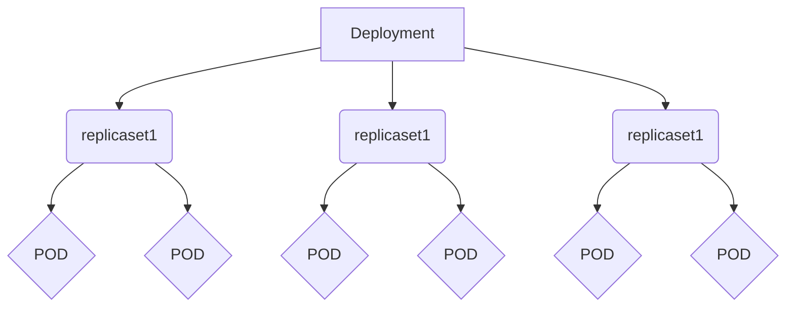

[TOC]

# 一 Kubernetes概述

##  1.1 容器编排工具

*   docker 官方编排工具

~~~
docker compose    # 单机编排工具
docker swarm      # 将多台 docker 提供的计算资源整合的接口，随后 docker compose 编排的时候只需要面向这个整合的接口进行编排就行，无论接口下有多少个主机。
docker mechine    # 将一个主机初始化为一个能够加入 docker swarm 集群中的预置程序
~~~

*   mesos IDC 操作系统

~~~
IDC 操作系统，能将一个 IDC 提供的硬件资源，统一调度和分配，它只是一个资源分配工具，非能够直接托管容器的，所以它提供了以个能够直接编排框架，marathon。
~~~

*   kubernetes

~~~bash
目前最流行的容器编排工具，市场占有率最高
~~~

## 1.2 kubernetes

kubernetes 是希腊语，翻译过来是：舵手的意思，它的原型是谷歌内部使用 Borg 集群管理系统，可以说是集结了 Borg 设计思想的精华，并且吸收了 Borg 系统中的经验和教训。

它的目标不仅仅是一个编排系统，而是提供一个规范，可以让你来描述集群的架构，定义服务的最终状态，Kubernetes可以帮你将系统自动地达到和维持在这个状态。Kubernetes作为云原生应用的基石，相当于一个云操作系统，其重要性不言而喻。

kubernetes 在 2014 年发布了第一个版本，目前开源并托管在 Github 上。

~~~bash
https://github.com/Kubernetes
~~~

目前，AWS、阿里云、微软云，目前已经原生支持 K8S ，目前已经可以让用户直接部署云原生的服务。

*   有什么优势

~~~
- 基于 Borg 系统，设计成熟，开源、且轻量级，简单易学、容易理解；
- 模块化，可插拔，支持钩子，可任意组合，例如：网络组件 flannel，存储插件；
- 故障发现（存活性探针）和自我修复能力（副本数量）、服务滚动升级（就绪探针）和在线扩容（副本数量）；
- 可扩展的资源自动调度机制（多维度的水平自动扩容）、多粒度的资源配额管理能力（资源限制）。
~~~

## 1.3 环境架构

Kubernetes 是一个集群，整合多台计算机的计算能力，它是一种有中心节点模式的集群，在 K8S 集群中主机分为两种角色：

~~~
Master：集群的管理节点，有一个或者一组节点，一般 3 个足够了。
nodes：提供计算资源的节点，就是运行容器的节点，可以扩展。
~~~

客户端创建启动容器的请求交给 Master ，Master 上有一个**调度器**它能分析各 nodes 节点上的资源状态，找一个最适合运行用户容器的节点，并在这个节点上使用 Docker 启动这个容器，node 节点的 Docker 在启动容器时候会首先检查本地有没有镜像，如果没有就从仓库中 pull 然后运行。

那么仓库可以运行为容器，所以也可以托管在 Kubernetes 之上，其实 Kubernetes 可以托管自身，即自托管。

*   ApiServer

kubernetes 接收用户创建容器等请求的是 Kubernetes Cluster，那么它对外提供服务的接口就是一个 API 接口 ，这个接口需要编程来访问，或者通过编写好的客户端程序来访问，Kubernetes Master 上有一个组件就是 ApiServer，来接收客端请求，解析客户端请求。

*   scheduler

如果客户请求是运行一个容器，那么 Master 会使用调度器（scheduler）根据用户的请求来分配一个能够运行容器的 nodes 节点，例如：根据用户对资源要求，CPU、内存、来评估哪个 nodes 最合适运行。

大概的过程就是：首先是预选，从 nodes 中挑选出符合用户容器运行要求的，然后在这些预选结果中进行优选，选出最佳的适配 node。

*   Controller（控制器）

如果运行容器的节点宕机或者容器本身运行出现问题，kubernetes 能够在其他节点再启动一个一模一样的容器，这就是 Kubernetes 提供的自愈能力。

控制器就实现了监控它所负责的每一个容器的健康状态，一旦发现不健康了，那么控制器会向 Master 发送请求，Master 会再次由调度器挑选出合适的节点再次运行这个容器。

它能持续性探测所管理的容器，一旦不健康，或不符合用户定义的健康状态，就会由它发起来请求，来保证容器向用户希望的健康状态迁徙。

而 Kubernets 支持众多的控制器，支持容器健康的控制器只是其中一种。

*   ControllerManager（制器管理器）

在 Master 内置组件中有一个控制器管理器，它负责监视着每一个控制器，如果控制器不健康无法工作，那么由控制器管理器来确保控制器的健康，由于 Master 有多个，所以具有冗余性。

*   Pod（原子调度单元，是容器的封装）

在 Kubernetes 上调度的原子单元，Kubernetes 不直接调度容器，而是 Pod，Pod可以理解为容器的二次封装，可以由一个或者多个容器组成，多个容器共享同一个网络名称空间：NET、UTS、IPC。

同一个 POD 里的容器，还能共享同一个存储卷，存储卷可以属于 POD。

一般一个 POD 只运行一个容器，如果需要在POD放多个容器，那么一般有一个主容器，其他容器是为主容器提供服务的。

*   node（工作节点）

提供计算资源的节点，就是运行 Pod 的主机，Kubenetes Cluster 统一管理所有的 node 节点的计算资源，当用户请求创建资源的时候，可以检查目前集群还有没有资源可以运行用户的容器，这实现了统一调度统一管理的一个平台。

*   label（标签）

一个由 `key = value` 组成的标签，可以为 POD 打上一个标签。

*   selecter（标签选择器）

集群中运行的众多 POD ，前面提到一个控制器可以管理若干个 POD ，那么控制器如何从集群中运行的所有 POD 中挑选出来自己需要管理的 POD 呢?

在创建一个 POD 的时候为 POD 打上一个标签，让程序可以通过这个标签来识别出来这个POD，还可以用来区分一组相同功能的POD，例如：创建四个nginx pod，可以给每个pod加一个 K/V类型的标签如：app=nginx，将来找出这四个 nginx pod，那么条件就是根据 拥有 key 为 app 的pod 并且 value 为 nginx 来挑出这组 POD。

标签不是 POD 唯一具有的机制，其他的组件同样可以有标签。

## 1.4 架构和组件

*   etcd

~~~bash
用于 Kubernetes 的后端数据存储，所有集群数据都存储在此处
~~~

*   Master 节点负责维护集群的目标状态，上面运行的主控组件有

~~~bash
kube-apiserver                 # 对外暴露了 Kubernetes API，它是的 Kubernetes 前端控制层，只有 API Server 会与 etcd 通信，其它模块都必须通过 API Server 访问集群状态
kube-controller-manager        # 处理集群中常规任务，它是单独的进程，内部包含多个控制器，例如维护 POD 数量
kube-scheduler                 # 监视新创建的 Pod 为新创建的 POD 分配合适的 node 节点
~~~

*   Node 节点实际负责实施，也就是运行 POD 的节点，上面运行的组件有

~~~bash
kubelet                        # 它监测已经分配给自己的 Pod，为 POD 准备卷，下载 POD 所需的 Secret，下载镜像并运行，进行生命周期探测，上报 POD 和节点状态
kube-proxy                     # 通过维护主机上的网络规则并执行连接转发，将 Kubernetes 提供的网络服务代理到每个节点上，实现了Kubernetes服务抽象
docker                         # 用于运行容器
~~~

*   插件

~~~bash
插件是增强集群功能的 Pod 和 Service，插件对象本身是受命名空间限制的，被创建于 kube-system 命名空间。
~~~

*   DNS

~~~bash
虽然其他插件并不是必需的，但所有 Kubernetes 集群都应该具有Cluster DNS，许多应用依赖于它，为 Kubernetes 服务提供DNS记录，容器启动该后会自动将 DNS 服务器包含在 resolv.conf 中。
~~~

# 二 核心组件/附件

## 2.1 Controller

这些控制器分别用于确保不同类型的 POD 资源运行于符合用户所期望的状态。

*   RelicationController

控制同一类 POD 对象的副本数量，实现程序的滚动更新，或者回滚的操作。

在滚动更新时候，允许临时超出规定的副本数量，

*   RelicaSet

副本集控制器，它不直接使用，它有一个声明式中心控制器 Deployment

*   Deployment

它只能管理无状态的应用，这个控制器，支持二级控制器，例如：HPA（Horizontal Pod Autoscaler，水平 POD 自动伸缩控制器），当负载高的时候，自动启动更多的 POD。

*   StatefulSet

管理有状态的应用

*   DaeminSet

如果需要在每一个 node 上运行一个副本，而不是随意运行

*   Job

运行作业，时间不固定的操作，例如：备份、清理，临时启动一个 POD 来进行备份的任务，运行完成就结束了。

如果运行时候 JOB 挂了，那么需要重新启动起来，如果运行完成了则不需要再启动了。

*   Cronjob

和周期性作业

## 2.2 Service

为客户端提供一个稳定的访问入口，Service 靠标签选择器来关联 POD 的，只要 POD 上有相关的标签，那么就会被 Service 选中，作为 Service 的后端，Service 关联 POD 后会动态探测这个 POD 的 IP 地址和端口，并作为自己调度的后端。

总的来说客户端请求 Service 由 Service 代理至后端的 POD，所以客户端看到的始终是 Service 的地址。

K8S 上的 Service 不是一个应用程序，也不是一个组件，它是一个 iptables dnat 规则，或者 ipvs 规则，Service 只是规则，所以是 ping 不通的，但是它的确可以请求。

Service 作为 k8s 的对象来说，是有名称的，可以通过 Service 的名称解析为 Service 的 IP 地址。

*   AddOns

解析域名是由 DNS 来解析的，为 k8s 中提供域名解析这种基础服务，称之为基础架构 POD 也称为 k8s 附件，所以域名解析的 POD 就是 k8s 中的一种 AddOns。

而 k8s 中的 dns 附件，是动态的，例如：service 名称发生更改，就会自动触发 dns 中的解析记录的改变，如果手动修改 service 的地址，也会自动触发 DNS 解析记录的改变，所以客户端访问服务时，可以直接访问服务的名称。

## 2.3 网络模型

k8s 有三种网络：POD网络、集群网络、节点网络

~~~
POD网络：所有 POD 处于同一个网络中
集群网络：Service 是一个另外一个网络
节点网络：node 节点也是另外一个网络
~~~

所以，接入外部访问时候，请求首先到达 node 网络，然后 node 网络代理至 service 网络，service 根据 ipvs 规则来转发到 pod 网络中的 pod 上。

k8s 有三种通信：

* 同一个 POD 内的多个容器间的通信，可以直接通过 lo 通信。

* POD 与 POD 通信，所有 POD 都处于一个网络，可以跨 node 与另外的 POD 直接通信，因为使用了叠加网络。

* POD 与 Service 通信。

## 2.4 kube-proxy

在 node 节点上运行的一个守护进程，它负责随时与 apiserver 进行通信，因为每个 pod 发生变化后需要保存在 apiserver 中，而 apiserver 发生改变后会生成一个通知事件，这个事件可以被任何关联的组件接收到，例如被 kube-proxy 一旦发现某个 service 后端的 pod 地址发生改变，那么就由 kube-proxy 负责在本地将地址写入 iptables 或者 ipvs 规则中。

所以 service 的管理是靠 kube-proxy 来实现的，当你创建一个 service ，那么就靠 kube-proxy 在每个节点上创建为 iptables 或者 ipvs 规则，每个 service 的变动也需要 kube-proxy 反应到规则上。

apiserver 需要保存各个 node 信息，它需要保存在 etcd 中。

## 2.5 etcd

是一个键值存储的系统，与 redis 很想，但是 etcd 还有一些协调功能是 redis 所不具备的，它还有节点选举等功能，从这个角度来讲 etcd 更像 zookpeer。

由于整个集群的所有信息都保存在 etcd，所以 etcd 如果宕机，那么整个集群就挂了，因而 etcd 需要做高可用。

## 2.6 flanel

托管为 k8s 的附件运行

node 网络：各节点之间进行通信

POD 网络：所有 node上的 POD 彼此之间通过叠加，或者直接路由方式通信

service 网络：由 kube-proxy 负责管控和生成

## 知识小结

*   Master

~~~
kube-scheduler             # 调度 pod
kuber-controller-manager   # 管理 pod
kube-apiserver             # 接收请求
etcd                       # 集群状态存储，集群所有的组件的状态都保存在这里
~~~

*   node

~~~
kubelet                    # 
kube-proxy                 # 
docker                     # 容器引擎
~~~

# 三 集群部署

Kubeadm 是 K8S 官方提供的快速部署工具，它提供了 kubeadm init 以及 kubeadm join 这两个命令作为快速创建 kubernetes 集群的最佳实践，本章节说明了使用 kubeadm 来部署 K8S 集群的过程。

-   集群组织结构

| 项目     | 说明                                      |
| -------- | ----------------------------------------- |
| 集群规模 | Master、node1、node2                      |
| 网络规划 | POD：10.244.0.0/16、Service：10.96.0.0/12 |

## 3.1 部署前准备

>   本小节的所有的操作，在所有的节点上进行

### 3.1.1 关闭 firewalld 和 selinux

```bash
setenforce 0
sed -i '/^SELINUX=/cSELINUX=disabled' /etc/selinux/config

systemctl stop firewalld
systemctl disable firewalld
```

### 3.1.2 加载 ipvs 内核模块

-   安装 IPVS 模块

```bash
yum -y install ipvsadm ipset sysstat conntrack libseccomp
```

-   设置开机加载配置文件

```bash
cat >>/etc/modules-load.d/ipvs.conf<<EOF
ip_vs_dh
ip_vs_ftp
ip_vs
ip_vs_lblc
ip_vs_lblcr
ip_vs_lc
ip_vs_nq
ip_vs_pe_sip
ip_vs_rr
ip_vs_sed
ip_vs_sh
ip_vs_wlc
ip_vs_wrr
nf_conntrack_ipv4
EOF
```

-   设置开机加载 IPVS 模块

```bash
systemctl enable systemd-modules-load.service   # 设置开机加载内核模块
lsmod | grep -e ip_vs -e nf_conntrack_ipv4      # 重启后检查 ipvs 模块是否加载
```

-   如果集群已经部署在了 iptables 模式下，可以通过下面命令修改，修改 mode 为 ipvs 重启集群即可。

```bash
kubectl edit -n kube-system configmap kube-proxy
```

### 3.1.3 下载 Docker 和 K8S

-   设置 docker 源

```bash
curl -o /etc/yum.repos.d/docker-ce.repo https://mirrors.aliyun.com/docker-ce/linux/centos/docker-ce.repo
```

-   设置 k8s 源

```bash
cat >>/etc/yum.repos.d/kuberetes.repo<<EOF
[kuberneres]
name=Kubernetes
baseurl=https://mirrors.aliyun.com/kubernetes/yum/repos/kubernetes-el7-x86_64/
gpgcheck=0
gpgkey=https://mirrors.aliyun.com/kubernetes/yum/doc/yum-key.gpg
enabled=1
EOF
```

-   安装 docker-ce 和 kubernetes

```bash
yum install docker-ce kubelet kubectl kubeadm -y
```

```bash
systemctl start docker

systemctl enable docker
systemctl enable kubelet
```

### 3.1.4 设置内核及 K8S 参数

-   设置内核参数

```bash
cat >>/etc/sysctl.conf<<EOF
net.bridge.bridge-nf-call-ip6tables = 1
net.bridge.bridge-nf-call-iptables = 1
net.ipv4.ip_forward = 1
EOF
```

-   设置 kubelet 忽略 swap，使用 ipvs

```bash
cat >/etc/sysconfig/kubelet<<EOF
KUBELET_EXTRA_ARGS="--fail-swap-on=false"
KUBE_PROXY_MODE=ipvs
EOF
```

## 3.2 部署 Master

>   本小节的所有的操作，只在 Master 节点上进行

### 3.2.1 提前拉取镜像

kubeadm init 在初始化的时候会到谷歌的 docker hub 拉取镜像，所以我们要提前做好翻墙的准备，需要在本机 9666 端口启动翻墙的软件。

-   配置 Docker 拉取镜像时候的代理地址，vim /usr/lib/systemd/system/docker.service。

```bash
[Service]
Environment="HTTPS_PROXY=127.0.0.1:9666"
Environment="NO_PROXY=127.0.0.0/8,172.16.0.0/16"
```

-   提前拉取初始化需要的镜像

```bash
kubeadm config images pull
```

- 使用其他源镜像

```bash
docker pull mirrorgooglecontainers/kube-apiserver:v1.14.2
docker pull mirrorgooglecontainers/kube-controller-manager:v1.14.2
docker pull mirrorgooglecontainers/kube-scheduler:v1.14.2
docker pull mirrorgooglecontainers/kube-proxy:v1.14.2
docker pull mirrorgooglecontainers/pause:3.1
docker pull mirrorgooglecontainers/etcd:3.3.10
docker pull coredns/coredns:1.3.1


利用`kubeadm config images list` 查看需要的docker image name

k8s.gcr.io/kube-apiserver:v1.14.2
k8s.gcr.io/kube-controller-manager:v1.14.2
k8s.gcr.io/kube-scheduler:v1.14.2
k8s.gcr.io/kube-proxy:v1.14.2
k8s.gcr.io/pause:3.1
k8s.gcr.io/etcd:3.3.10
k8s.gcr.io/coredns:1.3.1

修改tag：

docker tag docker.io/mirrorgooglecontainers/kube-apiserver:v1.14.2 k8s.gcr.io/kube-apiserver:v1.14.2
docker tag docker.io/mirrorgooglecontainers/kube-scheduler:v1.14.2 k8s.gcr.io/kube-scheduler:v1.14.2
docker tag docker.io/mirrorgooglecontainers/kube-proxy:v1.14.2 k8s.gcr.io/kube-proxy:v1.14.2
docker tag docker.io/mirrorgooglecontainers/kube-controller-manager:v1.14.2 k8s.gcr.io/kube-controller-manager:v1.14.2
docker tag docker.io/mirrorgooglecontainers/etcd:3.3.10  k8s.gcr.io/etcd:3.3.10
docker tag docker.io/mirrorgooglecontainers/pause:3.1  k8s.gcr.io/pause:3.1
docker tag docker.io/coredns/coredns:1.3.1  k8s.gcr.io/coredns:1.3.1

docker rmi `docker images |grep docker.io/ |awk '{print $1":"$2}'`
```


### 3.2.2 初始化Master

-   使用 kubeadm 初始化 k8s 集群

```bash
kubeadm init --kubernetes-version=v1.14.0 --pod-network-cidr=10.244.0.0/16 --service-cidr=10.96.0.0/12 --ignore-preflight-errors=Swap
```

-   如果有报错使用下面命令查看

```bash
journalctl -xeu kubelet
```

-   如果初始化过程被中断可以使用下面命令来恢复

```bash
kubeadm reset
```

-   下面是最后执行成功显示的结果，需要保存这个执行结果，以让 node 节点加入集群

```bash
Your Kubernetes control-plane has initialized successfully!

To start using your cluster, you need to run the following as a regular user:

  mkdir -p $HOME/.kube
  sudo cp -i /etc/kubernetes/admin.conf $HOME/.kube/config
  sudo chown $(id -u):$(id -g) $HOME/.kube/config

You should now deploy a pod network to the cluster.
Run "kubectl apply -f [podnetwork].yaml" with one of the options listed at:
  https://kubernetes.io/docs/concepts/cluster-administration/addons/

Then you can join any number of worker nodes by running the following on each as root:

kubeadm join 172.16.100.9:6443 --token 2dyd69.hrfsjkkxs4stim7n \
    --discovery-token-ca-cert-hash sha256:4e30c1f41aefb177b708a404ccb7e818e31647c7dbdd2d42f6c5c9894b6f41e7
```

-   最好以普通用户的身份运行下面的命令

```bash
mkdir -p $HOME/.kube
sudo cp -i /etc/kubernetes/admin.conf $HOME/.kube/config
sudo chown $(id -u):$(id -g) $HOME/.kube/config
```

-   部署 flannel 网络插件

```bash
kubectl apply -f https://raw.githubusercontent.com/coreos/flannel/master/Documentation/kube-flannel.yml
```

-   查看 kube-system 命名空间中运行的 pods

```bash
kubectl get pods -n kube-system
```

-   查看 k8s 集群组件的状态

```bash
kubectl get ComponentStatus
```

## 3.3 部署 Node

>   本小节的所有的操作，只在 Node 节点上进行。

### 3.3.1 加入集群


-   加入集群，注意在命令尾部加上 --ignore-preflight-errors=Swap ，以忽略 k8s 对主机 swap 的检查（k8s为了性能所以要求进制 swap ）

```bash
kubeadm join 172.16.100.9:6443 --token 2dyd69.hrfsjkkxs4stim7n \
    --discovery-token-ca-cert-hash sha256:4e30c1f41aefb177b708a404ccb7e818e31647c7dbdd2d42f6c5c9894b6f41e7 --ignore-preflight-errors=Swap
```

-   返回结果，表示加入集群成功

```bash
This node has joined the cluster:
* Certificate signing request was sent to apiserver and a response was received.
* The Kubelet was informed of the new secure connection details.

Run 'kubectl get nodes' on the control-plane to see this node join the cluster.
```

### 3.3.2 查看进度

当 node 节点加入 K8S 集群中后，Master 会调度到 Node 节点上一些组件，用于处理集群事务，这些组件没有下载完成之前 Node 节点在集群中还是未就绪状态

-   在 node 执行下面命令，可以查看镜像的下载进度，下面是最终结果显示

```bash
$ docker image ls
REPOSITORY               TAG                 IMAGE ID            CREATED             SIZE
k8s.gcr.io/kube-proxy    v1.14.0             5cd54e388aba        6 weeks ago         82.1MB
quay.io/coreos/flannel   v0.11.0-amd64       ff281650a721        3 months ago        52.6MB
k8s.gcr.io/pause         3.1                 da86e6ba6ca1        16 months ago       742kB
```

-   可以在 Master 上使用下面命令来查看新加入的节点状态

```bash
$ kubectl get nodes
NAME     STATUS   ROLES    AGE     VERSION
master   Ready    master   3d21h   v1.14.1
node1    Ready    <none>   3d21h   v1.14.1
node2    Ready    <none>   3d21h   v1.14.1
```


```
拷贝到node节点
for i in /tmp/*.tar; do scp -i $i root@172.16.0.15:/root/;done


node节点还原
for i in *.tar ;do docker load -i $i;done
```

-   查看 kube-system 这个 k8s 命名空间中有哪些组件，分别运行在哪个节点，-o wide 是以详细方式显示。

```bash
$ kubectl get pods -n kube-system -o wide

NAME                                 READY   STATUS    RESTARTS   AGE     IP              NODE         NOMINATED NODE   READINESS GATES
coredns-fb8b8dccf-cp24r              1/1     Running   0          26m     10.244.0.2      i-xeahpl98   <none>           <none>
coredns-fb8b8dccf-ljswp              1/1     Running   0          26m     10.244.0.3      i-xeahpl98   <none>           <none>
etcd-i-xeahpl98                      1/1     Running   0          25m     172.16.100.9    i-xeahpl98   <none>           <none>
kube-apiserver-i-xeahpl98            1/1     Running   0          25m     172.16.100.9    i-xeahpl98   <none>           <none>
kube-controller-manager-i-xeahpl98   1/1     Running   0          25m     172.16.100.9    i-xeahpl98   <none>           <none>
kube-flannel-ds-amd64-crft8          1/1     Running   3          16m     172.16.100.6    i-me87b6gw   <none>           <none>
kube-flannel-ds-amd64-nckw4          1/1     Running   0          6m41s   172.16.100.10   i-qhcc2owe   <none>           <none>
kube-flannel-ds-amd64-zb7sg          1/1     Running   0          23m     172.16.100.9    i-xeahpl98   <none>           <none>
kube-proxy-7kjkf                     1/1     Running   0          6m41s   172.16.100.10   i-qhcc2owe   <none>           <none>
kube-proxy-c5xs2                     1/1     Running   2          16m     172.16.100.6    i-me87b6gw   <none>           <none>
kube-proxy-rdzq2                     1/1     Running   0          26m     172.16.100.9    i-xeahpl98   <none>           <none>
kube-scheduler-i-xeahpl98            1/1     Running   0          25m     172.16.100.9    i-xeahpl98   <none>           <none>
```

### 3.3.3 下载太慢

node 节点需要翻墙下载镜像太慢，建议使用 docker 镜像的导入导出功能
先将master的三个镜像打包发送到node节点，load后再jion

-   导出

```bash
docker image save -o /tmp/kube-proxy.tar k8s.gcr.io/kube-proxy
docker image save -o /tmp/flannel.tar quay.io/coreos/flannel
docker image save -o /tmp/pause.tar k8s.gcr.io/pause
```

-   导入

```bash
docker image load -i /tmp/kube-proxy.tar
docker image load -i /tmp/pause.tar
docker image load -i /tmp/flannel.tar
```

# 四 入门命令

## 4.1 kubectl

kubectl 是 apiserver 的客户端程序，这个客户端程序是通过连接 master 节点上的 apiserver ，实现各种 k8s 对象的增删改查等基本操作，在 k8s 可被管理的对象有很多个

```bash
基本命令 (初级):
  create         从文件或标准输入创建资源
  expose         获取一个复制控制器，服务，部署或者暴露一个 POD 将其作为新的 Kubernetes 服务公开
  run            创建并运行特定的镜像，创建使用 deployment 或 job 管理的容器
  set            设置对象的特定功能

基本命令 (中级):
  explain        文档或者资源
  get            显示一个或多个资源
  edit           编辑服务器上的资源
  delete         按文件名，标准输入，资源和名称或资源和标签选择器删除资源

部署命令:
  rollout        管理资源的部署
  scale          为部署设置新大小，ReplicaSet, Replication Controller, Job
  autoscale      自动扩展一个部署, ReplicaSet, 或者 ReplicationController

群集管理命令:
  certificate    修改证书资源.
  cluster-info   显示群集信息
  top            显示资源（CPU /内存/存储）使用情况。
  cordon         将节点标记为不可调度
  uncordon       将节点标记为可调度
  drain          设定 node 进入维护模式
  taint          更新一个或多个节点上的污点

故障排除和调试命令:
  describe       显示特定资源或资源组的详细信息
  logs           在容器中打印容器的日志
  attach         附加到正在运行的容器
  exec           在容器中执行命令
  port-forward   将一个或多个本地端口转发到 pod
  proxy          运行代理到 Kubernetes API 服务器
  cp             将文件和目录复制到容器，和从容器复制，跨容器复制文件
  auth           检查授权

高级命令:
  diff           针对将要应用的版本的 Diff 实时版本
  apply          通过文件名或标准输入将配置应用于资源
  patch          使用策略合并补丁更新资源的字段
  replace        用文件名或标准输入替换资源
  wait           实验阶段命令：在一个或多个资源上等待特定条件，定义一个触发器
  convert        在不同的API版本之间转换配置文件
  kustomize      从目录或远程 URL 构建 kustomization 目标

设置命令:
  label          更新资源上的标签
  annotate       更新资源上的注释
  completion     命令补全相关功能

其他命令:
  api-resources  在服务器上打印支持的API资源
  api-versions   以 "group/version" 的形式在服务器上打印支持的API版本
  config         修改 kubeconfig 文件
  plugin         提供与插件交互的实用程序
  version        打印客户端和服务器版本信息
```

## 4.2 run

*   创建控制器并运行镜像

~~~bash
kubectl run nginx --image=nginx:latest    # 创建一个名为 nginx 的控制器，运行 nginx:latest 版本的镜像
~~~

*   指定运行的 POD 数量

~~~bash
kubectl run nginx --image=nginx --replicas=5  # 启动 5 个 POD
~~~

*   不运行容器的默认命令，使用自定义的指令

~~~bash
kubectl run nginx --image=nginx --command -- <cmd> <arg1> ... <argN>
~~~

*   运行一个周期任务

~~~bash
kubectl run pi --schedule="0/5 * * * ?" --image=perl --restart=OnFailure -- perl -Mbignum=bpi -wle 'print bpi(2000)'
~~~

*   指定控制器名称运行 nginx 指定端口和副本数量，以测试模式运行

```bash
kubectl run nginx-deploy --image=nginx --port=80 --replicas=1 --dry-run=true
```

-   查看容器是否运行

```bash
kubectl get deployment
```

-   查看被调度的主机

```bash
kubectl get pod -o wide
```

*   通过 ip 地址直接访问，由于所有的 POD 处于同一个网络中，所以在集群内部是可以访问的

~~~bash
curl 10.244.2.2
~~~

*   假如现在删除刚创建的这个 POD，那么副本控制器会自动在其他的 node 上重建这个 POD

~~~bash
kubectl delete pods nginx-deploy-5c9b546997-jsmk6
~~~

*   再次执行查看，会发现容器已经被调度到其他节点上运行了

~~~bash
kubectl get pod -o wide
~~~

## 4.3 expose

现在存在一个问题，就是 POD 的 IP 地址可能随时发生变动，所以不能作为访问的入口，那么就需要 service 来代理 POD 来创建一个固定的端点。

*   创建一个 service 暴露一个服务

```bash
kubectl expose deployment nginx-deploy --name=nginx --port=80 --target-port=80 --protocol=TCP
```

~~~bash
在控制器 nginx-deploy 上创建名字为 nginx 的 service ，它工作端口为 80，代理的后端容器端口 80，协议为 TCP。
~~~

*   可以看到刚刚创建的名字为 nginx 的 service ，现在就可以在集群内用 service 的地址来访问了，外部不行

~~~bash
kubectl get service
~~~

-   删除一个任务

```bash
kubectl delete deployment nginx-deploy
```

## 4.4 cp

* 拷贝宿主机文件或目录到pod中，⚠️要求tar二进制文件已经存在容器中，不然拷贝会失败

```shell
kubectl cp /tmp/foo_dir <some-pod>:/tmp/bar_dir
 
[root@master ~]# kubectl cp flannel.tar  nginx-58cd4d4f44-8pwb7:/usr/share/nginx/html 
[root@master ~]# kubectl cp mainfile/  nginx-58cd4d4f44-8pwb7:/usr/share/nginx/html 
[root@master ~]# kubectl exec -it nginx-58cd4d4f44-8pwb7 -- /bin/bash
root@nginx-58cd4d4f44-8pwb7:/# ls -l /usr/share/nginx/html/
total 54108
-rw-r--r-- 1 root root      537 Jul 11  2017 50x.html
-rw-r--r-- 1 root root      355 May 27 06:47 dashboard-adminuser.yaml
-rw------- 1 root root 55390720 May 27 01:49 flannel.tar
-rw-r--r-- 1 root root      612 Jul 11  2017 index.html
drwxr-xr-x 4 root root       51 Aug 17 14:16 mainfile
```

## 4.5 port-forward

* 端口转发，将svc地址或着pods端口利用kubelet映射到宿主机上,将访问宿主机的8888端口的所有流量转发到8111svc

```shell
kubectl port-forward --address 0.0.0.0 service/nginx 8888 8111
```

* 转发pods端口,将访问宿主机的8888端口流量转发到pod的5000端口

```shell
kubectl port-forward pod/mypod 8888:5000
```

## 4.6 coredns

service 提供了对 pod 的固定访问端点，但是 service 本身的变动我们无法知晓，需要 coredns 对 service 做域名解析。

*   查看 coredns 运行状态

~~~bash
kubectl get pods -n kube-system -o wide
~~~

*   查看各个 kube-system 命名空间运行的服务，可以看到 kube-dns 运行的 IP 地址

~~~bash
kubectl get service -n kube-system
~~~

*   使用 kube-dns 来解析 nginx 这个 service 的地址就可以正常解析了

~~~bash
dig -t A nginx.default.svc.cluster.local @10.96.0.10
~~~

*   创建一个访问 nginx 客户端容器，并进入交互式模式，这个容器默认的 dns 服务器就是 kube-dns 所在的服务器

~~~bash
kubectl run client --image=busybox --replicas=1 -it --restart=Never
~~~

~~~bash
/ # cat /etc/resolv.conf 
nameserver 10.96.0.10                                               # kube-dns 地址
search default.svc.cluster.local svc.cluster.local cluster.local    # 默认的解析搜索域
options ndots:5
~~~

*   在 busybox 这个容器中请求 nginx 这个域名的 service ，能够正常访问

~~~bash
wget -O - -q http://nginx:80/
~~~

## 4.7模拟 POD 被删除

*   现在我们删除 service 后端的 POD ，副本控制器会自动创建新的 POD，而 service 则会自动指向新创建的 POD

~~~bash
kubectl delete pods nginx-deploy-5c9b546997-4w24n
~~~

*   查看由副本控制器自动创建的 POD

~~~bash
kubectl get pods
~~~

*   在 busybox 这个容器中请求 nginx 这个域名的 service ，访问没有受到影响

~~~bash
wget -O - -q http://nginx:80/
~~~

## 4.8 模拟 service 被删除

*   当我们删除 service 并且重新建立一个 service 再次查看 service 的地址已经发生变化了

~~~bash
kubectl delete service nginx
~~~

~~~bash
kubectl expose deployment nginx-deploy --name=nginx --port=80 --target-port=80 --protocol=TCP
~~~

~~~bash
kubectl get service
~~~

*   在 busybox 这个容器中请求 nginx 这个域名的 service ，访问没有仍然没有受到影响

~~~bash
wget -O - -q http://nginx:80/
~~~

## 4.9 labels

为什么 Pod 被删除后，servic 仍然能够正确的调度到新的 POD 上，这就是 k8s 的 labels 这个机制来保证的。

能够使用标签机制不止有 pod、在 k8s 中很多对象都可以使用标签，例如：node、service

*   查看 service 的详细信息，会发现标签选择器

~~~bash
kubectl describe service nginx
~~~

~~~bash
Name:              nginx
Namespace:         default
Labels:            run=nginx-deploy
Annotations:       <none>
Selector:          run=nginx-deploy       # 这个选择器会自动选中 run 标签，且值为 nginx-deploy 的 POD
Type:              ClusterIP
IP:                10.101.149.4
Port:              <unset>  80/TCP
TargetPort:        80/TCP
Endpoints:         10.244.2.4:80          # 当 service 的后端，当 POD 发生变动则立即会更新
Session Affinity:  None
Events:            <none>
~~~

*   查看 POD 的标签，会看到拥有 run=nginx-deploy 标签的容器，而人为删除一个 POD 后，副本控制器创建的副本上的标签不会变化，所以标签又被 service 关联。

~~~bash
kubectl get pods --show-labels
~~~

~~~bash
NAME                            READY   STATUS    RESTARTS   AGE     LABELS
client                          1/1     Running   0          21m     run=client
nginx-deploy-5c9b546997-kh88w   1/1     Running   0          8m37s   pod-template-hash=5c9b546997,run=nginx-deploy
~~~

*   查看 POD 的详细信息，也可以查看到 POD 的详细信息

~~~bash
kubectl describe deployment nginx-deploy
~~~

*   根据标签过滤，使用 -l 来指定标签名称或同时过滤其值

~~~bash
kubectl get pods --show-labels -l run=nginx-deploy
~~~

*   标签选择器集中运算

~~~bash
关系与：KEY,KEY、KEY=VALUE2,KEY=VALUE2       # -l run,app
等值关系：KEY = VALUE、KEY != VALUE           # -l run=nginx-deploy,app!=myapp
集合关系：KYE in|not in (VALUE1,VALUE2)      # -l "release in (canary,bata,alpha)"  
~~~

*   显示指定的标签的值，下面显示了两个标签

~~~bash
kubectl get pods --show-labels -L run,pod-template-hash
~~~

*   为指定的 POD 打标签，为 client 这个 POD 打上一个 release 标签，其值为 canary

~~~bash
kubectl label pods client release=canary
~~~

*   修改 POD 的标签，使用 --overwrite 进行修改原有标签

~~~bash
kubectl label pods client release=stable --overwrite
~~~

*   删除指定的 nodes 上的标签，使用标签名称加 - 符号

~~~bash
kubectl label nodes node2 disktype-
~~~

*   许多资源支持内嵌字段来定义其使用的标签选择器，例如 service 关联 pod 时候：

~~~bash
matchLabels：直接给定键值
matchExpressions：基于给定的表达式来定义使用标签选择器：{key:"KEY",operator:"OPERATOR",value:[VAL1,VAL2,...]}
    使用 key 与 value 进行 operator 运算，复合条件的才被选择
    操作符：
    	In、NotIn：其 value 列表必须有值
    	Exists、NotExists：其 value 必须为空
~~~

*   k8s 中很多对象都可以打标签，例如给 nodes 打一个标记，随后在添加资源时候就可以让资源对节点有倾向性了

~~~bash
kubectl label nodes node2 disktype=ssd
~~~

~~~bash
kubectl get nodes --show-labels
~~~

## 4.10 动态扩容

*   扩容一个集群的的 POD，下面命令表示修改 deployment 控制器下的 nginx-deply 容器的副本数量为2

~~~bash
kubectl scale --replicas=5 deployment nginx-deploy
~~~

## 4.11 滚动升级

*   更换 nginx-deploy 这个控制器下的 nginx-deploy 容器镜像为 ikubernetes/myapp:v2

~~~bash
kubectl set image deployment nginx-deploy nginx-deploy=ikubernetes/myapp:v2
~~~

*   查看更新的过程，直到 5 个容器中运行的镜像全部更新完

~~~bash
kubectl rollout status deployment nginx-deploy
~~~

~~~bash
[root@node1 ~]# kubectl rollout status deployment nginx-deploy
Waiting for deployment "nginx-deploy" rollout to finish: 3 out of 5 new replicas have been updated...
Waiting for deployment "nginx-deploy" rollout to finish: 3 out of 5 new replicas have been updated...
Waiting for deployment "nginx-deploy" rollout to finish: 3 out of 5 new replicas have been updated...
Waiting for deployment "nginx-deploy" rollout to finish: 3 out of 5 new replicas have been updated...
Waiting for deployment "nginx-deploy" rollout to finish: 3 out of 5 new replicas have been updated...
Waiting for deployment "nginx-deploy" rollout to finish: 4 out of 5 new replicas have been updated...
Waiting for deployment "nginx-deploy" rollout to finish: 4 out of 5 new replicas have been updated...
Waiting for deployment "nginx-deploy" rollout to finish: 4 out of 5 new replicas have been updated...
Waiting for deployment "nginx-deploy" rollout to finish: 4 out of 5 new replicas have been updated...
Waiting for deployment "nginx-deploy" rollout to finish: 4 out of 5 new replicas have been updated...
Waiting for deployment "nginx-deploy" rollout to finish: 2 old replicas are pending termination...
Waiting for deployment "nginx-deploy" rollout to finish: 2 old replicas are pending termination...
Waiting for deployment "nginx-deploy" rollout to finish: 2 old replicas are pending termination...
Waiting for deployment "nginx-deploy" rollout to finish: 1 old replicas are pending termination...
Waiting for deployment "nginx-deploy" rollout to finish: 1 old replicas are pending termination...
Waiting for deployment "nginx-deploy" rollout to finish: 1 old replicas are pending termination...
Waiting for deployment "nginx-deploy" rollout to finish: 4 of 5 updated replicas are available...
deployment "nginx-deploy" successfully rolled out
~~~

*   回滚操作，不指定任何的镜像则为上一个版本的镜像

~~~bash
kubectl rollout undo deployment nginx-deploy
~~~

>   如果防止更新过程中被调度，那么就需要学习就绪性检测才能实现

## 4.12 集群外访问

*   修改 service 的网络类型为 NodePort

~~~bash
kubectl edit service nginx
~~~

~~~bash
type: ClusterIP -> type: NodePort
~~~

*   查看 service 的信息，发现多了一个 30982 端口

~~~bash
kubectl get service
~~~

~~~bash
NAME         TYPE        CLUSTER-IP     EXTERNAL-IP   PORT(S)        AGE
kubernetes   ClusterIP   10.96.0.1      <none>        443/TCP        15h
nginx        NodePort    10.105.27.11   <none>        80:30982/TCP   42m
~~~

*   在集群外部使用任意的 node IP 地址 + 端口来访问

~~~bash
http://172.16.100.101:30982/
~~~

## 4.13 排查日志

*   查看一个 pod 的某个容器的运行日志

~~~bash
kubectl logs pod-demo busybox
~~~

## 4.14 连入 POD 容器

~~~bash
kubectl exec -it pod-demo -c myapp -- /bin/sh
~~~

# 五 配置清单使用

apiserver 仅接收 json 格式的资源定义，yaml 格式定义提供的配置清单，apiserver 可自动将其转换为 json 格式，而后再进行执行。

## 5.1 可配置的对象

-   可用资源清单配置的对象

```bash
workload：Pod、ReplicaSet、Deployment、StatefulSet、DaemonSet、Job、CronJob
服务发现及均衡：Service、Ingress
配置与存储：Volume、CSI
    ConfigMap、Secret
    DownwardAPI
集群级资源
    Namespace、None、Role、ClusterRole、RoleBinding、ClusterRoleBinding
元数据类型资源
    HPA、PodTemplate、LimitRange
```

## 5.2 配置清单组成

*   配置清单组成部分，大部分资源使用配置清单方式来创建

~~~bash
apiVersion
	# 以 "group/version" 形式指明，这个对象属于哪个 API 组（版本）
kind:
    # 资源类别，标记创建什么类型的资源
metadata:
	# 元数据内部是嵌套的字段
	# 定义了资源对象的名称、命名空间（k8s级别的不是系统的）等、标签、注解等
spec:
	# 规范定义资源应该拥有什么样的特性，依靠控制器确保特性能够被满足
	# 它是用户定义的所期望了资源状态
status:
	# 显示资源的当前状态，k8s 就是确保当前状态向目标状态无限靠近从而满足用户期望
	# 它是只读的，代表了资源当前状态
~~~

*   获取全部的 api 版本

~~~bash
kubectl api-versions
~~~

## 5.3 获取清单帮助

*   查看 k8s 某个内置对象的配置清单格式，应该包含哪些字段，使用 . 来显示字段的格式帮助信息

~~~bash
kubectl explain pods
kubectl explain pods.metadata
~~~

## 5.4 清单基本格式

*   定义一个资源清单

~~~bash
apiVersion: v1
kind: Pod
metadata:
  name: pod-deme
  namespace: default
  labels:
    app: myapp
    tier: frontend
spec:
  containers:
  - name: myapp
    image: ikubernetes/myapp:v1
  - name: busybox
    image: busybox:latest
    command:
    - "/bin/sh"
    - "-c"
    - "sleep 10"
~~~

## 5.5 快捷获取清单

*   使用 -o 参数来指定对象数据的输出格式，使用 --dry-run 来测试性执行一个指令，它两个结合起来，就可以通过命令创建，且生成 yaml 格式配置文件了 -o yaml --dry-run

~~~bash
kubectl create secret docker-registry regsecret --docker-server=registry-vpc.cn-hangzhou.aliyuncs.com --docker-username=admin --docker-password=123456 --docker-email=420123641@qq.com -o yaml --dry-run
~~~

## 5.6 create 创建

*   创建资源清单中的资源，这样创建的为裸 POD ，没有控制器管理，所以删除后不会自动重建

~~~bash
kubectl create -f pod-demo.yaml
~~~

## 5.7 delete 删除

*   删除资源清单中定义的 POD

~~~bash
kubectl delete -f pod-demo.yaml
~~~

## 5.8 applay 创建或更新

applay 可以执行多次，如果发现文件不同，则更新

~~~bash
kubectl applay -f pod-demo.yaml
~~~

# 六 POD 配置清单

## 6.1 pods.metadata POD元数据

### 6.1.1 labels 标签

-   labels 定义标签，键值对组成的标签

```bash
  labels:
    app: myapp
    tier: frontend
```

## 6.2 pods.spec 规范

### 6.2.1 nodeName 运行节点

-   在使用资源清单定义 pod 时候，使用 nodeName 可以直接绑定资源对象在哪个 POD 运行的节点

```yaml
apiVersion: v1
kind: Pod
metadata:
  name: pod-deme
  namespace: default
  labels:
    app: myapp
    tier: frontend
spec:
  nodeName: node2                           # 直接指定 POD 运行的节点
  containers:
  - name: myapp
    image: ikubernetes/myapp:v1
    imagePullPolicy: IfNotPresent
```

### 6.2.2 nodeSelector 节点选择

-   在使用资源清单定义 pod 时候，使用 nodeSelector （节点标签选择器）字段，来定义节点的倾向性

```yaml
apiVersion: v1
kind: Pod
metadata:
  name: pod-deme
  namespace: default
  labels:
    app: myapp
    tier: frontend
spec:
  nodeSelector:                            # 在 spec 中定义这个 POD 的节点倾向性
  	disktype: ssd                         # 这个 POD 最终会运行在拥有 disktype 标签且值为 ssd 的 nodes 上
  containers:
  - name: myapp
    image: ikubernetes/myapp:v1
    imagePullPolicy: IfNotPresent
    ports:
```

-   从文件启动 pod，观察 pod 运行的节点，会发现已经运行在有标签的 node 节点上了

```bash
kubectl create -f pod-demo.yaml
```

```
kubectl get pods -o wide
```

```bash
NAME       READY   STATUS    RESTARTS   AGE   IP            NODE    NOMINATED NODE   READINESS GATES
pod-demo   1/1     Running   0          21s   10.244.2.29   node3   <none>           <none>
```

### 6.2.3 restartPolicy POD重启策略

Always：一旦容器挂了，那么总是重启它，k8s 每次重启策略为 30 秒的两倍，直到等待 300 秒重启。

OnFailure：只有其状态为错误的时候才去重启它

Never：从来不重启，挂了就挂了

```bash
一旦某个 POD 被调度到某个节点上，只要这个节点在，那么它就不会被重新调度，只能被重启，除非 POD 被删除才会被重新调度，或者 node 挂了，才会被重新调度，否则只要 node 在，那么 POD 就不会被重新调度，如果 POD 启动失败，那么将不断的重启 POD。
```

```bash
当需要终止 POD ，k8s 发送 kill -15 信号，让容器平滑的终止，等待 30 秒的宽限期，如果没有终止，那么则发送 kill 信号
```

### 6.2.4 hostNetwork 主机网络空间

使用布尔值指定是否让 POD 使用主机的网络名称空间

### 6.2.5 hostPID 主机PID空间

使用布尔值指定是否让 POD 使用主机的PID名称空间

### 6.2.6 containers 配置

>   kubectl explain pods.spec.containers

描述 POD 内所运行容器，语法：containers <[]Object>，表示它的值为数组，数组内使用对象的方式来描述一个容器，对象可以有以下参数：

*   可用参数

| 参数                     | 作用               |
| ------------------------ | ------------------ |
| args                     |                    |
| command                  |                    |
| env                      | 向容器传递环境变量 |
| envFrom                  |                    |
| image                    |                    |
| imagePullPolicy          |                    |
| lifecycle                |                    |
| livenessProbe            |                    |
| name                     |                    |
| ports                    |                    |
| readinessProbe           |                    |
| resources                |                    |
| securityContext          |                    |
| stdin                    |                    |
| stdinOnce                |                    |
| terminationMessagePath   |                    |
| terminationMessagePolicy |                    |
| tty                      |                    |
| volumeDevices            |                    |
| volumeMounts             |                    |
| workingDir               |                    |

*   示例型配置

~~~bash
apiVersion: v1
kind: Pod
metadata:
  name: pod-deme                     # pod 的名称
  namespace: default
  labels:
    app: myapp
    tier: frontend
spec:
  containers:
    - name: myapp                      # 运行的容器名称
      image: ikubernetes/myapp:v1      # 容器的镜像
      imagePullPolicy: IfNotPresent    # 从仓库获取镜像的策略
      ports:                           # 定义容器暴漏的端口
    - name: busybox
      image: busybox:latest
      command:
        - "/bin/sh"
        - "-c"
        - "sleep 10"
~~~

#### 6.2.6.1 imagePullPolicy下载策略

*   imagePullPolicy 镜像获取的策略，详见：`kubectl explain pods.spec.containers`

~~~bash
Always            # 总是从仓库下载
Never             # 从不下载，本地有就用，没有就失败
IfNotPresent      # 如果本地存在就直接使用，如果不存在就下载
~~~

>   如果标签是 latest 那么则始终从仓库下载

#### 6.2.6.2 ports 端口信息

*   ports 定义容器保暴露的，详见：`kubectl explain pods.spec.containers.ports`

在此处暴露的端口可为系统提供有关容器的网络连接的信息，但主要是信息性的，此处没有指定的端口也不会阻止容器暴露该端口，容器中任何侦听 0.0.0.0 地址的端口都可以从网络访问

~~~yaml
    ports:                    # 定义两个端口对象一个 http 一个 https
    - name: http              # 定义这个端口的名称，方便别的对象取引用
      containerPort: 80       # 端口号
    - name: https             # 方便引用的名称
      containerPort: 443      # 这个端口号仅仅是起到信息的作用，方便查看和使用名称引用
~~~

#### 6.2.6.3 env 传递环境变量

~~~yaml
在容器中获取 POD 的信息

可以使用环境变量
可以使用 downwardAPI
https://kubernetes.io/zh/docs/tasks/inject-data-application/downward-api-volume-expose-pod-information/
~~~

#### 6.2.6.4 command ENTRYPOINT

*   command 定义容器运行的程序，详见：

一个 entrypoint array 而 command 启动的程序是不会运行在 Shell 中的，如果想要运行在 Shell 中需要自己填写，如果没有提供这个指令，那么将运行 docker 镜像中的 ENTRYPOINT。

#### 6.2.6.5 args CMD

*   args 向 command 传递参数的

如果你没有定义 args 而镜像中又存在 ENTRYPOINT 指令和 CMD 指令，那么镜像自己的 CMD 将作为参数传递给 ENTRYPOINT。如果手动指定了 args 那么镜像中的 CMD 字段不再作为参数进行传递。

如果在 args 中引用了变量，则需要使用 $(VAR_NAME) 来引用一个变量，如果不想在这里进行命令替换，那么可以 $$(VAR_NAME)，转义后在容器内使用。

#### 6.2.6.6 annotations 注解信息

annotations 与 label 不同的地方在于，它不能用于挑选资源对象，仅为对象提供元数据，它的长度不受限制

~~~yaml
apiVersion: v1
kind: Pod
metadata:
  name: pod-deme
  namespace: default
  labels:
    app: myapp
    tier: frontend
  annotations:                                      # 注解关键字
    kaliarch/created-by: "xuel"               # 添加键值对的资源注解
spec:
  containers:
  - name: myapp
    image: ikubernetes/myapp:v1
    imagePullPolicy: IfNotPresent
~~~

#### 6.2.6.7 POD 生命周期

*   一般状态

~~~bash
Pending：已经创建但是没有适合运行它的节点，已经调度，但是尚未完成
Running：运行状态
Failed： 启动失败
Succeed：成功，这个状态很短
Unkown： 未知的状态，如果 Apiserver 与 kubelet 通信失败则会处于这个状态
~~~

*   创建 POD 阶段

用户的创建请求提交给 apiserver ，而 apiserver 会将请求的目标状态保存在 etcd 中，而后 apiserver 会请求 schedule 进行调度，并且把调度的结果更新在 etcd 的 pod 状态中，随后一旦保存在 etcd 中，并完成 schedule 更新后目标节点的 kubelet 就会从 etcd 的状态变化得知有新任务给自己，所以此时会拿到用户所希望的资源清单目标状态，根据清单在当前节点运行这个 POD，如果创建成功或者失败，则将结果发回给 apiserver ，apiserver 再次保存在 etcd 中。

#### 6.2.6.8 livenessProbe 存活性探测

>   详细见：kubectl explain pods.spec.containers.livenessProbe

*   livenessProbe / readinessProbe 是 k8s 两个生命周期，这两个生命周期都可以定义探针来探测容器状态做出不同反应

~~~bash
livenessProbe     # 指示容器是否正在运行。如果存活探测失败，则依据 restartPolicy 策略来进行重启
readinessProbe    # 指示容器是否准备好服务请求。如果就绪探测失败端点控制器将从与 Pod 匹配的所有 Service 的端点中删除该 Pod 的 IP 地址
~~~

*   livenessProbe / readinessProbe 可用的探针和探针特性，探针只能定义一种类型，例如：HTTPGetAction

~~~bash
exec          # 在容器内执行指定命令。如果命令退出时返回码为 0 则认为诊断成功。
tcpSocket     # 对指定端口上的容器的 IP 地址进行 TCP 检查。如果端口打开，则诊断被认为是成功的。
httpGet       # HTTP GET 请求指定端口和路径上的容器。如果响应码大于等于200 且小于 400，则诊断被认为是成功的。
~~~

~~~yaml
failureThreshold    # 探测几次才判定为探测失败，默认为 3 次。
periodSeconds       # 每次探测周期的间隔时长。
timeoutSeconds      # 每次探测发出后等待结果的超时时间，默认为 1 秒。
initalDelaySeconds  # 在容器启动后延迟多久去进行探测，默认为启动容器后立即探测。
~~~

*   使用 exec 探针，实验结果应该为 39 秒后 POD 显示 ERROR ，但不自动重启 POD

~~~bash
apiVersion: v1
kind: Pod
metadata:
  name: execlive
  namespace: default
  labels:
    app: myapp
    tier: frontend
spec:
  containers:
    - name: busybox
      image: busybox
      command:
        - "/bin/sh"
        - "-c"
        - "touch /tmp/healthy; sleep 30; rm -rf /tmp/healthy; sleep 3600"    # 创建一个文件等待 30 秒，这个时间探针应该是成功的，30 秒后则失败
      livenessProbe:                                   # 容器的存活性检测，如果失败则按照 restartPolicy 策略来重启 POD
        exec:                                          # exec 类型探针，进入容器执行一条命令
          command: ["test", "-e" ,"/tmp/healthy"]      # 执行的命令为测试文件存在性
        initialDelaySeconds: 2                         # 容器启动后延迟多久进行探测
        periodSeconds: 3                               # 每次探测周期的间隔时长为 3 秒
        failureThreshold: 3                            # 3 次失败后则判定为容器探测存活性失败
  restartPolicy: Never                                 # 当探测到容器失败是否重启 POD
~~~

*   使用 httpGet 探针，实验结果应该大约 40 秒后探测存活性失败，自动重启 POD，第一次重启会立即进行，随后是 30 秒的2倍直到 300 秒。

~~~yaml
apiVersion: v1
kind: Pod
metadata:
  name: httpgetlive
  namespace: default
  labels:
    app: myapp
    tier: frontend
spec:
  containers:
    - name: nginx
      image: ikubernetes/myapp:v1
      ports:
        - name: http
          containerPort: 80
        - name: https
          containerPort: 443
      livenessProbe:                   # 容器的存活性检测，如果失败则按照 restartPolicy 策略来重启 POD
        httpGet:                       # httpget 探针
          path: /error.html            # 探测的页面，为了效果这个页面不存在
          port: http                   # 探测的端口，使用名称引用容器的端口
          httpHeaders:                 # httpget 时候设置请求头
            - name: X-Custom-Header
              value: Awesome
        initialDelaySeconds: 15        # 容器启动后延迟多久进行探测
        timeoutSeconds: 1              # 每次探测发出等待结果的时长
  restartPolicy: Always                # 当探测到容器失败是否重启 POD
~~~

#### 6.2.6.9 readinessProbe 就绪性检测

例如有一个容器运行的是 tomcat ，而 tomcat 展开 war 包，部署完成的时间可能较长，而默认 k8s 会在容器启动就标记为 read 状态，接收 service 的调度请求，但是容器启动不代表 tomcat 已经成功运行，所以需要 readinessProbe 进行就绪性探测，来决定是否可以接入 service 上。

*   livenessProbe / readinessProbe 可用的探针和探针特性基本一样，探针只能定义一种类型，例如：HTTPGetAction

~~~bash
livenessProbe     # 指示容器是否正在运行。如果存活探测失败，则依据 restartPolicy 策略来进行重启
readinessProbe    # 指示容器是否准备好服务请求。如果就绪探测失败端点控制器将从与 Pod 匹配的所有 Service 的端点中删除该 Pod 的 IP 地址
~~~

*   使用 httpGet 探针，实验结果应该大约 40 秒后探测存活性失败，自动重启 POD，第一次重启会立即进行，随后是 30 秒的2倍直到 300 秒。

~~~yaml
apiVersion: v1
kind: Pod
metadata:
  name: httpgetread
  namespace: default
  labels:
    app: myapp
    tier: frontend
spec:
  containers:
    - name: nginx
      image: ikubernetes/myapp:v1
      ports:
        - name: http
          containerPort: 80
        - name: https
          containerPort: 443
      livenessProbe:                   # 容器的存活性检测，如果失败则按照 restartPolicy 策略来重启 POD
        httpGet:                       # httpget 探针
          path: /error.html            # 探测的页面，为了效果这个页面不存在
          port: http                   # 探测的端口，使用名称引用容器的端口
          httpHeaders:                 # httpget 时候设置请求头
            - name: X-Custom-Header
              value: Awesome
        initialDelaySeconds: 15        # 容器启动后延迟多久进行探测
        timeoutSeconds: 1              # 每次探测发出等待结果的时长
  restartPolicy: Always                # 当探测到容器失败是否重启 POD
~~~

*   手动进入容器，删除 index.html 以触发就绪性探针的检测

~~~bash
kubectl exec -it httpgetread -- /bin/sh
$ rm -f /usr/share/nginx/html/index.html
~~~

*   结果这个 POD 的 READY 状态已经变成非就绪了，此时 service 不会再调度到这个节点了

~~~bash
[root@node1 ~]# kubectl get pods -w
NAME                            READY   STATUS    RESTARTS   AGE
httpgetread                     0/1     Running   0          2m50s
~~~

*   在容器内再创建一个文件，以触发就绪性探针的检测

~~~bash
kubectl exec -it httpgetread -- /bin/sh
$ echo "hello worlld" >>/usr/share/nginx/html/index.html
~~~

*   结果这个 POD 的的 READY 状态已经编程就绪了，此时 service 会调度到这个节点了

~~~bash
[root@node1 ~]# kubectl get pods -w
NAME                            READY   STATUS    RESTARTS   AGE
httpgetread                     1/1     Running   0          8m15s
~~~

#### 6.2.6.10 lifecycle 生命周期钩子

>   详见：kubectl explain pods.spec.containers.lifecycle

~~~bash
postStart           # 在容器启动后立即执行的命令，如果这个操作失败了，那么容器会终止，且根据 restartPolicy 来决定是否重启
preStop             # 在容器终止前立即执行的命令
~~~

*   postStart / preStop 的基本使用

~~~bash
apiVersion: v1
kind: Pod
metadata:
  name: lifecycle-demo
spec:
  containers:
  - name: lifecycle-demo-container
    image: nginx

    lifecycle:
      postStart:
        exec:
          command: ["/bin/sh", "-c", "echo Hello from the postStart handler > /usr/share/message"]
      preStop:
        exec:
          command: ["/usr/sbin/nginx","-s","quit"]
~~~

POD控制器

控制器管理的 POD 可以实现，自动维护 POD 副本数量，它能实现 POD 的扩容和缩容，但是不能实现滚的那个更新等高级功能。

| 名称                  | 作用                                                         |
| --------------------- | ------------------------------------------------------------ |
| ReplicationController | 原来 k8s 只有这一种控制器，目前已经接近废弃                  |
| ReplicaSet            | 代用户创建指定数量的 POD 副本，还支持扩缩容，被称为新一代的 ReplicationController。主要由 3 个指标，1. 用户希望的 POD 副本，2. 标签选择器，判定 POD 是否归自己管理，3. 如果 POD 副本不够，按照哪个 POD template 创建 POD，但一般我们不直接使用 ReplicaSet。 |
| Deployment            | Deployment 通过控制 ReplicaSet 来实现功能，除了支持 ReplicaSet 的扩缩容意外，还支持滚动更新和回滚等，还提供了声明式的配置，这个是我们日常使用最多的控制器。它是用来管理无状态的应用。 |
| DaemonSet             | 用于确保集群内的每个 node 上只运行一个指定的 POD，如果有新增的节点也都会自动运行这个 POD，所以这个控制器无需定义 POD 运行的数量，只需要定义标签选择器和 POD template。所以可以跟根据标签选择器选中的 node 上只运行一个 POD 副本。 |
| Job                   | 执行一个一次性任务，例如数据库备份，任务完成后正常退出，则 POD 不会再被启动了，除非任务异常终止。 |
| CronJob               | 执行一些周期性任务                                           |
| StatefulSet           | 管理有状态的 POD ，但是对每个不同的有状态应用需要自行编写脚本，完成对有状态服务的管理，为了解决 StatefulSet 不方便编写有状态应用管理的问题。k8s 还提供了 helm 这样类似于 yum 的方式，方便用户从 helm 市场来安装一个有状态的应用。 |

# 七 控制器配置清单

## 7.1 ReplicaSet 控制器

>   详见：kubectl explain replicaset

*   清单规范

~~~bash
apiVersion	<string>    # api 版本号，一般为 apps/v1
kind	    <string>    # 资源类别，标记创建什么类型的资源
metadata    <Object>    # POD 元数据
spec	    <Object>    # 元数据
~~~

### 7.1.1 replicaset.spec 规范

1.  replicas 副本数量，指定一个数字

2.  selector 标签选择器，可以使用 matchLabels、matchExpressions 两种类型的选择器来选中目标 POD

~~~bash
matchLabels：直接给定键值
matchExpressions：基于给定的表达式来定义使用标签选择器：{key:"KEY",operator:"OPERATOR",value:[VAL1,VAL2,...]}
    使用 key 与 value 进行 operator 运算，复合条件的才被选择
    操作符：
    	In、NotIn：其 value 列表必须有值
    	Exists、NotExists：其 value 必须为空
~~~

3.  template 模板，这里面定义的就是一个 POD 对象，这个对象只包含了 pod.metadata 和 pod.spec 两部分。

### 7.1.2 清单示例

~~~yaml
apiVersion: apps/v1
kind: ReplicaSet
metadata:
  name: myrs
  namespace: default
spec:
  replicas: 2
  selector:
    matchLabels:
      app: myapp
      release: canary
  template:
    metadata:
      name: myapp-pod     # 这个其实没用，因为创建的 POD 以 rs 的名字开头
      labels:
        app: myapp        # 标签一定要符合 replicaset 标签选择器的规则，否则将陷入创建 pod 的死循环，直到资源耗尽
        release: canary
    spec:
      containers:
        - name: myapp-containers
          image: ikubernetes/myapp:v1
          ports:
            - name: http
              containerPort: 80
~~~

## 7.2 Deployment控制器

Deployment 通过控制 ReplicaSet 来实现功能，除了支持 ReplicaSet 的扩缩容意外，还支持滚动更新和回滚等，还提供了声明式的配置，这个是我们日常使用最多的控制器。它是用来管理无状态的应用。

Deployment 在滚动更新时候，通过控制多个 ReplicaSet 来实现，ReplicaSet 又控制多个 POD，多个 ReplicaSet 相当于多个应用的版本。



*   清单规范，详见：kubectl explain deployment

~~~bash
apiVersion	<string>    # apps/v1

kind	    <string>    # 资源类别，标记创建什么类型的资源

metadata    <Object>    # POD 元数据

spec	    <Object>    # 元数据
~~~

### 7.2.1 replicaset.spec 对象规范

1.  replicas 副本数量，指定一个数字

2.  selector 标签选择器，可以使用 matchLabels、matchExpressions 两种类型的选择器来选中目标 POD

~~~bash
matchLabels：直接给定键值
matchExpressions：基于给定的表达式来定义使用标签选择器：{key:"KEY",operator:"OPERATOR",value:[VAL1,VAL2,...]}
    使用 key 与 value 进行 operator 运算，复合条件的才被选择
    操作符：
    	In、NotIn：其 value 列表必须有值
    	Exists、NotExists：其 value 必须为空
~~~

3.  template 模板，这里面定义的就是一个 POD 对象，这个对象只包含了 pod.metadata 和 pod.spec 两部分。

4.  strategy 更新策略，支持滚动更新、支持滚动更新的更新方式

~~~bash
type：                # 更新类型，Recreate 滚动更新，RollingUpdate 滚动更新策略
rollingUpdate：       # 滚动更新时候的策略，这是默认的更新策略
	maxSurge：        # 滚动更新时候允许临时超出多少个，可以指定数量或者百分比，默认 25%
	maxUnavailable：  # 最多允许多少个 POD 不可用，默认 25%
~~~

5.  revisionHistoryLimit 滚动更新后最多保存多少个更新的历史版本，值为一个数字

6.  paused 当更新启动后控制是否暂停

### 7.2.2 清单示例

~~~yaml
apiVersion: apps/v1
kind: Deployment
metadata:
  name: myapp-deploy
  namespace: default
spec:
  replicas: 2
  selector:
    matchLabels:
      app: myapp
      release: canary
  template:
    metadata:
      labels:
        app: myapp
        release: canary
    spec:
      containers:
        - name: myapp
          image: ikubernetes/myapp:v1
          ports:
            - name: http
              containerPort: 80
~~~

### 7.2.3 关于更新

1.  直接修改清单文件，kubectl apply -f deployment.yaml
2.  使用 kubectl patch 使用 json 格式给出更新的内容

~~~bash
kubectl patch deployment myapp-deploy -p '{"spec":{"replicas":5}}'    # 修改 POD 副本数量

kubectl patch deployment myapp-deploy -p '{"spec":{"strategy":{"rollingUpdate":{"maxSurge":1,"maxUnavailable":0}}}}'                                 # 修改更新策略
~~~

3.  仅更新镜像 kubectl set image

~~~bash
kubectl set image deployment myapp-deploy myapp=ikubernetes/myapp:v3
~~~

### 7.2.4 模拟金丝雀发布

*   在更新刚刚启动的时候，将更新过程暂停，那么只能更新一个，这实现了在集群中增加一个金丝雀版本

~~~bash
kubectl set image deployment myapp-deploy myapp=ikubernetes/myapp:v3 && kubectl rollout pause deployment myapp-deploy
~~~

*   查看已经被更新中被暂停的控制器状态，可以看到一直处于暂停状态的 deployment

~~~bash
kubectl rollout status deployment myapp-deploy
~~~

~~~bash
Waiting for deployment "myapp-deploy" rollout to finish: 1 out of 5 new replicas have been updated...

等待部署“myapp-deploy”部署完成：5个新副本中的1个已更新...
~~~


*   如果金丝雀没有问题，那么继续可以使用继续更新的命令

~~~bash
kubectl rollout resume deployment myapp-deploy
~~~

### 7.2.5 更新策略

*   最大不可用为 0 ，更新时候可以临时超出1个

~~~bash
kubectl patch deployment myapp-deploy -p '{"spec":{"strategy":{"rollingUpdate":{"maxSurge":1,"maxUnavailable":0}}}}'
~~~

### 7.2.6 关于回滚

1.  rollout undo 是回滚的命令，默认滚回上一版本

~~~bash
kubectl rollout undo deployment myapp-deploy
~~~

2.  查看可以回滚的版本

~~~bash
kubectl rollout history deployment myapp-deploy
~~~

2.  rollout undo 指定回滚的版本

~~~bash
kubectl rollout undo deployment myapp-deploy --to-revision=2
~~~

3.  查看当前的工作版本

~~~bash
kubectl get rs -o wide
~~~

## 7.3 DaemonSet控制器

*   清单规范，详见 kubectl explain daemonset

~~~bash
apiVersion	<string>    # apps/v1

kind	    <string>    # 资源类别，标记创建什么类型的资源

metadata    <Object>    # POD 元数据

spec	    <Object>    # 元数据
~~~

### 7.3.1 DaemonSet.spec规范

此处只列举不同之处

1.  updateStrategy 更新策略，支持滚动更新、支持滚动更新的更新方式，默认滚动更新每个 node

~~~bash
rollingUpdate   # 滚动更新，它只有一个 rollingUpdate 参数，表示每次更新几个 node 上的  DaemonSet 任务
OnDelete        # 在删除时更新
~~~

### 7.3.2 清单示例

~~~yaml
apiVersion: apps/v1
kind: Deployment
metadata:
  name: redis
  namespace: default
spec:
  replicas: 1
  selector:
    matchLabels:
      app: redis
      role: logstor
  template:
    metadata:
      labels:
        app: redis
        role: logstor
    spec:
      containers:
        - name: redis
          image: redis:4.0-alpine
          ports:
            - name: redis
              containerPort: 6379
---                                         # 可以使用 --- 来分隔多个记录
apiVersion: apps/v1
kind: DaemonSet
metadata:
  name: filebeat-daemonset
  namespace: default
spec:
  selector:
    matchLabels:
      app: filebeat
      release: stalbe
  template:
    metadata:
      labels:
        app: filebeat
        release: stalbe
    spec:
      containers:
        - name: filebeat
          image: ikubernetes/filebeat:5.6.5-alpine
          env:                                         # 向容器传递环境变量
            - name: REDIS_HOST                         # 容器内的环境变量名称
              value: redis.default.svc.cluster.local   # 环境变量值，指向 redis service
            - name: REDIS_LOG_LEVEL
              value: info
~~~

### 7.3.3 关于更新

*   更新 filebeat-daemonset 这个 daemonset 控制器下的 filebeat 容器的镜像

~~~bash
kubectl set image daemonsets filebeat-daemonset filebeat=ikubernetes/filebeat:5.6.6-alpine
~~~

# 八 Service 配置清单

Service 为 POD 控制器控制的 POD 集群提供一个固定的访问端点，Service 的工作还依赖于 K8s 中的一个附件，就是 CoreDNS ，它将 Service 地址提供一个域名解析。

## 8.1 Service 工作模式

1.  userspace: 1.1 之前版本
2.  iptables: 1.10 之前版本
3.  ipvs：1.11 之后版本

## 8.2 Service 类型

| 类型         | 作用                                                    |
| ------------ | ------------------------------------------------------- |
| ClusterIP    | 默认值，分配一个 Service 网络的地址，仅用于集群内部通信 |
| NodePort     | 如果需要集群外部访问，可以使用这个类型                  |
| ExternalName | 把集群外部的服务引入到集群内部，方便在集群内部使用      |
| LoadBalancer | K8S 工作在云环境中，调用云环境创建负载均衡器            |

## 8.3 资源记录

SVC_NAME.NS_NAME.DOMAIN.LTD

例如：redis.default.svc.cluster.local.

## 8.4 Service 清单

*   清单组成

~~~bash
apiVersion	<string>    # api 版本号，v1
kind	    <string>    # 资源类别，标记创建什么类型的资源
metadata    <Object>    # POD 元数据
spec	    <Object>    # 元数据
~~~

## 8.5 service.spec 规范

1.  clusterIP：指定 Service 处于 service 网络的哪个 IP，默认为动态分配
2.  type： service 类型，可用：ExternalName, ClusterIP, NodePort, and LoadBalancer

## 8.6 ClusterIP 类型的 service

~~~yaml
apiVersion: v1
kind: Service
metadata:
  name: redis
  namespace: default
spec:
  selector:
    app: redis
    role: logstor
  type: ClusterIP
  clusterIP: 10.96.0.100
  ports:
    - port: 6379         # service 端口
      targetPort: 6379   # pod 监听的端口
      protocol: TCP
~~~

## 8.7 NodePort 类型的 service

NodePort 是在 ClusterIP 类型上增加了一个暴露在了 node 的网络命名空间上的一个 nodePort，所以用户可以从集群外部访问到集群了，因而用户的请求流程是：Client -> NodeIP:NodePort -> ClusterIP:ServicePort -> PodIP:ContainerPort。

可以理解为 NodePort 增强了 ClusterIP 的功能，让客户端可以在每个集群外部访问任意一个 nodeip 从而访问到 clusterIP，再由 clusterIP 进行负载均衡至 POD。

*   清单示例

~~~yaml
apiVersion: v1
kind: Service
metadata:
  name: myapp
  namespace: default
spec:
  selector:
    app: myapp
    release: canary
  type: NodePort
  ports:
    - port: 80         # service 端口
      targetPort: 80   # pod 监听的端口
      nodePort: 30080    # service 会在每个 node 上添加 iptables/ipvs 规则重定向这个端口的访问，所以必须保证所有 node 的这个端口没被占用
      protocol: TCP
~~~

~~~bash
在集群外部就可以使用：http://172.16.100.102:30080 来访问这个 service 地址了
~~~

~~~bash
在集群内可以使用 service 的域名在 coredns 上解析得到 service 地址：dig -t A myapp.default.svc.cluster.local @10.96.0.10
~~~

## 8.8 loadBalancerIP 类型

service 在每台主机的 iptables/ipvs 规则内，访问任意一台 node 都可以到达 pod，所以应该在这些 nodeip 前加负载均衡器，如果工作在公有云，可以使用 k8s 内置的 loadBalancerIP，操作公有云的负载均衡器即服务，实现动态的增删。

可以理解为 loadBalancerIP 增强了 NodePort 类型的 service ，在集群外部对每台 nodeip 进行负载均衡。

## 8.9 无集群地址的 Service

无头 service 表示 service 没有 ClusterIP 也不映射 NodePort，而是将 service 的域名直接解析为 nodeIP 从而直接访问 nodeIP 上的 POD。

-   清单示例

```
apiVersion: v1
kind: Service
metadata:
  name: myapp-nohead
  namespace: default
spec:
  selector:
    app: myapp-nohead
    release: canary
  type: ClusterIP
  clusterIP: None
  ports:
    - port: 80         # service 端口
      targetPort: 80   # pod 监听的端口
```

-   查看 CoreDNS 服务器的地址

```bash
kubectl get svc -n kube-system
```

-   在集群内使用 CoreDNS 的地址解析无头的 serive 域名，得到的直接为 nodeip 中的 pod 地址，利用 dns 的多条 A 记录来负载均衡

```bash
dig -t A myapp-nohead.default.svc.cluster.local. @10.96.0.10
```

```
;; ANSWER SECTION:
myapp-nohead.default.svc.cluster.local.	5 IN A	10.244.1.75
myapp-nohead.default.svc.cluster.local.	5 IN A	10.244.2.74
```

## 8.10 externalName 类型

当 POD 需要访问一个集群外部的服务时候，externalName 可以映射一个集群外部的服务到集群内部，供集群内 POD 访问。

就是把外部的一个域名地址，映射为集群内部 coredns 解析的一个内部地址，提供集群内部访问。

# 九 ingress 控制器

如果 k8s 需要提供一个网站，并且这个站点需要以 https 访问，而 iptables/ipvs 工作在 4 层，客户发出的 ssl 请求根本不被解析就被调度到后端 POD了。解决方法有两个：

1. 可以在公有云的负载均衡器上配置上 ssl 证书。

2.  新建一个负载均衡器的 POD ，例如 nignx ，这个 POD 共享主机的网络命名空间，也就是说可以直接通过 nodeip 访问到负载均衡器，ssl 证书配置在这个负载均衡器上，对外连接为 https 而对内的代理为 http 协议到 POD 网络的 POD 上。

*   存在的问题

~~~bash
- 负载均衡器 POD 使用节点的网络名称空间，那么它只能在这个 node 节点上运行一个了，否则就出现端口冲突。
- 负载均衡器是代理 POD 卸载 ssl 证书的关键节点，它不能只运行一个，它需要在所有节点运行一个。
~~~

*   解决方法

~~~bash
- 负载均衡器使用 DaemonSet 在每个 node 节点运行一个，代理请求至 POD 网络的中的 POD 上。
- 如果集群节点非常的多，其实不必在每个 node 节点都必须运行一个负载均衡器 POD。
- 控制负载均衡器 POD 运行的数量可以通过 lables 指定运行那几个 node 节点上。
- 然后可以在负载均衡器 POD 所在的 node 节点上打上 “污点” 使其他的 POD 不会再被调度上来，而只有负载均衡器 POD 可以容忍这些 “污点”。
~~~

*   负载均衡器可选，按照优先级先后排序

~~~bash
Envoy            # 
Traefik          # 为微服务而生的反向代理
Nginx            # 改造后可以适用于微服务环境
HAproxy          # 不推荐使用
~~~

新建一个 service 将需要代理的不同服务的 pod 分类

新建一个 ingress 资源，从 service 中取得分类结果，映射进 Envoy 中，重载 Envoy 软件。

## 9.1 ingress.spec 规范

*   API 和 kind

~~~bash
apiVersion：extensions

kind：ingress
~~~

*   ingress.spec

~~~bash
backend         # 后端有哪些 POD
rules           # 调度规则
    host        # 虚拟主机
    http        # http 路径
~~~

## 9.2 ingress-nginx 代理

*   后端 service 和 pods

~~~yaml
apiVersion: v1
kind: Service
metadata:
  name: service-ingress-myapp
  namespace: default
spec:
  selector:
    app: myapp
    release: canary
  ports:
    - name: http
      port: 80
      targetPort: 80

---
apiVersion: apps/v1
kind: Deployment
metadata:
  name: myapp
  namespace: default
spec:
  replicas: 4
  selector:
    matchLabels:
      app: myapp
      release: canary
  template:
    metadata:
      labels:
        app: myapp
        release: canary
    spec:
      containers:
        - name: myapp
          image: ikubernetes/myapp:v2
          ports:
            - name: http
              containerPort: 80
~~~

*   创建 ingress-nginx

~~~bash
kubectl apply -f https://raw.githubusercontent.com/kubernetes/ingress-nginx/master/deploy/mandatory.yaml
~~~

*   让 ingress-nginx 在集群外部访问

~~~bash
kubectl apply -f https://raw.githubusercontent.com/kubernetes/ingress-nginx/master/deploy/provider/baremetal/service-nodeport.yaml
~~~

*   创建 ingress 对象，它能将 ingress-nginx 与 service 关联，从而在 service 后主机发生变动的时候，反应在 ingress-nginx 这个容器的配置文件中

~~~yaml
apiVersion: extensions/v1beta1
kind: Ingress
metadata:
  name: ingress-deploy-myapp
  namespace: default
  annotations:
    kubernetes.io/ingress.class: "nginx"
spec:
  rules:
    - host: myapp.kaliarch.com                       # 基于主机名的访问
      http:
        paths:
          - path:                                   # 空的时候代表根，访问根的时候映射到 backend
            backend:                                # 后端的 service 的配置
              serviceName: service-ingress-myapp    # 关联 service 从而获取到后端主机的变动
              servicePort: 80                       # 关联 service 的地址
~~~

*   查看 ingress-nginx 对外暴露的端口，这里为30080，和 30443 两个

~~~bash
kubectl get service -n ingress-nginx
~~~

*   使用 nodeip + ingress-nginx 暴露端口访问，由于上面创建的 ingress 为基于主机名称的，所以需要在访问时在 /etc/hosts 做好映射到 node。

~~~bash
http://myapp.kaliarch.com:30080/index.html
~~~

## 9.3 ingress-tomcat 代理

*   后端 service 和 pods

~~~yaml
apiVersion: v1
kind: Service
metadata:
  name: service-ingress-tomcat
  namespace: default
spec:
  selector:
    app: tomcat
    release: canary
  ports:
    - name: http
      port: 8080
      targetPort: 8080
    - name: ajp
      port: 8009
      targetPort: 8009

---
apiVersion: apps/v1
kind: Deployment
metadata:
  name: deploy-tomcat
  namespace: default
spec:
  replicas: 4
  selector:
    matchLabels:
      app: tomcat
      release: canary
  template:
    metadata:
      labels:
        app: tomcat
        release: canary
    spec:
      containers:
        - name: tomcat
          image: tomcat:8.5.32-jre8-alpine
          ports:
            - name: http
              containerPort: 8080
            - name: ajp
              containerPort: 8009
~~~

*   制作自签名证书，让 ingress-nginx 带有证书来访问

~~~bash
# 生成 key
openssl genrsa -out tls.key 2048

# 生成自签证书，CN=域名必须要与自己的域名完全一致
openssl req -new -x509 -key tls.key -out tls.crt -subj /C=CN/ST=Beijing/L=Beijing/O=DevOps/CN=tomcat.kaliarch.com
~~~

*   创建 secret 证书对象，它是标准的 k8s 对象

~~~bash
kubectl create secret tls tomcat-ingress-secret --cert=tls.crt --key=tls.key
~~~

*   创建带证书的 ingress 对象，它能将 ingress-tomcat 与 service 关联，从而在 service 后主机发生变动的时候，反应在 ingress-tomcat 这个容器的配置文件中

~~~yaml
apiVersion: extensions/v1beta1
kind: Ingress
metadata:
  name: ingress-deploy-tomcat-tls
  namespace: default
  annotations:
    kubernetes.io/ingress.class: "nginx"
spec:
  tls:
    - hosts:
      - tomcat.kaliarch.com
      secretName: tomcat-ingress-secret
  rules:
    - host: tomcat.kaliarch.com
      http:
        paths:
          - path:
            backend:
              serviceName: service-ingress-tomcat
              servicePort: 8080
~~~

-   查看 ingress-nginx 对外暴露的端口，这里为30080，和 30443 两个

```bash
kubectl get service -n ingress-nginx
```

-   使用 nodeip + ingress-nginx 暴露端口访问，由于上面创建的 ingress 为基于主机名称的，所以需要在访问时在 /etc/hosts 做好映射到 node。

```bash
https://tomcat.kaliarch.com:30443
```

# 十 POD 存储卷

大部分有状态的应用都有持久存储，在 Docker 上我们将容器所需要的存储卷放在宿主机上，但是 k8s 上不行，因为 POD 会被在不同的 node 节点上创建删除，所以 k8s 需要一套另外的存储卷机制，它能脱离节点为整个集群提供持久存储。

k8s 提供了多种不同的存储卷，k8s 中存储卷属于 POD 而不是容器，POD 可以挂载，POD 为什么能有存储卷呢？这是因为在所有节点上运行了一个 Pause 的镜像，它是 POD 的基础架构容器，它拥有存储卷，同一个 POD 内的所有容器是一个网络名称空间的。

## 10.1 卷的类型

>   查看 POD 支持的存储类型：kubectl explain pods.spec.volumes

1.  HostPath：在节点本地新建一个路径，与容器建立关联关系，但节点挂了的数据也不存在了，所以也不具有持久性，容器被调度到别的 node 时候不能跨节点使用HostPath。
2.  Local：直接使用节点的设备、也支持一个目录类似于 HostPath。
3.  EmptyDir：只在节点本地使用，一旦 POD 删除，存储卷也会删除，它不具有持久性，当临时目录或者缓存。
4.  网络存储：iSCSI、NFS、Cifs、glusterfs、cephfs、EBS（AWS)、Disk（Azone）

## 10.2 容器挂载选项

在 K8S 中卷属于 POD 的，而不是容器，所以卷的定义在 POD 中，可以定义多个卷。

-   在 POD 中挂载使用，kubectl explain pods.spec.containers.volumeMounts

```bash
apiVersion: v1
kind: Pod
metadata:
  name: myapp
  namespace: default
  labels:
    app: myapp
spec:
  containers:
  - name: myapp
    image: ikubernetes/myapp:v1
    volumeMounts        <[]Object>  # 卷挂载对象
      mountPath	        <string>    # 挂载路径
      mountPropagation  <string>    # 确定挂载如何从主机传播到容器
      name	            <string>    # 挂载哪个卷
      readOnly	        <boolean>   # 是否只读挂载
      subPath	        <string>    # 挂载在子路径下
      subPathExpr       <string>    # 与 subPath 类似，挂载在子路径下，不同的是可以使用 $(VAR_NAME) 表示容器扩展这个变量
```

## 10.3 节点存储

### 10.3.1 hostpath存储卷

在宿主机的路径挂载到 POD 上，POD 删除后，卷数据是不会随之删除的，但如果 node 节点挂掉，那么数据有可能丢失，如果 POD 被调度到其他的节点，那么原来卷的数据就访问不到了。

>   https://kubernetes.io/docs/concepts/storage/volumes/#hostpath

-   定义参数，kubectl explain pods.spec.volumes.hostPath

```bash
path	<string>  # 主机上目录的路径。 如果路径是符号链接，则会跟随真实路径的链接。
type	<string>  # 见下表
```

| 值                  | 行为                                                         |
| :------------------ | :----------------------------------------------------------- |
|                     | 空字符串（默认）用于向后兼容，这意味着在安装hostPath卷之前不会执行任何检查。 |
| `DirectoryOrCreate` | 如果给定路径中不存在任何内容，则将根据需要创建一个空目录，权限设置为0755，与Kubelet具有相同的组和所有权。 |
| `Directory`         | 目录必须存在于给定路径中                                     |
| `FileOrCreate`      | 如果给定路径中不存在任何内容，则会根据需要创建一个空文件，权限设置为0644，与Kubelet具有相同的组和所有权。 |
| `File`              | 文件必须存在于给定路径中                                     |
| `Socket`            | UNIX套接字必须存在于给定路径中                               |
| `CharDevice`        | 字符设备必须存在于给定路径中                                 |
| `BlockDevice`       | 块设备必须存在于给定路径中                                   |

*   示例

~~~yaml
apiVersion: v1
kind: Pod
metadata:
  name: myapp
  namespace: default
  labels:
    app: myapp
spec:
  containers:
  - name: myapp
    image: ikubernetes/myapp:v1
    volumeMounts:                       # 容器挂载哪些卷
    - name: webstore                    # 挂载哪个卷
      mountPath: /usr/share/nginx/html  # 挂载到容器内哪个目录
      readOnly: false                   # 是否只读
  volumes:                              # 存储卷属于POD的（不属于容器)
  - name: webstore                      # 存储卷对象名字
    hostPath:                           # hostpath 类型的存储卷对象
      path: /data/myapp                 # 处于宿主机的目录
      type: DirectoryOrCreate           # 不存在则创建
~~~

### 10.3.2 gitRepo卷

将 git 仓库的内容当作存储使用，在 POD 创建时候连接到仓库，并拉取仓库，并将它挂载到容器内当作一个存储卷。

它其实是建立在 emptyDir 的基础上，但是对卷的操作不会同步到 gitrepo 上。

### 10.3.3 emptyDir缓存卷

它使用宿主机一个目录作为挂载点，随着 POD 生命周期的结束，其中的数据也会丢失，但是它有一个非常大的优点就是可以使用内存当作存储空间挂载使用。

它可以用在 POD 中两个容器中有一些数据需要共享时候选用。

-   定义 emptyDir 参数，`kubectl explain pods.spec.volumes.emptyDir`

```bash
medium      <string>    # 使用 "" 表示使用 Disk 来存储，使用 Memory 表示使用内存
sizeLimit   <string>    # 限制存储空间的大小
```

-   使用示例

~~~yaml
apiVersion: v1
kind: Pod
metadata:
  name: pod-volume-demo
  namespace: default
  labels:
    app: myapp
    tier: frontend
spec:
  volumes:
    - name: html
      emptyDir: {}      # 使用磁盘，且没有容量限制
  containers:
    - name: myapp
      image: ikubernetes/myapp:v1
      imagePullPolicy: IfNotPresent
      volumeMounts:
        - name: html
          mountPath: /usr/share/nginx/html/
      ports:
        - name: http
          containerPort: 80
        - name: https
          containerPort: 443
    - name: busybox
      image: busybox:latest
      imagePullPolicy: IfNotPresent
      volumeMounts:
        - name: html
          mountPath: /data/
      command:
        - "/bin/sh"
        - "-c"
        - "while true; do date >> /data/index.html; sleep 10; done"
~~~

-   使用示例

```yaml
apiVersion: v1
kind: Pod
metadata:
  name: pod-volume-demo
  namespace: default
  labels:
    app: myapp
    tier: frontend
spec:
  containers:
    - name: myapp
      image: ikubernetes/myapp:v1
      imagePullPolicy: IfNotPresent
      volumeMounts:
        - name: html
          mountPath: /usr/share/nginx/html/
      ports:
        - name: http
          containerPort: 80
        - name: https
          containerPort: 443
    - name: busybox
      image: busybox:latest
      imagePullPolicy: IfNotPresent
      volumeMounts:
        - name: html
          mountPath: /data/
      command:
        - "/bin/sh"
        - "-c"
        - "while true; do date >> /data/index.html; sleep 10; done"
  volumes:
    - name: html
      emptyDir:
        medium: ""
        sizeLimit: 1536Mi
```

## 10.4 网络存储

网络存储，就是脱离了节点生命周期的存储设备，即使 pod 被调度到别的 node 节点上，仍然可以挂载使用其中的数据。

### 10.4.1 nfs

nfs 服务器是存在于集群之外的服务器，它不受 node 节点的影响，因而在 node 节点宕机后仍然能够提供持久存储给其他 POD。

-   在 k8s 的 node 找一个主机，安装配置 nfs 服务器并启动

```bash
$ yum install nfs-utils                                                     # 安装 nfs 服务
$ mkdir -p /data/volumes                                                    # 创建 volume 卷目录
echo '/data/volumes  172.16.100.0/16(rw,no_root_squash)' >> /etc/exports    # 配置 nfs 服务器
$ systemctl start nfs                                                       # 启动 nfs 服务器
$ ss -tnl                                                                   # 确认监听端口，nfs 监听 TCP 2049 端口
```

-   在 k8s 集群的 node 节点安装 nfs 驱动，测试挂载是否正常

```bash
$ yum install nfs-utils
$ mount -t nfs 172.16.100.104:/data/volumes /mnt
```

-   定义 nfs 参数，kubectl explain pods.spec.volumes.nfs

```bash
path	  <string>       # nfs 服务器的路径
readOnly  <boolean>      # 是否只读
server	  <string>       # nfs 服务器地址
```

-   使用示例

```yaml
apiVersion: v1
kind: Pod
metadata:
  name: pod-vol-nfs-demo
  namespace: default
spec:
  containers:
  - name: myapp
    image: ikubernetes/myapp:v1
    volumeMounts:
      - name: html
        mountPath: /usr/share/nginx/html/
  volumes:
    - name: html
      nfs:
        path: /data/volumes
        server: 172.16.100.104
```

## 10.5 分布式存储

分布式存储能提供脱离节点生命周期的存储，又比网络存储更加健壮，它是分布式的，有很强的高可用性，但是分布式存储配置复杂，在由 NFS 提供的网络储存中，用户需要知道分配给 POD 的 NFS 存储的地址才能使用，而在由分布式提供的存储能力的存储上，用户需要充分了解该分布式存储的配置参数，才能够使用这个分布式存储。

由此 K8S 提供了 PV、PVC 两种机制，让普通用户无需关心底层存储参数的配置，只需要说明需要使用多大的持久存储，就可以了。 


一般 PV 与 PVC 是一对绑定的，PV属于全局，PVC 属于某个名称空间，当一个 PV 被一个 PVC 绑定，别的名称空间 PVC 就不可以再绑定了。请求绑定某个 PV 就是由 PVC 来完成的，被 PVC 绑定的 PV 称作 PV 的绑定状态。

PVC 绑定了一个 PV，那么 PVC 所处名称空间定义的 POD 就可以使用 persistentVolumeClaim 类型的 volumes 了，然后容器就可以通过 volumeMounts 挂载 PVC 类型的卷了。

persistentVolumeClaim 卷是否允许多路读写，这取决于 PV 定义时候的读写特性：单路读写、多路读写、多路只读。

如果某个 POD 不在需要了，我们把它删除了、同时也删除了 PVC、那么此时 PV 还可以有自己的回收策略： delete删除PV、Retain什么都不做。

### 10.5.1 PersistentVolume

由管理员添加的的一个存储的描述，是一个集群级别的全局资源，包含存储的类型，存储的大小和访问模式等。它的生命周期独立于Pod，例如当使用它的 Pod 销毁时对 PV 没有影响。

>   见：kubectl explain PersistentVolume.spec

-   在 nfs 上定义存储，/etc/exports，并且导出 nfs 定义

```bash
/data/volumes/v1    172.16.100.0/16(rw,no_root_squash)
/data/volumes/v2    172.16.100.0/16(rw,no_root_squash)
/data/volumes/v3    172.16.100.0/16(rw,no_root_squash)
/data/volumes/v4    172.16.100.0/16(rw,no_root_squash)
/data/volumes/v5    172.16.100.0/16(rw,no_root_squash)
```

```bash
exportfs -arv
```

-   将 nfs 在 k8s 中定义为 PersistentVolume，详见：kubectl explain PersistentVolume.spec.nfs

```yaml
apiVersion: v1
kind: PersistentVolume
metadata:
  name: pv-001
  labels:
    name: pv001
spec:
  accessModes:
    - ReadWriteMany
    - ReadWriteOnce
  capacity:
    storage: 1Gi
  nfs:
    path: /data/volumes/v1
    server: 172.16.100.104

---
apiVersion: v1
kind: PersistentVolume
metadata:
  name: pv-002
  labels:
    name: pv003
spec:
  accessModes:
    - ReadWriteMany
    - ReadWriteOnce
  capacity:
    storage: 2Gi
  nfs:
    path: /data/volumes/v2
    server: 172.16.100.104

---
apiVersion: v1
kind: PersistentVolume
metadata:
  name: pv-003
  labels:
    name: pv003
spec:
  accessModes:
    - ReadWriteMany
    - ReadWriteOnce
  capacity:
    storage: 3Gi
  nfs:
    path: /data/volumes/v3
    server: 172.16.100.104
```

```bash
kubectl get persistentvolume
NAME     CAPACITY   ACCESS MODES   RECLAIM POLICY   STATUS      CLAIM   STORAGECLASS   REASON   AGE
pv-001   1Gi        RWO,RWX        Retain           Available                                   3m38s
pv-002   2Gi        RWO,RWX        Retain           Available                                   3m38s
pv-003   3Gi        RWO,RWX        Retain           Available                                   3m38s
```

### 10.5.2. PersistentVolumeClaim

是 Namespace 级别的资源，描述对 PV 的一个请求。请求信息包含存储大小，访问模式等。

-   定义 PVC，kubectl explain PersistentVolumeClaim.spec

```bash
accessModes         <[]string>  # 设置访问模式
    ReadWriteOnce               # 单个节点以读写方式挂载
    ReadOnlyMany                # - 多节点以只读方式挂载
    ReadWriteMany               # - 多节点以读写方式挂载

dataSource          <Object>    # 如果配置程序可以支持 Volume Snapshot 数据源，它将创建一个新卷，并且数据将同时还原到该卷。 
resources           <Object>    # 资源表示 PersistentVolume 应具有的最小资源
selector            <Object>    # 选择哪个 PersistentVolume
storageClassName    <string>    # 存储类名称
volumeMode          <string>    # 定义声明所需的 PersistentVolume 类型才能被选中
volumeName          <string>    # 后端 PersistentVolume ，就是精确选择 PersistentVolume ，而不是使用 selector 来选定
```

*   在 volumes 中使用 PVC，kubectl explain pods.spec.volumes.persistentVolumeClaim

~~~yaml
persistentVolumeClaim
    claimName    <string>  # 在当前名称空间已经创建号的 PVC 名称
    readOnly     <boolean> # 是否只读
~~~

*   定义 PersistentVolumeClaim，详见：kubectl explain PersistentVolumeClaim.spec

~~~yaml
apiVersion: v1
kind: PersistentVolumeClaim
metadata:
  name: my-pvc
  namespace: default
spec:
  accessModes:
    - ReadWriteMany        # 访问模式
  resources:               # 资源条件
    requests:              # 挑选 PV 时候必须满足的条件，不满足则一直等待
      storage: 2Gi         # 存储大小
~~~

*   在 pod 清单中定义 persistentVolumeClaim 类型的 volumes ，并在容器中挂载 volumeMounts。

~~~yaml
apiVersion: v1
kind: Pod
metadata:
  name: pod-vol-nfs-demo
  namespace: default
spec:
  containers:
  - name: myapp
    image: ikubernetes/myapp:v1
    volumeMounts:
      - name: html
        mountPath: /usr/share/nginx/html/
  volumes:
    - name: html
      persistentVolumeClaim:
        claimName: my-pvc            # 使用的 PVC 的名称
~~~

### 10.5.3 StorageClass

PVC 申请 PV 的时候，未必有符合条件的 PV，k8s 为我们准备了 StorageClass 可以在 PVC 申请 PV 的时候通过 StorageClass 动态生成 PV。

StorageClass 可以动态的到 CephFS 、NFS 等存储（或者云端存储）产生一个 PV，要求存储设备必须支持 RESTfull 风格的接口。

## 10.6 StorageClass Ceph RBD

### 10.6.1 配置 Ceph 储存池

-   创建 ceph 存储池

```bash
yum install -y ceph-common                                                                   # 在所有节点安装 ceph-common
```

```bash
ceph osd pool create kube 4096                                                               # 创建 pool
ceph osd pool ls                                                                             # 查看 pool

ceph auth get-or-create client.kube mon 'allow r' osd 'allow rwx pool=kube' -o /etc/ceph/ceph.client.kube.keyring
ceph auth list                                                                               # 授权 client.kube 用户访问 kube 这个 pool

scp /etc/ceph/ceph.client.kube.keyring node1:/etc/ceph/                                      # 将用户 keyring 文件拷贝到各个 ceph 节点
scp /etc/ceph/ceph.client.kube.keyring node1:/etc/ceph/
```

### 10.6.2 安装 rbd-provisioner

-   1.12 版本后 kube-controller-manager 不再内置 rbd 命令，所以 StorageClass 的 provisioner 而是通过外部的插件来实现

```bash
https://github.com/kubernetes-incubator/external-storage/tree/master/ceph/rbd/deploy/rbac    # rbd-provisioner
```

```bash
$ git clone https://github.com/kubernetes-incubator/external-storage.git                     # 下载 rbd-provisioner
$ cat >>external-storage/ceph/rbd/deploy/rbac/clusterrole.yaml<<EOF                          # 允许 rbd-provisioner 访问 ceph 的密钥
  - apiGroups: [""]
    resources: ["secrets"]
    verbs: ["create", "get", "list", "watch"]
EOF
$ kubectl apply -f external-storage/ceph/rbd/deploy/rbac/                                    # 安装 rbd-provisioner
```

### 10.6.3 使用 StorageClass

-   创建 CephX 验证 secret

```yaml
https://github.com/kubernetes-incubator/external-storage/tree/master/ceph/rbd/examples       # rbd-provisioner 使用 ceph rbd 的示例
```

```yaml
---
apiVersion: v1
kind: Secret
metadata:
  name: ceph-admin-secret
  namespace: kube-system
type: "kubernetes.io/rbd"
data:
  # ceph auth get-key client.admin | base64                                                  # 从这个命令中取得 keyring 认证的 base64 密钥串复制到下面
  key: QVFER3U5TmM1NXQ4SlJBQXhHMGltdXZlNFZkUXRvN2tTZ1BENGc9PQ==


---
apiVersion: v1
kind: Secret
metadata:
  name: ceph-secret
  namespace: kube-system
type: "kubernetes.io/rbd"
data:
  # ceph auth get-key client.kube | base64                                                  # 从这个命令中取得 keyring 认证的 base64 密钥串复制到下面
  key: QVFCcUM5VmNWVDdQRlJBQWR1NUxFNzVKeThiazdUWVhOa3N2UWc9PQ==
```

-   创建 StorageClass 指向 rbd-provisioner，

```yaml
---
kind: StorageClass
apiVersion: storage.k8s.io/v1
metadata:
  name: ceph-rbd
provisioner: ceph.com/rbd
reclaimPolicy: Retain
parameters:
  monitors: 172.16.100.9:6789
  pool: kube
  adminId: admin
  adminSecretName: ceph-admin-secret
  adminSecretNamespace: kube-system
  userId: kube
  userSecretName: ceph-secret
  userSecretNamespace: kube-system
  fsType: ext4
  imageFormat: "2"
  imageFeatures: "layering"
```

-   创建 PersistentVolumeClaim

```yaml
---
kind: PersistentVolumeClaim
apiVersion: v1
metadata:
  name: ceph-rbd-pvc  data-kong-postgresql-0 
spec:
  storageClassName: ceph-rbd
  accessModes:
  - ReadWriteOnce
  resources:
    requests:
      storage: 1Gi
```

-   在 POD 中使用 PVC，最后在容器中挂载 PVC。

```yaml
---
apiVersion: v1
kind: Pod
metadata:
  name: ceph-sc-pvc-demo
  namespace: default
spec:
  containers:
  - name: myapp
    image: ikubernetes/myapp:v1
    volumeMounts:
      - name: pvc-volume
        mountPath: /usr/share/nginx/html/
  volumes:
    - name: pvc-volume
      persistentVolumeClaim:
        claimName: ceph-rbd-pvc
```

# 十一 配置信息容器化

k8s 提供了 configMap、secret 这两种特殊类型的存储卷，多数情况下不是为 POD 提供存储空间，而是为用户提供了从集群外部到 POD 内部注入配置信息的方式。

-   配置信息容器化有哪些方式

1.  自定义命令行参数，例如：command、args，根据 args 传递不同的参数来将容器运行为不同的特性
2.  直接把配置信息制作为 image 中，但是这种方式非常不灵活，这个镜像只能适用于一种使用场景，过度耦合
3.  环境变量，Cloud Native 支持通过环境变量来加载配置，或者使用 ENTRYPOINT 脚本来预处理环境变量为配置信息
4.  存储卷，在容器启动时候挂载一个存储卷，或者专用的配置存储卷，挂载到应用程序的配置文件目录

-   Secret与ConfigMap对比

```
相同点：
-   key / value 的形式 
-   属于某个特定的 namespace 
-   可以导出到环境变量 
-   可以通过目录/文件形式挂载(支持挂载所有key和部分key)

不同点：
-   Secret 可以被 ServerAccount 关联(使用) 
-   Secret 可以存储 register 的鉴权信息，用在 ImagePullSecret 参数中，用于拉取私有仓库的镜像 
-   Secret 支持 Base64 加密 
-   Secret 分为 kubernetes.io/Service Account，kubernetes.io/dockerconfigjson，Opaque三种类型, Configmap 不区分类型 
-   Secret 文件存储在tmpfs文件系统中，Pod 删除后 Secret文件也会对应的删除。
```

## 11.1 POD 获取环境变量

-   env，详见：kubectl explain pods.spec.containers.env

```yaml
name              <string>  # 变量名称
value	          <string>  # 变量的值
valueFrom         <Object>  # 引用值，如：configMap 的某个键、POD 定义中的字段名，如：metadata.labels
resourceFieldRef  <Object>  # 引用资源限制中的值
secretKeyRef      <Object>  # 引用 secretKey
```

## 11.2 configMap

假如我们现在要启动一个 POD ，这个 POD 启动时候，需要读取不同的配置信息，那么我们有两种方式：

1.  可以将 configMap 资源关联到当前 POD 上，POD 从 configMap 读取一个数据，传递给 POD 内部容器的一个变量，变量被注入后，可以重启容器。
2.  可以将 configMap 资源挂载到当前 POD 上，作为一个文件系统的路径，这个目录正好是应用程序读取配置文件的路径，容器就可以读取到配置信息了，当 configMap 修改了，那么就会通知 POD ，POD 可以进行重载配置。

在每个 configMap 中所有的配置信息都保存为键值的配置形式。

-   清单格式，详见：kubectl explain configMap

```bash
apiVersion	<string>              # 版本号
binaryData	<map[string]string>   # 二进制的数据
data	    <map[string]string>   # 键值对的数据
kind	    <string>              # 对象类型
metadata	<Object>              # 对象元数据
```

-   命令行方式创建

```bash
# 创建名为 my-config 的 configMap，它的数据来自目录中的文件，键为文件名，值为文件内容
kubectl create configmap my-config --from-file=path/to/dir

# 创建名为 my-config 的 configMap，它的数据来自文件中的键值对
kubectl create configmap my-config --from-file=path/to/file

# 创建名为 my-config 的 configMap，也可以手动指定键的名称
kubectl create configmap my-config --from-file=key1=/path/to/bar/file1.txt --from-file=key2=/path/to/bar/file2.txt

# 从字面量中创建
kubectl create configmap my-config --from-literal=key1=config1 --from-literal=key2=config2

# 从env文件中命名 my-config
kubectl create configmap my-config --from-env-file=path/to/bar.env
```

### 11.2.1 注入 POD ENV

-   创建 ConfigMap 并在 POD ENV 中使用

```yaml
apiVersion: v1
kind: ConfigMap                                        # 创建 ConfigMap 对象
metadata:
  name: nginx-config
  namespace: default
data:
  server_name: myapp.kaliarch.com                       # 键值对数据
  nginx_port: |                                        # 键值对数据，此处为 nginx 配置文件，需要注意换行的写法
    server {
        server_name  myapp.kaliarch.com;
        listen  80;
        root  /data/web/html;
    }

---
apiVersion: v1
kind: Pod
metadata:
  name: pod-configmap-demo
  namespace: default
  labels:
    app: myapp
    tier: frontend
  annotations:
    kaliarch.com/created-by: "cluster amdin"
spec:
  containers:
    - name: myapp
      image: ikubernetes/myapp:v1
      ports:
        - name: http
          containerPort: 80
      env:
        - name: NGINX_SERVER_PORT          # 定义容器内变量的名字，容器需要在启动的时候使用 ENTRYPOINT 脚本将环境变量转换为应用的配置文件
          valueFrom:                       # 值来自于 configMap 对象中
            configMapKeyRef:               # 引用 configMap 对象
              name: nginx-config           # configMap 对象的名字
              key: nginx_port              # 引用 configMap 中的哪个 key
              optional: true               # 相对 POD 启动是否为可选，如果 configMap 中不存在这个值，true 则不阻塞 POD 启动
        - name: NGINX_SERVER_NAME          # 定义容器内变量的名字，使用 exec 进入容器会发现变量已经在启动容器前注入容器内部了。
          valueFrom:
            configMapKeyRef:
              name: nginx-config
              key: server_name
```

### 11.2.2 挂载为 POD 卷

-   configMap 中的数据可以在容器内挂载为文件，并且当 configMap 中的数据发生变动的时候，容器内的文件相应也会发生变动，但不会重载容器内的进程。

```yaml
apiVersion: v1
kind: ConfigMap                                     # 创建 ConfigMap
metadata:
  name: nginx-config-volumes
  namespace: default
data:                                               # ConfigMap 中保存了两个数据，
  index: |                                          # 数据1，它可以在 container 中使用 ENV 注入环境变量，也可以在 container 中使用 volumeMounts 挂载成为文件
    <h1>this is a test page<h1>
  vhost: |                                          # 数据2，它可以在 container 中使用 ENV 注入环境变量，也可以在 container 中使用 volumeMounts 挂载成为文件
    server {                                                                                                                                  
        listen       80;                                                                                                                      
        server_name  localhost;                                                                                                               
                                                                                                                                              
        location / {                                                                                                                          
            root   /usr/share/nginx/html;                                                                                                     
            index  index.html index.htm;                                                                                                      
        }                                                                                                                                     
                                                                                                                                              
        error_page   500 502 503 504  /50x.html;                                                                                              
        location = /50x.html {                                                                                                                
            root   /usr/share/nginx/html;                                                                                                     
        }                                                                                                                                     
                                                                                                                                              
        location = /hostname.html {                                                                                                           
            alias /etc/hostname;                                                                                                              
        }                                                                                                                                     
    } 
    server {
        server_name  myapp.kaliarch.com;
        listen  80;
        root  /data/web/html;
    }

---
apiVersion: v1
kind: Pod
metadata:
  name: pod-configmap-volumes-demo
  namespace: default
  labels:
    app: myapp
    tier: frontend
  annotations:
    kaliarch.com/created-by: "cluster amdin"
spec:
  containers:
    - name: myapp
      image: ikubernetes/myapp:v1
      ports:
        - name: http
          containerPort: 80
      volumeMounts:
        - name: nginx-conf
          mountPath: /etc/nginx/conf.d
          readOnly: true
        - name: nginx-page
          mountPath: /data/web/html/
          readOnly: true
  volumes:                                               # 定义卷
    - name: nginx-conf                                   # 定义卷的名字
      configMap:                                         # 该卷的类型为 configMap
        name: nginx-config-volumes                       # 从命名空间中读取哪个名字的 configMap
        items:                                           # 定义 configMap 数据到文件的映射，如果不定义则使用 configMap 中的键为文件名称，值为文件内容
          - key: vhost                                   # 使用 configMap 哪个键
            path: www.conf                               # 将 configMap 中的数据，映射为容器内哪个文件名称
            mode: 644                                    # 指明文件的权限
    - name: nginx-page
      configMap:
        name: nginx-config-volumes
        items:
          - key: index
            path: index.html
            mode: 644
```

-   启动后进入容器查看文件是否正常挂载

```bash
kubectl exec -it pod-configmap-volumes-demo -c myapp -- /bin/sh
```

-   使用 curl 命令验证，是否能够正常使用

```bash
$ curl 10.244.2.104
Hello MyApp | Version: v1 | <a href="hostname.html">Pod Name</a>

$ curl -H "Host:myapp.kaliarch.com" 10.244.2.104
<h1>this is a test page<h1>
```

## 11.3 secret

configMap 是明文存储数据的，如果需要存储敏感数据，则需要使用 secret ，secret 与 configMap 的作用基本一致，且 secret 中的数据不是明文存放的，而是 base64 编码保存的。

-   secret 类型

```bash
docker-registry    # 创建一个 Docker registry 使用的 secret
generic            # 从本地文件，目录或字面值创建一个 secret
tls                # 创建一个 TLS  secret
```

-   清单格式，详见：kubectl explain secret

```bash
apiVersion	<string>               # API 版本
data	    <map[string]string>    # 以键值对列出数据，值需要经过 base64 加密
kind	    <string>               # 对象类型
metadata	<Object>               # 元数据
stringData	<map[string]string>    # 明文的数据
type	    <string>               # 数据类型
```

### 11.3.1 私有仓库认证1

-   首先通过命令行创建出来 secret

```bash
kubectl create secret docker-registry regsecret --docker-server=registry-vpc.cn-hangzhou.aliyuncs.com --docker-username=admin --docker-password=123456 --docker-email=420123641@qq.com

```

-   如果想保存为文件可以

```bash
kubectl get secret regsecret -o yaml

```

-   POD 创建时候，从 docker hub 拉取镜像使用的用户名密码，kubectl explain pods.spec 的 imagePullSecrets 字段

```yaml
apiVersion: v1
kind: Pod
metadata:
  name: secret-file-pod
spec:
  containers:
  - name: mypod
    image: redis
  imagePullSecrets:                         # 获取镜像需要的用户名密码
   - name: regsecret                        # secret 对象

```

### 11.3.2 私有仓库认证2

-   首先通过命令行创建出来 secret

```bash
kubectl create secret docker-registry regsecret --docker-server=registry-vpc.cn-hangzhou.aliyuncs.com --docker-username=admin --docker-password=123456 --docker-email=420123641@qq.com

```

-   创建自定义的 serviceaccount 对象，在 serviceaccount 对象上定义 image pull secrets

```yaml
apiVersion: v1
kind: ServiceAccount
metadata:
  name: admin
  namespace: default
imagePullSecrets:
- name: regsecret                       # 指定 secret

```

-   创建 POD 使用指定的 serviceaccount 对象

```yaml
apiVersion: v1
kind: Pod
metadata:
  name: pod-serviceaccount-demo
  namespace: default
  labels:
    app: myapp
    tier: frontend
spec:
  containers:
    - name: nginx
      image: ikubernetes/myapp:v1
      ports:
        - name: http
          containerPort: 80
  serviceAccountName: admin                          # 使用 serviceaccount 进行拉取镜像的认证，这样更加安全

```

### 11.3.3 创建 TLS 证书

-   首先通过命令行创建出来

```bash
kubectl create secret tls nginx-secret --cert=tls.crt --key=tls.key

```

-   secret 中的数据可以在容器内挂载为文件，然后在 nginx 容器内使用证书文件

```yaml
apiVersion: v1
kind: Pod
metadata:
  name: pod-configmap-volumes-demo
  namespace: default
  labels:
    app: myapp
    tier: frontend
  annotations:
    kaliarch.com/created-by: "cluster amdin"
spec:
  containers:
    - name: myapp
      image: ikubernetes/myapp:v1
      ports:
        - name: http
          containerPort: 80
      volumeMounts:
        - name: nginx-conf
          mountPath: /etc/nginx/secret
          readOnly: true
  volumes:                                               # 定义卷
    - name: nginx-conf                                   # 定义卷的名字
      configMap:                                         # 该卷的类型为 secret
        name: nginx-secret                               # 从命名空间中读取哪个名字的 secret
        items:                                           # 定义 secret 数据到文件的映射，如果不定义则使用 secret 中的键为文件名称，值为文件内容
          - key: tls.key                                 # 使用 secret 哪个键
            path: www.conf                               # 将 secret 中的数据，映射为容器内哪个文件名称
            mode: 644                                    # 指明文件的权限
          - key: tls.crt
            path: index.html
            mode: 644

```

# 十二 StatefulSet 控制器

StatefulSet 适用于有状态的应用，一般它管理的具有一下特点的 POD 资源

1.  稳定且唯一的网络标识符
2.  稳定且持久的存储
3.  有序、平滑的部署和扩展
4.  有序、平滑的终止和删除
5.  有序的滚动更新

一个典型的 StatefulSet 应用一般包含三个组件：

1.  headless service （无头 service）
2.  StatefulSet （控制器）
3.  volumeClaimTemplate（存储卷申请模板）


各个 POD 用到的存储卷必须使用由 StorageClass 动态供给或者由管理员事先创建好的 PV。

删除 StatefulSet 或者缩减其规模导致 POD 被删除时不会自动删除其存储卷以确保数据安全。

StatefulSet 控制器依赖于一个事先存在的 headless Service 对象实现 POD 对象的持久、唯一的标识符配置；此 headless Service 需要由用户手动配置，它能实现在 POD 出现故障被重构时候，依然能够使用之前的主机名。

## 12.1 清单格式

```yaml
podManagementPolicy    <string>      # 控制扩展时候的顺序策略
replicas	           <integer>     # 模板运行的副本数
revisionHistoryLimit   <integer>     # 更新历史最大保存数量
selector               <Object>      # 标签选择器
serviceName            <string>      # headless service 的名称，基于这个 service 为 POD 分配标识符
template               <Object>      # POD 对象模板，需要配置挂载存储卷，应该使用 PCV 类型
updateStrategy         <Object>      # StatefulSet 更新策略
volumeClaimTemplates   <[]Object>    # pvs 的列表

```

-   POD 关联使用 PVC 逻辑

每个 POD 中应该定义一个 PVC 类型的 volume ，这个 PVC 类型的 volume 应该关联到一个当前同一个名称空间的 PVC，这个 PVC 应该关联到集群级别的 PV 上。

statefullset 会为 POD 自动创建 PVC 类型的 Volume ，并且在 POD 所在的名称空间中自动创建 PVC。


在 StatefulSet 中，每一个 POD 的名字是固定且唯一的，即有序的数字来标识，例如：web-0 挂了，重建的 POD 还叫做 web-0。


访问 Service 时候的格式：$(servicename).$(namespace).svc.cluster.local，这个无头 Service 名字在解析时，解析为 POD 名称的别名。

headless 能保证，对 service 的访问能够解析为 POD IP，但是现在需要标识的是每个 POD 的名字，所以，只需要在 Service 前加上 POD 的名称即可。

例如：pod 名称为 web-0，服务名为：myapp，那么访问这个 POD 就使用

~~~bash
web-0.myapp.default.svc.cluster.local
~~~

## 12.2 创建 NFS PV

```bash
apiVersion: v1
kind: PersistentVolume
metadata:
  name: pv-001
  labels:
    name: pv001
spec:
  accessModes:
    - ReadWriteMany
    - ReadWriteOnce
  capacity:
    storage: 5Gi
  nfs:
    path: /data/volumes/v1
    server: 172.16.100.104
---

apiVersion: v1
kind: PersistentVolume
metadata:
  name: pv-002
  labels:
    name: pv003
spec:
  accessModes:
    - ReadWriteMany
    - ReadWriteOnce
  capacity:
    storage: 5Gi
  nfs:
    path: /data/volumes/v2
    server: 172.16.100.104

---

apiVersion: v1
kind: PersistentVolume
metadata:
  name: pv-003
  labels:
    name: pv003
spec:
  accessModes:
    - ReadWriteMany
    - ReadWriteOnce
  capacity:
    storage: 5Gi
  nfs:
    path: /data/volumes/v3
    server: 172.16.100.104

---

apiVersion: v1
kind: PersistentVolume
metadata:
  name: pv-004
  labels:
    name: pv004
spec:
  accessModes:
    - ReadWriteMany
    - ReadWriteOnce
  capacity:
    storage: 10Gi
  nfs:
    path: /data/volumes/v4
    server: 172.16.100.104

---

apiVersion: v1
kind: PersistentVolume
metadata:
  name: pv-005
  labels:
    name: pv005
spec:
  accessModes:
    - ReadWriteMany
    - ReadWriteOnce
  capacity:
    storage: 10Gi
  nfs:
    path: /data/volumes/v5
    server: 172.16.100.104

```

## 12.3 创建 statefulSet

```yaml
apiVersion: v1
kind: Service
metadata:
  name: myapp
  labels:
    app: myapp
spec:
  ports:
    - port: 80
      name: web
  clusterIP: None
  selector:
    app: myapp-pod

---
apiVersion: apps/v1
kind: StatefulSet
metadata:
  name: myapp
spec:
  serviceName: myapp
  replicas: 3
  selector:
    matchLabels:
      app: myapp-pod
  template:
    metadata:
      labels:
        app: myapp-pod
    spec:
      containers:
        - name: myapp
          image: ikubernetes/myapp:v1
          ports:
            - containerPort: 80
              name: web
          volumeMounts:
            - name: myappdata
              mountPath: /usr/share/nginx/html
  volumeClaimTemplates:
    - metadata:
        name: myappdata
      spec:
        accessModes:
          - ReadWriteOnce
        resources:
          requests:
            storage: 5Gi

```

-   访问 pod

```bash
pod_name.service_name.ns_name.svc.cluster.local

```

## 12.4 扩容和升级

-   扩容和缩容

```bash
kubectl scale sts myapp --replicas=5

```

-   升级策略，kubectl explain sts.spec.updateStrategy.rollingUpdate.partition

```bash
可以实现金丝雀发布，首先仅仅更新大于等于多少的部分，然后更新大于 0 的，就可以全部更新了
kubectl patch sta myapp -p '{"spec":{"updateStrategy":{"rollingUpdate":{"partition":4}}}}'

```

```bash
kubectl set image statefulset/myapp myapp=ikubernetes/myapp:v2kubectl 

```

```bash
 kubectl patch sta myapp -p '{"spec":{"updateStrategy":{"rollingUpdate":{"partition":0}}}}'

```

# 十三 用户认证系统

apiserver 是所有请求访问的网关接口，请求过程中，认证用于实现身份识别，授权用于实现权限检查，实际上，我们使用命令行：kubectl apply -f ment.yaml，实际上是转换为 HTTP 协议向 apiserver 发起请求的，而认证是信息由 ~/.kube/config 这个文件提供的，这个文件记录了管理员权限的用户信息。

-   k8s 的 API 是 RESTfull 风格的，所以资源是由路径标明的，在 k8s 中，资源只能属于两个地方：属于集群 或 属于名称空间。

```bash
集群级别：namespace、pv
名称空间：POD、deployment、daemonSet、 service、PCV
```

例如：请求 delfault 名称空间下的 myapp-deploy 控制器，就是下面的写法

```bash
http://172.16.100.100/apis/apps/v1/namespaces/default/deployments/myapp-deploy
```

上面表示：http://172.16.100.100:6443 集群的 apis 下的 apps 组的 v1 版本的 namespaces 下寻找 default 下的 myapp-deploy 控制器

## 13.1 用户的类型

我们使用 kubectl 连接 k8s 集群进行控制，实际上是使用用户家目录下 .kube/config 这个文件中的用户连接到 apiserver 实现认证的，而有些 POD （如：CoreDNS）也需要获取集群的信息，它们也需要连接到 k8s 集群中，所以 k8s 中用户的类型有两种：

1.  人类使用的用户：useraccount，处于用户家目录 .kube/config 文件中，可使用 kubectl config --help 获取帮助创建
2.  POD 使用的用户：serviceaccunt，是一种 k8s 对象，它可以使用 kubectl create serviceaccount --help 获取帮助创建

## 13.2 POD如何连接集群

POD 需要使用 serviceaccount 连接并认证到集群，POD 之所以能够连接到集群是因为有一个内置的 service 将 POD 的请求代理至 apiserver 的地址了。

-   名字为 kubernetes 的 servie 为 POD 连接到 apiserver 提供了通信

```bash
$ kubectl describe service kubernetes                            # 集群内部的 POD 与 apiserver 通信使用的 service ，但是注意 apiserver 需要认证的

Name:              kubernetes
Namespace:         default
Labels:            component=apiserver
                   provider=kubernetes
Annotations:       <none>
Selector:          <none>
Type:              ClusterIP
IP:                10.96.0.1                                     # 集群内部访问 apiserver 的网关
Port:              https  443/TCP
TargetPort:        6443/TCP
Endpoints:         172.16.100.101:6443                           # apiserver 工作的地址
Session Affinity:  None
Events:            <none>
```

## 13.3 serviceaccount 对象

k8s 的认证有两种一种是：human user、一种是 serviceaccount，下面就是创建 serviceaccount 它是 POD 访问 apiserver 所用的一种对象，而 human user，即使 kubectl 命令行通过读取 config 中的用户而认证到 apiserver 的。

-   创建一个 serviceaccount 对象，它会自动创建并关联一个 secret，这个 serviceaccount 可以到 apiserver 上进行认证，但是认证不代表有权限，所以需要授权

```bash
$ kubectl create serviceaccount admin
$ kubectl get secret

```

-   创建 POD 使用指定的 serviceaccount 对象

```yaml
apiVersion: v1
kind: Pod
metadata:
  name: pod-serviceaccount-demo
  namespace: default
  labels:
    app: myapp
    tier: frontend
spec:
  containers:
    - name: nginx
      image: ikubernetes/myapp:v1
      ports:
        - name: http
          containerPort: 80
  serviceAccountName: admin

```

### 13.3.1 在 POD 中使用 serviceaccount

-   POD 连接 apiserver 时候，需要在清单中指定 serviceAccountName 这个字段，详见：kubectl explain pods.spec

每个 POD 默认自带一个 volumes，这是一个 secret，这个存储卷保存着 default-token-bq2gn 用来访问 apiserver ，而这个 secret 权限仅仅能通过 api 访问当前 POD 自身的信息，如果想要一个 POD 拥有管理集群的权限，那么可以手动创建一个 secret 并通过 volumes 挂载到 POD 上。

serviceaccout 也属于标准的 k8s 对象，这个对象提供了账号信息，但是账号由没有权限需要 rbac 机制来决定。

## 13.4 kubectl 配置文件

-   kubectl 配置文件解析，详见：kubectl config view

```yaml
apiVersion: v1
kind: Config
clusters:                                             # 集群列表
- cluster:                                            # 列表中的一个集群对象
    certificate-authority-data: DATA+OMITTED          # 服务器认证方式
    server: https://172.16.100.101:6443               # 集群的 apiserver 地址
  name: kubernetes                                    # 集群名称
users:                                                # 用户列表
- name: kubernetes-admin                              # 列表中的一个用户对象
  user:                                               # 
    client-certificate-data: REDACTED                 # 客户端证书
    client-key-data: REDACTED                         # 客户端私钥
contexts:                                             # 上下文列表
- context:                                            # 列表中的一个上下文对象
    cluster: kubernetes                               # 集群名称
    user: kubernetes-admin                            # 用户名称
  name: kubernetes-admin@kubernetes                   # 上下文名称
current-context: kubernetes-admin@kubernetes          # 当前上下文
preferences: {}

```

-   配置文件保存了：多个集群、多用户的配置，kubectl 可以使用不同的用户访问不同的集群。

```bash
集群列表：集群对象列表
用户列表：用户对象列表
上下文：是描述集群与用户的关系列表。
当前上下文：表示当前使用哪个用户访问哪个集群

```

```bash
自定义配置信息：详见：kubectl config  --help
ca 和证书保存路径：/etc/kubernetes 保存了所有的 ca 和签发的证书信息。

```

## 13.5 添加证书用户到 config

k8s apiserver 认证方式有两种：ssl证书 和 token 认证，本次使用 ssl 证书创建用户

### 13.5.1 创建SSL证书用户

-   创建连接 apiserver 的用户证书

```bash
# 创建私钥
(umask 077; openssl genrsa -out kaliarch.key 2048)

# 生成证书签署请求，O 是组，CN 就是账号，这个账号被 k8s 用来识别身份，授权也需要授权这个账号
openssl req -new -key kaliarch.key -out kaliarch.csr -subj "/CN=kaliarch"
#penssl req -new -key kaliarch.key -out kaliarch.csr -subj "O=system:masters/CN=kaliarch/"

# 使用 CA 签署证书，并且在 1800 天内有效
openssl x509 -req -in kaliarch.csr -CA /etc/kubernetes/pki/ca.crt -CAkey /etc/kubernetes/pki/ca.key -CAcreateserial -out kaliarch.crt -days 1800

# 查看证书
openssl x509 -in kaliarch.crt -text -noout

```

### 13.5.2 添加SSL证书用户到config

-   将 kaliarch 用户添加到 k8s 的 config 中，设置客户端证书为 kaliarch.crt，设置客户端私钥为：kaliarch.key，使用 --embed-certs=true 来隐藏这些机密信息

```bash
kubectl config set-credentials kaliarch --client-certificate=./kaliarch.crt --client-key=./kaliarch.key --embed-certs=true

```

### 13.5.3 创建切换上下文

-   创建上下文对象，授权 kaliarch 用户访问名称为 kubernetes 的集群

```bash
kubectl config set-context kaliarch@kubernetes --cluster=kubernetes --user=kaliarch

```

-   切换当前使用的上下文，到授权 kaliarch 到 kubernetes 的上下文上

```bash
kubectl config use-context kaliarch@kubernetes

```

-   由于这个用户没有授权，所以这个用户是无法 get 到信息的，可以再切换回来

```bash
$ kubectl get pods
$ kubectl config use-context kubernetes-admin@kubernetes

```

## 13.6 创建新 config 文件

使用 kubectl config set-cluster 创建一个新的 config 文件，想要设定这个新创建的 config 文件可以使用 --kubeconfig=/tmp/test.conf 指明。

-   设置集群的连接的 ca 机构证书，--kubeconfig 可以指定 kubectl 使用的配置文件位置，默认为用户家目录 .kube 目录中的 config

```bash
kubectl config set-cluster k8s-cluster --server=https://172.16.100.101:6443 --certificate-authority=/etc/kubernetes/pki/ca.crt --embed-certs=true --kubeconfig=/tmp/test.conf 

```

-   将 kaliarch 用户添加到 k8s 的 config 中，设置客户端证书为 kaliarch.crt，设置客户端私钥为：kaliarch.key，使用 --embed-certs=true 来隐藏这些机密信息

```bash
kubectl config set-credentials kaliarch --client-certificate=./kaliarch.crt --client-key=./kaliarch.key --embed-certs=true

```

-   创建上下文对象，授权 kaliarch 用户访问名称为 kubernetes 的集群

```bash
kubectl config set-context def-ns-admin@k8s-cluster --cluster=k8s-cluster --user=def-ns-admin --kubeconfig=/tmp/test.conf

```

-   切换当前使用的上下文，到授权 kaliarch 到 kubernetes 的上下文上

```bash
kubectl config use-context def-ns-admin@k8s-cluster --kubeconfig=/tmp/test.con

```

## 13.7 基于 token 认证

### 13.7.1 创建 serviceaccount

-   为 POD 创建一个 serviceaccount 对象，它是 POD 访问 apiserver 的凭证

```bash
kubectl create serviceaccount dashborad-admin -n kube-system

```

### 13.7.2 绑定集群管理员角色

-   创建 clusterrolebinding 将用户绑定至 cluster-admin 集群管理员（最高权限）

```bash
kubectl create clusterrolebinding dashborad-cluster-admin --clusterrole=cluster-admin --serviceaccount=kube-system:dashborad-admin

```

### 13.7.3 通过 serviceaccount 得到 Token

-   找到刚才创建的 serviceaccount 对象

```bash
kubectl get secret -n kube-system

```

-   得到 serviceaccount 对象中的 Token

```bash
kubectl describe secret -n kube-system dashborad-admin-token-skz95

```

# 十四 用户权限系统

在 k8s 中的用户权限系统是使用 RBAC 模式的，RBAC 是 Role-Based AC 的缩写，全称：基于角色的访问控制。

我们可以让一个用户扮演一个角色，而这个角色拥有权限，而这个用户就拥有了这个权限，所以在 RBAC 中，用户授权就是授权某个角色。

```bash
用户（user）：用户可以拥有某个角色。

角色（role）：角色可以拥有某些许可。
	1. 操作
	2. 对象

许可（permission）： 在一个对象上能施加的操作组合起来，称之为一个许可权限。

```

-   用户类型

```bash
Human User：              # 用户账号
Pod Service Account：     # 服务账号

```

-   角色类型

```bash
- rule（角色）、rolebinding（角色绑定）
- clausterrole（集群角色）、clusterrolebinding（集群角色绑定）

```

-   授权类型

```bash
- 用户通过 rolebinding 去 bind rule，rolebinding 只能是当前命名空间中
- 通过 clusterrolebinding 去 bind clausterrole，clusterrolebinding会在所有名称空间生效
- 通过 rolebinding 去 bind clausterrole，由于 rolebinding 只在当前名称空间，所以 clausterrole 权限被限制为当前名称空间

```

-   通过 rolebinding 去 bind clausterrole 的好处

```bash
如果有很多名称空间、如果用 rolebinding 绑定 rule，那么则需要在每个名称空间都定义 role
如果使用 rolebinding 绑定一个 clausterrole ，由于 clausterrole 拥有所有名称空间的权限，而 rolebinding  只能绑定当前名称空间，那么就省去为每个名称空间都新建一个 role 的过程了。

```

## 14.1 权限列表

```bash
kubectl get clusterrole admin -o yaml

```

## 14.2 创建 Role

-   命令行定义

```bash
kubectl create role pods-reader --verb=get,list,watch --resource=pods

```

-   使用清单方式定义

```yaml
apiVersion: rbac.authorization.k8s.io/v1
kind: Role
metadata:
  name: pods-reder
  namespace: default
rules:
- apiGroups:                           # 对哪些 api 群组内的资源进行操作
  - ""
  resources:                           # 对哪些资源授权
  - pods
  verbs:                               # 授权做哪些操作
  - get
  - list
  - watch

```

## 14.3 创建 rolebinding

-   使用 rolebinding 对象创建，用户与 role 的绑定

```bash
kubectl create rolebinding kaliarch-read-pods --role=pods-reader --user=kaliarch

```

-   使用清单方式定义

```yaml
apiVersion: rbac.authorization.k8s.io/v1
kind: RoleBinding
metadata:
  name: kaliarch-read-pods
roleRef:
  apiGroup: rbac.authorization.k8s.io
  kind: Role
  name: pods-reader
subjects:
- apiGroup: rbac.authorization.k8s.io
  kind: User
  name: kaliarch

```

-   切换用户和环境上下文

```bash
$ kubectl config use-context kaliarch@kubernetes

```

-   测试用户是否拥有 get 权限

```bash
kubectl get pods

```

## 14.4 创建 clusterrole

-   命令行定义

```bash
kubectl create clusterrole cluster-reader --verb=get,list,watch --resource=pods

```

-   使用清单方式定义

```bash
apiVersion: rbac.authorization.k8s.io/v1
kind: ClusterRole
metadata:
  name: cluster-reader
rules:
- apiGroups:
  - ""
  resources:
  - pods
  verbs:
  - get
  - list
  - watch

```

-   系统内置有非常多的 clusterrole，详见：kubectl get clusterrole

```bash
NAME                                                                   AGE
admin                                                                  5d16h
cluster-admin                                                          5d16h
cluster-reader                                                         4m32s
edit                                                                   5d16h
flannel                                                                5d6h
system:aggregate-to-admin                                              5d16h
system:aggregate-to-edit                                               5d16h
system:aggregate-to-view                                               5d16h
system:auth-delegator                                                  5d16h
system:aws-cloud-provider                                              5d16h
system:basic-user                                                      5d16h
system:certificates.k8s.io:certificatesigningrequests:nodeclient       5d16h
system:certificates.k8s.io:certificatesigningrequests:selfnodeclient   5d16h
system:controller:attachdetach-controller                              5d16h
system:controller:certificate-controller                               5d16h
system:controller:clusterrole-aggregation-controller                   5d16h
system:controller:cronjob-controller                                   5d16h
system:controller:daemon-set-controller                                5d16h

```

## 14.5 创建 clusterrolebinding

-   命令行定义

```bash
kubectl create clusterrolebinding kaliarch-read-all-pods --clusterrole=cluster-reader --user=kaliarch

```

-   清单定义

```yaml
apiVersion: rbac.authorization.k8s.io/v1beta1
kind: ClusterRoleBinding
metadata:
  name: kaliarch-read-all-pods
roleRef:
  apiGroup: rbac.authorization.k8s.io
  kind: ClusterRole
  name: cluster-reader
subjects:
- apiGroup: rbac.authorization.k8s.io
  kind: User
  name: kaliarch
```

-   切换用户和环境上下文

```bash
$ kubectl config use-context kaliarch@kubernetes
```

-   测试用户是否拥有 get 权限

```bash
$ kubectl get pods -n kube-system
$ kubectl config use-context kubernetes-admin@kubernetes
```

## 14.6 rolebinding 与 clusterrole

如果使用 rolebinding 绑定一个 clausterrole ，由于 clausterrole 拥有所有名称空间的权限，而 rolebinding  只能绑定当前名称空间，那么就省去为每个名称空间都新建一个 role 的过程了。

-   命令定义

```bash
$ kubectl create rolebinding kaliarch-cluster-reader --clusterrole=cluster-reader --user=kaliarch
```

-   清单定义

```bash
apiVersion: rbac.authorization.k8s.io/v1
kind: RoleBinding
metadata:
  name: kaliarch-admin
roleRef:
  apiGroup: rbac.authorization.k8s.io
  kind: ClusterRole
  name: admin
subjects:
- apiGroup: rbac.authorization.k8s.io
  kind: User
  name: kaliarch
```

-   切换用户和环境上下文

```bash
$ kubectl config use-context kaliarch@kubernetes
```

-   测试用户是否拥有 get 权限，由于使用了 rolebinding ，所以 cluster-reader 被限制到当前命名空间

```bash
$ kubectl get pods -n kube-system
$ kubectl config use-context kubernetes-admin@kubernetes
```

## 14.7 RBAC授权

在 bind 授权的时候，可以绑定的用户主体有：user、group

-   使用 rolebinding 和 clusterrolebinding 绑定

```bash
绑定到 user：表示只有这一个用户拥有 role 或者 clusterrole 的权限
绑定到 group：表示这个组内的所有用户都具有了 role 或者 clusterrole 的权限

```

-   创建用户时候加入组，加入组后账户自动集成该组的权限

```bash
# 创建私钥
(umask 077; openssl genrsa -out kaliarch.key 2048)

# 生成证书签署请求，O 是组，CN 就是账号，这个账号被 k8s 用来识别身份，授权也需要授权这个账号
openssl req -new -key kaliarch.key -out kaliarch.csr -subj "O=system:masters/CN=kaliarch/"

# 使用 CA 签署证书，并且在 1800 天内有效
openssl x509 -req -in kaliarch.csr -CA /etc/kubernetes/pki/ca.crt -CAkey /etc/kubernetes/pki/ca.key -CAcreateserial -out kaliarch.crt -days 1800

# 查看证书
openssl x509 -in kaliarch.crt -text -noout
```

# 十五 dashboard

它作为 k8s 集群的附件存在，是 kubernetes 官方的项目之一，详见：https://github.com/kubernetes/dashboard

## 15.1 部署流程

-   为 dashboard 提供 ssl 证书

```bash
# 生成私钥
(umask 077; openssl genrsa -out dashboard.key 2048)

# 生成一个自签证书，注意 CN 的值必须要与自己的域名完全一致
openssl req -new -x509 -key dashboard.key -out dashboard.crt -subj "/O=dashboard/CN=k8s.dashboard.com"

# 查看证书
openssl x509 -in dashboard.crt -text -noout
```

-   下载 dashboard 的清单文件

```yaml
wget https://raw.githubusercontent.com/kubernetes/dashboard/v1.10.1/src/deploy/recommended/kubernetes-dashboard.yaml
```

-   为 dashboard 创建 secret 对象

```bash
kubectl -n kube-system create secret generic kubernetes-dashboard-certs --from-file=dashboard.crt=./dashboard.crt --from-file=dashboard.key=./dashboard.key
```

-   修改 dashboard 清单中 service 的工作模式为 nodeport

```bash
sed -i '/targetPort: 8443/a\ \ type: NodePort' kubernetes-dashboard.yaml
```

-   注释掉 kubernetes-dashboard.yaml 清单文件中的 Dashboard Secret 这个证书的清单定义

```bash
# ------------------- Dashboard Secret ------------------- #

#apiVersion: v1
#kind: Secret
#metadata:
#  labels:
#    k8s-app: kubernetes-dashboard
#  name: kubernetes-dashboard-certs
#  namespace: kube-system
#type: Opaque

#---
```

-   部署 dashboard 清单

```bash
kubectl apply -f kubernetes-dashboard.yaml
```

-   取得 service 运行的端口

```bash
kubectl get service -n kube-system
```

-   使用 chrome 访问 dashboard

```bash
https://172.16.100.102:31097/
```

## 15.2 使用令牌登录

-   为 POD 创建一个 serviceaccount 对象，它是 POD 访问 apiserver 的凭证

```bash
kubectl create serviceaccount dashborad-admin -n kube-system
```

-   创建 clusterrolebinding 将用户绑定至 cluster-admin 集群管理员（最高权限）

```bash
kubectl create clusterrolebinding dashborad-cluster-admin --clusterrole=cluster-admin --serviceaccount=kube-system:dashborad-admin
```

-   找到刚才创建的 serviceaccount 对象

```bash
kubectl get secret -n kube-system
```

-   得到 serviceaccount 对象中的 Token

```bash
kubectl describe secret -n kube-system dashborad-admin
```

## 15.3 分级管理

现在需要创建一个只能管理 default 名称空间的用户，那么我们可以用 rolebinding 去绑定 admin 这个 clusterrolue 对象，那么就获得了当前名称空间的管理员权限了。

-   创建 serviceaccount 登录

```bash
kubectl create serviceaccount def-ns-admin -n default
```

-   使用 rolebinding 对象，将 default 名称空间的 def-ns-admin 这个 serviceaccunt 与 admin 这个 clusterrole 绑定 

```bash
kubectl create rolebinding def-ns-admin --clusterrole=admin --serviceaccount=default:def-ns-admin
```

-   找到刚才创建的 serviceaccount 对象

```bash
kubectl get secret -n kube-system
```

-   得到 serviceaccount 对象中的 Token

```bash
kubectl describe secret def-ns-admin
```

## 15.4 配置文件认证

与之前基于 SSL 证书的 config 文件不同，这次使用是基于 Token 的 config 文件，可以不用创建证书了，使用已有的 serviceaccount 对象的 token。

-   设置集群的连接的 ca 机构证书，--kubeconfig 可以指定 kubectl 使用的配置文件位置，默认为用户家目录 .kube 目录中的 config

```bash
kubectl config set-cluster k8s-cluster --server=https://172.16.100.101:6443 --certificate-authority=/etc/kubernetes/pki/ca.crt --embed-certs=true --kubeconfig=/tmp/test.conf 
```

-   取得一个已经绑定角色的 serviceaccount 对象的 Token

```bash
kubectl describe secret def-ns-admin
```

-   使用 Token 来创建配置文件中的用户

```bash
kubectl config set-credentials def-ns-admin --token=<TOKEN> --kubeconfig=/tmp/test.conf
```

-   创建上下文对象，授权 kaliarch 用户访问名称为 kubernetes 的集群

```bash
kubectl config set-context def-ns-admin@k8s-cluster --cluster=k8s-cluster --user=def-ns-admin --kubeconfig=/tmp/test.conf
```

-   切换当前使用的上下文，到授权 kaliarch 到 kubernetes 的上下文上

```bash
kubectl config use-context def-ns-admin@k8s-cluster --kubeconfig=/tmp/test.conf
```

-   复制 /tmp/test.conf 这个文件到 dashboard 中就可以登录了

# 十六 网络通信

K8S 的网络通信完全由 CNI 接口上的插件来实现，插件需要实现以下集中通信模型。

目前比较流行的插件有：flannel、calico、canel、kube-router ...

-   如何加载插件

k8s 在启动的时候会去：/etc/cni/net.d/ 目录下寻找网络插件的配置文件，POD 在创建时候 k8s 调用这个配置文件，由插件根据这个配置文件进行创建网络。

## 16.1 通信模型

1.  容器间通信：同一个 POD 内多个容器间的通信，使用 lo 网卡通信
2.  POD间通信：POD IP 直接与 POD IP 通信
3.  POD 与 Service：POD IP 直接与 Cluster IP
4.  Service 与集群外部客户端的通信，ingress、NodePort、Loadbacer

## 16.2 通信模型底层

无论哪一种网络插件，它们用到的底层方案都是以下几种：

1.  虚拟网桥：brg，用纯软件实现一个虚拟网卡，一端在POD上，一端在宿主机上接入到网桥或物理接口桥上，称为隧道网络。
2.  多路复用：MacVLAN，基于 MAC 的方式创建 VLAN ，为每个虚拟接口配置一个独立的 MAC 地址，使得一个物理网卡承载多个容器使用，这样容器直接使用物理网卡，基于 MacVLAN 进行跨节点通信。
3.  硬件交换：网卡支持硬件交换，SR-IOV （单根-IO虚拟化） 方式，这种网卡支持直接在物理级别虚拟出多个接口，高性能。

## 16.3 K8S 名称空间

K8S 名称空间与 POD 网络名称空间不在一个维度，所以即使在不同的 K8S 集群名称空间内创建的不同 POD，也可以通过网络直接通信。

而目前应用最广的 flannel 网络插件，是不支持这种不同集群命名空间的网络隔离策略的。

calico 支持地址分配，也支持不同集群命名空间的网络隔离策略，但是它使用较为复杂，支持 BGP 三层网络转发，性能比 flannel 强。

也可以使用 flannel 来做网络管理，再安装 calico 仅仅做集群命名空间网路隔离策略，这种搭配方案。

## 16.4 K8S网络拓扑

所有 POD 连接到，本机 cni0 接口这个网络，cni0 接口发出的报文到达 flannel.1 这个接口，这个接口将报文封装为隧道协议，通过本机的真实的物理网卡发出。

-   查看本机的接口

```bash
1: lo:                       # 本地回环
2: ens33:                    # 主机物理网卡
3: docker0:                  # docker 默认的桥接网络，在 k8s 中无用可以删除
4: dummy0:                   # 
5: kube-ipvs0:               # 
6: flannel.1:                # flannel 虚拟网卡，封装隧道报文
7: cni0:                     # 所有容器处于这个网桥
8: veth0c014b8b@if3:         # 容器的网卡连接到 cni0
9: veth97c048e5@if3:         # 容器的网卡连接到 cni0
11: vethd2f0bf2b@if3:        # 容器的网卡连接到 cni0
12: veth648a500f@if3:        # 容器的网卡连接到 cni0
```

-   下载 bridge-utils 包使用命令 brctl show cni0 查看 cni0 接口

```bash
bridge    name    bridge id           STP    enabled    interfaces
cni0              8000.9a6ec95f8285   no		        veth0c014b8b
                                                        veth648a500f
                                                        veth7a3f56b7
                                                        veth97c048e5
                                                        vethd2f0bf2b
```

## 16.5 flannel

flannel 是一个专为 kubernetes 定制的三层网络解决方案，主要用于解决容器的跨主机通信问题。

### 16.5.1 flannel 工作模式

-   flannel.1 这个虚拟网卡支持多种传输模式：VxLAN、host-gw、Directrouting、udp 

| 模式          | 介绍                                                         |
| ------------- | ------------------------------------------------------------ |
| VXLAN         | 使用 VxLAN 作为隧道封装报文                                  |
| host-gw       | 不使用叠加网络，而是在主机的路由表中创建到其他主机 subnet 的路由条目，性能较好，缺陷是：所有 node 节点必须处于同一个二层网络中。 |
| DirectRouting | 当主机位于同一子网时启用直接路由，不在回退到 VxLAN。         |
| UDP           | 直接使用 UDP 协议，性能差                                    |

### 16.5.2 VXLAN 通信过程

Flannel VXLAN 实质上是一种 “覆盖网络(overlay network)” ，也就是将TCP数据包装在另一种网络包里面进行路由转发和通信，目前已经支持UDP、VxLAN、AWS VPC和GCE路由等数据转发方式。

-   flannel VXLAN 通信过程

在 K8S 上 POD 与 POD 是直接通过对方的 IP 地址进行通信的，POD 发出的报文经过 cni0 网桥到达 flannel ，flannel 将报文封装上一层 VxLAN 的首部，外层又被封装一层 UDP 协议的首部，发送给本机物理网卡，本机物理网卡又将 flannel 发过来的报文外层封装上 IP 首部和以太网帧首部（MAC）由网卡发出，另外一个 node 节点收到报文，内核发现是一个 VxLAN 的包，拆掉 IP 首部送给 flannel 应用程序，flannel 拆掉 VxLAN 首部并将内部的数据发送给，cni0 网桥，cni0 收到后转发给 POD。

```
|                                               |                                   |
|<------------------ VxLAN封装 ----------------->|<----------- 原始报文 ------------->|
+-----------+-----------+-----------+-----------+-----------+-----------+-----------+
|  node 网络 |  node网络  | node 网络 |  VxLan    |   POD MAC |  POD IP   |    data   |
|  帧首部MAC |   IP首部   | UDP 首部  |   首部     |    首部    |   首部    |  Payload  |
+-----------+-----------+-----------+-----------+-----------+-----------+-----------+
```

### 16.5.3 flannel 部署方式

1.  在 k8s 集群启动前，flannel 直接部署到节点上，作为一个守护进程运行。

```bash
任何一个部署了 kubelet 的节点都应该部署 flannel ，因为 kubelet 要借助 flannel 为 POD 设置网络接口
```

2.  使用 kube-admin 直接将 k8s 自己的组件包括 flannel 运行在 k8s 之上的静态 POD。

```bash
必须配置为共享 node 节点网络名称空间的 POD，所以 flannel POD 控制器为 DaemonSet。
```

### 16.5.4flannel 配置文件

-   配置文件选项含义

```json
{
    "Network": "10.244.0.0/16",     // flannel 使用的 CIDR 格式的网络地址，用于为 POD 配置网络功能
	"SubnetLen": 24,                // 把 Network 切分为子网供各 node 节点使用时，使用多长的掩码切分，默认为 24
	"SubnetMin": "10.244.10.0/24",  // 用于分配给 node 的子网起始地址，从这个网络开始分配网络
    "SubnetMax": "10.244.255.0/24"  // 用于分配给 nide 的子网结束位置，这个是最大分配的网路  
    "Backend": {                    // 指明 POD 与 POD 跨节点通信时候使用的 flannel 工作模式
        "Type": "vxlan",            // 工作模式
    	"Directrouting": true       // 是否使用直接路由模式
    }
}
```

-   flannel 托管到 k8s 上的配置文件，处于 kube-flannel-cfg 这个 configmap 中。

```bash
kubectl get configmap kube-flannel-cfg -n kube-system -o json
```

### 16.5.5 修改工作模式

-   修改 flannel 工作模式，添加 Directrouting，这个操作应该在刚刚部署完 k8s 集群时候修改，推荐修改

```bash
kubectl edit configmap kube-flannel-cfg -n kube-system
```

```bash
"Backend": {
    "Type": "vxlan",
    "Directrouting": true
}
```

-   查看本机路由表

```bash
ip route show
```

```bash
default via 172.16.100.254 dev ens33 proto static metric 100 
10.244.1.0/24 via 10.244.1.0 dev ens33             # 必须为 dev 物理网卡接口，否则 Directrouting 没有设置成功
10.244.2.0/24 via 10.244.2.0 dev ens33             # 必须为 dev 物理网卡接口，否则 Directrouting 没有设置成功
172.16.100.0/24 dev ens33 proto kernel scope link src 172.16.100.101 metric 100 
172.17.0.0/16 dev docker0 proto kernel scope link src 172.17.0.1 
```

## 16.6 Calico

Calico 创建和管理⼀个扁平的三层网络(不需要 overlay)，每个容器会分配一个可路由的 ip。由于通信时不需要解包和封包，网络性能损耗小，易于排查，且易于水平扩展。

小规模部署时可以通过 bgp client 直接互联，大规模下可通过指定的 BGP route reflector 来完成，这样保证所有的数据流量都是通过 IP 路由的方式完成互联的。 

Calico 基于 iptables 还提供了丰富而灵活的网络 Policy，保证通过各个节点上的 ACLs 来提供 Workload 的多租户隔离、安全组以及其他可达性限制等功能。

有个新的项目：canel，它集合了 flannel 和 calico 的优点。

-   注意

Calico 目前不支持工作在 iptables 下的 kube-proxy，下面介绍 canal 网络策略的使用

### 16.6.1 安装 canal

-   下载清单文件，需要翻墙

```bash
kubectl apply -f https://docs.projectcalico.org/v3.6/getting-started/kubernetes/installation/hosted/canal/canal.yaml
```

### 16.6.2 清单定义

-   清单格式，详见：kubectl explain networkpolicy

```yaml
egress                  <[]Object>    # 出站规则的对象列表
  ports                 <[]Object>    # 目标端口的对象列表
    port                <string>      # 数字形式或者是命名的端口
    protocol                          # 协议 TCP、UDP
  to                    <[]Object>    # 目标地址对象列表
    ipBlock             <Object>      # 一组 IP 地址
      cidr	            <string>      # CIDR 表示的 IP 范围
      except	        <[]string>    # 排除 CIDR 中的某些地址
    namespaceSelector   <Object>      # 名称空间选择器
    podSelector         <Object>      # POD 选择器，目标地址可以也是一组 POD
ingress                 <[]Object>    # 入站规则的对象列表
  from                  <[]Object>    # 源地址对象列表
    ipBlock             <Object>      # 一组 IP 地址
      cidr	            <string>      # CIDR 表示的 IP 范围
      except	        <[]string>    # 排除 CIDR 中的某些地址
    namespaceSelector   <Object>      # 名称空间选择器
    podSelector         <Object>      # POD 选择器，源地址也可以是一组 POD
  ports                 <[]Object>    # POD 自己的端口，表示控制自己的端口是否可以被访问，的对象列表
    port                              # 数字形式或者是命名的端口
    protocol                          # 协议 TCP、UDP
podSelector             <Object>      # POD 选择器决定规则应用在哪些 POD 上
policyTypes             <[]string>    # 可以是 "Ingress", "Egress", 或者 "Ingress,Egress" ，表示放行满足这些规则访问
```

### 16.6.3policyTypes

-   首先定义 名称空间

```bash
kubectl create namespace dev
kubectl create namespace prod
```

-   在两个命名空间分别创建一个 POD

```yaml
apiVersion: v1
kind: Pod
metadata:
  name: pod1
  namespace: dev
  labels:
    app: myapp
spec:
  containers:
  - name: myapp
    image: ikubernetes/myapp:v1
    
---
apiVersion: v1
kind: Pod
metadata:
  name: pod1
  namespace: prod
  labels:
    app: myapp
spec:
  containers:
  - name: myapp
    image: ikubernetes/myapp:v1
```

```bash
kubectl apply -f pod-a.yaml -n dev
```

-   拒绝所有 dev 空间的报文

```yaml
apiVersion: networking.k8s.io/v1
kind: NetworkPolicy
metadata:
  name: deny-all-ingress
  namespace: dev
spec:
  podSelector: {}            # {} 空的选择器表示选择全部
  policyTypes:
  - Ingress                  # 指明 Ingress 规则生效，匹配 Ingress 将被放行，如果没定义 Ingress 则不能匹配所有，会拒绝全部
                             # policyTypes 没有 Egress 表示不控制 Egress ，默认为允许
```

-   在指定命名空间应用规则文件

```bash
kubectl apply -f deny-all-ingress.yaml -n dev
```

-   查看规则

```bash
kubectl get networkpolicy -n dev
```

-   查看 dev 空间中的 POD 地址并访问，结果是不能访问，因为这个命名空间拒绝外部访问

```bash
kubectl get pods -n dev -o wide
```

```bash
curl 10.244.1.2
```

-   查看 prod 空间中的 POD 地址并访问，结果可以访问，因为这个命名空间没有定义规则

```bash
kubectl get pods -n dev -o wide
```

```bash
curl 10.244.2.2
```

-   允许指定网段的 POD 访问本 POD 的 80 端口

```yaml
apiVersion: networking.k8s.io/v1
kind: NetworkPolicy
metadata:
  name: allow-80-ingress
  namespace: dev
spec:
  podSelector:
    matchLabels:
      app: myapp
  ingress:
  - from:
    - ipBlock:                   # 指定源地址为 IP 地址块 
        cidr: 10.244.0.0/16    # 掩码形式指出源地址 IP 地址范围
        except:                  # 排除 cidr 范围内的某个地址
        - 10.244.1.2/32
    ports:
    - port: 80                   # 入栈且目标端口为 80 的则匹配
      protocol: TCP
    - port: 443
      protocol: TCP
  policyTypes:
  - Ingress                  # 指明 Ingress 规则生效，匹配 Ingress 将被放行，如果没定义 Ingress 则不能匹配所有，拒绝全部
                             # policyTypes 没有 Egress 表示不控制 Egress ，默认为允许
```

-   查看规则

```bash
kubectl get networkpolicy -n dev
```

-   拒绝出栈的所有请求

```yaml
apiVersion: networking.k8s.io/v1
kind: NetworkPolicy
metadata:
  name: deny-all-egress
  namespace: prod
spec:
  podSelector: {}            # {} 空的选择器表示选择全部
  policyTypes:
  - Egress                   # 指明 Egress 规则生效，匹配 Egress 将被放行，如果没定义 Egress 则不能匹配所有，拒绝全部
                             # policyTypes 没有 Ingress 表示不控制 Egress ，默认为允许
```

# 十七 调度策略

Master 主要是运行集群的控制平面组件的，apiserver、scheduler、controlermanager，Master 还依赖与 etcd 这样的存储节点。

kubeadm 部署的集群会将 Master 的控制组件都运行为静态 POD 了，从本质来讲，这些组件就是运行在 Master 节点专为集群提供服务的进程，Master 是不负责运行工作负载的。

node 节点是负责运行工作负载 POD 的相关节点，用户只需要将运行任务提交给 Master 就可以了，用户无需关心运行在哪个 node 节点上，Master 整合了所有 node 为一个虚拟的资源池。

## 17.1 POD创建流程

用户创建的任务最终应该运行在哪个 node 节点上，是由 Master 节点上的 scheduler 决定的，而 scheduler 也是允许用户定义它的工作特性的，默认情况下，我们没有定义它，其实是使用的默认的 scheduler 调度器。

当我们使用 kubectl describe pods myapp 查看 POD 信息时候，会有一个 Events 字段中，有关于调度结果的相关信息。

Scheduler 会从众多的 node 节点中挑选出符合 POD 运行要求的节点，然后将选定的 node 节点信息记录在 etcd 中，kubelet 始终 waitch 着 apiserver 上的关于本节点的信息变化，kubelet 就会去 apiserver 获取关于变化信息的配置清单，根据配置清单的定义去创建 POD。

## 17.2 Service创建过程

当用户创建一个 service 的时候，这个请求会提交给 apiserver，apiserver 将清单文件写入 etcd 中，然后每个 node 节点上的 kube-proxy 会 waitch apiserver 关于 service 资源的相关变动，发生变化时候，每个节点的 kube-proxy 会将 service 创建为 iptables/ipvs 规则。

从通信角度来讲：kubectl、kubelet、kube-proxy 都是 apiserver 的客户端，这些组件与 apiserver 进行交互时候，数据格式为 json，内部的数据序列化方式为 protocolbuff。

## 17.3 资源限制维度

1.  资源需求：运行 POD 需要的最低资源需求
2.  资源限制：POD 可以占用的最高资源限额

## 17.4 Scheduler 调度过程

1.  预选阶段：排除完全不符合运行这个 POD 的节点、例如资源最低要求、资源最高限额、端口是否被占用
2.  优选阶段：基于一系列的算法函数计算出每个节点的优先级，按照优先级排序，取得分最高的 node
3.  选中阶段：如果优选阶段产生多个结果，那么随机挑选一个节点

-   POD 中影响调度的字段，在 kubectl explain pods.spec 中

```bash
nodeName          # 直接指定 POD 的运行节点
nodeSelector      # 根据 node 上的标签来对 node 进行预选，这就是节点的亲和性
```

-   其他影响调度的因素

节点亲和性调度：表现为 nodeSelector 字段

POD 间亲和性：POD 更倾向和某些 POD 运行在一起，例如同一个机房、同一个机器

POD 间反亲和性：POD 和某 POD 更倾向不能运行在一起，这叫反亲和性，例如：监听同一个 nodeport，有机密数据的

Taints（污点）：给某些 node 打上污点，

Tolerations（污点容忍）：一个 POD 能够容忍 node 上的污点，如果运行过程中 node 出现新的污点，那么 POD 可以

驱逐POD：node 给一个限定的时间，让 POD 离开这个节点。

## 17.4 预选因素

下面的预选条件需要满足所有的预选条件才可以通过预选

1.  CheckNodeConditionPred

```bash
检查节点是否正常
```

2.  GeneralPredicates

| 子策略            | 作用                                                         |
| ----------------- | ------------------------------------------------------------ |
| HostName          | 检查主机名称是不是 pod.spec.hostname 指定的 NodeName         |
| PodFitsHostPorts  | 检查 Pod 内每一个容器 pods.spec.containers.ports.hostPort 清单是否已被其它容器占用，如果有所需的 HostPort 不满足需求，那么 Pod 不能调度到这个主机上 |
| MatchNodeSelector | 检查 POD 容器上定义了 pods.spec.nodeSelector 查看 node 标签是否能够匹配 |
| PodFitsResources  | 检查 node 是否有足够的资源运行此 POD 的基本要求              |

3.  NoDiskConflict（默认没有启用）

```bash
检查 pod 定义的存储是否在 node 节点上使用。
```

4.  PodToleratesNodeTaints

```
检查节点的污点 nodes.spec.taints 是否是 POD 污点容忍清单中 pods.spec.tolerations 的子集
```

5.  PodToleratesNodeNoExecuteTaints

```
检查 pod 是否容忍节点上有 NoExecute 污点。NoExecute 这个污点是啥意思呢。如果一个 pod 上运行在一个没有污点的节点上后，这个节点又给加上污点了，那么 NoExecute 表示这个新加污点的节点会驱逐其上正在运行的 pod；不加 NoExecute 不会驱逐节点上运行的 pod，表示接受既成事实，这是默认策略。
```

6.  CheckNodeLabelPresence（默认没有启用）

```
检查节点上指定标签的存在性，如果节点有pod指定的标签，那么这个节点就被选中。
```

7.  CheckServiceAffinity（默认没有启用）

```
一个 Service 下可以有多个 POD，比如这些 POD 都运行在 1、2、3 机器上，而没有运行在 4、5、6 机器上，那么CheckServiceAffinity 就表示新加入的 POD 都集中运行在 1、2、3 机器上，这样集中好处是一个 Service 下 POD 之间内部通信的效率变高了。 
```

8.  MaxEBSVolumeCount

```bash
确保已挂载的亚马逊 EBS 存储卷不超过设置的最大值，默认39
```

9.  MaxGCEPDVolumeCount

```
确保已挂载的GCE存储卷不超过设置的最大值，默认16
```

10 MaxAzureDiskVolumeCount

```
确保已挂载的Azure存储卷不超过设置的最大值，默认16
```

11.  CheckVolumeBinding

```
检查节点上的 PVC 是否被别的 POD 绑定了 
```

12.  NoVolumeZoneConflict

```
检查给定的 zone (机房) 限制前提下，检查如果在此主机上部署 POD 是否存在卷冲突
```

13.  CheckNodeMemoryPressure

```
检查 node 节点上内存是否存在压力
```

14.  CheckNodeDiskPressure

```
检查磁盘 IO 是否压力过大
```

15.  CheckNodePIDPressure

```
检查 node 节点上 PID 资源是否存在压力
```

16.  MatchInterPodAffinity

```
检查 Pod 是否满足亲和性或者反亲和性
```

## 17.5 优选函数

在每个节点执行优选函数，将结果每个优选函数相加，得分最高的胜出。

1.  least_requested.go

```
选择消耗最小的节点（根据空闲比率评估 cpu(总容量-sum(已使用)*10/总容量)）

```

2.  balanced_resource_allocation.go

```
均衡资源的使用方式，表示以 cpu 和内存占用率的相近程度作为评估标准，二者占用越接近，得分就越高，得分高的胜出。

```

3.  node_prefer_avoid_pods.go

```
看节点是否有注解信息 "scheduler.alpha.kubernetes.io/preferAvoidPods" 。没有这个注解信息，说明这个节点是适合运行这个 POD 的。

```

4.  taint_toleration.go

```
将 pods.spec.tolerations 与 nodes.spec.taints 列表项进行匹配度检查，匹配的条目越多，得分越低。

```

5.  selector_spreading.go

```
查找当前 POD 对象对应的 service、statefulset、replicatset 等所匹配的标签选择器，在节点上运行的带有这样标签的 POD 越少得分越高，这样的 POD 优选被选出。 这就是说我们要把同一个标签选择器下运行的 POD 散开(spreading)到多个节点上。

```

6.  interpod_affinity_test.go

```
遍历 POD 对象亲和性的条目，并将那些能够匹配到节点权重相加，值越大的得分越高，得分高的胜出。

```

7.  most_requested.go

```
表示尽可能的把一个节点的资源先用完，这个和 least_requested 相反，二者不能同时使用。

```

8.  node_label.go

```
根据节点是否拥有标签，不关心标签是什么，来评估分数。

```

9.  image_locality.go

```
表示根据满足当前 POD 对象需求的已有镜的体积大小之和来选择节点的。
```

10.  node_affinity.go

```
根据 POD 对象中的 nodeselector，对节点进行匹配度检查，能够成功匹配的数量越多，得分就越高。
```

## 17.6 选择函数

当通过优选的节点有多个，那么从中随机选择一台

# 十八 高级调度设置

节点选择器：nodeselector、nodeName

节点亲和调度：nodeAffinity

## 18.1 节点选择器

-   使用 nodeselector 来将预选范围缩小，没有被 nodeselector 选中的节点将被预选阶段淘汰

```yaml
apiVersion: v1
kind: Pod
metadata:
  name: pod-schedule-demo
  namespace: default
  labels:
    app: myapp
spec:
  containers:
  - name: myapp
    image: ikubernetes/myapp:v1
  nodeSelector:
    gpu: ok
```

-   此时如果没有任何一个节点有 gpu 这个标签，那么这个 POD 的调度将会被挂起，Pending 状态，直到满足条件

```bash
kubectl label nodes node2 gpu=ok --overwrite
```

-   查看 POD 被调度的节点，POD 已经被调度到 node2 节点了

```bash
kubectl get pods -o wide
```

## 18.2 对节点的亲和性

亲和性定义，详见：kubectl explain pods.spec.affinity.nodeAffinity

-   POD 对节点亲和性定义

```bash
nodeAffinity             <Object>                                # POD 对 node 节点的亲和性
  preferredDuringSchedulingIgnoredDuringExecution  <[]Object>    # 软亲和性要求，尽量满足亲和性
    preference           <Object>                                # 亲和的节点对象
      matchExpressions   <[]Object>                              # 查找表达式
        key              <string>                                # 标签
        operator         <string>                                # 操作：比较
        values           <[]string>                              # 值
      matchFields        <[]Object>                              # 查找字段
        key              <string>                                # 标签
        operator         <string>                                # 操作：比较
        values           <[]string>                              # 值
    weight               <integer>                               # 权重 1 - 100
  requiredDuringSchedulingIgnoredDuringExecution   <Object>      # 硬亲和性要求，不满足则 Pending
    nodeSelectorTerms    <[]Object>                              # 选择器对象列表
      matchExpressions   <[]Object>                              # 选择器对象列表
        key              <string>                                # 标签
        operator         <string>                                # 操作：比较
        values           <[]string>                              # 值
      matchFields        <[]Object>                              # 查找字段
        key              <string>                                # 标签
        operator         <string>                                # 操作：比较
        values           <[]string>                              # 值
```

-   示例配置

```yaml
apiVersion: v1
kind: Pod
metadata:
  name: pod-nodeaffinity1-demo
  namespace: default
  labels:
    app: myapp
spec:
  containers:
  - name: myapp
    image: ikubernetes/myapp:v1
  affinity:
    nodeAffinity:
      requiredDuringSchedulingIgnoredDuringExecution:        # 硬亲和性要求，不满足就 Pending
        nodeSelectorTerms:
        - matchExpressions:
          - key: zone
            operator: In
            values:
            - foo
            - bar

---
apiVersion: v1
kind: Pod
metadata:
  name: pod-nodeaffinity2-demo
  namespace: default
  labels:
    app: myapp
spec:
  containers:
  - name: myapp
    image: ikubernetes/myapp:v1
  affinity:
    nodeAffinity:
      preferredDuringSchedulingIgnoredDuringExecution:     # 软亲和性要求，不满足也可以对凑
      - preference:
          matchExpressions:
          - key: zone
            operator: In
            values:
            - foo
            - bar
        weight: 50
```

-   查看结果，kubectl get pods

```bash
NAME                     READY   STATUS    RESTARTS   AGE
pod-nodeaffinity1-demo   0/1     Pending   0          6m16s  # 硬亲和性要求，没有就等待
pod-nodeaffinity2-demo   1/1     Running   0          7s     # 软亲和性要求，没有合适主机也可以凑和
```

## 18.3 对 POD 的亲和性

POD 和 POD 出于高效的通信这种需求，所以需要将 POD 和 POD 组织在同一台机器，同一个机房，例如：LNMT 如果能运行在同一个主机上更好。

1.  想把一组 POD 运行在一起，使用节点亲和性就可以实现，为了达成这个目的，我们需要：把节点标签精心编排，希望在一起运行的 POD，就使用同一组标签选择器来选择节点，这种方式需要管理节点标签和 POD 亲和性才能做到。

2.  想把一组 POD 运行在一起，使用 POD 亲和性，我们可以设置 POD 对某个 POD 的亲和性，那么比如：LNMT，那么 MySQL 和 Tomcat 可以设置为更加亲和 Ngninx 所在的主机或机柜，所以必须有个前提就是 POD 和 POD 怎么才是最近的，这个标准是什么，也就是什么是同一位置，怎么才能知道 node 和 node 是在一个机柜。

    所以可以为同一个机柜的 node 节点打上相同的标签。

3.  MySQL 和 Tomcat 一定不能和 Nginx 运行在一起，这就是反亲和性。

-   POD 对其他 POD 的亲和性，详见：kubectl explain pods.spec.affinity.podAffinity

```yaml
podAffinity                <Object>                              # POD 对其他 POD 的亲和性
  preferredDuringSchedulingIgnoredDuringExecution  <[]Object>    # 软性亲和性，尽量满足亲和性
    podAffinityTerm        <Object>                              # 亲和的 POD 对象
      labelSelector        <Object>                              # 标签选择器对象列表
        matchExpressions   <[]Object>                            # 标签选择器对象，选 POD 标签
          key              <string>                              # 标签
          operator         <string>                              # 操作：比较
          values           <[]string>                            # 值
        matchLabels        <map[string]string>                   # 集合标签选择器
      namespaces           <[]string>                            # 名称空间的列表
      topologyKey	       <string>                              # 亲和判断条件
    weight                 <integer>                             # 权重 1 - 100
  requiredDuringSchedulingIgnoredDuringExecution   <[]Object>    # 硬性亲和性，不满足则 Pending
    labelSelector          <Object>                              # 标签选择器对象列表
      matchExpressions   <[]Object>                              # 标签选择器对象，选 POD 标签
        key              <string>                                # 标签
        operator         <string>                                # 操作：比较
        values           <[]string>                              # 值
      matchLabels        <map[string]string>                     # 集合标签选择器
    namespaces             <[]string>                            # 名称空间的列表
    topologyKey            <string>                              # 亲和判断条件
```

-   示例配置

```yaml
apiVersion: v1
kind: Pod
metadata:
  name: pod1
  namespace: default
  labels:
    app: myapp
    tier: frontend
spec:
  containers:
  - name: myapp
    image: ikubernetes/myapp:v1

---
apiVersion: v1
kind: Pod
metadata:
  name: pod2
  namespace: default
  labels:
    app: db
    tier: db
spec:
  containers:
  - name: busybox
    image: busybox:latest
    imagePullPolicy: IfNotPresent
    command:
    - "sh"
    - "-c"
    - "sleep 3600"
  affinity:
    podAffinity:
      requiredDuringSchedulingIgnoredDuringExecution:   # 硬亲和性要求，不满足的 Pending
      - labelSelector:
          matchExpressions:
          - key: app
            operator: In
            values:
            - myapp
        topologyKey: kubernetes.io/hostname             # 亲和性的依据为同一个主机名则亲和
```

-   查看结果，kubectl get pods -o wide

```bash
NAME   READY   STATUS    RESTARTS   AGE     IP           NODE    NOMINATED NODE   READINESS GATES
pod1   1/1     Running   0          3m33s   10.244.2.4   node3   <none>           <none>
pod2   1/1     Running   0          3m33s   10.244.2.5   node3   <none>           <none>
```

## 18.4 对 POD 的反亲和性

-   POD 对其他 POD 的反亲和性，详见：kubectl explain pods.spec.affinity.podAntiAffinity

```yaml
podAntiAffinity              <Object>                            # POD 对其他 POD 的反亲和性
  preferredDuringSchedulingIgnoredDuringExecution  <[]Object>    # 软性反亲和性，尽量满足亲和性
    podAffinityTerm        <Object>                              # 反亲和的 POD 对象
      labelSelector        <Object>                              # 标签选择器对象列表
        matchExpressions   <[]Object>                            # 标签选择器对象，选 POD 标签
          key              <string>                              # 标签
          operator         <string>                              # 操作：比较
          values           <[]string>                            # 值
        matchLabels        <map[string]string>                   # 集合标签选择器
      namespaces           <[]string>                            # 名称空间的列表
      topologyKey	       <string>                              # 亲和判断条件
    weight                 <integer>                             # 权重 1 - 100
  requiredDuringSchedulingIgnoredDuringExecution   <[]Object>    # 硬性反亲和性，不满足则 Pending
    labelSelector          <Object>                              # 标签选择器对象列表
      matchExpressions   <[]Object>                              # 标签选择器对象，选 POD 标签
        key              <string>                                # 标签
        operator         <string>                                # 操作：比较
        values           <[]string>                              # 值
      matchLabels        <map[string]string>                     # 集合标签选择器
    namespaces             <[]string>                            # 名称空间的列表
    topologyKey            <string>                              # 亲和判断条件
```

-   配置清单

```yaml
apiVersion: v1
kind: Pod
metadata:
  name: pod3
  namespace: default
  labels:
    app: myapp
    tier: frontend
spec:
  containers:
  - name: myapp
    image: ikubernetes/myapp:v1

---
apiVersion: v1
kind: Pod
metadata:
  name: pod4
  namespace: default
  labels:
    app: db
    tier: db
spec:
  containers:
  - name: busybox
    image: busybox:latest
    imagePullPolicy: IfNotPresent
    command:
    - "sh"
    - "-c"
    - "sleep 3600"
  affinity:
    podAntiAffinity:
      requiredDuringSchedulingIgnoredDuringExecution:   # 硬亲和性要求，不满足的 Pending
      - labelSelector:
          matchExpressions:
          - key: app
            operator: In
            values:
            - myapp
        topologyKey: kubernetes.io/hostname             # 反亲和性的依据为同一个主机名
```

## 18.5 node 污点

污点只用在 node 上的键值属性（nodes.spec.taints），它的作用是拒绝不能容忍这些污点的 POD 运行的，因此需要在 POD 上定义容忍度（pods.spec.tolerations），它也是键值数据，是一个列表，表示 POD 可以容忍的污点列表。

一个 POD 能不能运行在一个节点上，就是 pods.spec.tolerations 列表中是否包括了 nodes.spec.taints 中的数据。

-   node 污点清单格式，详见：kubectl explain node.spec.taints

```yaml
taints          <[]Object>     # 污点对象列表
  effect        <string>       # 当 POD 不能容忍这个污点的时候，要采取的行为，也就是排斥不容忍污点的 POD
    NoSchedule                 # 影响调度过程，但是已经调度完成 POD 无影响
    PreferNoSchedule           # 影响调度过程，尝试驱逐调度已经完成的但不容忍新污点的 POD
    NoExecute                  # 新增的污点，影响新的调度过程，且强力驱逐调度已经完成的但不容忍新污点的 POD
  key           <string>       # 键
  timeAdded     <string>       # 
  value         <string>       # 值
```

-   给 node 打上污点，键为 node-type 值为 production，污点动作

```bash
kubectl taint node node2 node-type=production:NoSchedule
```

-   删除 node 上的一个污点

```bash
kubectl taint node node2 node-type-
```

-   测试清单

```yaml
apiVersion: apps/v1
kind: Deployment
metadata:
  name: myapp-deploy
  namespace: default
spec:
  replicas: 4
  selector:
    matchLabels:
      app: myapp
      release: canary
  template:
    metadata:
      labels:
        app: myapp
        release: canary
    spec:
      containers:
        - name: myapp
          image: ikubernetes/myapp:v2
          ports:
            - name: http
              containerPort: 80
```

-   查看结果，kubectl get pods -o wide，因为 POD 没有定义容忍 node2 的污点

```yaml
NAME                            READY   STATUS    RESTARTS   AGE   IP            NODE    NOMINATED NODE   READINESS GATES
myapp-deploy-675558bfc5-4x5cf   1/1     Running   0          9s    10.244.2.13   node3   <none>           <none>
myapp-deploy-675558bfc5-58f2s   1/1     Running   0          9s    10.244.2.10   node3   <none>           <none>
myapp-deploy-675558bfc5-gz4kv   1/1     Running   0          9s    10.244.2.12   node3   <none>           <none>
myapp-deploy-675558bfc5-hlxdd   1/1     Running   0          9s    10.244.2.11   node3   <none>           <none>
```

-   此时给 node3 也打上污点，并驱逐原有的 POD

```bash
kubectl taint node node3 node-type=dev:NoExecute
```

-   查看结果，kubectl get pods -o wide，因为 node3 新增的污点驱逐了不能容忍污点的 POD ，所以 POD 被挂起

```bash
NAME                            READY   STATUS    RESTARTS   AGE   IP       NODE     NOMINATED NODE   READINESS GATES
myapp-deploy-675558bfc5-22wpj   0/1     Pending   0          10s   <none>   <none>   <none>           <none>
myapp-deploy-675558bfc5-lctv5   0/1     Pending   0          14s   <none>   <none>   <none>           <none>
myapp-deploy-675558bfc5-m5qdh   0/1     Pending   0          15s   <none>   <none>   <none>           <none>
myapp-deploy-675558bfc5-z8c4q   0/1     Pending   0          14s   <none>   <none>   <none>           <none>
```

## 18.6 POD 污点容忍

-   POD 容忍度，详见：kubectl explain pods.spec.tolerations

```yaml
tolerations            <[]Object>    # 容忍度对象
  effect               <string>      # 能否容忍 node 上的污点驱逐策略，为空表示容忍任何驱逐策略
    NoSchedule                       # 能容忍 node 污点的 NoSchedule
    PreferNoSchedule                 # 能容忍 node 污点的 PreferNoSchedule
    NoExecute                        # 能容忍 node 污点的 NoExecute
  key                  <string>      # 污点的键
  operator             <string>      # Exists 污点存在不管什么值，Equal 污点的值必须等值
  tolerationSeconds    <integer>     # 容忍时间，即如果被驱逐，可以等多久再走，默认 0 秒，NoExecute 使用
  value                <string>      # 污点的值
```

-   给 node2 、node3 分别打污点

```bash
kubectl taint node node2 node-type=production:NoSchedule
kubectl taint node node3 node-type=dev:NoExecute
```

-   定义 POD 清单文件，容忍 node 上存在 node-type 值为 dev 的污点、接受被驱逐。

```yaml
apiVersion: apps/v1
kind: Deployment
metadata:
  name: myapp-deploy
  namespace: default
spec:
  replicas: 4
  selector:
    matchLabels:
      app: myapp
      release: canary
  template:
    metadata:
      labels:
        app: myapp
        release: canary
    spec:
      containers:
        - name: myapp
          image: ikubernetes/myapp:v2
          ports:
            - name: http
              containerPort: 80
      tolerations:
      - key: node-type
        operator: Equal
        value: dev
        effect: NoExecute
```

-   查看结果，kubectl get pods -o wide，运行在自己容忍的污点的节点上了

```yaml
NAME                           READY   STATUS    RESTARTS   AGE     IP            NODE    NOMINATED NODE   READINESS GATES
myapp-deploy-97578cf74-5v2r6   1/1     Running   0          6m22s   10.244.2.16   node3   <none>           <none>
myapp-deploy-97578cf74-gbfj7   1/1     Running   0          6m22s   10.244.2.14   node3   <none>           <none>
myapp-deploy-97578cf74-l4lbv   1/1     Running   0          6m22s   10.244.2.15   node3   <none>           <none>
myapp-deploy-97578cf74-zvn8f   1/1     Running   0          6m20s   10.244.2.17   node3   <none>           <none>
```

-   为节点增加新的污点，设置驱离 POD

```bash
kubectl taint node node3 disk=hdd:NoExecute --overwrite
```

-   查看结果，kubectl get pods -o wide，POD 不能容忍新的污点，结果被驱逐

```bash
NAME                           READY   STATUS    RESTARTS   AGE   IP       NODE     NOMINATED NODE   READINESS GATES
myapp-deploy-97578cf74-84bfz   0/1     Pending   0          6s    <none>   <none>   <none>           <none>
myapp-deploy-97578cf74-fxk2d   0/1     Pending   0          5s    <none>   <none>   <none>           <none>
myapp-deploy-97578cf74-jp99j   0/1     Pending   0          6s    <none>   <none>   <none>           <none>
myapp-deploy-97578cf74-vdkbx   0/1     Pending   0          6s    <none>   <none>   <none>           <none>
```

# 十九 容器资源限制

起始值 requests 最低保障

终结值 limits 硬限制

-   CPU

```
1 颗 CPU = 1000 millicores
0.5 颗 CPU = 500 m
```

-   内存

```
Ei、Pi、Ti、Gi、Mi、Ki
```

## 19.1 资源限制

-   清单格式，详见：kubectl explain pods.spec.containers.resources

```yaml
resources      <Object>               # 资源限制
  limits       <map[string]string>    # 资源最高限制
    cpu        <string>               # 单位 m
    memory     <string>               # 单位 Gi、Mi
  requests     <map[string]string>    # 资源最低要求
    cpu        <string>               # 单位 m
    memory     <string>               # 单位 Gi、Mi
```

-   清单示例，node 节点的 CPU 为 12 核心，cpu limits 设置为 1000m 也就是允许

```yaml
apiVersion: v1
kind: Pod
metadata:
  name: pod-resources-demo
  namespace: default
  labels:
    app: myapp
    tier: frontend
spec:
  containers:
  - name: nginx
    image: ikubernetes/stress-ng
    command:
    - "/usr/bin/stress-ng"
    #- "-m 1"                       # 以单线程压测内存
    - "-c 1"                        # 以单线程压测CPU
    - "--metrics-brief"
    ports:
    - name: http
      containerPort: 80
    - name: https
      containerPort: 443
    resources:
      requests:
        cpu: 1000m                 # 它决定在预选阶段淘汰哪些主机
        memory: 512Mi
      limits:
        cpu: 1000m                 # 表示限制容器使用 node 节点的一颗 CPU，无论多少进程，它们最多只能占用 node 节点的可 CPU
        memory: 512Mi
```

-   查看结果

```yaml
Mem: 855392K used, 139916K free, 10188K shrd, 796K buff, 350368K cached
CPU0:   0% usr   0% sys   0% nic  99% idle   0% io   0% irq   0% sirq
CPU1: 100% usr   0% sys   0% nic   0% idle   0% io   0% irq   0% sirq         # 占满了一颗 CPU
CPU2:   0% usr   0% sys   0% nic  99% idle   0% io   0% irq   0% sirq
CPU3:   0% usr   0% sys   0% nic  99% idle   0% io   0% irq   0% sirq
CPU4:   0% usr   0% sys   0% nic  99% idle   0% io   0% irq   0% sirq
CPU5:   0% usr   0% sys   0% nic  99% idle   0% io   0% irq   0% sirq
CPU6:   0% usr   0% sys   0% nic  99% idle   0% io   0% irq   0% sirq
CPU7:   0% usr   0% sys   0% nic  99% idle   0% io   0% irq   0% sirq
CPU8:   0% usr   0% sys   0% nic  99% idle   0% io   0% irq   0% sirq
CPU9:   0% usr   0% sys   0% nic  99% idle   0% io   0% irq   0% sirq
CPU10:   0% usr   0% sys   0% nic  99% idle   0% io   0% irq   0% sirq
CPU11:   0% usr   0% sys   0% nic  99% idle   0% io   0% irq   0% sirq
Load average: 0.84 0.50 0.40 3/485 11
  PID  PPID USER     STAT   VSZ %VSZ CPU %CPU COMMAND
    6     1 root     R     6888   1%   1   8% {stress-ng-cpu} /usr/bin/stress-ng -c 1 --metrics-brief
    1     0 root     S     6244   1%  10   0% /usr/bin/stress-ng -c 1 --metrics-brief
    7     0 root     R     1504   0%  11   0% top
```

## 19.2 qos 质量管理

-   GuranteedW

```
每个容器同时设置了 CPU 和内存的 requests 和 limits，而且
    cpu.limits = cpu.requests
    memory.limits = memory.requests
那么它将优先被调度
```

-   Burstable

```
至少有一个容器设置 CPU 或内存资源的 requests 属性

那么它将具有中等优先级
```

-   BestEffort

```
没有任何一个容器设置了 requests 或 limits 属性

那么它将只有最低优先级，当资源不够用的时候，这个容器可能最先被终止，以腾出资源来，为 Burstable 和 Guranteed
```

-   oom 策略

```
最先杀死占用量和需求量的比例大的
```

# 二十 HeapSter监控（废弃中）

kubectl top 是 k8s 内置查看 POD 监控信息的命令，它是从 HeapSter 中取得数据，而 HeapSter 是运行在 K8S 集群级别的监控软件。

kubectl 有一个内置插件，叫 cAdvisor 它用来收集 node 节点和节点上的 POD 上的资源使用量，HeapSter 可以收集 cAdvisor 在每个节点上采集的数据，这些数据想要持续存储，那么就必须将数据放在 influx DB 的数据库中，然后可以使用 Grafana 配置 influx DB 为数据源，然后展示。

-   heapster 官方项目

```
https://github.com/kubernetes-retired/heapster
```

## 20.1 安装 influx DB

influx DB 是一个时序数据库，它需要一个持久存储来保存数据，所以要注意的是在它的清单文件中应该将官方默认的 emptyDir 修改为具有持久存储能力的存储卷。

-   heapster/deploy/kube-config/influxdb/influxdb.yaml

```yaml
apiVersion: apps/v1                     # 此处修改为 apps/v1，由于修改了此处所以还需要修改标签选择器
kind: Deployment
metadata:
  name: monitoring-influxdb
  namespace: kube-system
spec:
  replicas: 1
  selector:                             # 添加标签
    matchLables:                        # 添加标签
      task: monitoring                  # 添加标签
      k8s-app: influxdb                 # 添加标签
  template:
    metadata:
      labels:
        task: monitoring
        k8s-app: influxdb
    spec:
      containers:
      - name: influxdb
        image: k8s.gcr.io/heapster-influxdb-amd64:v1.5.2
        volumeMounts:
        - mountPath: /data
          name: influxdb-storage
      volumes:
      - name: influxdb-storage
        emptyDir: {}                    # 此处应该修改为具有持久存储能力的
---
apiVersion: v1
kind: Service
metadata:
  labels:
    task: monitoring
    # For use as a Cluster add-on (https://github.com/kubernetes/kubernetes/tree/master/cluster/addons)
    # If you are NOT using this as an addon, you should comment out this line.
    kubernetes.io/cluster-service: 'true'
    kubernetes.io/name: monitoring-influxdb
  name: monitoring-influxdb
  namespace: kube-system
spec:
  ports:
  - port: 8086
    targetPort: 8086
  selector:
    k8s-app: influxdb

```

-   查看 service 和 pod

```bash
$ kubectl get svc -n kube-system
NAME                   TYPE        CLUSTER-IP       EXTERNAL-IP   PORT(S)                  AGE
kube-dns               ClusterIP   10.96.0.10       <none>        53/UDP,53/TCP,9153/TCP   9d
kubernetes-dashboard   NodePort    10.109.5.194     <none>        443:30894/TCP            3d14h
monitoring-influxdb    ClusterIP   10.104.173.236   <none>        8086/TCP                 18s

$ kubectl get pod -n kube-system
NAME                                    READY   STATUS    RESTARTS   AGE
.....
monitoring-influxdb-866db5f944-d7rkd    1/1     Running   0          69s

```

## 20.2 安装 HeapSter

-   首先安装 rbac 的用户，heapster/deploy/kube-config/rbac/heapster-rbac.yaml

```yaml
kind: ClusterRoleBinding
apiVersion: rbac.authorization.k8s.io/v1beta1
metadata:
  name: heapster
roleRef:
  apiGroup: rbac.authorization.k8s.io
  kind: ClusterRole
  name: system:heapster
subjects:
- kind: ServiceAccount
  name: heapster
  namespace: kube-system
```

-   安装 heapster，heapster/deploy/kube-config/influxdb/heapster.yaml

```yaml
apiVersion: v1
kind: ServiceAccount
metadata:
  name: heapster
  namespace: kube-system
---
apiVersion: apps/v1                    # 修改此处的为 apps/v1，修改此处以后还需要添加 selector 
kind: Deployment
metadata:
  name: heapster
  namespace: kube-system
spec:
  replicas: 1
  selector:                           # 因为修改 api 版本所以需要添加
    matchLabels:                      # 添加
      task: monitoring                # 添加
      k8s-app: heapster               # 添加
  template:
    metadata:
      labels:
        task: monitoring
        k8s-app: heapster
    spec:
      serviceAccountName: heapster
      containers:
      - name: heapster
        image: k8s.gcr.io/heapster-amd64:v1.5.4
        imagePullPolicy: IfNotPresent
        command:
        - /heapster
        - --source=kubernetes:https://kubernetes.default
        - --sink=influxdb:http://monitoring-influxdb.kube-system.svc:8086
---
apiVersion: v1
kind: Service
metadata:
  labels:
    task: monitoring
    kubernetes.io/cluster-service: 'true'
    kubernetes.io/name: Heapster
  name: heapster
  namespace: kube-system
spec:
  ports:
  - port: 80
    targetPort: 8082
  selector:
    k8s-app: heapster
```

-   查看结果，kubectl get pods -n kube-system

```
NAME                                    READY   STATUS    RESTARTS   AGE
...
heapster-5d4bf58946-6dmgf               1/1     Running   0          113s
monitoring-influxdb-866db5f944-d7rkd    1/1     Running   0          23m
```

## 20.3 安装 Grafana

-   安装 Grafana 清单：heapster/deploy/kube-config/influxdb/grafana.yaml

```yaml
apiVersion: apps/v1                # 修改此处为 apps/v1
kind: Deployment
metadata:
  name: monitoring-grafana
  namespace: kube-system
spec:
  replicas: 1
  selector:                        # 由于修改了 api 版本，所以增加此处
    matchLabels:                   # 标签选择器
      task: monitoring             # 标签选择器
      k8s-app: grafana             # 标签选择器
  template:
    metadata:
      labels:
        task: monitoring
        k8s-app: grafana
    spec:
      containers:
      - name: grafana
        image: k8s.gcr.io/heapster-grafana-amd64:v5.0.4
        ports:
        - containerPort: 3000
          protocol: TCP
        volumeMounts:
        - mountPath: /etc/ssl/certs
          name: ca-certificates
          readOnly: true
        - mountPath: /var
          name: grafana-storage
        env:
        - name: INFLUXDB_HOST
          value: monitoring-influxdb
        - name: GF_SERVER_HTTP_PORT
          value: "3000"
        - name: GF_AUTH_BASIC_ENABLED
          value: "false"
        - name: GF_AUTH_ANONYMOUS_ENABLED
          value: "true"
        - name: GF_AUTH_ANONYMOUS_ORG_ROLE
          value: Admin
        - name: GF_SERVER_ROOT_URL
          value: /
      volumes:
      - name: ca-certificates
        hostPath:
          path: /etc/ssl/certs              # 注意配置 ssl 证书
      - name: grafana-storage
        emptyDir: {}                       # 注意配置持久存储
---
apiVersion: v1
kind: Service
metadata:
  labels:
    kubernetes.io/cluster-service: 'true'
    kubernetes.io/name: monitoring-grafana
  name: monitoring-grafana
  namespace: kube-system
spec:
  type: NodePort                         # 如果需要通过外部访问可以打开，可以关闭 heapster 的此项
  ports:
  - port: 80
    targetPort: 3000
  selector:
    k8s-app: grafana
```

# 二十一 新一代监控架构

## 21.1 核心指标流水线

由 kubelet、metrics-server 以及由 apiserver 提供的 api 组成；主要 CPU累计使用率、内存实时使用率、POD 资源占用率及容器的磁盘占用率。

-   metrics-server（新一代的资源指标获取方式）

它是一个 apiserver ，它仅仅用于服务于核心指标服务的，它不是 k8s 的组成部分，仅仅是托管在 k8s 之上 POD。

k8s 的 apiserver 和 metrics-server 的 apiserver 前端应该加一个代理服务器，它就是一个聚合器，把来自多个不同的 apiserver 聚合成一个。它就是 kube-aggregator，经过它聚合后的 api 我么将通过 /apis/metrics.k8s.io/v1/beta1 来获取。

## 21.2监控流水线

用于从系统收集各种指标数据并提供终端用户、存储系统以及 HPA，它包含核心指标和非核心指标，非核心指标不能被 k8s 所理解，k8s-prometheus-adapter 就是转换为 k8s 所理解格式的一个插件

-   prometheus

CNCF下的第二大项目，收集各种维度的指标，

它收集的信息，来决定是否进行 HPA（自动伸缩） 的一个标准

prometheus 既作为监控系统使用，也作为特殊指标的提供者来使用，但是如果想要作为特殊指标提供给 HPA 这样的机制使用，需要转换格式，而这个转换为特殊指标的一个插件叫：k8s-prometheus-adapter。

## 21.3 安装 metrics-server

*   官方仓库，这里我使用第一个

~~~bash
https://github.com/kubernetes-incubator/metrics-server/tree/master/deploy/1.8%2B      # 插件官方地址
https://github.com/kubernetes/kubernetes/tree/master/cluster/addons/metrics-server    # k8s 官方插件示例
~~~

-   安装部署相关的文件：/tree/master/deploy/，修改 metrics-server-deployment.yaml 文件

```yaml
      containers:
      - name: metrics-server
        image: k8s.gcr.io/metrics-server-amd64:v0.3.1
        imagePullPolicy: Always
        args:                                               # 添加参数
        - '--kubelet-preferred-address-types=InternalIP'    # 不使用主机名，使用 IP
        - '--kubelet-insecure-tls'                          # 不验证客户端证书
        volumeMounts:
        - name: tmp-dir
          mountPath: /tmp

```

```bash
$ kubectl apply -f ./
```

-   查看 POD 和 Service 的启动情况

```bash
$ kubectl get pods -n kube-system
$ kubectl get svc -n kube-system
```

-   查看 API 中是否存在，metrics.k8s.io/v1beta1

```bash
$ kubectl api-versions
```

-   通过测试接口获取监控数据，kubectl proxy --port 8080，kubectl top 也可以正常使用了

```bash
$ curl http://127.0.0.1:8080/apis/metrics.k8s.io/v1beta1
$ kubectl top nodes
```

## 21.4 安装 prometheus

-   工作原理

```
-   prometheus 通过 pull metrilcs 指令从每个 Jobs/exporters 拉取数据
-   其他的 short-lived jobs 也可以通过向 pushgateway 主动发送数据，由 prometheus 被动接收
-   prometheus 自身实现了一个时间序列数据库，会将得到的数据存储到其中
-   在 k8s 需要使用 service discovery 来发现服务取得需要监控的目标
-   可以使用 apiclient、webui、Grafana、来将 prometheus 中的数据展示出来
-   当需要报警的时候还会推送给 alertmanager 这个组件由这个组件来发送报警
```

-   部署文件

```bash
https://github.com/kubernetes/kubernetes/tree/master/cluster/addons/prometheus
https://github.com/iKubernetes/k8s-prom
```

## 21.5 HPA命令行方式

-   创建 POD 和 service

```bash
kubectl run myapp --image=ikubernetes/myapp:v1 --replicas=1 --requests='cpu=50m',memory='256Mi' --limits='cpu=50m,memory=256Mi' --labels='app=myapp' --expose --port=80
```

-   创建 HPA 控制器

```
kubectl autoscale deployment myapp --min=1 --max=8 --cpu-percent=60
```

-   查看 HPA 控制器，kubectl get hpa

```bash
NAME    REFERENCE          TARGETS   MINPODS   MAXPODS   REPLICAS   AGE
myapp   Deployment/myapp   0%/60%    1         8         1          17s
```

-   开始压力测试

```bash
ab -c 100 -n 5000000 http://172.16.100.102:32749/index.html
```

-   测试结果，自动扩容生效

```bash
$ kubectl get hpa -w
NAME    REFERENCE          TARGETS   MINPODS   MAXPODS   REPLICAS   AGE
myapp   Deployment/myapp   0%/60%    1         8         1          7m35s
myapp   Deployment/myapp   34%/60%   1         8         1          9m58s
myapp   Deployment/myapp   102%/60%   1         8         1          11m
myapp   Deployment/myapp   102%/60%   1         8         2          11m
myapp   Deployment/myapp   96%/60%    1         8         2          12m
myapp   Deployment/myapp   96%/60%    1         8         4          12m
myapp   Deployment/myapp   31%/60%    1         8         4          13m
myapp   Deployment/myapp   26%/60%    1         8         4          14m
myapp   Deployment/myapp   0%/60%     1         8         4          15m
myapp   Deployment/myapp   0%/60%     1         8         4          17m
myapp   Deployment/myapp   0%/60%     1         8         3          18m

$ kubectl get pods
NAME                     READY   STATUS        RESTARTS   AGE
myapp-64bf6764c5-45qwj   0/1     Terminating   0          7m1s
myapp-64bf6764c5-72crv   1/1     Running       0          20m
myapp-64bf6764c5-gmz6c   1/1     Running       0          8m1s
```

## 21.6 HPA清单

-   清单定义详见：kubectl explain hpa.spec

```yaml
maxReplicas                       <integer>         # 自动伸缩的 POD 数量上限
minReplicas                       <integer>         # 自动伸缩的 POD 数量下限
scaleTargetRef	                  <Object>          # 其他的伸缩指标
  apiVersion                      <string>          # 指标 api 版本
  kind                            <string>          # 指标类型
  name                            <string>          # 可用指标
targetCPUUtilizationPercentage    <integer>         # 根据目标 平均 CPU 利用率阈值评估自动伸缩
```

-   示例清单，它实现了对 myapp 这个 deployment 控制器下的 POD 进行自动扩容

```yaml
apiVersion: autoscaling/v2beta1
kind: HorizontalPodAutoscaler
metadata:
  name: myapp-hpa-v2
spec:
  scaleTargetRef:
    apiVersion: apps/v1
    kind: Deployment
    name: myapp
  minReplicas: 1
  maxReplicas: 10
  metrics:
  - type: Resource
    resource:
      name: cpu
      targetAverageUtilization: 55
  - type: Resource
    resource:
      name: memory
      targetAverageValue: 50Mi
```

# 二十二 K8S包管理器

Helm 是 Deis 开发的一个用于 Kubernetes 应用的包管理工具，主要用来管理 Charts。有点类似于 Ubuntu 中的 APT 或 CentOS 中的 YUM。

Helm Chart 是用来封装 Kubernetes 原生应用程序的一系列 YAML 文件。可以在你部署应用的时候自定义应用程序的一些 Metadata，以便于应用程序的分发。

对于应用发布者而言，可以通过 Helm 打包应用、管理应用依赖关系、管理应用版本并发布应用到软件仓库。

对于使用者而言，使用 Helm 后不用需要编写复杂的应用部署文件，可以以简单的方式在 Kubernetes 上查找、安装、升级、回滚、卸载应用程序。

## 22.1 基础概念

-   Helm

Helm 是一个命令行下的客户端工具。主要用于 Kubernetes 应用程序 Chart 的创建、打包、发布以及创建和管理本地和远程的 Chart 仓库。

-   Tiller

Tiller 是 Helm 的服务端，部署在 Kubernetes 集群中。Tiller 用于接收 Helm 的请求，并根据 Chart 生成 Kubernetes 的部署文件（Helm 称为 Release），然后提交给 Kubernetes 创建应用。Tiller 还提供了 Release 的升级、删除、回滚等一系列功能。

-   Chart

Helm 的软件包，采用 TAR 格式。类似于 APT 的 DEB 包或者 YUM 的 RPM 包，其包含了一组定义 Kubernetes 资源相关的 YAML 文件。

-   Repoistory

Helm 的软件仓库，Repository 本质上是一个 Web 服务器，该服务器保存了一系列的 Chart 软件包以供用户下载，并且提供了一个该 Repository 的 Chart 包的清单文件以供查询，Helm 可以同时管理多个不同的 Repository。

-   Release

使用 helm install 命令在 Kubernetes 集群中部署的 Chart 称为 Release。Chart 与 Release 的关系类似于面向对象中的类与实例的关系。

## 22.2 Helm 工作原理

-   Chart Install 过程

```
1. Helm 从指定的目录或者 TAR 文件中解析出 Chart 结构信息。
2. Helm 将指定的 Chart 结构和 Values 信息通过 gRPC 传递给 Tiller。
3. Tiller 根据 Chart 和 Values 生成一个 Release。
4. Tiller 将 Release 发送给 Kubernetes 用于生成 Release。
```

-   Chart Update 过程

```
1. Helm 从指定的目录或者 TAR 文件中解析出 Chart 结构信息。
2. Helm 将需要更新的 Release 的名称、Chart 结构和 Values 信息传递给 Tiller。
3. Tiller 生成 Release 并更新指定名称的 Release 的 History。
4. Tiller 将 Release 发送给 Kubernetes 用于更新 Release。
```

-   Chart Rollback 过程

```
1. Helm 将要回滚的 Release 的名称传递给 Tiller。
2. Tiller 根据 Release 的名称查找 History。
3. Tiller 从 History 中获取上一个 Release。
4. Tiller 将上一个 Release 发送给 Kubernetes 用于替换当前 Release。
```

-   Chart 处理依赖说明

```
Tiller 在处理 Chart 时，直接将 Chart 以及其依赖的所有 Charts 合并为一个 Release，同时传递给 Kubernetes。
因此 Tiller 并不负责管理依赖之间的启动顺序。Chart 中的应用需要能够自行处理依赖关系。
```

## 22.3 部署 Helm

官方 github 地址：https://github.com/helm/helm

-   下载二进制版本，解压并安装 helm

```
$ wget https://storage.googleapis.com/kubernetes-helm/helm-v2.13.1-linux-amd64.tar.gz
$ tar xf helm-v2.13.1-linux-amd64.tar.gz
$ mv helm /usr/local/bin/
```

-   初始化 tiller 时候会自动读取 ~/.kube 目录，所以需要确保 config 文件存在并认证成功
-   tiller 配置 rbac，新建 rbac-config.yaml，并应用

```bash
https://github.com/helm/helm/blob/master/docs/rbac.md    # 在这个页面中找到 rbac-config.yaml 
```

```bash
$ kubectl apply -f tiller-rbac.yaml
```

-   初始化 tiller 时候会自动读取 ~/.kube 目录，所以需要确保 config 文件存在并认证成功

```bash
$ helm init --service-account tiller
```

-   添加 incubator 源

```bash
$ helm repo add incubator https://aliacs-app-catalog.oss-cn-hangzhou.aliyuncs.com/charts-incubator/
$ helm repo update
```

-   安装完成，查看版本

```bash
$ helm version
```

```bash
Client: &version.Version{SemVer:"v2.13.1", GitCommit:"618447cbf203d147601b4b9bd7f8c37a5d39fbb4", GitTreeState:"clean"}
Server: &version.Version{SemVer:"v2.9.1", GitCommit:"20adb27c7c5868466912eebdf6664e7390ebe710", GitTreeState:"clean"}
```

-   helm 官方可用的 chart 仓库

```bash
http://hub.kubeapps.com/
```

-   命令基本使用

```bash
completion 	# 为指定的shell生成自动完成脚本（bash或zsh）
create     	# 创建一个具有给定名称的新 chart
delete     	# 从 Kubernetes 删除指定名称的 release
dependency 	# 管理 chart 的依赖关系
fetch      	# 从存储库下载 chart 并（可选）将其解压缩到本地目录中
get        	# 下载一个命名 release
help       	# 列出所有帮助信息
history    	# 获取 release 历史
home       	# 显示 HELM_HOME 的位置
init       	# 在客户端和服务器上初始化Helm
inspect    	# 检查 chart 详细信息
install    	# 安装 chart 存档
lint       	# 对 chart 进行语法检查
list       	# releases 列表
package    	# 将 chart 目录打包成 chart 档案
plugin     	# 添加列表或删除 helm 插件
repo       	# 添加列表删除更新和索引 chart 存储库
reset      	# 从集群中卸载 Tiller
rollback   	# 将版本回滚到以前的版本
search     	# 在 chart 存储库中搜索关键字
serve      	# 启动本地http网络服务器
status     	# 显示指定 release 的状态
template   	# 本地渲染模板
test       	# 测试一个 release
upgrade    	# 升级一个 release
verify     	# 验证给定路径上的 chart 是否已签名且有效
version    	# 打印客户端/服务器版本信息
dep         # 分析 Chart 并下载依赖
```

*   指定 values.yaml 部署一个 chart

~~~bash
helm install --name els1 -f values.yaml stable/elasticsearch
~~~

*   升级一个 chart

~~~bash
helm upgrade --set mysqlRootPassword=passwd db-mysql stable/mysql
~~~

*   回滚一个 chart

~~~bash
helm rollback db-mysql 1
~~~

*   删除一个 release

~~~bash
helm delete --purge db-mysql
~~~

*   只对模板进行渲染然后输出，不进行安装

~~~bash
helm install/upgrade xxx --dry-run --debug
~~~

## 22.4 Chart文件组织

```bash
myapp/                               # Chart 目录
├── charts                           # 这个 charts 依赖的其他 charts，始终被安装
├── Chart.yaml                       # 描述这个 Chart 的相关信息、包括名字、描述信息、版本等
├── templates                        # 模板目录
│   ├── deployment.yaml              # deployment 控制器的 Go 模板文件
│   ├── _helpers.tpl                 # 以 _ 开头的文件不会部署到 k8s 上，可用于定制通用信息
│   ├── ingress.yaml                 # ingress 的模板文件
│   ├── NOTES.txt                    # Chart 部署到集群后的一些信息，例如：如何使用、列出缺省值
│   ├── service.yaml                 # service 的 Go 模板文件
│   └── tests
│       └── test-connection.yaml
└── values.yaml                      # 模板的值文件，这些值会在安装时应用到 GO 模板生成部署文件
```

## 22.5 使用 Helm + Ceph 部署 EFK

本文使用 K8S 集群上运行 EFK，使用 Ceph 集群作为 ElasticSearch 集群的持久存储。

用到知识有：Storage Class、PVC、Helm，另外，很多服务镜像需要翻墙。

helm install 阻塞过程会下载镜像可能会比较慢。

helm 里面有很多可以定制的项目，这里我就不定制了，反正我的资源也够用，懒得调了。

## 22.6 Storage Class

```yaml
---
apiVersion: v1
kind: Secret
metadata:
  name: ceph-admin-secret
  namespace: kube-system
type: "kubernetes.io/rbd"
data:
  # ceph auth get-key client.admin | base64
  key: QVFER3U5TmMQNXQ4SlJBAAhHMGltdXZlNFZkUXAvN2tTZ1BENGc9PQ==


---
apiVersion: v1
kind: Secret
metadata:
  name: ceph-secret
  namespace: kube-system
type: "kubernetes.io/rbd"
data:
  # ceph auth get-key client.kube | base64
  key: QVFCcUM5VmNWVDdQCCCCWR1NUxFNfVKeTAiazdUWVhOa3N2UWc9PQ==


---
kind: StorageClass
apiVersion: storage.k8s.io/v1
metadata:
  name: ceph-rbd
provisioner: ceph.com/rbd
reclaimPolicy: Retain
parameters:
  monitors: 172.16.100.9:6789
  pool: kube
  adminId: admin
  adminSecretName: ceph-admin-secret
  adminSecretNamespace: kube-system
  userId: kube
  userSecretName: ceph-secret
  userSecretNamespace: kube-system
  fsType: ext4
  imageFormat: "2"
  imageFeatures: "layering"
```

## 22.7 Helm Elasticsearch

-   下载 elasticsearch 的 StatfullSet 的 chart

```bash
helm fetch stable/elasticsearch
```

-   编辑 values.yaml，修改 storageClass 指向上面创建的 storageClass

```yaml
storageClass: "ceph-rbd"
```

-   使用 helm 指定 values.yaml 部署 elasticsearch

```bash
helm install --name els1 -f values.yaml stable/elasticsearch
```

-   安装后查看，调试直到全部处于 READY 状态

```bash
$ kubectl get pods
NAME                                         READY   STATUS    RESTARTS   AGE
els1-elasticsearch-client-55696f5bdd-qczbf   1/1     Running   1          78m
els1-elasticsearch-client-55696f5bdd-tdwdc   1/1     Running   1          78m
els1-elasticsearch-data-0                    1/1     Running   1          78m
els1-elasticsearch-data-1                    1/1     Running   1          56m
els1-elasticsearch-master-0                  1/1     Running   1          78m
els1-elasticsearch-master-1                  1/1     Running   1          53m
els1-elasticsearch-master-2                  1/1     Running   1          52m
rbd-provisioner-9b8ffbcc-nxdjd               1/1     Running   2          81m
```

-   也可以使用 helm 命令查看

```bash
$ helm status els1

LAST DEPLOYED: Sun May 12 16:28:56 2019
NAMESPACE: default
STATUS: DEPLOYED

RESOURCES:
==> v1/ConfigMap
NAME                     DATA  AGE
els1-elasticsearch       4     88m
els1-elasticsearch-test  1     88m

==> v1/Pod(related)
NAME                                        READY  STATUS   RESTARTS  AGE
els1-elasticsearch-client-55696f5bdd-qczbf  1/1    Running  1         88m
els1-elasticsearch-client-55696f5bdd-tdwdc  1/1    Running  1         88m
els1-elasticsearch-data-0                   1/1    Running  1         88m
els1-elasticsearch-data-1                   1/1    Running  1         66m
els1-elasticsearch-master-0                 1/1    Running  1         88m
els1-elasticsearch-master-1                 1/1    Running  1         63m
els1-elasticsearch-master-2                 1/1    Running  1         62m

==> v1/Service
NAME                          TYPE       CLUSTER-IP     EXTERNAL-IP  PORT(S)   AGE
els1-elasticsearch-client     ClusterIP  10.98.197.185  <none>       9200/TCP  88m
els1-elasticsearch-discovery  ClusterIP  None           <none>       9300/TCP  88m

==> v1/ServiceAccount
NAME                       SECRETS  AGE
els1-elasticsearch-client  1        88m
els1-elasticsearch-data    1        88m
els1-elasticsearch-master  1        88m

==> v1beta1/Deployment
NAME                       READY  UP-TO-DATE  AVAILABLE  AGE
els1-elasticsearch-client  2/2    2           2          88m

==> v1beta1/StatefulSet
NAME                       READY  AGE
els1-elasticsearch-data    2/2    88m
els1-elasticsearch-master  3/3    88m


NOTES:
The elasticsearch cluster has been installed.

Elasticsearch can be accessed:

  * Within your cluster, at the following DNS name at port 9200:

    els1-elasticsearch-client.default.svc

  * From outside the cluster, run these commands in the same shell:

    export POD_NAME=$(kubectl get pods --namespace default -l "app=elasticsearch,component=client,release=els1" -o jsonpath="{.items[0].metadata.name}")
    echo "Visit http://127.0.0.1:9200 to use Elasticsearch"
    kubectl port-forward --namespace default $POD_NAME 9200:9200
```

-   启动一个临时的容器，解析集群地址，测试集群信息，查看集群节点

```bash
$ kubectl run cirros1 --rm -it --image=cirros -- /bin/sh

/ # nslookup els1-elasticsearch-client.default.svc
Server:    10.96.0.10
Address 1: 10.96.0.10 kube-dns.kube-system.svc.cluster.local

Name:      els1-elasticsearch-client.default.svc
Address 1: 10.98.197.185 els1-elasticsearch-client.default.svc.cluster.local
/ # curl els1-elasticsearch-client.default.svc.cluster.local:9200/_cat/nodes
10.244.2.28  7 96 2 0.85 0.26 0.16 di - els1-elasticsearch-data-0
10.244.1.37  7 83 1 0.04 0.06 0.11 di - els1-elasticsearch-data-1
10.244.2.25 19 96 2 0.85 0.26 0.16 i  - els1-elasticsearch-client-55696f5bdd-tdwdc
10.244.2.27 28 96 2 0.85 0.26 0.16 mi * els1-elasticsearch-master-2
10.244.1.39 19 83 1 0.04 0.06 0.11 i  - els1-elasticsearch-client-55696f5bdd-qczbf
10.244.2.29 21 96 2 0.85 0.26 0.16 mi - els1-elasticsearch-master-1
10.244.1.38 23 83 1 0.04 0.06 0.11 mi - els1-elasticsearch-master-0
```

## 22.8 Helm fluentd-elasticsearch

-   安装 kiwigrid 源

```bash
helm repo add kiwigrid https://kiwigrid.github.io
```

-   下载 fluentd-elasticsearch

```bash
helm fetch kiwigrid/fluentd-elasticsearch

```

-   获取集群地址

```bash
els1-elasticsearch-client.default.svc.cluster.local:9200

```

-   编辑修改 values.yaml，指定 elasticsearch 集群的位置

```bash
elasticsearch:
  host: 'els1-elasticsearch-client.default.svc.cluster.local'
  port: 9200

```

-   修改对污点的容忍程度，使其容忍 Master 节点的污点，也运行在 Master 节点上收集信息

```yaml
tolerations: 
  - key: node-role.kubernetes.io/master
    operator: Exists
    effect: NoSchedule

```

-   如果使用 prometheus 监控应该打开 prometheusRole 规则

```yaml
podAnnotations:
  prometheus.io/scrape: "true"
  prometheus.io/port: "24231"
  
service:
  type: ClusterIP
  ports:
    - name: "monitor-agent"
      port: 24231

```

-   使用 helm 指定 values.yaml 部署 fluentd-elasticsearch

```bash
helm install --name flu1 -f values.yaml kiwigrid/fluentd-elasticsearch

```

-   查看状态 flu1 这个 helm 服务的运行状态

```bash
[root@master fluentd-elasticsearch]# helm status flu1
LAST DEPLOYED: Sun May 12 18:13:12 2019
NAMESPACE: default
STATUS: DEPLOYED

RESOURCES:
==> v1/ClusterRole
NAME                        AGE
flu1-fluentd-elasticsearch  17m

==> v1/ClusterRoleBinding
NAME                        AGE
flu1-fluentd-elasticsearch  17m

==> v1/ConfigMap
NAME                        DATA  AGE
flu1-fluentd-elasticsearch  6     17m

==> v1/DaemonSet
NAME                        DESIRED  CURRENT  READY  UP-TO-DATE  AVAILABLE  NODE SELECTOR  AGE
flu1-fluentd-elasticsearch  3        3        3      3           3          <none>         17m

==> v1/Pod(related)
NAME                              READY  STATUS   RESTARTS  AGE
flu1-fluentd-elasticsearch-p49fc  1/1    Running  1         17m
flu1-fluentd-elasticsearch-q5b9k  1/1    Running  0         17m
flu1-fluentd-elasticsearch-swfvt  1/1    Running  0         17m

==> v1/Service
NAME                        TYPE       CLUSTER-IP      EXTERNAL-IP  PORT(S)    AGE
flu1-fluentd-elasticsearch  ClusterIP  10.106.106.209  <none>       24231/TCP  17m

==> v1/ServiceAccount
NAME                        SECRETS  AGE
flu1-fluentd-elasticsearch  1        17m


NOTES:
1. To verify that Fluentd has started, run:

  kubectl --namespace=default get pods -l "app.kubernetes.io/name=fluentd-elasticsearch,app.kubernetes.io/instance=flu1"

THIS APPLICATION CAPTURES ALL CONSOLE OUTPUT AND FORWARDS IT TO elasticsearch . Anything that might be identifying,
including things like IP addresses, container images, and object names will NOT be anonymized.
2. Get the application URL by running these commands:
  export POD_NAME=$(kubectl get pods --namespace default -l "app.kubernetes.io/name=fluentd-elasticsearch,app.kubernetes.io/instance=flu1" -o jsonpath="{.items[0].metadata.name}")
  echo "Visit http://127.0.0.1:8080 to use your application"
  kubectl port-forward $POD_NAME 8080:80

```

-   是否生成了索引，直接使用访问 elasticsearch 的 RESTfull API 接口。

```bash
$ kubectl run cirros1 --rm -it --image=cirros -- /bin/sh
/ # curl els1-elasticsearch-client.default.svc.cluster.local:9200/_cat/indices
green open logstash-2019.05.10 a2b-GyKsSLOZPqGKbCpyJw 5 1   158 0 84.2kb   460b
green open logstash-2019.05.09 CwYylNhdRf-A5UELhrzHow 5 1 71418 0 34.3mb 17.4mb
green open logstash-2019.05.12 5qRFpV46RGG_bWC4xbsyVA 5 1 34496 0 26.1mb 13.2mb

```

## 22.9 Helm kibana

-   下载 stable/kibana

```bash
helm fetch stable/kibana

```

-   编辑 values.yaml，修改 elasticsearch 指向 elasticsearch 集群的地址

```bash
elasticsearch.hosts: http://els1-elasticsearch-client.default.svc.cluster.local:920

```

-   修改 service 的工作模式，使得可以从集群外部访问

```yaml
service:
  type: NodePort

```

-   使用 helm 指定 values.yaml 部署 kibana

```bash
helm install --name kib1 -f values.yaml stable/kibana

```

-   获取 service 端口

```bash
$ kubectl get svc
NAME                           TYPE        CLUSTER-IP      EXTERNAL-IP   PORT(S)         AGE
els1-elasticsearch-client      ClusterIP   10.98.197.185   <none>        9200/TCP        4h51m
els1-elasticsearch-discovery   ClusterIP   None            <none>        9300/TCP        4h51m
flu1-fluentd-elasticsearch     ClusterIP   10.101.97.11    <none>        24231/TCP       157m
kib1-kibana                    NodePort    10.103.7.215    <none>        443:31537/TCP   6m50s
kubernetes                     ClusterIP   10.96.0.1       <none>        443/TCP         3d4h

```

-   由于 service 工作在 NodePort 模式下，所以可以在集群外部访问了

```bash
172.16.100.6:31537
```

## 参考链接

* [Kubernetes官网教程](https://kubernetes.io/docs/concepts/workloads/controllers/statefulset/)
* [Kubernetes中文社区](https://www.kubernetes.org.cn/k8s)
* [从Kubernetes到Cloud Native](https://jimmysong.io/kubernetes-handbook/cloud-native/from-kubernetes-to-cloud-native.html)
* [Kubernetes Handbook](https://www.bookstack.cn/read/feiskyer-kubernetes-handbook/appendix-ecosystem.md)
* [Kubernetes从入门到实战](https://www.kancloud.cn/huyipow/kubernetes/722822)
* [Kubernetes指南](https://kubernetes.feisky.xyz/)
* [awesome-kubernetes](https://ramitsurana.github.io/awesome-kubernetes/)
* [从Docker到Kubernetes进阶](https://www.qikqiak.com/k8s-book/)
* [python微服务实战](https://www.qikqiak.com/tdd-book/)
* [云原生之路](https://jimmysong.io/kubernetes-handbook/cloud-native/from-kubernetes-to-cloud-native.html)
* [CNCF Cloud Native Interactive Landscape](https://landscape.cncf.io/)

### 视频

* [马哥(docker容器技术+k8s集群技术)](https://www.bilibili.com/video/av35847195/?p=16&t=3931)
* [微服务容器化实战](https://www.acfun.cn/v/ac10232871)

---
如果此笔记对您有任何帮助，更多文章，欢迎关注博客一块学习交流👏

### 请我喝咖啡☕️

* 微信


* 支付宝
