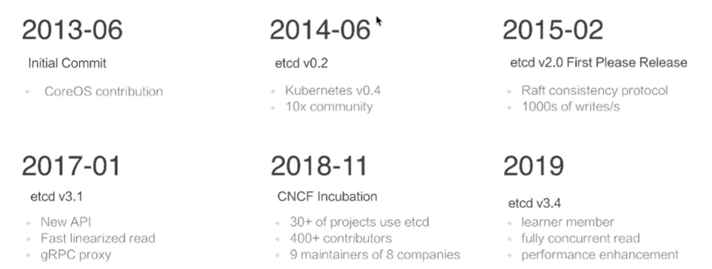
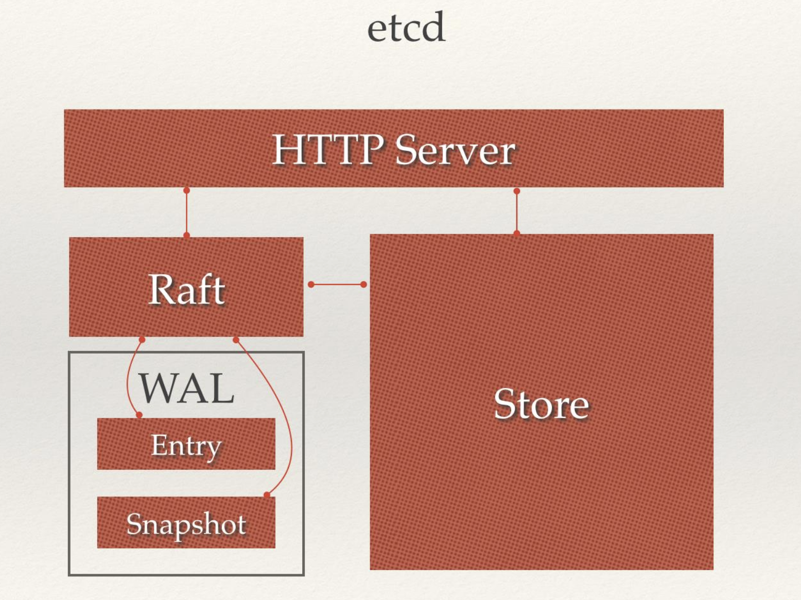
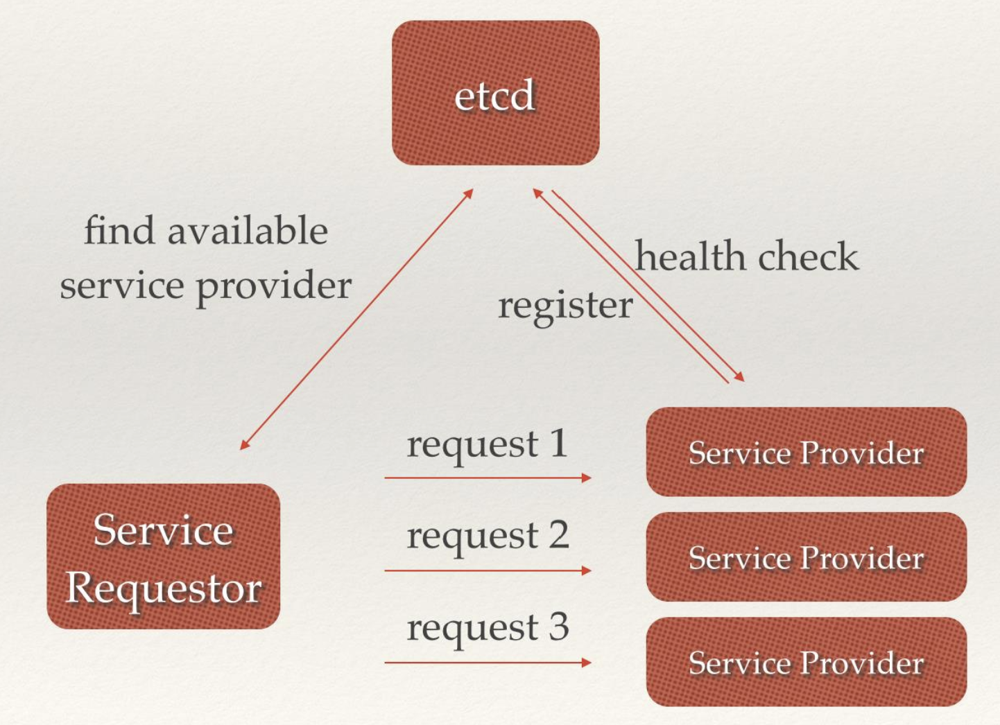
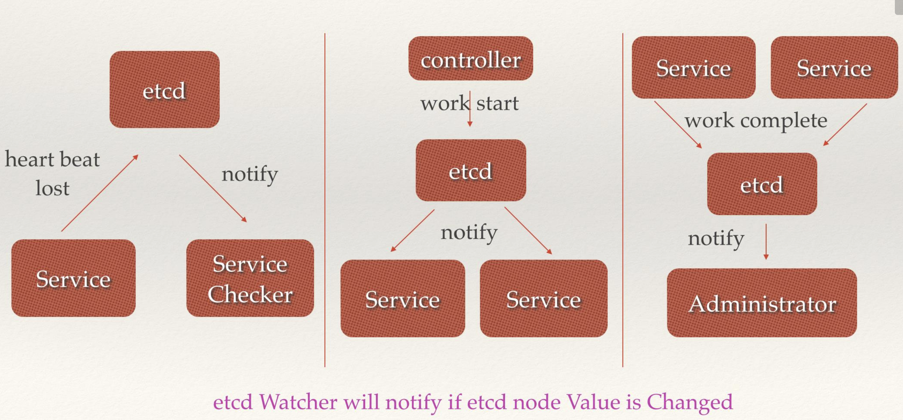
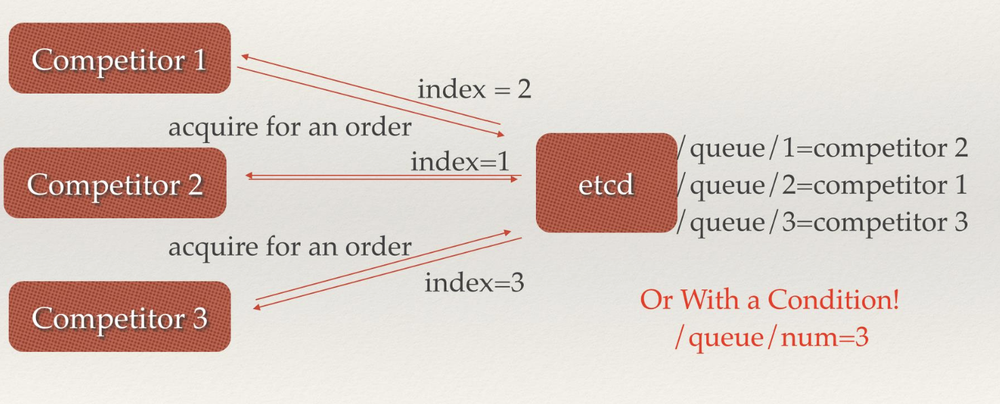
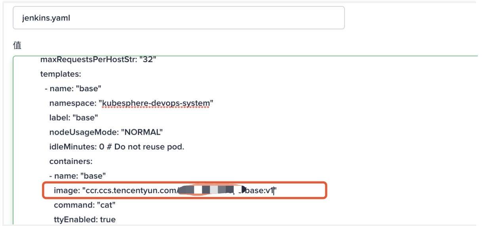
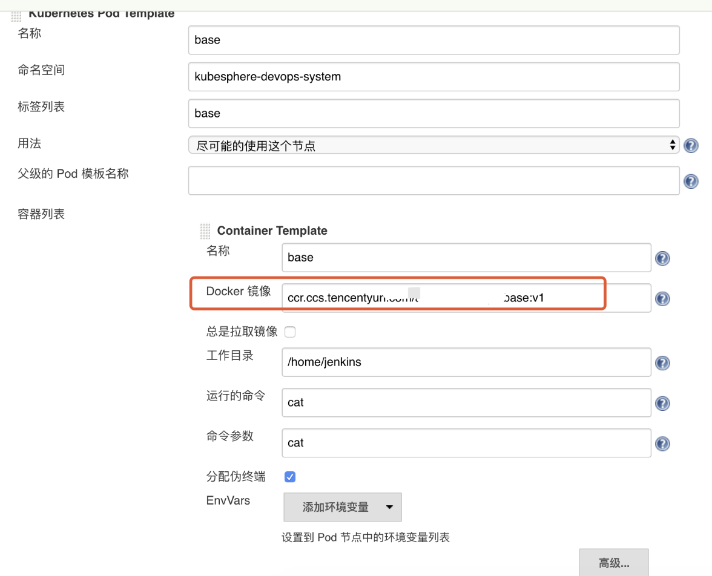
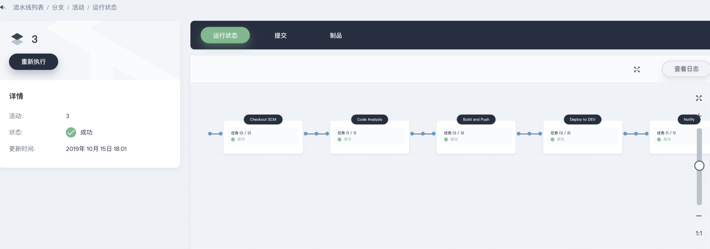

.. contents::
   :depth: 3
..

七 控制器配置清单
=================

7.1 ReplicaSet 
---------------------

   详见：kubectl explain replicaset

-  清单规范

.. code:: bash

   apiVersion  <string>    # api 版本号，一般为 apps/v1
   kind        <string>    # 资源类别，标记创建什么类型的资源
   metadata    <Object>    # POD 元数据
   spec        <Object>    # 元数据

7.1.1 replicaset.spec 规范
~~~~~~~~~~~~~~~~~~~~~~~~~~

1. replicas 副本数量，指定一个数字

2. selector 标签选择器，可以使用 matchLabels、matchExpressions
   两种类型的选择器来选中目标 POD

.. code:: bash

   matchLabels：直接给定键值
   matchExpressions：基于给定的表达式来定义使用标签选择器：{key:"KEY",operator:"OPERATOR",value:[VAL1,VAL2,...]}
       使用 key 与 value 进行 operator 运算，复合条件的才被选择
       操作符：
           In、NotIn：其 value 列表必须有值
           Exists、NotExists：其 value 必须为空

3. template 模板，这里面定义的就是一个 POD 对象，这个对象只包含了
   pod.metadata 和 pod.spec 两部分。

7.1.2 清单示例
~~~~~~~~~~~~~~

.. code:: yaml

   apiVersion: apps/v1
   kind: ReplicaSet
   metadata:
     name: myrs
     namespace: default
   spec:
     replicas: 2
     selector:
       matchLabels:
         app: myapp
         release: canary
     template:
       metadata:
         name: myapp-pod     # 这个其实没用，因为创建的 POD 以 rs 的名字开头
         labels:
           app: myapp        # 标签一定要符合 replicaset 标签选择器的规则，否则将陷入创建 pod 的死循环，直到资源耗尽
           release: canary
       spec:
         containers:
           - name: myapp-containers
             image: ikubernetes/myapp:v1
             ports:
               - name: http
                 containerPort: 80

7.2 Deployment控制器
--------------------

Deployment 通过控制 ReplicaSet 来实现功能，除了支持 ReplicaSet
的扩缩容意外，还支持滚动更新和回滚等，还提供了声明式的配置，这个是我们日常使用最多的控制器。它是用来管理无状态的应用。

Deployment 在滚动更新时候，通过控制多个 ReplicaSet 来实现，ReplicaSet
又控制多个 POD，多个 ReplicaSet 相当于多个应用的版本。

.. code:: mermaid

   graph TB
   Deployment[Deployment] --> replicaset1(replicaset1) 
   Deployment[Deployment] --> replicaset2(replicaset2)
   Deployment[Deployment] --> replicaset3(replicaset3)
   replicaset1(replicaset1) --> POD1{POD}
   replicaset1(replicaset1) --> POD2{POD}
   replicaset2(replicaset1) --> POD5{POD}
   replicaset2(replicaset1) --> POD6{POD}
   replicaset3(replicaset1) --> POD9{POD}
   replicaset3(replicaset1) --> POD10{POD}

-  清单规范，详见：kubectl explain deployment

.. code:: bash

   apiVersion  <string>    # apps/v1

   kind        <string>    # 资源类别，标记创建什么类型的资源

   metadata    <Object>    # POD 元数据

   spec        <Object>    # 元数据

7.2.1 replicaset.spec 对象规范
~~~~~~~~~~~~~~~~~~~~~~~~~~~~~~

1. replicas 副本数量，指定一个数字

2. selector 标签选择器，可以使用 matchLabels、matchExpressions
   两种类型的选择器来选中目标 POD

.. code:: bash

   matchLabels：直接给定键值
   matchExpressions：基于给定的表达式来定义使用标签选择器：{key:"KEY",operator:"OPERATOR",value:[VAL1,VAL2,...]}
       使用 key 与 value 进行 operator 运算，复合条件的才被选择
       操作符：
           In、NotIn：其 value 列表必须有值
           Exists、NotExists：其 value 必须为空

3. template 模板，这里面定义的就是一个 POD 对象，这个对象只包含了
   pod.metadata 和 pod.spec 两部分。

4. strategy 更新策略，支持滚动更新、支持滚动更新的更新方式

.. code:: bash

   type：                # 更新类型，Recreate 滚动更新，RollingUpdate 滚动更新策略
   rollingUpdate：       # 滚动更新时候的策略，这是默认的更新策略
       maxSurge：        # 滚动更新时候允许临时超出多少个，可以指定数量或者百分比，默认 25%
       maxUnavailable：  # 最多允许多少个 POD 不可用，默认 25%

5. revisionHistoryLimit
   滚动更新后最多保存多少个更新的历史版本，值为一个数字

6. paused 当更新启动后控制是否暂停

.. _清单示例-1:

7.2.2 清单示例
~~~~~~~~~~~~~~

.. code:: yaml

   apiVersion: apps/v1
   kind: Deployment
   metadata:
     name: myapp-deploy
     namespace: default
   spec:
     replicas: 2
     selector:
       matchLabels:
         app: myapp
         release: canary
     template:
       metadata:
         labels:
           app: myapp
           release: canary
       spec:
         containers:
           - name: myapp
             image: ikubernetes/myapp:v1
             ports:
               - name: http
                 containerPort: 80

7.2.3 关于更新
~~~~~~~~~~~~~~

1. 直接修改清单文件，kubectl apply -f deployment.yaml
2. 使用 kubectl patch 使用 json 格式给出更新的内容

.. code:: bash

   kubectl patch deployment myapp-deploy -p '{"spec":{"replicas":5}}'    # 修改 POD 副本数量

   kubectl patch deployment myapp-deploy -p '{"spec":{"strategy":{"rollingUpdate":{"maxSurge":1,"maxUnavailable":0}}}}'                                 # 修改更新策略

3. 仅更新镜像 kubectl set image

.. code:: bash

   kubectl set image deployment myapp-deploy myapp=ikubernetes/myapp:v3

7.2.4 模拟金丝雀发布
~~~~~~~~~~~~~~~~~~~~

-  在更新刚刚启动的时候，将更新过程暂停，那么只能更新一个，这实现了在集群中增加一个金丝雀版本

.. code:: bash

   kubectl set image deployment myapp-deploy myapp=ikubernetes/myapp:v3 && kubectl rollout pause deployment myapp-deploy

-  查看已经被更新中被暂停的控制器状态，可以看到一直处于暂停状态的
   deployment

.. code:: bash

   kubectl rollout status deployment myapp-deploy

.. code:: bash

   Waiting for deployment "myapp-deploy" rollout to finish: 1 out of 5 new replicas have been updated...

   等待部署"myapp-deploy"部署完成: 5个新副本中的1个已更新...

-  如果金丝雀没有问题，那么继续可以使用继续更新的命令

.. code:: bash

   kubectl rollout resume deployment myapp-deploy

7.2.5 更新策略
~~~~~~~~~~~~~~

-  最大不可用为 0 ，更新时候可以临时超出1个

.. code:: bash

   kubectl patch deployment myapp-deploy -p '{"spec":{"strategy":{"rollingUpdate":{"maxSurge":1,"maxUnavailable":0}}}}'

7.2.6 关于回滚
~~~~~~~~~~~~~~

1. rollout undo 是回滚的命令，默认滚回上一版本

.. code:: bash

   kubectl rollout undo deployment myapp-deploy

2. 查看可以回滚的版本

.. code:: bash

   kubectl rollout history deployment myapp-deploy

2. rollout undo 指定回滚的版本

.. code:: bash

   kubectl rollout undo deployment myapp-deploy --to-revision=2

3. 查看当前的工作版本

.. code:: bash

   kubectl get rs -o wide

7.3 DaemonSet控制器
-------------------

-  清单规范，详见 kubectl explain daemonset

.. code:: bash

   apiVersion  <string>    # apps/v1

   kind        <string>    # 资源类别，标记创建什么类型的资源

   metadata    <Object>    # POD 元数据

   spec        <Object>    # 元数据

7.3.1 DaemonSet.spec规范
~~~~~~~~~~~~~~~~~~~~~~~~

此处只列举不同之处

1. updateStrategy
   更新策略，支持滚动更新、支持滚动更新的更新方式，默认滚动更新每个 node

.. code:: bash

   rollingUpdate   # 滚动更新，它只有一个 rollingUpdate 参数，表示每次更新几个 node 上的  DaemonSet 任务
   OnDelete        # 在删除时更新

.. _清单示例-2:

7.3.2 清单示例
~~~~~~~~~~~~~~

.. code:: yaml

   apiVersion: apps/v1
   kind: Deployment
   metadata:
     name: redis
     namespace: default
   spec:
     replicas: 1
     selector:
       matchLabels:
         app: redis
         role: logstor
     template:
       metadata:
         labels:
           app: redis
           role: logstor
       spec:
         containers:
           - name: redis
             image: redis:4.0-alpine
             ports:
               - name: redis
                 containerPort: 6379
   ---                                         # 可以使用 --- 来分隔多个记录
   apiVersion: apps/v1
   kind: DaemonSet
   metadata:
     name: filebeat-daemonset
     namespace: default
   spec:
     selector:
       matchLabels:
         app: filebeat
         release: stalbe
     template:
       metadata:
         labels:
           app: filebeat
           release: stalbe
       spec:
         containers:
           - name: filebeat
             image: ikubernetes/filebeat:5.6.5-alpine
             env:                                         # 向容器传递环境变量
               - name: REDIS_HOST                         # 容器内的环境变量名称
                 value: redis.default.svc.cluster.local   # 环境变量值，指向 redis service
               - name: REDIS_LOG_LEVEL
                 value: info

.. _关于更新-1:

7.3.3 关于更新
~~~~~~~~~~~~~~

-  更新 filebeat-daemonset 这个 daemonset 控制器下的 filebeat 容器的镜像

.. code:: bash

   kubectl set image daemonsets filebeat-daemonset filebeat=ikubernetes/filebeat:5.6.6-alpine

八 Service 配置清单
===================

Service 为 POD 控制器控制的 POD 集群提供一个固定的访问端点，Service
的工作还依赖于 K8s 中的一个附件，就是 CoreDNS ，它将 Service
地址提供一个域名解析。

8.1 Service 工作模式
--------------------

1. userspace: 1.1 之前版本
2. iptables: 1.10 之前版本
3. ipvs：1.11 之后版本

8.2 Service 类型
----------------

============ =======================================================
类型         作用
============ =======================================================
ClusterIP    默认值，分配一个 Service 网络的地址，仅用于集群内部通信
NodePort     如果需要集群外部访问，可以使用这个类型
ExternalName 把集群外部的服务引入到集群内部，方便在集群内部使用
LoadBalancer K8S 工作在云环境中，调用云环境创建负载均衡器
============ =======================================================

8.3 资源记录
------------

SVC_NAME.NS_NAME.DOMAIN.LTD

例如：redis.default.svc.cluster.local.

8.4 Service 清单
----------------

-  清单组成

.. code:: bash

   apiVersion  <string>    # api 版本号，v1
   kind        <string>    # 资源类别，标记创建什么类型的资源
   metadata    <Object>    # POD 元数据
   spec        <Object>    # 元数据

8.5 service.spec 规范
---------------------

1. clusterIP：指定 Service 处于 service 网络的哪个 IP，默认为动态分配
2. type： service 类型，可用：ExternalName, ClusterIP, NodePort, and
   LoadBalancer

8.6 ClusterIP 类型的 service
----------------------------

.. code:: yaml

   apiVersion: v1
   kind: Service
   metadata:
     name: redis
     namespace: default
   spec:
     selector:
       app: redis
       role: logstor
     type: ClusterIP
     clusterIP: 10.96.0.100
     ports:
       - port: 6379         # service 端口
         targetPort: 6379   # pod 监听的端口
         protocol: TCP

8.7 NodePort 类型的 service
---------------------------

NodePort 是在 ClusterIP 类型上增加了一个暴露在了 node
的网络命名空间上的一个
nodePort，所以用户可以从集群外部访问到集群了，因而用户的请求流程是：Client
-> NodeIP:NodePort -> ClusterIP:ServicePort -> PodIP:ContainerPort。

可以理解为 NodePort 增强了 ClusterIP
的功能，让客户端可以在每个集群外部访问任意一个 nodeip 从而访问到
clusterIP，再由 clusterIP 进行负载均衡至 POD。

-  清单示例

.. code:: yaml

   apiVersion: v1
   kind: Service
   metadata:
     name: myapp
     namespace: default
   spec:
     selector:
       app: myapp
       release: canary
     type: NodePort
     ports:
       - port: 80         # service 端口
         targetPort: 80   # pod 监听的端口
         nodePort: 30080    # service 会在每个 node 上添加 iptables/ipvs 规则重定向这个端口的访问，所以必须保证所有 node 的这个端口没被占用
         protocol: TCP

.. code:: bash

   在集群外部就可以使用: http://172.16.100.102:30080 来访问这个 service 地址了

.. code:: bash

   在集群内可以使用 service 的域名在 coredns 上解析得到 service 地址: dig -t A myapp.default.svc.cluster.local @10.96.0.10

8.8 loadBalancerIP 类型
-----------------------

service 在每台主机的 iptables/ipvs 规则内，访问任意一台 node 都可以到达
pod，所以应该在这些 nodeip 前加负载均衡器，如果工作在公有云，可以使用
k8s 内置的
loadBalancerIP，操作公有云的负载均衡器即服务，实现动态的增删。

可以理解为 loadBalancerIP 增强了 NodePort 类型的 service
，在集群外部对每台 nodeip 进行负载均衡。

8.9 无集群地址的 Service
------------------------

无头 service 表示 service 没有 ClusterIP 也不映射 NodePort，而是将
service 的域名直接解析为 nodeIP 从而直接访问 nodeIP 上的 POD。

-  清单示例

::

   apiVersion: v1
   kind: Service
   metadata:
     name: myapp-nohead
     namespace: default
   spec:
     selector:
       app: myapp-nohead
       release: canary
     type: ClusterIP
     clusterIP: None
     ports:
       - port: 80         # service 端口
         targetPort: 80   # pod 监听的端口

-  查看 CoreDNS 服务器的地址

.. code:: bash

   kubectl get svc -n kube-system

-  在集群内使用 CoreDNS 的地址解析无头的 serive 域名，得到的直接为
   nodeip 中的 pod 地址，利用 dns 的多条 A 记录来负载均衡

.. code:: bash

   dig -t A myapp-nohead.default.svc.cluster.local. @10.96.0.10

::

   ;; ANSWER SECTION:
   myapp-nohead.default.svc.cluster.local. 5 IN A  10.244.1.75
   myapp-nohead.default.svc.cluster.local. 5 IN A  10.244.2.74

8.10 externalName 类型
----------------------

当 POD 需要访问一个集群外部的服务时候，externalName
可以映射一个集群外部的服务到集群内部，供集群内 POD 访问。

就是把外部的一个域名地址，映射为集群内部 coredns
解析的一个内部地址，提供集群内部访问。

九 ingress 控制器
=================

如果 k8s 需要提供一个网站，并且这个站点需要以 https 访问，而
iptables/ipvs 工作在 4 层，客户发出的 ssl 请求根本不被解析就被调度到后端
POD了。解决方法有两个：

1. 可以在公有云的负载均衡器上配置上 ssl 证书。

2. 新建一个负载均衡器的 POD ，例如 nignx ，这个 POD
   共享主机的网络命名空间，也就是说可以直接通过 nodeip
   访问到负载均衡器，ssl 证书配置在这个负载均衡器上，对外连接为 https
   而对内的代理为 http 协议到 POD 网络的 POD 上。

-  存在的问题

.. code:: bash

   - 负载均衡器 POD 使用节点的网络名称空间, 那么它只   能在这个 node 节点上运行一个了,否则就出现端口冲突
   - 负载均衡器是代理 POD 卸载 ssl 证书的关键节点, 它不能只运行一个, 它需要在所有节点运行一个

-  解决方法

.. code:: bash

   - 负载均衡器使用 DaemonSet 在每个 node 节点运行一个,代理请求至 POD 网络的中的 POD 上
   - 如果集群节点非常的多,其实不必在每个 node 节点都必须运行一个负载均衡器 POD
   - 控制负载均衡器 POD 运行的数量可以通过 lables 指定运行那几个 node 节点上
   - 然后可以在负载均衡器 POD 所在的 node 节点上打上 "污点" 使其他的 POD 不会再被调度上来, 而只有负载均衡器 POD 可以容忍这些 "污点"

-  负载均衡器可选，按照优先级先后排序

.. code:: bash

   Envoy            # 云原生高性能服务代理,已从cncf毕业
   Traefik          # 为微服务而生的反向代理
   Nginx            # 改造后可以适用于微服务环境
   HAproxy          # 不推荐使用

新建一个 service 将需要代理的不同服务的 pod 分类

新建一个 ingress 资源，从 service 中取得分类结果，映射进 Envoy 中，重载
Envoy 软件。

9.1 ingress.spec 规范
---------------------

-  API 和 kind

.. code:: bash

   apiVersion: extensions

   kind: ingress

-  ingress.spec

.. code:: bash

   backend         # 后端有哪些 POD
   rules           # 调度规则
       host        # 虚拟主机
       http        # http 路径

9.2 ingress-nginx 代理
----------------------

-  后端 service 和 pods

.. code:: yaml

   apiVersion: v1
   kind: Service
   metadata:
     name: service-ingress-myapp
     namespace: default
   spec:
     selector:
       app: myapp
       release: canary
     ports:
       - name: http
         port: 80
         targetPort: 80

   ---
   apiVersion: apps/v1
   kind: Deployment
   metadata:
     name: myapp
     namespace: default
   spec:
     replicas: 4
     selector:
       matchLabels:
         app: myapp
         release: canary
     template:
       metadata:
         labels:
           app: myapp
           release: canary
       spec:
         containers:
           - name: myapp
             image: ikubernetes/myapp:v2
             ports:
               - name: http
                 containerPort: 80

-  创建 ingress-nginx

.. code:: bash

   kubectl apply -f https://raw.githubusercontent.com/kubernetes/ingress-nginx/nginx-0.21.0/deploy/mandatory.yaml

-  让 ingress-nginx 在集群外部访问

.. code:: bash

   kubectl apply -f https://raw.githubusercontent.com/kubernetes/ingress-nginx/nginx-0.21.0/deploy/provider/baremetal/service-nodeport.yaml

-  创建 ingress 对象，它能将 ingress-nginx 与 service 关联，从而在
   service 后主机发生变动的时候，反应在 ingress-nginx
   这个容器的配置文件中

.. code:: yaml

   apiVersion: extensions/v1beta1
   kind: Ingress
   metadata:
     name: ingress-deploy-myapp
     namespace: default
     annotations:
       kubernetes.io/ingress.class: "nginx"
   spec:
     rules:
       - host: myapp.kaliarch.com                       # 基于主机名的访问
         http:
           paths:
             - path:                                   # 空的时候代表根，访问根的时候映射到 backend
               backend:                                # 后端的 service 的配置
                 serviceName: service-ingress-myapp    # 关联 service 从而获取到后端主机的变动
                 servicePort: 80                       # 关联 service 的地址

-  查看 ingress-nginx 对外暴露的端口，这里为30080，和 30443 两个

.. code:: bash

   kubectl get service -n ingress-nginx

-  使用 nodeip + ingress-nginx 暴露端口访问，由于上面创建的 ingress
   为基于主机名称的，所以需要在访问时在 /etc/hosts 做好映射到 node。

.. code:: bash

   http://myapp.kaliarch.com:30080/index.html  

9.3 ingress-tomcat 代理
-----------------------

-  后端 service 和 pods

.. code:: yaml

   apiVersion: v1
   kind: Service
   metadata:
     name: service-ingress-tomcat
     namespace: default
   spec:
     selector:
       app: tomcat
       release: canary
     ports:
       - name: http
         port: 8080
         targetPort: http
       - name: ajp
         port: 8009
         targetPort: ajp

   ---
   apiVersion: apps/v1
   kind: Deployment
   metadata:
     name: deploy-tomcat
     namespace: default
   spec:
     replicas: 4
     selector:
       matchLabels:
         app: tomcat
         release: canary
     template:
       metadata:
         labels:
           app: tomcat
           release: canary
       spec:
         containers:
           - name: tomcat
             image: tomcat:8.5.32-jre8-alpine
             ports:
               - name: http
                 containerPort: 8080
               - name: ajp
                 containerPort: 8009

-  制作自签名证书，让 ingress-nginx 带有证书来访问

.. code:: bash

   # 生成 key
   openssl genrsa -out tls.key 2048

   # 生成自签证书，CN=域名必须要与自己的域名完全一致
   openssl req -new -x509 -key tls.key -out tls.crt -subj /C=CN/ST=Beijing/L=Beijing/O=DevOps/CN=tomcat.kaliarch.com

-  创建 secret 证书对象，它是标准的 k8s 对象

.. code:: bash

   kubectl create secret tls tomcat-ingress-secret --cert=tls.crt --key=tls.key

-  创建带证书的 ingress 对象，它能将 ingress-tomcat 与 service
   关联，从而在 service 后主机发生变动的时候，反应在 ingress-tomcat
   这个容器的配置文件中

.. code:: yaml

   apiVersion: extensions/v1beta1
   kind: Ingress
   metadata:
     name: ingress-deploy-tomcat-tls
     namespace: default
     annotations:
       kubernetes.io/ingress.class: "nginx"
   spec:
     tls:
       - hosts:
         - tomcat.kaliarch.com
         secretName: tomcat-ingress-secret
     rules:
       - host: tomcat.kaliarch.com
         http:
           paths:
             - path:
               backend:
                 serviceName: service-ingress-tomcat
                 servicePort: 8080

-  查看 ingress-nginx 对外暴露的端口，这里为30080，和 30443 两个

.. code:: bash

   kubectl get service -n ingress-nginx

-  使用 nodeip + ingress-nginx 暴露端口访问，由于上面创建的 ingress
   为基于主机名称的，所以需要在访问时在 /etc/hosts 做好映射到 node。

.. code:: bash

   https://tomcat.kaliarch.com:30443

十 POD 存储卷
=============

大部分有状态的应用都有持久存储，在 Docker
上我们将容器所需要的存储卷放在宿主机上，但是 k8s 上不行，因为 POD
会被在不同的 node 节点上创建删除，所以 k8s
需要一套另外的存储卷机制，它能脱离节点为整个集群提供持久存储。

k8s 提供了多种不同的存储卷，k8s 中存储卷属于 POD 而不是容器，POD
可以挂载，POD 为什么能有存储卷呢？这是因为在所有节点上运行了一个 Pause
的镜像，它是 POD 的基础架构容器，它拥有存储卷，同一个 POD
内的所有容器是一个网络名称空间的。

10.1 卷的类型
-------------

   查看 POD 支持的存储类型：kubectl explain pods.spec.volumes

1. HostPath：在节点本地新建一个路径，与容器建立关联关系，但节点挂了的数据也不存在了，所以也不具有持久性，容器被调度到别的
   node 时候不能跨节点使用HostPath。
2. Local：直接使用节点的设备、也支持一个目录类似于 HostPath。
3. EmptyDir：只在节点本地使用，一旦 POD
   删除，存储卷也会删除，它不具有持久性，当临时目录或者缓存。
4. 网络存储：iSCSI、NFS、Cifs、glusterfs、cephfs、EBS（AWS)、Disk（Azone）

10.2 容器挂载选项
-----------------

在 K8S 中卷是属于 POD 的，而不是容器，所以卷的定义在 POD 中，一个 POD
中可以定义多个卷。

-  在 POD 中挂载使用，kubectl explain pods.spec.containers.volumeMounts

.. code:: bash

   apiVersion: v1
   kind: Pod
   metadata:
     name: myapp
     namespace: default
     labels:
       app: myapp
   spec:
     containers:
     - name: myapp
       image: ikubernetes/myapp:v1
       volumeMounts        <[]Object>  # 卷挂载对象
         mountPath         <string>    # 挂载路径
         mountPropagation  <string>    # 确定挂载如何从主机传播到容器
         name              <string>    # 挂载哪个卷
         readOnly          <boolean>   # 是否只读挂载
         subPath           <string>    # 挂载在子路径下
         subPathExpr       <string>    # 与 subPath 类似，挂载在子路径下，不同的是可以使用 $(VAR_NAME) 表示容器扩展这个变量

10.3 节点存储
-------------

10.3.1 hostpath存储卷
~~~~~~~~~~~~~~~~~~~~~

在宿主机的路径挂载到 POD 上，POD 删除后，卷数据是不会随之删除的，但如果
node 节点挂掉，那么数据有可能丢失，如果 POD
被调度到其他的节点，那么原来卷的数据就访问不到了。

   https://kubernetes.io/docs/concepts/storage/volumes/#hostpath

-  定义参数，kubectl explain pods.spec.volumes.hostPath

.. code:: bash

   path    <string>  # 主机上目录的路径。 如果路径是符号链接，则会跟随真实路径的链接。
   type    <string>  # 见下表

+----------------+-----------------------------------------------------+
| 值             | 行为                                                |
+================+=====================================================+
|                | 空字符串（默认）用于向后兼容，这意味着在安装hostPath卷之前不会执行任何检查。 |
+----------------+-----------------------------------------------------+
| ``DirectoryOrC | 如果给定路径中不存在任何内容，则将根据需要创建一个空目录，权限设置为0755，与Kubelet具有相同 |
| reate``        | 的组和所有权。                                      |
+----------------+-----------------------------------------------------+
| ``Directory``  | 目录必须存在于给定路径中                            |
+----------------+-----------------------------------------------------+
| ``FileOrCreate | 如果给定路径中不存在任何内容，则会根据需要创建一个空文件，权限设置为0644，与Kubelet具有相同 |
| ``             | 的组和所有权。                                      |
+----------------+-----------------------------------------------------+
| ``File``       | 文件必须存在于给定路径中                            |
+----------------+-----------------------------------------------------+
| ``Socket``     | UNIX套接字必须存在于给定路径中                      |
+----------------+-----------------------------------------------------+
| ``CharDevice`` | 字符设备必须存在于给定路径中                        |
+----------------+-----------------------------------------------------+
| ``BlockDevice` | 块设备必须存在于给定路径中                          |
| `              |                                                     |
+----------------+-----------------------------------------------------+

-  示例

.. code:: yaml

   apiVersion: v1
   kind: Pod
   metadata:
     name: myapp
     namespace: default
     labels:
       app: myapp
   spec:
     containers:
     - name: myapp
       image: ikubernetes/myapp:v1
       volumeMounts:                       # 容器挂载哪些卷
       - name: webstore                    # 挂载哪个卷
         mountPath: /usr/share/nginx/html  # 挂载到容器内哪个目录
         readOnly: false                   # 是否只读
     volumes:                              # 存储卷属于POD的（不属于容器)
     - name: webstore                      # 存储卷对象名字
       hostPath:                           # hostpath 类型的存储卷对象
         path: /data/myapp                 # 处于宿主机的目录
         type: DirectoryOrCreate           # 不存在则创建

10.3.2 gitRepo卷
~~~~~~~~~~~~~~~~

将 git 仓库的内容当作存储使用，在 POD
创建时候连接到仓库，并拉取仓库，并将它挂载到容器内当作一个存储卷。

它其实是建立在 emptyDir 的基础上，但是对卷的操作不会同步到 gitrepo 上。

10.3.3 emptyDir缓存卷
~~~~~~~~~~~~~~~~~~~~~

它使用宿主机一个目录作为挂载点，随着 POD
生命周期的结束，其中的数据也会丢失，但是它有一个非常大的优点就是可以使用内存当作存储空间挂载使用。

它可以用在 POD 中两个容器中有一些数据需要共享时候选用。

-  定义 emptyDir 参数，\ ``kubectl explain pods.spec.volumes.emptyDir``

.. code:: bash

   medium      <string>    # 使用 "" 表示使用 Disk 来存储，使用 Memory 表示使用内存
   sizeLimit   <string>    # 限制存储空间的大小

-  使用示例

.. code:: yaml

   apiVersion: v1
   kind: Pod
   metadata:
     name: pod-volume-demo
     namespace: default
     labels:
       app: myapp
       tier: frontend
   spec:
     volumes:
       - name: html
         emptyDir: {}      # 使用磁盘，且没有容量限制
     containers:
       - name: myapp
         image: ikubernetes/myapp:v1
         imagePullPolicy: IfNotPresent
         volumeMounts:
           - name: html
             mountPath: /usr/share/nginx/html/
         ports:
           - name: http
             containerPort: 80
           - name: https
             containerPort: 443
       - name: busybox
         image: busybox:latest
         imagePullPolicy: IfNotPresent
         volumeMounts:
           - name: html
             mountPath: /data/
         command:
           - "/bin/sh"
           - "-c"
           - "while true; do date >> /data/index.html; sleep 10; done"

-  使用示例

.. code:: yaml

   apiVersion: v1
   kind: Pod
   metadata:
     name: pod-volume-demo
     namespace: default
     labels:
       app: myapp
       tier: frontend
   spec:
     containers:
       - name: myapp
         image: ikubernetes/myapp:v1
         imagePullPolicy: IfNotPresent
         volumeMounts:
           - name: html
             mountPath: /usr/share/nginx/html/
         ports:
           - name: http
             containerPort: 80
           - name: https
             containerPort: 443
       - name: busybox
         image: busybox:latest
         imagePullPolicy: IfNotPresent
         volumeMounts:
           - name: html
             mountPath: /data/
         command:
           - "/bin/sh"
           - "-c"
           - "while true; do date >> /data/index.html; sleep 10; done"
     volumes:
       - name: html
         emptyDir:
           medium: ""
           sizeLimit: 1536Mi

10.4 网络存储
-------------

网络存储，就是脱离了节点生命周期的存储设备，即使 pod 被调度到别的 node
节点上，仍然可以挂载使用其中的数据。

10.4.1 nfs
~~~~~~~~~~

nfs 服务器是存在于集群之外的服务器，它不受 node 节点的影响，因而在 node
节点宕机后仍然能够提供持久存储给其他 POD。

-  在 k8s 的 node 找一个主机，安装配置 nfs 服务器并启动

.. code:: bash

   $ yum install nfs-utils                                                     # 安装 nfs 服务
   $ mkdir -p /data/volumes                                                    # 创建 volume 卷目录
   echo '/data/volumes  172.16.100.0/16(rw,no_root_squash)' >> /etc/exports    # 配置 nfs 服务器
   $ systemctl start nfs                                                       # 启动 nfs 服务器
   $ ss -tnl                                                                   # 确认监听端口，nfs 监听 TCP 2049 端口

-  在 k8s 集群的 node 节点安装 nfs 驱动，测试挂载是否正常

.. code:: bash

   $ yum install nfs-utils
   $ mount -t nfs 172.16.100.104:/data/volumes /mnt

-  定义 nfs 参数，kubectl explain pods.spec.volumes.nfs

.. code:: bash

   path      <string>       # nfs 服务器的路径
   readOnly  <boolean>      # 是否只读
   server    <string>       # nfs 服务器地址

-  使用示例

.. code:: yaml

   apiVersion: v1
   kind: Pod
   metadata:
     name: pod-vol-nfs-demo
     namespace: default
   spec:
     containers:
     - name: myapp
       image: ikubernetes/myapp:v1
       volumeMounts:
         - name: html
           mountPath: /usr/share/nginx/html/
     volumes:
       - name: html
         nfs:
           path: /data/volumes
           server: 172.16.100.104

10.5 分布式存储
---------------

分布式存储能提供脱离节点生命周期的存储，又比网络存储更加健壮，它是分布式的，有很强的高可用性，但是分布式存储配置复杂，在由
NFS 提供的网络储存中，用户需要知道分配给 POD 的 NFS
存储的地址才能使用，而在由分布式提供的存储能力的存储上，用户需要充分了解该分布式存储的配置参数，才能够使用这个分布式存储。

由此 K8S 提供了 PV、PVC
两种机制，让普通用户无需关心底层存储参数的配置，只需要说明需要使用多大的持久存储，就可以了。

一般 PV 与 PVC 是一对绑定的，PV属于全局，PVC 属于某个名称空间，当一个 PV
被一个 PVC 绑定，别的名称空间 PVC 就不可以再绑定了。请求绑定某个 PV
就是由 PVC 来完成的，被 PVC 绑定的 PV 称作 PV 的绑定状态。

PVC 绑定了一个 PV，那么 PVC 所处名称空间定义的 POD 就可以使用
persistentVolumeClaim 类型的 volumes 了，然后容器就可以通过 volumeMounts
挂载 PVC 类型的卷了。

persistentVolumeClaim 卷是否允许多路读写，这取决于 PV
定义时候的读写特性：单路读写、多路读写、多路只读。

如果某个 POD 不在需要了，我们把它删除了、同时也删除了 PVC、那么此时 PV
还可以有自己的回收策略： delete删除PV、Retain什么都不做。

10.5.1 PersistentVolume
~~~~~~~~~~~~~~~~~~~~~~~

由管理员添加的的一个存储的描述，是一个集群级别的全局资源，包含存储的类型，存储的大小和访问模式等。它的生命周期独立于Pod，例如当使用它的
Pod 销毁时对 PV 没有影响。

   见：kubectl explain PersistentVolume.spec

-  在 nfs 上定义存储，/etc/exports，并且导出 nfs 定义

.. code:: bash

   /data/volumes/v1    172.16.100.0/16(rw,no_root_squash)
   /data/volumes/v2    172.16.100.0/16(rw,no_root_squash)
   /data/volumes/v3    172.16.100.0/16(rw,no_root_squash)
   /data/volumes/v4    172.16.100.0/16(rw,no_root_squash)
   /data/volumes/v5    172.16.100.0/16(rw,no_root_squash)

.. code:: bash

   exportfs -arv

-  将 nfs 在 k8s 中定义为 PersistentVolume，详见：kubectl explain
   PersistentVolume.spec.nfs

.. code:: yaml

   apiVersion: v1
   kind: PersistentVolume
   metadata:
     name: pv-001
     labels:
       name: pv001
   spec:
     accessModes:
       - ReadWriteMany
       - ReadWriteOnce
     capacity:
       storage: 1Gi
     nfs:
       path: /data/volumes/v1
       server: 172.16.100.104

   ---
   apiVersion: v1
   kind: PersistentVolume
   metadata:
     name: pv-002
     labels:
       name: pv003
   spec:
     accessModes:
       - ReadWriteMany
       - ReadWriteOnce
     capacity:
       storage: 2Gi
     nfs:
       path: /data/volumes/v2
       server: 172.16.100.104

   ---
   apiVersion: v1
   kind: PersistentVolume
   metadata:
     name: pv-003
     labels:
       name: pv003
   spec:
     accessModes:
       - ReadWriteMany
       - ReadWriteOnce
     capacity:
       storage: 3Gi
     nfs:
       path: /data/volumes/v3
       server: 172.16.100.104

.. code:: bash

   kubectl get persistentvolume
   NAME     CAPACITY   ACCESS MODES   RECLAIM POLICY   STATUS      CLAIM   STORAGECLASS   REASON   AGE
   pv-001   1Gi        RWO,RWX        Retain           Available                                   3m38s
   pv-002   2Gi        RWO,RWX        Retain           Available                                   3m38s
   pv-003   3Gi        RWO,RWX        Retain           Available                                   3m38s

10.5.2. PersistentVolumeClaim
~~~~~~~~~~~~~~~~~~~~~~~~~~~~~

是 Namespace 级别的资源，描述对 PV
的一个请求。请求信息包含存储大小，访问模式等。

-  定义 PVC，kubectl explain PersistentVolumeClaim.spec

.. code:: bash

   accessModes         <[]string>  # 设置访问模式
       ReadWriteOnce               # 单个节点以读写方式挂载
       ReadOnlyMany                # - 多节点以只读方式挂载
       ReadWriteMany               # - 多节点以读写方式挂载

   dataSource          <Object>    # 如果配置程序可以支持 Volume Snapshot 数据源，它将创建一个新卷，并且数据将同时还原到该卷。 
   resources           <Object>    # 资源表示 PersistentVolume 应具有的最小资源
   selector            <Object>    # 选择哪个 PersistentVolume
   storageClassName    <string>    # 存储类名称
   volumeMode          <string>    # 定义声明所需的 PersistentVolume 类型才能被选中
   volumeName          <string>    # 后端 PersistentVolume ，就是精确选择 PersistentVolume ，而不是使用 selector 来选定

-  在 volumes 中使用 PVC，kubectl explain
   pods.spec.volumes.persistentVolumeClaim

.. code:: yaml

   persistentVolumeClaim
       claimName    <string>  # 在当前名称空间已经创建号的 PVC 名称
       readOnly     <boolean> # 是否只读

-  定义 PersistentVolumeClaim，详见：kubectl explain
   PersistentVolumeClaim.spec

.. code:: yaml

   apiVersion: v1
   kind: PersistentVolumeClaim
   metadata:
     name: my-pvc
     namespace: default
   spec:
     accessModes:
       - ReadWriteMany        # 访问模式
     resources:               # 资源条件
       requests:              # 挑选 PV 时候必须满足的条件，不满足则一直等待
         storage: 2Gi         # 存储大小

-  在 pod 清单中定义 persistentVolumeClaim 类型的 volumes
   ，并在容器中挂载 volumeMounts。

.. code:: yaml

   apiVersion: v1
   kind: Pod
   metadata:
     name: pod-vol-nfs-demo
     namespace: default
   spec:
     containers:
     - name: myapp
       image: ikubernetes/myapp:v1
       volumeMounts:
         - name: html
           mountPath: /usr/share/nginx/html/
     volumes:
       - name: html
         persistentVolumeClaim:
           claimName: my-pvc            # 使用的 PVC 的名称

10.5.3 StorageClass
~~~~~~~~~~~~~~~~~~~

PVC 申请 PV 的时候，未必有符合条件的 PV，k8s 为我们准备了 StorageClass
可以在 PVC 申请 PV 的时候通过 StorageClass 动态生成 PV。

StorageClass 可以动态的到 CephFS 、NFS 等存储（或者云端存储）产生一个
PV，要求存储设备必须支持 RESTfull 风格的接口。

10.6 StorageClass Ceph RBD
--------------------------

10.6.1 配置 Ceph 储存池
~~~~~~~~~~~~~~~~~~~~~~~

-  创建 ceph 存储池

.. code:: bash

   yum install -y ceph-common                                                                   # 在所有节点安装 ceph-common

.. code:: bash

   ceph osd pool create kube 4096                                                               # 创建 pool
   ceph osd pool ls                                                                             # 查看 pool

   ceph auth get-or-create client.kube mon 'allow r' osd 'allow rwx pool=kube' -o /etc/ceph/ceph.client.kube.keyring
   ceph auth list                                                                               # 授权 client.kube 用户访问 kube 这个 pool

   scp /etc/ceph/ceph.client.kube.keyring node1:/etc/ceph/                                      # 将用户 keyring 文件拷贝到各个 ceph 节点
   scp /etc/ceph/ceph.client.kube.keyring node1:/etc/ceph/

10.6.2 安装 rbd-provisioner
~~~~~~~~~~~~~~~~~~~~~~~~~~~

-  1.12 版本后 kube-controller-manager 不再内置 rbd 命令，所以
   StorageClass 的 provisioner 而是通过外部的插件来实现

.. code:: bash

   https://github.com/kubernetes-incubator/external-storage/tree/master/ceph/rbd/deploy/rbac    # rbd-provisioner

.. code:: bash

   $ git clone https://github.com/kubernetes-incubator/external-storage.git                     # 下载 rbd-provisioner
   $ cat >>external-storage/ceph/rbd/deploy/rbac/clusterrole.yaml<<EOF                          # 允许 rbd-provisioner 访问 ceph 的密钥
     - apiGroups: [""]
       resources: ["secrets"]
       verbs: ["create", "get", "list", "watch"]
   EOF
   $ kubectl apply -f external-storage/ceph/rbd/deploy/rbac/                                    # 安装 rbd-provisioner

10.6.3 使用 StorageClass
~~~~~~~~~~~~~~~~~~~~~~~~

-  创建 CephX 验证 secret

.. code:: yaml

   https://github.com/kubernetes-incubator/external-storage/tree/master/ceph/rbd/examples       # rbd-provisioner 使用 ceph rbd 的示例

.. code:: yaml

   ---
   apiVersion: v1
   kind: Secret
   metadata:
     name: ceph-admin-secret
     namespace: kube-system
   type: "kubernetes.io/rbd"
   data:
     # ceph auth get-key client.admin | base64                                                  # 从这个命令中取得 keyring 认证的 base64 密钥串复制到下面
     key: QVFER3U5TmM1NXQ4SlJBQXhHMGltdXZlNFZkUXRvN2tTZ1BENGc9PQ==

   ---
   apiVersion: v1
   kind: Secret
   metadata:
     name: ceph-secret
     namespace: kube-system
   type: "kubernetes.io/rbd"
   data:
     # ceph auth get-key client.kube | base64                                                  # 从这个命令中取得 keyring 认证的 base64 密钥串复制到下面
     key: QVFCcUM5VmNWVDdQRlJBQWR1NUxFNzVKeThiazdUWVhOa3N2UWc9PQ==

-  创建 StorageClass 指向 rbd-provisioner，

.. code:: yaml

   ---
   kind: StorageClass
   apiVersion: storage.k8s.io/v1
   metadata:
     name: ceph-rbd
   provisioner: ceph.com/rbd
   reclaimPolicy: Retain
   parameters:
     monitors: 172.16.100.9:6789
     pool: kube
     adminId: admin
     adminSecretName: ceph-admin-secret
     adminSecretNamespace: kube-system
     userId: kube
     userSecretName: ceph-secret
     userSecretNamespace: kube-system
     fsType: ext4
     imageFormat: "2"
     imageFeatures: "layering"

-  创建 PersistentVolumeClaim

.. code:: yaml

   ---
   kind: PersistentVolumeClaim
   apiVersion: v1
   metadata:
     name: ceph-rbd-pvc  data-kong-postgresql-0 
   spec:
     storageClassName: ceph-rbd
     accessModes:
     - ReadWriteOnce
     resources:
       requests:
         storage: 1Gi

-  在 POD 中使用 PVC，最后在容器中挂载 PVC。

.. code:: yaml

   ---
   apiVersion: v1
   kind: Pod
   metadata:
     name: ceph-sc-pvc-demo
     namespace: default
   spec:
     containers:
     - name: myapp
       image: ikubernetes/myapp:v1
       volumeMounts:
         - name: pvc-volume
           mountPath: /usr/share/nginx/html/
     volumes:
       - name: pvc-volume
         persistentVolumeClaim:
           claimName: ceph-rbd-pvc

十一 配置信息容器化
===================

k8s 提供了 configMap、secret 这两种特殊类型的存储卷，多数情况下不是为
POD 提供存储空间，而是为用户提供了从集群外部到 POD
内部注入配置信息的方式。

-  配置信息容器化有哪些方式

1. 自定义命令行参数，例如：command、args，根据 args
   传递不同的参数来将容器运行为不同的特性
2. 直接把配置信息制作为 image
   中，但是这种方式非常不灵活，这个镜像只能适用于一种使用场景，过度耦合
3. 环境变量，Cloud Native 支持通过环境变量来加载配置，或者使用
   ENTRYPOINT 脚本来预处理环境变量为配置信息
4. 存储卷，在容器启动时候挂载一个存储卷，或者专用的配置存储卷，挂载到应用程序的配置文件目录

-  Secret与ConfigMap对比

::

   相同点：
   -   key / value 的形式 
   -   属于某个特定的 namespace 
   -   可以导出到环境变量 
   -   可以通过目录/文件形式挂载(支持挂载所有key和部分key)

   不同点：
   -   Secret 可以被 ServerAccount 关联(使用) 
   -   Secret 可以存储 register 的鉴权信息，用在 ImagePullSecret 参数中，用于拉取私有仓库的镜像 
   -   Secret 支持 Base64 加密 
   -   Secret 分为 kubernetes.io/Service Account，kubernetes.io/dockerconfigjson，Opaque三种类型, Configmap 不区分类型 
   -   Secret 文件存储在tmpfs文件系统中，Pod 删除后 Secret文件也会对应的删除。

11.1 POD 获取环境变量
---------------------

-  env，详见：kubectl explain pods.spec.containers.env

.. code:: yaml

   name              <string>  # 变量名称
   value             <string>  # 变量的值
   valueFrom         <Object>  # 引用值，如：configMap 的某个键、POD 定义中的字段名，如：metadata.labels
   resourceFieldRef  <Object>  # 引用资源限制中的值
   secretKeyRef      <Object>  # 引用 secretKey

11.2 configMap
--------------

假如我们现在要启动一个 POD ，这个 POD
启动时候，需要读取不同的配置信息，那么我们有两种方式：

1. 可以将 configMap 资源关联到当前 POD 上，POD 从 configMap
   读取一个数据，传递给 POD
   内部容器的一个变量，变量被注入后，可以重启容器。
2. 可以将 configMap 资源挂载到当前 POD
   上，作为一个文件系统的路径，这个目录正好是应用程序读取配置文件的路径，容器就可以读取到配置信息了，当
   configMap 修改了，那么就会通知 POD ，POD 可以进行重载配置。

在每个 configMap 中所有的配置信息都保存为键值的配置形式。

-  清单格式，详见：kubectl explain configMap

.. code:: bash

   apiVersion  <string>              # 版本号
   binaryData  <map[string]string>   # 二进制的数据
   data        <map[string]string>   # 键值对的数据
   kind        <string>              # 对象类型
   metadata    <Object>              # 对象元数据

-  命令行方式创建

.. code:: bash

   # 创建名为 my-config 的 configMap，它的数据来自目录中的文件，键为文件名，值为文件内容
   kubectl create configmap my-config --from-file=path/to/dir

   # 创建名为 my-config 的 configMap，它的数据来自文件中的键值对
   kubectl create configmap my-config --from-file=path/to/file

   # 创建名为 my-config 的 configMap，也可以手动指定键的名称
   kubectl create configmap my-config --from-file=key1=/path/to/bar/file1.txt --from-file=key2=/path/to/bar/file2.txt

   # 从字面量中创建
   kubectl create configmap my-config --from-literal=key1=config1 --from-literal=key2=config2

   # 从env文件中命名 my-config
   kubectl create configmap my-config --from-env-file=path/to/bar.env

11.2.1 注入 POD ENV
~~~~~~~~~~~~~~~~~~~

-  创建 ConfigMap 并在 POD ENV 中使用

.. code:: yaml

   apiVersion: v1
   kind: ConfigMap                                        # 创建 ConfigMap 对象
   metadata:
     name: nginx-config
     namespace: default
   data:
     server_name: myapp.kaliarch.com                       # 键值对数据
     nginx_port: |                                        # 键值对数据，此处为 nginx 配置文件，需要注意换行的写法
       server {
           server_name  myapp.kaliarch.com;
           listen  80;
           root  /data/web/html;
       }

   ---
   apiVersion: v1
   kind: Pod
   metadata:
     name: pod-configmap-demo
     namespace: default
     labels:
       app: myapp
       tier: frontend
     annotations:
       kaliarch.com/created-by: "cluster amdin"
   spec:
     containers:
       - name: myapp
         image: ikubernetes/myapp:v1
         ports:
           - name: http
             containerPort: 80
         env:
           - name: NGINX_SERVER_PORT          # 定义容器内变量的名字，容器需要在启动的时候使用 ENTRYPOINT 脚本将环境变量转换为应用的配置文件
             valueFrom:                       # 值来自于 configMap 对象中
               configMapKeyRef:               # 引用 configMap 对象
                 name: nginx-config           # configMap 对象的名字
                 key: nginx_port              # 引用 configMap 中的哪个 key
                 optional: true               # 相对 POD 启动是否为可选，如果 configMap 中不存在这个值，true 则不阻塞 POD 启动
           - name: NGINX_SERVER_NAME          # 定义容器内变量的名字，使用 exec 进入容器会发现变量已经在启动容器前注入容器内部了。
             valueFrom:
               configMapKeyRef:
                 name: nginx-config
                 key: server_name

11.2.2 挂载为 POD 卷
~~~~~~~~~~~~~~~~~~~~

-  configMap 中的数据可以在容器内挂载为文件，并且当 configMap
   中的数据发生变动的时候，容器内的文件相应也会发生变动，但不会重载容器内的进程。

.. code:: yaml

   apiVersion: v1
   kind: ConfigMap                                     # 创建 ConfigMap
   metadata:
     name: nginx-config-volumes
     namespace: default
   data:                                               # ConfigMap 中保存了两个数据，
     index: |                                          # 数据1，它可以在 container 中使用 ENV 注入环境变量，也可以在 container 中使用 volumeMounts 挂载成为文件
       <h1>this is a test page<h1>
     vhost: |                                          # 数据2，它可以在 container 中使用 ENV 注入环境变量，也可以在 container 中使用 volumeMounts 挂载成为文件
       server {                                                                                                                                  
           listen       80;                                                                                                                      
           server_name  localhost;                                                                                                               
                                                                                                                                                 
           location / {                                                                                                                          
               root   /usr/share/nginx/html;                                                                                                     
               index  index.html index.htm;                                                                                                      
           }                                                                                                                                     
                                                                                                                                                 
           error_page   500 502 503 504  /50x.html;                                                                                              
           location = /50x.html {                                                                                                                
               root   /usr/share/nginx/html;                                                                                                     
           }                                                                                                                                     
                                                                                                                                                 
           location = /hostname.html {                                                                                                           
               alias /etc/hostname;                                                                                                              
           }                                                                                                                                     
       } 
       server {
           server_name  myapp.kaliarch.com;
           listen  80;
           root  /data/web/html;
       }

   ---
   apiVersion: v1
   kind: Pod
   metadata:
     name: pod-configmap-volumes-demo
     namespace: default
     labels:
       app: myapp
       tier: frontend
     annotations:
       kaliarch.com/created-by: "cluster amdin"
   spec:
     containers:
       - name: myapp
         image: ikubernetes/myapp:v1
         ports:
           - name: http
             containerPort: 80
         volumeMounts:
           - name: nginx-conf
             mountPath: /etc/nginx/conf.d
             readOnly: true
           - name: nginx-page
             mountPath: /data/web/html/
             readOnly: true
     volumes:                                               # 定义卷
       - name: nginx-conf                                   # 定义卷的名字
         configMap:                                         # 该卷的类型为 configMap
           name: nginx-config-volumes                       # 从命名空间中读取哪个名字的 configMap
           items:                                           # 定义 configMap 数据到文件的映射，如果不定义则使用 configMap 中的键为文件名称，值为文件内容
             - key: vhost                                   # 使用 configMap 哪个键
               path: www.conf                               # 将 configMap 中的数据，映射为容器内哪个文件名称
               mode: 644                                    # 指明文件的权限
       - name: nginx-page
         configMap:
           name: nginx-config-volumes
           items:
             - key: index
               path: index.html
               mode: 644

-  启动后进入容器查看文件是否正常挂载

.. code:: bash

   kubectl exec -it pod-configmap-volumes-demo -c myapp -- /bin/sh

-  使用 curl 命令验证，是否能够正常使用

.. code:: bash

   $ curl 10.244.2.104
   Hello MyApp | Version: v1 | <a href="hostname.html">Pod Name</a>

   $ curl -H "Host:myapp.kaliarch.com" 10.244.2.104
   <h1>this is a test page<h1>

11.3 secret
-----------

configMap 是明文存储数据的，如果需要存储敏感数据，则需要使用 secret
，secret 与 configMap 的作用基本一致，且 secret
中的数据不是明文存放的，而是 base64 编码保存的。

-  secret 类型

.. code:: bash

   docker-registry    # 创建一个 Docker registry 使用的 secret
   generic            # 从本地文件，目录或字面值创建一个 secret
   tls                # 创建一个 TLS  secret

-  清单格式，详见：kubectl explain secret

.. code:: bash

   apiVersion  <string>               # API 版本
   data        <map[string]string>    # 以键值对列出数据，值需要经过 base64 加密
   kind        <string>               # 对象类型
   metadata    <Object>               # 元数据
   stringData  <map[string]string>    # 明文的数据
   type        <string>               # 数据类型

11.3.1 私有仓库认证1
~~~~~~~~~~~~~~~~~~~~

-  首先通过命令行创建出来 secret

.. code:: bash

   kubectl create secret docker-registry regsecret --docker-server=registry-vpc.cn-hangzhou.aliyuncs.com --docker-username=admin --docker-password=123456 --docker-email=420123641@qq.com

-  如果想保存为文件可以

.. code:: bash

   kubectl get secret regsecret -o yaml

-  POD 创建时候，从 docker hub 拉取镜像使用的用户名密码，kubectl explain
   pods.spec 的 imagePullSecrets 字段

.. code:: yaml

   apiVersion: v1
   kind: Pod
   metadata:
     name: secret-file-pod
   spec:
     containers:
     - name: mypod
       image: redis
     imagePullSecrets:                         # 获取镜像需要的用户名密码
      - name: regsecret                        # secret 对象

11.3.2 私有仓库认证2
~~~~~~~~~~~~~~~~~~~~

-  首先通过命令行创建出来 secret

.. code:: bash

   kubectl create secret docker-registry regsecret --docker-server=registry-vpc.cn-hangzhou.aliyuncs.com --docker-username=admin --docker-password=123456 --docker-email=420123641@qq.com

-  创建自定义的 serviceaccount 对象，在 serviceaccount 对象上定义 image
   pull secrets

.. code:: yaml

   apiVersion: v1
   kind: ServiceAccount
   metadata:
     name: admin
     namespace: default
   imagePullSecrets:
   - name: regsecret                       # 指定 secret

-  创建 POD 使用指定的 serviceaccount 对象

.. code:: yaml

   apiVersion: v1
   kind: Pod
   metadata:
     name: pod-serviceaccount-demo
     namespace: default
     labels:
       app: myapp
       tier: frontend
   spec:
     containers:
       - name: nginx
         image: ikubernetes/myapp:v1
         ports:
           - name: http
             containerPort: 80
     serviceAccountName: admin                          # 使用 serviceaccount 进行拉取镜像的认证，这样更加安全

11.3.3 创建 TLS 证书
~~~~~~~~~~~~~~~~~~~~

-  首先通过命令行创建出来

.. code:: bash

   kubectl create secret tls nginx-secret --cert=tls.crt --key=tls.key

-  secret 中的数据可以在容器内挂载为文件，然后在 nginx
   容器内使用证书文件

.. code:: yaml

   apiVersion: v1
   kind: Pod
   metadata:
     name: pod-configmap-volumes-demo
     namespace: default
     labels:
       app: myapp
       tier: frontend
     annotations:
       kaliarch.com/created-by: "cluster amdin"
   spec:
     containers:
       - name: myapp
         image: ikubernetes/myapp:v1
         ports:
           - name: http
             containerPort: 80
         volumeMounts:
           - name: nginx-conf
             mountPath: /etc/nginx/secret
             readOnly: true
     volumes:                                               # 定义卷
       - name: nginx-conf                                   # 定义卷的名字
         configMap:                                         # 该卷的类型为 secret
           name: nginx-secret                               # 从命名空间中读取哪个名字的 secret
           items:                                           # 定义 secret 数据到文件的映射，如果不定义则使用 secret 中的键为文件名称，值为文件内容
             - key: tls.key                                 # 使用 secret 哪个键
               path: www.conf                               # 将 secret 中的数据，映射为容器内哪个文件名称
               mode: 644                                    # 指明文件的权限
             - key: tls.crt
               path: index.html
               mode: 644

十二 StatefulSet 控制器
=======================

StatefulSet 适用于有状态的应用，一般它管理的具有一下特点的 POD 资源

1. 稳定且唯一的网络标识符
2. 稳定且持久的存储
3. 有序、平滑的部署和扩展
4. 有序、平滑的终止和删除
5. 有序的滚动更新

一个典型的 StatefulSet 应用一般包含三个组件：

1. headless service （无头 service）
2. StatefulSet （控制器）
3. volumeClaimTemplate（存储卷申请模板）

各个 POD 用到的存储卷必须使用由 StorageClass
动态供给或者由管理员事先创建好的 PV。

删除 StatefulSet 或者缩减其规模导致 POD
被删除时不会自动删除其存储卷以确保数据安全。

StatefulSet 控制器依赖于一个事先存在的 headless Service 对象实现 POD
对象的持久、唯一的标识符配置；此 headless Service
需要由用户手动配置，它能实现在 POD
出现故障被重构时候，依然能够使用之前的主机名。

12.1 清单格式
-------------

.. code:: yaml

   podManagementPolicy    <string>      # 控制扩展时候的顺序策略
   replicas               <integer>     # 模板运行的副本数
   revisionHistoryLimit   <integer>     # 更新历史最大保存数量
   selector               <Object>      # 标签选择器
   serviceName            <string>      # headless service 的名称，基于这个 service 为 POD 分配标识符
   template               <Object>      # POD 对象模板，需要配置挂载存储卷，应该使用 PCV 类型
   updateStrategy         <Object>      # StatefulSet 更新策略
   volumeClaimTemplates   <[]Object>    # pvs 的列表

-  POD 关联使用 PVC 逻辑

每个 POD 中应该定义一个 PVC 类型的 volume ，这个 PVC 类型的 volume
应该关联到一个当前同一个名称空间的 PVC，这个 PVC 应该关联到集群级别的 PV
上。

statefullset 会为 POD 自动创建 PVC 类型的 Volume ，并且在 POD
所在的名称空间中自动创建 PVC。

在 StatefulSet 中，每一个 POD
的名字是固定且唯一的，即有序的数字来标识，例如：web-0 挂了，重建的 POD
还叫做 web-0。

访问 Service
时候的格式：\ :math:`(servicename).`\ (namespace).svc.cluster.local，这个无头
Service 名字在解析时，解析为 POD 名称的别名。

headless 能保证，对 service 的访问能够解析为 POD
IP，但是现在需要标识的是每个 POD 的名字，所以，只需要在 Service 前加上
POD 的名称即可。

例如：pod 名称为 web-0，服务名为：myapp，那么访问这个 POD 就使用

.. code:: bash

   web-0.myapp.default.svc.cluster.local

12.2 创建 NFS PV
----------------

.. code:: bash

   apiVersion: v1
   kind: PersistentVolume
   metadata:
     name: pv-001
     labels:
       name: pv001
   spec:
     accessModes:
       - ReadWriteMany
       - ReadWriteOnce
     capacity:
       storage: 5Gi
     nfs:
       path: /data/volumes/v1
       server: 172.16.100.104
   ---

   apiVersion: v1
   kind: PersistentVolume
   metadata:
     name: pv-002
     labels:
       name: pv003
   spec:
     accessModes:
       - ReadWriteMany
       - ReadWriteOnce
     capacity:
       storage: 5Gi
     nfs:
       path: /data/volumes/v2
       server: 172.16.100.104

   ---

   apiVersion: v1
   kind: PersistentVolume
   metadata:
     name: pv-003
     labels:
       name: pv003
   spec:
     accessModes:
       - ReadWriteMany
       - ReadWriteOnce
     capacity:
       storage: 5Gi
     nfs:
       path: /data/volumes/v3
       server: 172.16.100.104

   ---

   apiVersion: v1
   kind: PersistentVolume
   metadata:
     name: pv-004
     labels:
       name: pv004
   spec:
     accessModes:
       - ReadWriteMany
       - ReadWriteOnce
     capacity:
       storage: 10Gi
     nfs:
       path: /data/volumes/v4
       server: 172.16.100.104

   ---

   apiVersion: v1
   kind: PersistentVolume
   metadata:
     name: pv-005
     labels:
       name: pv005
   spec:
     accessModes:
       - ReadWriteMany
       - ReadWriteOnce
     capacity:
       storage: 10Gi
     nfs:
       path: /data/volumes/v5
       server: 172.16.100.104

12.3 创建 statefulSet
---------------------

.. code:: yaml

   apiVersion: v1
   kind: Service
   metadata:
     name: myapp
     labels:
       app: myapp
   spec:
     ports:
       - port: 80
         name: web
     clusterIP: None
     selector:
       app: myapp-pod

   ---
   apiVersion: apps/v1
   kind: StatefulSet
   metadata:
     name: myapp
   spec:
     serviceName: myapp
     replicas: 3
     selector:
       matchLabels:
         app: myapp-pod
     template:
       metadata:
         labels:
           app: myapp-pod
       spec:
         containers:
           - name: myapp
             image: ikubernetes/myapp:v1
             ports:
               - containerPort: 80
                 name: web
             volumeMounts:
               - name: myappdata
                 mountPath: /usr/share/nginx/html
     volumeClaimTemplates:
       - metadata:
           name: myappdata
         spec:
           accessModes:
             - ReadWriteOnce
           resources:
             requests:
               storage: 5Gi

-  访问 pod

.. code:: bash

   pod_name.service_name.ns_name.svc.cluster.local

12.4 扩容和升级
---------------

-  扩容和缩容

.. code:: bash

   kubectl scale sts myapp --replicas=5

-  升级策略，kubectl explain
   sts.spec.updateStrategy.rollingUpdate.partition

.. code:: bash

   可以实现金丝雀发布，首先仅仅更新大于等于多少的部分，然后更新大于 0 的，就可以全部更新了
   kubectl patch sta myapp -p '{"spec":{"updateStrategy":{"rollingUpdate":{"partition":4}}}}'

.. code:: bash

   kubectl set image statefulset/myapp myapp=ikubernetes/myapp:v2kubectl 

.. code:: bash

    kubectl patch sta myapp -p '{"spec":{"updateStrategy":{"rollingUpdate":{"partition":0}}}}'

十三 用户认证系统
=================

apiserver
是所有请求访问的网关接口，请求过程中，认证用于实现身份识别，授权用于实现权限检查，实际上，我们使用命令行：kubectl
apply -f ment.yaml，实际上是转换为 HTTP 协议向 apiserver
发起请求的，而认证是信息由 ~/.kube/config
这个文件提供的，这个文件记录了管理员权限的用户信息。

-  k8s 的 API 是 RESTfull 风格的，所以资源是由路径标明的，在 k8s
   中，资源只能属于两个地方：属于集群 或 属于名称空间。

.. code:: bash

   集群级别：namespace、pv
   名称空间：POD、deployment、daemonSet、 service、PCV

例如：请求 delfault 名称空间下的 myapp-deploy 控制器，就是下面的写法

.. code:: bash

   http://172.16.100.100/apis/apps/v1/namespaces/default/deployments/myapp-deploy

上面表示：http://172.16.100.100:6443 集群的 apis 下的 apps 组的 v1
版本的 namespaces 下寻找 default 下的 myapp-deploy 控制器

13.1 用户的类型
---------------

我们使用 kubectl 连接 k8s 集群进行控制，实际上是使用用户家目录下
.kube/config 这个文件中的用户连接到 apiserver 实现认证的，而有些 POD
（如：CoreDNS）也需要获取集群的信息，它们也需要连接到 k8s 集群中，所以
k8s 中用户的类型有两种：

1. 人类使用的用户：useraccount，处于用户家目录 .kube/config
   文件中，可使用 kubectl config –help 获取帮助创建
2. POD 使用的用户：serviceaccunt，是一种 k8s 对象，它可以使用 kubectl
   create serviceaccount –help 获取帮助创建

13.2 POD如何连接集群
--------------------

POD 需要使用 serviceaccount 连接并认证到集群，POD
之所以能够连接到集群是因为有一个内置的 service 将 POD 的请求代理至
apiserver 的地址了。

-  名字为 kubernetes 的 servie 为 POD 连接到 apiserver 提供了通信

.. code:: bash

   $ kubectl describe service kubernetes                            # 集群内部的 POD 与 apiserver 通信使用的 service ，但是注意 apiserver 需要认证的

   Name:              kubernetes
   Namespace:         default
   Labels:            component=apiserver
                      provider=kubernetes
   Annotations:       <none>
   Selector:          <none>
   Type:              ClusterIP
   IP:                10.96.0.1                                     # 集群内部访问 apiserver 的网关
   Port:              https  443/TCP
   TargetPort:        6443/TCP
   Endpoints:         172.16.100.101:6443                           # apiserver 工作的地址
   Session Affinity:  None
   Events:            <none>

13.3 serviceaccount 对象
------------------------

k8s 的认证有两种一种是：human user、一种是 serviceaccount，下面就是创建
serviceaccount 它是 POD 访问 apiserver 所用的一种对象，而 human
user，即使 kubectl 命令行通过读取 config 中的用户而认证到 apiserver 的。

-  创建一个 serviceaccount 对象，它会自动创建并关联一个 secret，这个
   serviceaccount 可以到 apiserver
   上进行认证，但是认证不代表有权限，所以需要授权

.. code:: bash

   $ kubectl create serviceaccount admin
   $ kubectl get secret

-  创建 POD 使用指定的 serviceaccount 对象

.. code:: yaml

   apiVersion: v1
   kind: Pod
   metadata:
     name: pod-serviceaccount-demo
     namespace: default
     labels:
       app: myapp
       tier: frontend
   spec:
     containers:
       - name: nginx
         image: ikubernetes/myapp:v1
         ports:
           - name: http
             containerPort: 80
     serviceAccountName: admin

13.3.1 在 POD 中使用 serviceaccount
~~~~~~~~~~~~~~~~~~~~~~~~~~~~~~~~~~~

-  POD 连接 apiserver 时候，需要在清单中指定 serviceAccountName
   这个字段，详见：kubectl explain pods.spec

每个 POD 默认自带一个 volumes，这是一个 secret，这个存储卷保存着
default-token-bq2gn 用来访问 apiserver ，而这个 secret 权限仅仅能通过
api 访问当前 POD 自身的信息，如果想要一个 POD
拥有管理集群的权限，那么可以手动创建一个 secret 并通过 volumes 挂载到
POD 上。

serviceaccout 也属于标准的 k8s
对象，这个对象提供了账号信息，但是账号由没有权限需要 rbac 机制来决定。

13.4 kubectl 配置文件
---------------------

-  kubectl 配置文件解析，详见：kubectl config view

.. code:: yaml

   apiVersion: v1
   kind: Config
   clusters:                                             # 集群列表
   - cluster:                                            # 列表中的一个集群对象
       certificate-authority-data: DATA+OMITTED          # 服务器认证方式
       server: https://172.16.100.101:6443               # 集群的 apiserver 地址
     name: kubernetes                                    # 集群名称
   users:                                                # 用户列表
   - name: kubernetes-admin                              # 列表中的一个用户对象
     user:                                               # 
       client-certificate-data: REDACTED                 # 客户端证书
       client-key-data: REDACTED                         # 客户端私钥
   contexts:                                             # 上下文列表
   - context:                                            # 列表中的一个上下文对象
       cluster: kubernetes                               # 集群名称
       user: kubernetes-admin                            # 用户名称
     name: kubernetes-admin@kubernetes                   # 上下文名称
   current-context: kubernetes-admin@kubernetes          # 当前上下文
   preferences: {}

-  配置文件保存了：多个集群、多用户的配置，kubectl
   可以使用不同的用户访问不同的集群。

.. code:: bash

   集群列表：集群对象列表
   用户列表：用户对象列表
   上下文：是描述集群与用户的关系列表。
   当前上下文：表示当前使用哪个用户访问哪个集群

.. code:: bash

   自定义配置信息：详见：kubectl config  --help
   ca 和证书保存路径：/etc/kubernetes 保存了所有的 ca 和签发的证书信息。

13.5 添加证书用户到 config
--------------------------

k8s apiserver 认证方式有两种：ssl证书 和 token 认证，本次使用 ssl
证书创建用户

13.5.1 创建SSL证书用户
~~~~~~~~~~~~~~~~~~~~~~

-  创建连接 apiserver 的用户证书

.. code:: bash

   # 创建私钥
   (umask 077; openssl genrsa -out kaliarch.key 2048)

   # 生成证书签署请求，O 是组，CN 就是账号，这个账号被 k8s 用来识别身份，授权也需要授权这个账号
   openssl req -new -key kaliarch.key -out kaliarch.csr -subj "/CN=kaliarch"
   #penssl req -new -key kaliarch.key -out kaliarch.csr -subj "O=system:masters/CN=kaliarch/"

   # 使用 CA 签署证书，并且在 1800 天内有效
   openssl x509 -req -in kaliarch.csr -CA /etc/kubernetes/pki/ca.crt -CAkey /etc/kubernetes/pki/ca.key -CAcreateserial -out kaliarch.crt -days 1800

   # 查看证书
   openssl x509 -in kaliarch.crt -text -noout

13.5.2 添加SSL证书用户到config
~~~~~~~~~~~~~~~~~~~~~~~~~~~~~~

-  将 kaliarch 用户添加到 k8s 的 config 中，设置客户端证书为
   kaliarch.crt，设置客户端私钥为：kaliarch.key，使用 –embed-certs=true
   来隐藏这些机密信息

.. code:: bash

   kubectl config set-credentials kaliarch --client-certificate=./kaliarch.crt --client-key=./kaliarch.key --embed-certs=true

13.5.3 创建切换上下文
~~~~~~~~~~~~~~~~~~~~~

-  创建上下文对象，授权 kaliarch 用户访问名称为 kubernetes 的集群

.. code:: bash

   kubectl config set-context kaliarch@kubernetes --cluster=kubernetes --user=kaliarch

-  切换当前使用的上下文，到授权 kaliarch 到 kubernetes 的上下文上

.. code:: bash

   kubectl config use-context kaliarch@kubernetes

-  由于这个用户没有授权，所以这个用户是无法 get 到信息的，可以再切换回来

.. code:: bash

   $ kubectl get pods
   $ kubectl config use-context kubernetes-admin@kubernetes

13.6 创建新 config 文件
-----------------------

使用 kubectl config set-cluster 创建一个新的 config
文件，想要设定这个新创建的 config 文件可以使用
–kubeconfig=/tmp/test.conf 指明。

-  设置集群的连接的 ca 机构证书，–kubeconfig 可以指定 kubectl
   使用的配置文件位置，默认为用户家目录 .kube 目录中的 config

.. code:: bash

   kubectl config set-cluster k8s-cluster --server=https://172.16.100.101:6443 --certificate-authority=/etc/kubernetes/pki/ca.crt --embed-certs=true --kubeconfig=/tmp/test.conf 

-  将 kaliarch 用户添加到 k8s 的 config 中，设置客户端证书为
   kaliarch.crt，设置客户端私钥为：kaliarch.key，使用 –embed-certs=true
   来隐藏这些机密信息

.. code:: bash

   kubectl config set-credentials kaliarch --client-certificate=./kaliarch.crt --client-key=./kaliarch.key --embed-certs=true

-  创建上下文对象，授权 kaliarch 用户访问名称为 kubernetes 的集群

.. code:: bash

   kubectl config set-context def-ns-admin@k8s-cluster --cluster=k8s-cluster --user=def-ns-admin --kubeconfig=/tmp/test.conf

-  切换当前使用的上下文，到授权 kaliarch 到 kubernetes 的上下文上

.. code:: bash

   kubectl config use-context def-ns-admin@k8s-cluster --kubeconfig=/tmp/test.con

13.7 基于 token 认证
--------------------

13.7.1 创建 serviceaccount
~~~~~~~~~~~~~~~~~~~~~~~~~~

-  为 POD 创建一个 serviceaccount 对象，它是 POD 访问 apiserver 的凭证

.. code:: bash

   kubectl create serviceaccount dashborad-admin -n kube-system

13.7.2 绑定集群管理员角色
~~~~~~~~~~~~~~~~~~~~~~~~~

-  创建 clusterrolebinding 将用户绑定至 cluster-admin
   集群管理员（最高权限）

.. code:: bash

   kubectl create clusterrolebinding dashborad-cluster-admin --clusterrole=cluster-admin --serviceaccount=kube-system:dashborad-admin

13.7.3 通过 serviceaccount 得到 Token
~~~~~~~~~~~~~~~~~~~~~~~~~~~~~~~~~~~~~

-  找到刚才创建的 serviceaccount 对象

.. code:: bash

   kubectl get secret -n kube-system

-  得到 serviceaccount 对象中的 Token

.. code:: bash

   kubectl describe secret -n kube-system dashborad-admin-token-skz95

十四 用户权限系统
=================

在 k8s 中的用户权限系统是使用 RBAC 模式的，RBAC 是 Role-Based AC
的缩写，全称：基于角色的访问控制。

我们可以让一个用户扮演一个角色，而这个角色拥有权限，而这个用户就拥有了这个权限，所以在
RBAC 中，用户授权就是授权某个角色。

.. code:: bash

   用户（user）：用户可以拥有某个角色。

   角色（role）：角色可以拥有某些许可。
       1. 操作
       2. 对象

   许可（permission）： 在一个对象上能施加的操作组合起来，称之为一个许可权限。

-  用户类型

.. code:: bash

   Human User：              # 用户账号
   Pod Service Account：     # 服务账号

-  角色类型

.. code:: bash

   - rule（角色）、rolebinding（角色绑定）
   - clausterrole（集群角色）、clusterrolebinding（集群角色绑定）

-  授权类型

.. code:: bash

   - 用户通过 rolebinding 去 bind rule，rolebinding 只能是当前命名空间中
   - 通过 clusterrolebinding 去 bind clausterrole，clusterrolebinding会在所有名称空间生效
   - 通过 rolebinding 去 bind clausterrole，由于 rolebinding 只在当前名称空间，所以 clausterrole 权限被限制为当前名称空间

-  通过 rolebinding 去 bind clausterrole 的好处

.. code:: bash

   如果有很多名称空间、如果用 rolebinding 绑定 rule，那么则需要在每个名称空间都定义 role
   如果使用 rolebinding 绑定一个 clausterrole ，由于 clausterrole 拥有所有名称空间的权限，而 rolebinding  只能绑定当前名称空间，那么就省去为每个名称空间都新建一个 role 的过程了。

14.1 权限列表
-------------

.. code:: bash

   kubectl get clusterrole admin -o yaml

14.2 创建 Role
--------------

-  命令行定义

.. code:: bash

   kubectl create role pods-reader --verb=get,list,watch --resource=pods

-  使用清单方式定义

.. code:: yaml

   apiVersion: rbac.authorization.k8s.io/v1
   kind: Role
   metadata:
     name: pods-reder
     namespace: default
   rules:
   - apiGroups:                           # 对哪些 api 群组内的资源进行操作
     - ""
     resources:                           # 对哪些资源授权
     - pods
     verbs:                               # 授权做哪些操作
     - get
     - list
     - watch

14.3 创建 rolebinding
---------------------

-  使用 rolebinding 对象创建，用户与 role 的绑定

.. code:: bash

   kubectl create rolebinding kaliarch-read-pods --role=pods-reader --user=kaliarch

-  使用清单方式定义

.. code:: yaml

   apiVersion: rbac.authorization.k8s.io/v1
   kind: RoleBinding
   metadata:
     name: kaliarch-read-pods
   roleRef:
     apiGroup: rbac.authorization.k8s.io
     kind: Role
     name: pods-reader
   subjects:
   - apiGroup: rbac.authorization.k8s.io
     kind: User
     name: kaliarch

-  切换用户和环境上下文

.. code:: bash

   $ kubectl config use-context kaliarch@kubernetes

-  测试用户是否拥有 get 权限

.. code:: bash

   kubectl get pods

14.4 创建 clusterrole
---------------------

-  命令行定义

.. code:: bash

   kubectl create clusterrole cluster-reader --verb=get,list,watch --resource=pods

-  使用清单方式定义

.. code:: bash

   apiVersion: rbac.authorization.k8s.io/v1
   kind: ClusterRole
   metadata:
     name: cluster-reader
   rules:
   - apiGroups:
     - ""
     resources:
     - pods
     verbs:
     - get
     - list
     - watch

-  系统内置有非常多的 clusterrole，详见：kubectl get clusterrole

.. code:: bash

   NAME                                                                   AGE
   admin                                                                  5d16h
   cluster-admin                                                          5d16h
   cluster-reader                                                         4m32s
   edit                                                                   5d16h
   flannel                                                                5d6h
   system:aggregate-to-admin                                              5d16h
   system:aggregate-to-edit                                               5d16h
   system:aggregate-to-view                                               5d16h
   system:auth-delegator                                                  5d16h
   system:aws-cloud-provider                                              5d16h
   system:basic-user                                                      5d16h
   system:certificates.k8s.io:certificatesigningrequests:nodeclient       5d16h
   system:certificates.k8s.io:certificatesigningrequests:selfnodeclient   5d16h
   system:controller:attachdetach-controller                              5d16h
   system:controller:certificate-controller                               5d16h
   system:controller:clusterrole-aggregation-controller                   5d16h
   system:controller:cronjob-controller                                   5d16h
   system:controller:daemon-set-controller                                5d16h

14.5 创建 clusterrolebinding
----------------------------

-  命令行定义

.. code:: bash

   kubectl create clusterrolebinding kaliarch-read-all-pods --clusterrole=cluster-reader --user=kaliarch

-  清单定义

.. code:: yaml

   apiVersion: rbac.authorization.k8s.io/v1beta1
   kind: ClusterRoleBinding
   metadata:
     name: kaliarch-read-all-pods
   roleRef:
     apiGroup: rbac.authorization.k8s.io
     kind: ClusterRole
     name: cluster-reader
   subjects:
   - apiGroup: rbac.authorization.k8s.io
     kind: User
     name: kaliarch

-  切换用户和环境上下文

.. code:: bash

   $ kubectl config use-context kaliarch@kubernetes

-  测试用户是否拥有 get 权限

.. code:: bash

   $ kubectl get pods -n kube-system
   $ kubectl config use-context kubernetes-admin@kubernetes

14.6 rolebinding 与 clusterrole
-------------------------------

如果使用 rolebinding 绑定一个 clausterrole ，由于 clausterrole
拥有所有名称空间的权限，而 rolebinding
只能绑定当前名称空间，那么就省去为每个名称空间都新建一个 role 的过程了。

-  命令定义

.. code:: bash

   $ kubectl create rolebinding kaliarch-cluster-reader --clusterrole=cluster-reader --user=kaliarch

-  清单定义

.. code:: bash

   apiVersion: rbac.authorization.k8s.io/v1
   kind: RoleBinding
   metadata:
     name: kaliarch-admin
   roleRef:
     apiGroup: rbac.authorization.k8s.io
     kind: ClusterRole
     name: admin
   subjects:
   - apiGroup: rbac.authorization.k8s.io
     kind: User
     name: kaliarch

-  切换用户和环境上下文

.. code:: bash

   $ kubectl config use-context kaliarch@kubernetes

-  测试用户是否拥有 get 权限，由于使用了 rolebinding ，所以
   cluster-reader 被限制到当前命名空间

.. code:: bash

   $ kubectl get pods -n kube-system
   $ kubectl config use-context kubernetes-admin@kubernetes

14.7 RBAC授权
-------------

在 bind 授权的时候，可以绑定的用户主体有：user、group

-  使用 rolebinding 和 clusterrolebinding 绑定

.. code:: bash

   绑定到 user：表示只有这一个用户拥有 role 或者 clusterrole 的权限
   绑定到 group：表示这个组内的所有用户都具有了 role 或者 clusterrole 的权限

-  创建用户时候加入组，加入组后账户自动集成该组的权限

.. code:: bash

   # 创建私钥
   (umask 077; openssl genrsa -out kaliarch.key 2048)

   # 生成证书签署请求，O 是组，CN 就是账号，这个账号被 k8s 用来识别身份，授权也需要授权这个账号
   openssl req -new -key kaliarch.key -out kaliarch.csr -subj "O=system:masters/CN=kaliarch/"

   # 使用 CA 签署证书，并且在 1800 天内有效
   openssl x509 -req -in kaliarch.csr -CA /etc/kubernetes/pki/ca.crt -CAkey /etc/kubernetes/pki/ca.key -CAcreateserial -out kaliarch.crt -days 1800

   # 查看证书
   openssl x509 -in kaliarch.crt -text -noout

十五 dashboard
==============

它作为 k8s 集群的附件存在，是 kubernetes
官方的项目之一，详见：https://github.com/kubernetes/dashboard

15.1 部署流程
-------------

-  为 dashboard 提供 ssl 证书

.. code:: bash

   # 生成私钥
   (umask 077; openssl genrsa -out dashboard.key 2048)

   # 生成一个自签证书，注意 CN 的值必须要与自己的域名完全一致
   openssl req -new -x509 -key dashboard.key -out dashboard.crt -subj "/O=dashboard/CN=k8s.dashboard.com"

   # 查看证书
   openssl x509 -in dashboard.crt -text -noout

-  下载 dashboard 的清单文件

.. code:: yaml

   wget https://raw.githubusercontent.com/kubernetes/dashboard/v1.10.1/src/deploy/recommended/kubernetes-dashboard.yaml

-  为 dashboard 创建 secret 对象

.. code:: bash

   kubectl -n kube-system create secret generic kubernetes-dashboard-certs --from-file=dashboard.crt=./dashboard.crt --from-file=dashboard.key=./dashboard.key

-  修改 dashboard 清单中 service 的工作模式为 nodeport

.. code:: bash

   sed -i '/targetPort: 8443/a\ \ type: NodePort' kubernetes-dashboard.yaml

-  注释掉 kubernetes-dashboard.yaml 清单文件中的 Dashboard Secret
   这个证书的清单定义

.. code:: bash

   # ------------------- Dashboard Secret ------------------- #

   #apiVersion: v1
   #kind: Secret
   #metadata:
   #  labels:
   #    k8s-app: kubernetes-dashboard
   #  name: kubernetes-dashboard-certs
   #  namespace: kube-system
   #type: Opaque

   #---

-  部署 dashboard 清单

.. code:: bash

   kubectl apply -f kubernetes-dashboard.yaml

-  取得 service 运行的端口

.. code:: bash

   kubectl get service -n kube-system

-  使用 chrome 访问 dashboard

.. code:: bash

   https://172.16.100.102:31097/

15.2 使用令牌登录
-----------------

-  为 POD 创建一个 serviceaccount 对象，它是 POD 访问 apiserver 的凭证

.. code:: bash

   kubectl create serviceaccount dashborad-admin -n kube-system

-  创建 clusterrolebinding 将用户绑定至 cluster-admin
   集群管理员（最高权限）

.. code:: bash

   kubectl create clusterrolebinding dashborad-cluster-admin --clusterrole=cluster-admin --serviceaccount=kube-system:dashborad-admin

-  找到刚才创建的 serviceaccount 对象

.. code:: bash

   kubectl get secret -n kube-system

-  得到 serviceaccount 对象中的 Token

.. code:: bash

   kubectl describe secret -n kube-system dashborad-admin

15.3 分级管理
-------------

现在需要创建一个只能管理 default 名称空间的用户，那么我们可以用
rolebinding 去绑定 admin 这个 clusterrolue
对象，那么就获得了当前名称空间的管理员权限了。

-  创建 serviceaccount 登录

.. code:: bash

   kubectl create serviceaccount def-ns-admin -n default

-  使用 rolebinding 对象，将 default 名称空间的 def-ns-admin 这个
   serviceaccunt 与 admin 这个 clusterrole 绑定

.. code:: bash

   kubectl create rolebinding def-ns-admin --clusterrole=admin --serviceaccount=default:def-ns-admin

-  找到刚才创建的 serviceaccount 对象

.. code:: bash

   kubectl get secret -n kube-system

-  得到 serviceaccount 对象中的 Token

.. code:: bash

   kubectl describe secret def-ns-admin

15.4 配置文件认证
-----------------

与之前基于 SSL 证书的 config 文件不同，这次使用是基于 Token 的 config
文件，可以不用创建证书了，使用已有的 serviceaccount 对象的 token。

-  设置集群的连接的 ca 机构证书，–kubeconfig 可以指定 kubectl
   使用的配置文件位置，默认为用户家目录 .kube 目录中的 config

.. code:: bash

   kubectl config set-cluster k8s-cluster --server=https://172.16.100.101:6443 --certificate-authority=/etc/kubernetes/pki/ca.crt --embed-certs=true --kubeconfig=/tmp/test.conf 

-  取得一个已经绑定角色的 serviceaccount 对象的 Token

.. code:: bash

   kubectl describe secret def-ns-admin

-  使用 Token 来创建配置文件中的用户

.. code:: bash

   kubectl config set-credentials def-ns-admin --token=<TOKEN> --kubeconfig=/tmp/test.conf

-  创建上下文对象，授权 kaliarch 用户访问名称为 kubernetes 的集群

.. code:: bash

   kubectl config set-context def-ns-admin@k8s-cluster --cluster=k8s-cluster --user=def-ns-admin --kubeconfig=/tmp/test.conf

-  切换当前使用的上下文，到授权 kaliarch 到 kubernetes 的上下文上

.. code:: bash

   kubectl config use-context def-ns-admin@k8s-cluster --kubeconfig=/tmp/test.conf

-  复制 /tmp/test.conf 这个文件到 dashboard 中就可以登录了

十六 网络通信
=============

K8S 的网络通信完全由 CNI
接口上的插件来实现，插件需要实现以下集中通信模型。

目前比较流行的插件有：flannel、calico、canel、kube-router …

-  如何加载插件

k8s 在启动的时候会去：/etc/cni/net.d/ 目录下寻找网络插件的配置文件，POD
在创建时候 k8s 调用这个配置文件，由插件根据这个配置文件进行创建网络。

16.1 通信模型
-------------

1. 容器间通信：同一个 POD 内多个容器间的通信，使用 lo 网卡通信
2. POD间通信：POD IP 直接与 POD IP 通信
3. POD 与 Service：POD IP 直接与 Cluster IP
4. Service 与集群外部客户端的通信，ingress、NodePort、Loadbacer

16.2 通信模型底层
-----------------

无论哪一种网络插件，它们用到的底层方案都是以下几种：

1. 虚拟网桥：brg，用纯软件实现一个虚拟网卡，一端在POD上，一端在宿主机上接入到网桥或物理接口桥上，称为隧道网络。
2. 多路复用：MacVLAN，基于 MAC 的方式创建 VLAN
   ，为每个虚拟接口配置一个独立的 MAC
   地址，使得一个物理网卡承载多个容器使用，这样容器直接使用物理网卡，基于
   MacVLAN 进行跨节点通信。
3. 硬件交换：网卡支持硬件交换，SR-IOV （单根-IO虚拟化）
   方式，这种网卡支持直接在物理级别虚拟出多个接口，高性能。

16.3 K8S 名称空间
-----------------

K8S 名称空间与 POD 网络名称空间不在一个维度，所以即使在不同的 K8S
集群名称空间内创建的不同 POD，也可以通过网络直接通信。

而目前应用最广的 flannel
网络插件，是不支持这种不同集群命名空间的网络隔离策略的。

calico
支持地址分配，也支持不同集群命名空间的网络隔离策略，但是它使用较为复杂，支持
BGP 三层网络转发，性能比 flannel 强。

也可以使用 flannel 来做网络管理，再安装 calico
仅仅做集群命名空间网路隔离策略，这种搭配方案。

16.4 K8S网络拓扑
----------------

所有 POD 连接到，本机 cni0 接口这个网络，cni0 接口发出的报文到达
flannel.1
这个接口，这个接口将报文封装为隧道协议，通过本机的真实的物理网卡发出。

-  查看本机的接口

.. code:: bash

   1: lo:                       # 本地回环
   2: ens33:                    # 主机物理网卡
   3: docker0:                  # docker 默认的桥接网络，在 k8s 中无用可以删除
   4: dummy0:                   # 
   5: kube-ipvs0:               # 
   6: flannel.1:                # flannel 虚拟网卡，封装隧道报文
   7: cni0:                     # 所有容器处于这个网桥
   8: veth0c014b8b@if3:         # 容器的网卡连接到 cni0
   9: veth97c048e5@if3:         # 容器的网卡连接到 cni0
   11: vethd2f0bf2b@if3:        # 容器的网卡连接到 cni0
   12: veth648a500f@if3:        # 容器的网卡连接到 cni0

-  下载 bridge-utils 包使用命令 brctl show cni0 查看 cni0 接口

.. code:: bash

   bridge    name    bridge id           STP    enabled    interfaces
   cni0              8000.9a6ec95f8285   no                veth0c014b8b
                                                           veth648a500f
                                                           veth7a3f56b7
                                                           veth97c048e5
                                                           vethd2f0bf2b

16.5 flannel
------------

flannel 是一个专为 kubernetes
定制的三层网络解决方案，主要用于解决容器的跨主机通信问题。

16.5.1 flannel 工作模式
~~~~~~~~~~~~~~~~~~~~~~~

-  flannel.1
   这个虚拟网卡支持多种传输模式：VxLAN、host-gw、Directrouting、udp

+-----------+----------------------------------------------------------+
| 模式      | 介绍                                                     |
+===========+==========================================================+
| VXLAN     | 使用 VxLAN 作为隧道封装报文                              |
+-----------+----------------------------------------------------------+
| host-gw   | 不使用叠加网络，而是在主机的路由表中创建到其他主机       |
|           | subnet 的路由条目，性能较好，缺陷是：所有 node           |
|           | 节点必须处于同一个二层网络中。                           |
+-----------+----------------------------------------------------------+
| DirectRou | 当主机位于同一子网时启用直接路由，不在回退到 VxLAN。     |
| ting      |                                                          |
+-----------+----------------------------------------------------------+
| UDP       | 直接使用 UDP 协议，性能差                                |
+-----------+----------------------------------------------------------+

16.5.2 VXLAN 通信过程
~~~~~~~~~~~~~~~~~~~~~

Flannel VXLAN 实质上是一种 “覆盖网络(overlay network)”
，也就是将TCP数据包装在另一种网络包里面进行路由转发和通信，目前已经支持UDP、VxLAN、AWS
VPC和GCE路由等数据转发方式。

-  flannel VXLAN 通信过程

在 K8S 上 POD 与 POD 是直接通过对方的 IP 地址进行通信的，POD
发出的报文经过 cni0 网桥到达 flannel ，flannel 将报文封装上一层 VxLAN
的首部，外层又被封装一层 UDP
协议的首部，发送给本机物理网卡，本机物理网卡又将 flannel
发过来的报文外层封装上 IP 首部和以太网帧首部（MAC）由网卡发出，另外一个
node 节点收到报文，内核发现是一个 VxLAN 的包，拆掉 IP 首部送给 flannel
应用程序，flannel 拆掉 VxLAN 首部并将内部的数据发送给，cni0 网桥，cni0
收到后转发给 POD。

::

   |                                               |                                   |
   |<------------------ VxLAN封装 ----------------->|<----------- 原始报文 ------------->|
   +-----------+-----------+-----------+-----------+-----------+-----------+-----------+
   |  node 网络 |  node网络  | node 网络 |  VxLan    |   POD MAC |  POD IP   |    data   |
   |  帧首部MAC |   IP首部   | UDP 首部  |   首部     |    首部    |   首部    |  Payload  |
   +-----------+-----------+-----------+-----------+-----------+-----------+-----------+

16.5.3 flannel 部署方式
~~~~~~~~~~~~~~~~~~~~~~~

1. 在 k8s 集群启动前，flannel 直接部署到节点上，作为一个守护进程运行。

.. code:: bash

   任何一个部署了 kubelet 的节点都应该部署 flannel ，因为 kubelet 要借助 flannel 为 POD 设置网络接口

2. 使用 kube-admin 直接将 k8s 自己的组件包括 flannel 运行在 k8s
   之上的静态 POD。

.. code:: bash

   必须配置为共享 node 节点网络名称空间的 POD，所以 flannel POD 控制器为 DaemonSet。

16.5.4flannel 配置文件
~~~~~~~~~~~~~~~~~~~~~~

-  配置文件选项含义

::

   {
       "Network": "10.244.0.0/16",     // flannel 使用的 CIDR 格式的网络地址，用于为 POD 配置网络功能
       "SubnetLen": 24,                // 把 Network 切分为子网供各 node 节点使用时，使用多长的掩码切分，默认为 24
       "SubnetMin": "10.244.10.0/24",  // 用于分配给 node 的子网起始地址，从这个网络开始分配网络
       "SubnetMax": "10.244.255.0/24"  // 用于分配给 nide 的子网结束位置，这个是最大分配的网路  
       "Backend": {                    // 指明 POD 与 POD 跨节点通信时候使用的 flannel 工作模式
           "Type": "vxlan",            // 工作模式
           "Directrouting": true       // 是否使用直接路由模式
       }
   }

-  flannel 托管到 k8s 上的配置文件，处于 kube-flannel-cfg 这个 configmap
   中。

.. code:: bash

   kubectl get configmap kube-flannel-cfg -n kube-system -o json

16.5.5 修改工作模式
~~~~~~~~~~~~~~~~~~~

-  修改 flannel 工作模式，添加 Directrouting，这个操作应该在刚刚部署完
   k8s 集群时候修改，推荐修改

.. code:: bash

   kubectl edit configmap kube-flannel-cfg -n kube-system

.. code:: bash

   "Backend": {
       "Type": "vxlan",
       "Directrouting": true
   }

-  查看本机路由表

.. code:: bash

   ip route show

.. code:: bash

   default via 172.16.100.254 dev ens33 proto static metric 100 
   10.244.1.0/24 via 10.244.1.0 dev ens33             # 必须为 dev 物理网卡接口，否则 Directrouting 没有设置成功
   10.244.2.0/24 via 10.244.2.0 dev ens33             # 必须为 dev 物理网卡接口，否则 Directrouting 没有设置成功
   172.16.100.0/24 dev ens33 proto kernel scope link src 172.16.100.101 metric 100 
   172.17.0.0/16 dev docker0 proto kernel scope link src 172.17.0.1 

16.6 Calico
-----------

Calico 创建和管理⼀个扁平的三层网络(不需要
overlay)，每个容器会分配一个可路由的
ip。由于通信时不需要解包和封包，网络性能损耗小，易于排查，且易于水平扩展。

小规模部署时可以通过 bgp client 直接互联，大规模下可通过指定的 BGP route
reflector 来完成，这样保证所有的数据流量都是通过 IP
路由的方式完成互联的。

Calico 基于 iptables 还提供了丰富而灵活的网络
Policy，保证通过各个节点上的 ACLs 来提供 Workload
的多租户隔离、安全组以及其他可达性限制等功能。

有个新的项目：canel，它集合了 flannel 和 calico 的优点。

-  注意

Calico 目前不支持工作在 iptables 下的 kube-proxy，下面介绍 canal
网络策略的使用

16.6.1 安装 canal
~~~~~~~~~~~~~~~~~

-  下载清单文件，需要翻墙

.. code:: bash

   kubectl apply -f https://docs.projectcalico.org/v3.6/getting-started/kubernetes/installation/hosted/canal/canal.yaml

16.6.2 清单定义
~~~~~~~~~~~~~~~

-  清单格式，详见：kubectl explain networkpolicy

.. code:: yaml

   egress                  <[]Object>    # 出站规则的对象列表
     ports                 <[]Object>    # 目标端口的对象列表
       port                <string>      # 数字形式或者是命名的端口
       protocol                          # 协议 TCP、UDP
     to                    <[]Object>    # 目标地址对象列表
       ipBlock             <Object>      # 一组 IP 地址
         cidr              <string>      # CIDR 表示的 IP 范围
         except            <[]string>    # 排除 CIDR 中的某些地址
       namespaceSelector   <Object>      # 名称空间选择器
       podSelector         <Object>      # POD 选择器，目标地址可以也是一组 POD
   ingress                 <[]Object>    # 入站规则的对象列表
     from                  <[]Object>    # 源地址对象列表
       ipBlock             <Object>      # 一组 IP 地址
         cidr              <string>      # CIDR 表示的 IP 范围
         except            <[]string>    # 排除 CIDR 中的某些地址
       namespaceSelector   <Object>      # 名称空间选择器
       podSelector         <Object>      # POD 选择器，源地址也可以是一组 POD
     ports                 <[]Object>    # POD 自己的端口，表示控制自己的端口是否可以被访问，的对象列表
       port                              # 数字形式或者是命名的端口
       protocol                          # 协议 TCP、UDP
   podSelector             <Object>      # POD 选择器决定规则应用在哪些 POD 上
   policyTypes             <[]string>    # 可以是 "Ingress", "Egress", 或者 "Ingress,Egress" ，表示放行满足这些规则访问

16.6.3 policyTypes
~~~~~~~~~~~~~~~~~~

-  首先定义 名称空间

.. code:: bash

   kubectl create namespace dev
   kubectl create namespace prod

-  在两个命名空间分别创建一个 POD

.. code:: yaml

   apiVersion: v1
   kind: Pod
   metadata:
     name: pod1
     namespace: dev
     labels:
       app: myapp
   spec:
     containers:
     - name: myapp
       image: ikubernetes/myapp:v1
       
   ---
   apiVersion: v1
   kind: Pod
   metadata:
     name: pod1
     namespace: prod
     labels:
       app: myapp
   spec:
     containers:
     - name: myapp
       image: ikubernetes/myapp:v1

.. code:: bash

   kubectl apply -f pod-a.yaml -n dev

-  拒绝所有 dev 空间的报文

.. code:: yaml

   apiVersion: networking.k8s.io/v1
   kind: NetworkPolicy
   metadata:
     name: deny-all-ingress
     namespace: dev
   spec:
     podSelector: {}            # {} 空的选择器表示选择全部
     policyTypes:
     - Ingress                  # 指明 Ingress 规则生效，匹配 Ingress 将被放行，如果没定义 Ingress 则不能匹配所有，会拒绝全部
                                # policyTypes 没有 Egress 表示不控制 Egress ，默认为允许

-  在指定命名空间应用规则文件

.. code:: bash

   kubectl apply -f deny-all-ingress.yaml -n dev

-  查看规则

.. code:: bash

   kubectl get networkpolicy -n dev

-  查看 dev 空间中的 POD
   地址并访问，结果是不能访问，因为这个命名空间拒绝外部访问

.. code:: bash

   kubectl get pods -n dev -o wide

.. code:: bash

   curl 10.244.1.2

-  查看 prod 空间中的 POD
   地址并访问，结果可以访问，因为这个命名空间没有定义规则

.. code:: bash

   kubectl get pods -n dev -o wide

.. code:: bash

   curl 10.244.2.2

-  允许指定网段的 POD 访问本 POD 的 80 端口

.. code:: yaml

   apiVersion: networking.k8s.io/v1
   kind: NetworkPolicy
   metadata:
     name: allow-80-ingress
     namespace: dev
   spec:
     podSelector:
       matchLabels:
         app: myapp
     ingress:
     - from:
       - ipBlock:                   # 指定源地址为 IP 地址块 
           cidr: 10.244.0.0/16    # 掩码形式指出源地址 IP 地址范围
           except:                  # 排除 cidr 范围内的某个地址
           - 10.244.1.2/32
       ports:
       - port: 80                   # 入栈且目标端口为 80 的则匹配
         protocol: TCP
       - port: 443
         protocol: TCP
     policyTypes:
     - Ingress                  # 指明 Ingress 规则生效，匹配 Ingress 将被放行，如果没定义 Ingress 则不能匹配所有，拒绝全部
                                # policyTypes 没有 Egress 表示不控制 Egress ，默认为允许

-  查看规则

.. code:: bash

   kubectl get networkpolicy -n dev

-  拒绝出栈的所有请求

.. code:: yaml

   apiVersion: networking.k8s.io/v1
   kind: NetworkPolicy
   metadata:
     name: deny-all-egress
     namespace: prod
   spec:
     podSelector: {}            # {} 空的选择器表示选择全部
     policyTypes:
     - Egress                   # 指明 Egress 规则生效，匹配 Egress 将被放行，如果没定义 Egress 则不能匹配所有，拒绝全部
                                # policyTypes 没有 Ingress 表示不控制 Egress ，默认为允许

十七 调度策略
=============

Master
主要是运行集群的控制平面组件的，apiserver、scheduler、controlermanager，Master
还依赖与 etcd 这样的存储节点。

kubeadm 部署的集群会将 Master 的控制组件都运行为静态 POD
了，从本质来讲，这些组件就是运行在 Master
节点专为集群提供服务的进程，Master 是不负责运行工作负载的。

node 节点是负责运行工作负载 POD 的相关节点，用户只需要将运行任务提交给
Master 就可以了，用户无需关心运行在哪个 node 节点上，Master 整合了所有
node 为一个虚拟的资源池。

17.1 POD创建流程
----------------

用户创建的任务最终应该运行在哪个 node 节点上，是由 Master 节点上的
scheduler 决定的，而 scheduler
也是允许用户定义它的工作特性的，默认情况下，我们没有定义它，其实是使用的默认的
scheduler 调度器。

当我们使用 kubectl describe pods myapp 查看 POD 信息时候，会有一个
Events 字段中，有关于调度结果的相关信息。

Scheduler 会从众多的 node 节点中挑选出符合 POD
运行要求的节点，然后将选定的 node 节点信息记录在 etcd 中，kubelet 始终
waitch 着 apiserver 上的关于本节点的信息变化，kubelet 就会去 apiserver
获取关于变化信息的配置清单，根据配置清单的定义去创建 POD。

17.2 Service创建过程
--------------------

当用户创建一个 service 的时候，这个请求会提交给 apiserver，apiserver
将清单文件写入 etcd 中，然后每个 node 节点上的 kube-proxy 会 waitch
apiserver 关于 service 资源的相关变动，发生变化时候，每个节点的
kube-proxy 会将 service 创建为 iptables/ipvs 规则。

从通信角度来讲：kubectl、kubelet、kube-proxy 都是 apiserver
的客户端，这些组件与 apiserver 进行交互时候，数据格式为
json，内部的数据序列化方式为 protocolbuff。

17.3 资源限制维度
-----------------

1. 资源需求：运行 POD 需要的最低资源需求
2. 资源限制：POD 可以占用的最高资源限额

17.4 Scheduler 调度过程
-----------------------

1. 预选阶段：排除完全不符合运行这个 POD
   的节点、例如资源最低要求、资源最高限额、端口是否被占用
2. 优选阶段：基于一系列的算法函数计算出每个节点的优先级，按照优先级排序，取得分最高的
   node
3. 选中阶段：如果优选阶段产生多个结果，那么随机挑选一个节点

-  POD 中影响调度的字段，在 kubectl explain pods.spec 中

.. code:: bash

   nodeName          # 直接指定 POD 的运行节点
   nodeSelector      # 根据 node 上的标签来对 node 进行预选，这就是节点的亲和性

-  其他影响调度的因素

节点亲和性调度：表现为 nodeSelector 字段

POD 间亲和性：POD 更倾向和某些 POD
运行在一起，例如同一个机房、同一个机器

POD 间反亲和性：POD 和某 POD
更倾向不能运行在一起，这叫反亲和性，例如：监听同一个
nodeport，有机密数据的

Taints（污点）：给某些 node 打上污点，

Tolerations（污点容忍）：一个 POD 能够容忍 node 上的污点，如果运行过程中
node 出现新的污点，那么 POD 可以

驱逐POD：node 给一个限定的时间，让 POD 离开这个节点。

17.4 预选因素
-------------

下面的预选条件需要满足所有的预选条件才可以通过预选

1. CheckNodeConditionPred

.. code:: bash

   检查节点是否正常

2. GeneralPredicates

+--------------+-------------------------------------------------------+
| 子策略       | 作用                                                  |
+==============+=======================================================+
| HostName     | 检查主机名称是不是 pod.spec.hostname 指定的 NodeName  |
+--------------+-------------------------------------------------------+
| PodFitsHostP | 检查 Pod 内每一个容器                                 |
| orts         | pods.spec.containers.ports.hostPort                   |
|              | 清单是否已被其它容器占用，如果有所需的 HostPort       |
|              | 不满足需求，那么 Pod 不能调度到这个主机上             |
+--------------+-------------------------------------------------------+
| MatchNodeSel | 检查 POD 容器上定义了 pods.spec.nodeSelector 查看     |
| ector        | node 标签是否能够匹配                                 |
+--------------+-------------------------------------------------------+
| PodFitsResou | 检查 node 是否有足够的资源运行此 POD 的基本要求       |
| rces         |                                                       |
+--------------+-------------------------------------------------------+

3. NoDiskConflict（默认没有启用）

.. code:: bash

   检查 pod 定义的存储是否在 node 节点上使用。

4. PodToleratesNodeTaints

::

   检查节点的污点 nodes.spec.taints 是否是 POD 污点容忍清单中 pods.spec.tolerations 的子集

5. PodToleratesNodeNoExecuteTaints

::

   检查 pod 是否容忍节点上有 NoExecute 污点。NoExecute 这个污点是啥意思呢。如果一个 pod 上运行在一个没有污点的节点上后，这个节点又给加上污点了，那么 NoExecute 表示这个新加污点的节点会驱逐其上正在运行的 pod；不加 NoExecute 不会驱逐节点上运行的 pod，表示接受既成事实，这是默认策略。

6. CheckNodeLabelPresence（默认没有启用）

::

   检查节点上指定标签的存在性，如果节点有pod指定的标签，那么这个节点就被选中。

7. CheckServiceAffinity（默认没有启用）

::

   一个 Service 下可以有多个 POD，比如这些 POD 都运行在 1、2、3 机器上，而没有运行在 4、5、6 机器上，那么CheckServiceAffinity 就表示新加入的 POD 都集中运行在 1、2、3 机器上，这样集中好处是一个 Service 下 POD 之间内部通信的效率变高了。 

8. MaxEBSVolumeCount

.. code:: bash

   确保已挂载的亚马逊 EBS 存储卷不超过设置的最大值，默认39

9. MaxGCEPDVolumeCount

::

   确保已挂载的GCE存储卷不超过设置的最大值，默认16

10 MaxAzureDiskVolumeCount

::

   确保已挂载的Azure存储卷不超过设置的最大值，默认16

11. CheckVolumeBinding

::

   检查节点上的 PVC 是否被别的 POD 绑定了 

12. NoVolumeZoneConflict

::

   检查给定的 zone (机房) 限制前提下，检查如果在此主机上部署 POD 是否存在卷冲突

13. CheckNodeMemoryPressure

::

   检查 node 节点上内存是否存在压力

14. CheckNodeDiskPressure

::

   检查磁盘 IO 是否压力过大

15. CheckNodePIDPressure

::

   检查 node 节点上 PID 资源是否存在压力

16. MatchInterPodAffinity

::

   检查 Pod 是否满足亲和性或者反亲和性

17.5 优选函数
-------------

在每个节点执行优选函数，将结果每个优选函数相加，得分最高的胜出。

1. least_requested.go

::

   选择消耗最小的节点（根据空闲比率评估 cpu(总容量-sum(已使用)*10/总容量)）

2. balanced_resource_allocation.go

::

   均衡资源的使用方式，表示以 cpu 和内存占用率的相近程度作为评估标准，二者占用越接近，得分就越高，得分高的胜出。

3. node_prefer_avoid_pods.go

::

   看节点是否有注解信息 "scheduler.alpha.kubernetes.io/preferAvoidPods" 。没有这个注解信息，说明这个节点是适合运行这个 POD 的。

4. taint_toleration.go

::

   将 pods.spec.tolerations 与 nodes.spec.taints 列表项进行匹配度检查，匹配的条目越多，得分越低。

5. selector_spreading.go

::

   查找当前 POD 对象对应的 service、statefulset、replicatset 等所匹配的标签选择器，在节点上运行的带有这样标签的 POD 越少得分越高，这样的 POD 优选被选出。 这就是说我们要把同一个标签选择器下运行的 POD 散开(spreading)到多个节点上。

6. interpod_affinity_test.go

::

   遍历 POD 对象亲和性的条目，并将那些能够匹配到节点权重相加，值越大的得分越高，得分高的胜出。

7. most_requested.go

::

   表示尽可能的把一个节点的资源先用完，这个和 least_requested 相反，二者不能同时使用。

8. node_label.go

::

   根据节点是否拥有标签，不关心标签是什么，来评估分数。

9. image_locality.go

::

   表示根据满足当前 POD 对象需求的已有镜的体积大小之和来选择节点的。

10. node_affinity.go

::

   根据 POD 对象中的 nodeselector，对节点进行匹配度检查，能够成功匹配的数量越多，得分就越高。

17.6 选择函数
-------------

当通过优选的节点有多个，那么从中随机选择一台

十八 高级调度设置
=================

节点选择器：nodeselector、nodeName

节点亲和调度：nodeAffinity

18.1 节点选择器
---------------

-  使用 nodeselector 来将预选范围缩小，没有被 nodeselector
   选中的节点将被预选阶段淘汰

.. code:: yaml

   apiVersion: v1
   kind: Pod
   metadata:
     name: pod-schedule-demo
     namespace: default
     labels:
       app: myapp
   spec:
     containers:
     - name: myapp
       image: ikubernetes/myapp:v1
     nodeSelector:
       gpu: ok

-  此时如果没有任何一个节点有 gpu 这个标签，那么这个 POD
   的调度将会被挂起，Pending 状态，直到满足条件

.. code:: bash

   kubectl label nodes node2 gpu=ok --overwrite

-  查看 POD 被调度的节点，POD 已经被调度到 node2 节点了

.. code:: bash

   kubectl get pods -o wide

18.2 对节点的亲和性
-------------------

亲和性定义，详见：kubectl explain pods.spec.affinity.nodeAffinity

-  POD 对节点亲和性定义

.. code:: bash

   nodeAffinity             <Object>                                # POD 对 node 节点的亲和性
     preferredDuringSchedulingIgnoredDuringExecution  <[]Object>    # 软亲和性要求，尽量满足亲和性
       preference           <Object>                                # 亲和的节点对象
         matchExpressions   <[]Object>                              # 查找表达式
           key              <string>                                # 标签
           operator         <string>                                # 操作：比较
           values           <[]string>                              # 值
         matchFields        <[]Object>                              # 查找字段
           key              <string>                                # 标签
           operator         <string>                                # 操作：比较
           values           <[]string>                              # 值
       weight               <integer>                               # 权重 1 - 100
     requiredDuringSchedulingIgnoredDuringExecution   <Object>      # 硬亲和性要求，不满足则 Pending
       nodeSelectorTerms    <[]Object>                              # 选择器对象列表
         matchExpressions   <[]Object>                              # 选择器对象列表
           key              <string>                                # 标签
           operator         <string>                                # 操作：比较
           values           <[]string>                              # 值
         matchFields        <[]Object>                              # 查找字段
           key              <string>                                # 标签
           operator         <string>                                # 操作：比较
           values           <[]string>                              # 值

-  示例配置

.. code:: yaml

   apiVersion: v1
   kind: Pod
   metadata:
     name: pod-nodeaffinity1-demo
     namespace: default
     labels:
       app: myapp
   spec:
     containers:
     - name: myapp
       image: ikubernetes/myapp:v1
     affinity:
       nodeAffinity:
         requiredDuringSchedulingIgnoredDuringExecution:        # 硬亲和性要求，不满足就 Pending
           nodeSelectorTerms:
           - matchExpressions:
             - key: zone
               operator: In
               values:
               - foo
               - bar

   ---
   apiVersion: v1
   kind: Pod
   metadata:
     name: pod-nodeaffinity2-demo
     namespace: default
     labels:
       app: myapp
   spec:
     containers:
     - name: myapp
       image: ikubernetes/myapp:v1
     affinity:
       nodeAffinity:
         preferredDuringSchedulingIgnoredDuringExecution:     # 软亲和性要求，不满足也可以对凑
         - preference:
             matchExpressions:
             - key: zone
               operator: In
               values:
               - foo
               - bar
           weight: 50

-  查看结果，kubectl get pods

.. code:: bash

   NAME                     READY   STATUS    RESTARTS   AGE
   pod-nodeaffinity1-demo   0/1     Pending   0          6m16s  # 硬亲和性要求，没有就等待
   pod-nodeaffinity2-demo   1/1     Running   0          7s     # 软亲和性要求，没有合适主机也可以凑和

18.3 对 POD 的亲和性
--------------------

POD 和 POD 出于高效的通信这种需求，所以需要将 POD 和 POD
组织在同一台机器，同一个机房，例如：LNMT 如果能运行在同一个主机上更好。

1. 想把一组 POD
   运行在一起，使用节点亲和性就可以实现，为了达成这个目的，我们需要：把节点标签精心编排，希望在一起运行的
   POD，就使用同一组标签选择器来选择节点，这种方式需要管理节点标签和 POD
   亲和性才能做到。

2. 想把一组 POD 运行在一起，使用 POD 亲和性，我们可以设置 POD 对某个 POD
   的亲和性，那么比如：LNMT，那么 MySQL 和 Tomcat 可以设置为更加亲和
   Ngninx 所在的主机或机柜，所以必须有个前提就是 POD 和 POD
   怎么才是最近的，这个标准是什么，也就是什么是同一位置，怎么才能知道
   node 和 node 是在一个机柜。

   所以可以为同一个机柜的 node 节点打上相同的标签。

3. MySQL 和 Tomcat 一定不能和 Nginx 运行在一起，这就是反亲和性。

-  POD 对其他 POD 的亲和性，详见：kubectl explain
   pods.spec.affinity.podAffinity

.. code:: yaml

   podAffinity                <Object>                              # POD 对其他 POD 的亲和性
     preferredDuringSchedulingIgnoredDuringExecution  <[]Object>    # 软性亲和性，尽量满足亲和性
       podAffinityTerm        <Object>                              # 亲和的 POD 对象
         labelSelector        <Object>                              # 标签选择器对象列表
           matchExpressions   <[]Object>                            # 标签选择器对象，选 POD 标签
             key              <string>                              # 标签
             operator         <string>                              # 操作：比较
             values           <[]string>                            # 值
           matchLabels        <map[string]string>                   # 集合标签选择器
         namespaces           <[]string>                            # 名称空间的列表
         topologyKey          <string>                              # 亲和判断条件
       weight                 <integer>                             # 权重 1 - 100
     requiredDuringSchedulingIgnoredDuringExecution   <[]Object>    # 硬性亲和性，不满足则 Pending
       labelSelector          <Object>                              # 标签选择器对象列表
         matchExpressions   <[]Object>                              # 标签选择器对象，选 POD 标签
           key              <string>                                # 标签
           operator         <string>                                # 操作：比较
           values           <[]string>                              # 值
         matchLabels        <map[string]string>                     # 集合标签选择器
       namespaces             <[]string>                            # 名称空间的列表
       topologyKey            <string>                              # 亲和判断条件

-  示例配置

.. code:: yaml

   apiVersion: v1
   kind: Pod
   metadata:
     name: pod1
     namespace: default
     labels:
       app: myapp
       tier: frontend
   spec:
     containers:
     - name: myapp
       image: ikubernetes/myapp:v1

   ---
   apiVersion: v1
   kind: Pod
   metadata:
     name: pod2
     namespace: default
     labels:
       app: db
       tier: db
   spec:
     containers:
     - name: busybox
       image: busybox:latest
       imagePullPolicy: IfNotPresent
       command:
       - "sh"
       - "-c"
       - "sleep 3600"
     affinity:
       podAffinity:
         requiredDuringSchedulingIgnoredDuringExecution:   # 硬亲和性要求，不满足的 Pending
         - labelSelector:
             matchExpressions:
             - key: app
               operator: In
               values:
               - myapp
           topologyKey: kubernetes.io/hostname             # 亲和性的依据为同一个主机名则亲和

-  查看结果，kubectl get pods -o wide

.. code:: bash

   NAME   READY   STATUS    RESTARTS   AGE     IP           NODE    NOMINATED NODE   READINESS GATES
   pod1   1/1     Running   0          3m33s   10.244.2.4   node3   <none>           <none>
   pod2   1/1     Running   0          3m33s   10.244.2.5   node3   <none>           <none>

18.4 对 POD 的反亲和性
----------------------

-  POD 对其他 POD 的反亲和性，详见：kubectl explain
   pods.spec.affinity.podAntiAffinity

.. code:: yaml

   podAntiAffinity              <Object>                            # POD 对其他 POD 的反亲和性
     preferredDuringSchedulingIgnoredDuringExecution  <[]Object>    # 软性反亲和性，尽量满足亲和性
       podAffinityTerm        <Object>                              # 反亲和的 POD 对象
         labelSelector        <Object>                              # 标签选择器对象列表
           matchExpressions   <[]Object>                            # 标签选择器对象，选 POD 标签
             key              <string>                              # 标签
             operator         <string>                              # 操作：比较
             values           <[]string>                            # 值
           matchLabels        <map[string]string>                   # 集合标签选择器
         namespaces           <[]string>                            # 名称空间的列表
         topologyKey          <string>                              # 亲和判断条件
       weight                 <integer>                             # 权重 1 - 100
     requiredDuringSchedulingIgnoredDuringExecution   <[]Object>    # 硬性反亲和性，不满足则 Pending
       labelSelector          <Object>                              # 标签选择器对象列表
         matchExpressions   <[]Object>                              # 标签选择器对象，选 POD 标签
           key              <string>                                # 标签
           operator         <string>                                # 操作：比较
           values           <[]string>                              # 值
         matchLabels        <map[string]string>                     # 集合标签选择器
       namespaces             <[]string>                            # 名称空间的列表
       topologyKey            <string>                              # 亲和判断条件

-  配置清单

.. code:: yaml

   apiVersion: v1
   kind: Pod
   metadata:
     name: pod3
     namespace: default
     labels:
       app: myapp
       tier: frontend
   spec:
     containers:
     - name: myapp
       image: ikubernetes/myapp:v1

   ---
   apiVersion: v1
   kind: Pod
   metadata:
     name: pod4
     namespace: default
     labels:
       app: db
       tier: db
   spec:
     containers:
     - name: busybox
       image: busybox:latest
       imagePullPolicy: IfNotPresent
       command:
       - "sh"
       - "-c"
       - "sleep 3600"
     affinity:
       podAntiAffinity:
         requiredDuringSchedulingIgnoredDuringExecution:   # 硬亲和性要求，不满足的 Pending
         - labelSelector:
             matchExpressions:
             - key: app
               operator: In
               values:
               - myapp
           topologyKey: kubernetes.io/hostname             # 反亲和性的依据为同一个主机名

18.5 node 污点
--------------

污点只用在 node
上的键值属性（nodes.spec.taints），它的作用是拒绝不能容忍这些污点的 POD
运行的，因此需要在 POD
上定义容忍度（pods.spec.tolerations），它也是键值数据，是一个列表，表示
POD 可以容忍的污点列表。

一个 POD 能不能运行在一个节点上，就是 pods.spec.tolerations
列表中是否包括了 nodes.spec.taints 中的数据。

-  node 污点清单格式，详见：kubectl explain node.spec.taints

.. code:: yaml

   taints          <[]Object>     # 污点对象列表
     effect        <string>       # 当 POD 不能容忍这个污点的时候，要采取的行为，也就是排斥不容忍污点的 POD
       NoSchedule                 # 影响调度过程，但是已经调度完成 POD 无影响
       PreferNoSchedule           # 影响调度过程，尝试驱逐调度已经完成的但不容忍新污点的 POD
       NoExecute                  # 新增的污点，影响新的调度过程，且强力驱逐调度已经完成的但不容忍新污点的 POD
     key           <string>       # 键
     timeAdded     <string>       # 
     value         <string>       # 值

-  给 node 打上污点，键为 node-type 值为 production，污点动作

.. code:: bash

   kubectl taint node node2 node-type=production:NoSchedule

-  删除 node 上的一个污点

.. code:: bash

   kubectl taint node node2 node-type-

-  测试清单

.. code:: yaml

   apiVersion: apps/v1
   kind: Deployment
   metadata:
     name: myapp-deploy
     namespace: default
   spec:
     replicas: 4
     selector:
       matchLabels:
         app: myapp
         release: canary
     template:
       metadata:
         labels:
           app: myapp
           release: canary
       spec:
         containers:
           - name: myapp
             image: ikubernetes/myapp:v2
             ports:
               - name: http
                 containerPort: 80

-  查看结果，kubectl get pods -o wide，因为 POD 没有定义容忍 node2
   的污点

.. code:: yaml

   NAME                            READY   STATUS    RESTARTS   AGE   IP            NODE    NOMINATED NODE   READINESS GATES
   myapp-deploy-675558bfc5-4x5cf   1/1     Running   0          9s    10.244.2.13   node3   <none>           <none>
   myapp-deploy-675558bfc5-58f2s   1/1     Running   0          9s    10.244.2.10   node3   <none>           <none>
   myapp-deploy-675558bfc5-gz4kv   1/1     Running   0          9s    10.244.2.12   node3   <none>           <none>
   myapp-deploy-675558bfc5-hlxdd   1/1     Running   0          9s    10.244.2.11   node3   <none>           <none>

-  此时给 node3 也打上污点，并驱逐原有的 POD

.. code:: bash

   kubectl taint node node3 node-type=dev:NoExecute

-  查看结果，kubectl get pods -o wide，因为 node3
   新增的污点驱逐了不能容忍污点的 POD ，所以 POD 被挂起

.. code:: bash

   NAME                            READY   STATUS    RESTARTS   AGE   IP       NODE     NOMINATED NODE   READINESS GATES
   myapp-deploy-675558bfc5-22wpj   0/1     Pending   0          10s   <none>   <none>   <none>           <none>
   myapp-deploy-675558bfc5-lctv5   0/1     Pending   0          14s   <none>   <none>   <none>           <none>
   myapp-deploy-675558bfc5-m5qdh   0/1     Pending   0          15s   <none>   <none>   <none>           <none>
   myapp-deploy-675558bfc5-z8c4q   0/1     Pending   0          14s   <none>   <none>   <none>           <none>

18.6 POD 污点容忍
-----------------

-  POD 容忍度，详见：kubectl explain pods.spec.tolerations

.. code:: yaml

   tolerations            <[]Object>    # 容忍度对象
     effect               <string>      # 能否容忍 node 上的污点驱逐策略，为空表示容忍任何驱逐策略
       NoSchedule                       # 能容忍 node 污点的 NoSchedule
       PreferNoSchedule                 # 能容忍 node 污点的 PreferNoSchedule
       NoExecute                        # 能容忍 node 污点的 NoExecute
     key                  <string>      # 污点的键
     operator             <string>      # Exists 污点存在不管什么值，Equal 污点的值必须等值
     tolerationSeconds    <integer>     # 容忍时间，即如果被驱逐，可以等多久再走，默认 0 秒，NoExecute 使用
     value                <string>      # 污点的值

-  给 node2 、node3 分别打污点

.. code:: bash

   kubectl taint node node2 node-type=production:NoSchedule
   kubectl taint node node3 node-type=dev:NoExecute

-  定义 POD 清单文件，容忍 node 上存在 node-type 值为 dev
   的污点、接受被驱逐。

.. code:: yaml

   apiVersion: apps/v1
   kind: Deployment
   metadata:
     name: myapp-deploy
     namespace: default
   spec:
     replicas: 4
     selector:
       matchLabels:
         app: myapp
         release: canary
     template:
       metadata:
         labels:
           app: myapp
           release: canary
       spec:
         containers:
           - name: myapp
             image: ikubernetes/myapp:v2
             ports:
               - name: http
                 containerPort: 80
         tolerations:
         - key: node-type
           operator: Equal
           value: dev
           effect: NoExecute

-  查看结果，kubectl get pods -o wide，运行在自己容忍的污点的节点上了

.. code:: yaml

   NAME                           READY   STATUS    RESTARTS   AGE     IP            NODE    NOMINATED NODE   READINESS GATES
   myapp-deploy-97578cf74-5v2r6   1/1     Running   0          6m22s   10.244.2.16   node3   <none>           <none>
   myapp-deploy-97578cf74-gbfj7   1/1     Running   0          6m22s   10.244.2.14   node3   <none>           <none>
   myapp-deploy-97578cf74-l4lbv   1/1     Running   0          6m22s   10.244.2.15   node3   <none>           <none>
   myapp-deploy-97578cf74-zvn8f   1/1     Running   0          6m20s   10.244.2.17   node3   <none>           <none>

-  为节点增加新的污点，设置驱离 POD

.. code:: bash

   kubectl taint node node3 disk=hdd:NoExecute --overwrite

-  查看结果，kubectl get pods -o wide，POD 不能容忍新的污点，结果被驱逐

.. code:: bash

   NAME                           READY   STATUS    RESTARTS   AGE   IP       NODE     NOMINATED NODE   READINESS GATES
   myapp-deploy-97578cf74-84bfz   0/1     Pending   0          6s    <none>   <none>   <none>           <none>
   myapp-deploy-97578cf74-fxk2d   0/1     Pending   0          5s    <none>   <none>   <none>           <none>
   myapp-deploy-97578cf74-jp99j   0/1     Pending   0          6s    <none>   <none>   <none>           <none>
   myapp-deploy-97578cf74-vdkbx   0/1     Pending   0          6s    <none>   <none>   <none>           <none>

十九 容器资源限制
=================

起始值 requests 最低保障

终结值 limits 硬限制

-  CPU

::

   1 颗 CPU = 1000 millicores
   0.5 颗 CPU = 500 m

-  内存

::

   Ei、Pi、Ti、Gi、Mi、Ki

19.1 资源限制
-------------

-  清单格式，详见：kubectl explain pods.spec.containers.resources

.. code:: yaml

   resources      <Object>               # 资源限制
     limits       <map[string]string>    # 资源最高限制
       cpu        <string>               # 单位 m
       memory     <string>               # 单位 Gi、Mi
     requests     <map[string]string>    # 资源最低要求
       cpu        <string>               # 单位 m
       memory     <string>               # 单位 Gi、Mi

-  清单示例，node 节点的 CPU 为 12 核心，cpu limits 设置为 1000m
   也就是允许

.. code:: yaml

   apiVersion: v1
   kind: Pod
   metadata:
     name: pod-resources-demo
     namespace: default
     labels:
       app: myapp
       tier: frontend
   spec:
     containers:
     - name: nginx
       image: ikubernetes/stress-ng
       command:
       - "/usr/bin/stress-ng"
       #- "-m 1"                       # 以单线程压测内存
       - "-c 1"                        # 以单线程压测CPU
       - "--metrics-brief"
       ports:
       - name: http
         containerPort: 80
       - name: https
         containerPort: 443
       resources:
         requests:
           cpu: 1000m                 # 它决定在预选阶段淘汰哪些主机
           memory: 512Mi
         limits:
           cpu: 1000m                 # 表示限制容器使用 node 节点的一颗 CPU，无论多少进程，它们最多只能占用 node 节点的可 CPU
           memory: 512Mi

-  查看结果

.. code:: yaml

   Mem: 855392K used, 139916K free, 10188K shrd, 796K buff, 350368K cached
   CPU0:   0% usr   0% sys   0% nic  99% idle   0% io   0% irq   0% sirq
   CPU1: 100% usr   0% sys   0% nic   0% idle   0% io   0% irq   0% sirq         # 占满了一颗 CPU
   CPU2:   0% usr   0% sys   0% nic  99% idle   0% io   0% irq   0% sirq
   CPU3:   0% usr   0% sys   0% nic  99% idle   0% io   0% irq   0% sirq
   CPU4:   0% usr   0% sys   0% nic  99% idle   0% io   0% irq   0% sirq
   CPU5:   0% usr   0% sys   0% nic  99% idle   0% io   0% irq   0% sirq
   CPU6:   0% usr   0% sys   0% nic  99% idle   0% io   0% irq   0% sirq
   CPU7:   0% usr   0% sys   0% nic  99% idle   0% io   0% irq   0% sirq
   CPU8:   0% usr   0% sys   0% nic  99% idle   0% io   0% irq   0% sirq
   CPU9:   0% usr   0% sys   0% nic  99% idle   0% io   0% irq   0% sirq
   CPU10:   0% usr   0% sys   0% nic  99% idle   0% io   0% irq   0% sirq
   CPU11:   0% usr   0% sys   0% nic  99% idle   0% io   0% irq   0% sirq
   Load average: 0.84 0.50 0.40 3/485 11
     PID  PPID USER     STAT   VSZ %VSZ CPU %CPU COMMAND
       6     1 root     R     6888   1%   1   8% {stress-ng-cpu} /usr/bin/stress-ng -c 1 --metrics-brief
       1     0 root     S     6244   1%  10   0% /usr/bin/stress-ng -c 1 --metrics-brief
       7     0 root     R     1504   0%  11   0% top

19.2 qos 质量管理
-----------------

-  GuranteedW

::

   每个容器同时设置了 CPU 和内存的 requests 和 limits，而且
       cpu.limits = cpu.requests
       memory.limits = memory.requests
   那么它将优先被调度

-  Burstable

::

   至少有一个容器设置 CPU 或内存资源的 requests 属性

   那么它将具有中等优先级

-  BestEffort

::

   没有任何一个容器设置了 requests 或 limits 属性

   那么它将只有最低优先级，当资源不够用的时候，这个容器可能最先被终止，以腾出资源来，为 Burstable 和 Guranteed

-  oom 策略

::

   最先杀死占用量和需求量的比例大的

二十 HeapSter监控（废弃中）
===========================

kubectl top 是 k8s 内置查看 POD 监控信息的命令，它是从 HeapSter
中取得数据，而 HeapSter 是运行在 K8S 集群级别的监控软件。

kubectl 有一个内置插件，叫 cAdvisor 它用来收集 node 节点和节点上的 POD
上的资源使用量，HeapSter 可以收集 cAdvisor
在每个节点上采集的数据，这些数据想要持续存储，那么就必须将数据放在
influx DB 的数据库中，然后可以使用 Grafana 配置 influx DB
为数据源，然后展示。

-  heapster 官方项目

::

   https://github.com/kubernetes-retired/heapster

20.1 安装 influx DB
-------------------

influx DB
是一个时序数据库，它需要一个持久存储来保存数据，所以要注意的是在它的清单文件中应该将官方默认的
emptyDir 修改为具有持久存储能力的存储卷。

-  heapster/deploy/kube-config/influxdb/influxdb.yaml

.. code:: yaml

   apiVersion: apps/v1                     # 此处修改为 apps/v1，由于修改了此处所以还需要修改标签选择器
   kind: Deployment
   metadata:
     name: monitoring-influxdb
     namespace: kube-system
   spec:
     replicas: 1
     selector:                             # 添加标签
       matchLables:                        # 添加标签
         task: monitoring                  # 添加标签
         k8s-app: influxdb                 # 添加标签
     template:
       metadata:
         labels:
           task: monitoring
           k8s-app: influxdb
       spec:
         containers:
         - name: influxdb
           image: k8s.gcr.io/heapster-influxdb-amd64:v1.5.2
           volumeMounts:
           - mountPath: /data
             name: influxdb-storage
         volumes:
         - name: influxdb-storage
           emptyDir: {}                    # 此处应该修改为具有持久存储能力的
   ---
   apiVersion: v1
   kind: Service
   metadata:
     labels:
       task: monitoring
       # For use as a Cluster add-on (https://github.com/kubernetes/kubernetes/tree/master/cluster/addons)
       # If you are NOT using this as an addon, you should comment out this line.
       kubernetes.io/cluster-service: 'true'
       kubernetes.io/name: monitoring-influxdb
     name: monitoring-influxdb
     namespace: kube-system
   spec:
     ports:
     - port: 8086
       targetPort: 8086
     selector:
       k8s-app: influxdb

-  查看 service 和 pod

.. code:: bash

   $ kubectl get svc -n kube-system
   NAME                   TYPE        CLUSTER-IP       EXTERNAL-IP   PORT(S)                  AGE
   kube-dns               ClusterIP   10.96.0.10       <none>        53/UDP,53/TCP,9153/TCP   9d
   kubernetes-dashboard   NodePort    10.109.5.194     <none>        443:30894/TCP            3d14h
   monitoring-influxdb    ClusterIP   10.104.173.236   <none>        8086/TCP                 18s

   $ kubectl get pod -n kube-system
   NAME                                    READY   STATUS    RESTARTS   AGE
   .....
   monitoring-influxdb-866db5f944-d7rkd    1/1     Running   0          69s

20.2 安装 HeapSter
------------------

-  首先安装 rbac
   的用户，heapster/deploy/kube-config/rbac/heapster-rbac.yaml

.. code:: yaml

   kind: ClusterRoleBinding
   apiVersion: rbac.authorization.k8s.io/v1beta1
   metadata:
     name: heapster
   roleRef:
     apiGroup: rbac.authorization.k8s.io
     kind: ClusterRole
     name: system:heapster
   subjects:
   - kind: ServiceAccount
     name: heapster
     namespace: kube-system

-  安装 heapster，heapster/deploy/kube-config/influxdb/heapster.yaml

.. code:: yaml

   apiVersion: v1
   kind: ServiceAccount
   metadata:
     name: heapster
     namespace: kube-system
   ---
   apiVersion: apps/v1                    # 修改此处的为 apps/v1，修改此处以后还需要添加 selector 
   kind: Deployment
   metadata:
     name: heapster
     namespace: kube-system
   spec:
     replicas: 1
     selector:                           # 因为修改 api 版本所以需要添加
       matchLabels:                      # 添加
         task: monitoring                # 添加
         k8s-app: heapster               # 添加
     template:
       metadata:
         labels:
           task: monitoring
           k8s-app: heapster
       spec:
         serviceAccountName: heapster
         containers:
         - name: heapster
           image: k8s.gcr.io/heapster-amd64:v1.5.4
           imagePullPolicy: IfNotPresent
           command:
           - /heapster
           - --source=kubernetes:https://kubernetes.default
           - --sink=influxdb:http://monitoring-influxdb.kube-system.svc:8086
   ---
   apiVersion: v1
   kind: Service
   metadata:
     labels:
       task: monitoring
       kubernetes.io/cluster-service: 'true'
       kubernetes.io/name: Heapster
     name: heapster
     namespace: kube-system
   spec:
     ports:
     - port: 80
       targetPort: 8082
     selector:
       k8s-app: heapster

-  查看结果，kubectl get pods -n kube-system

::

   NAME                                    READY   STATUS    RESTARTS   AGE
   ...
   heapster-5d4bf58946-6dmgf               1/1     Running   0          113s
   monitoring-influxdb-866db5f944-d7rkd    1/1     Running   0          23m

20.3 安装 Grafana
-----------------

-  安装 Grafana 清单：heapster/deploy/kube-config/influxdb/grafana.yaml

.. code:: yaml

   apiVersion: apps/v1                # 修改此处为 apps/v1
   kind: Deployment
   metadata:
     name: monitoring-grafana
     namespace: kube-system
   spec:
     replicas: 1
     selector:                        # 由于修改了 api 版本，所以增加此处
       matchLabels:                   # 标签选择器
         task: monitoring             # 标签选择器
         k8s-app: grafana             # 标签选择器
     template:
       metadata:
         labels:
           task: monitoring
           k8s-app: grafana
       spec:
         containers:
         - name: grafana
           image: k8s.gcr.io/heapster-grafana-amd64:v5.0.4
           ports:
           - containerPort: 3000
             protocol: TCP
           volumeMounts:
           - mountPath: /etc/ssl/certs
             name: ca-certificates
             readOnly: true
           - mountPath: /var
             name: grafana-storage
           env:
           - name: INFLUXDB_HOST
             value: monitoring-influxdb
           - name: GF_SERVER_HTTP_PORT
             value: "3000"
           - name: GF_AUTH_BASIC_ENABLED
             value: "false"
           - name: GF_AUTH_ANONYMOUS_ENABLED
             value: "true"
           - name: GF_AUTH_ANONYMOUS_ORG_ROLE
             value: Admin
           - name: GF_SERVER_ROOT_URL
             value: /
         volumes:
         - name: ca-certificates
           hostPath:
             path: /etc/ssl/certs              # 注意配置 ssl 证书
         - name: grafana-storage
           emptyDir: {}                       # 注意配置持久存储
   ---
   apiVersion: v1
   kind: Service
   metadata:
     labels:
       kubernetes.io/cluster-service: 'true'
       kubernetes.io/name: monitoring-grafana
     name: monitoring-grafana
     namespace: kube-system
   spec:
     type: NodePort                         # 如果需要通过外部访问可以打开，可以关闭 heapster 的此项
     ports:
     - port: 80
       targetPort: 3000
     selector:
       k8s-app: grafana

二十一 新一代监控架构
=====================

21.1 核心指标流水线
-------------------

由 kubelet、metrics-server 以及由 apiserver 提供的 api 组成；主要
CPU累计使用率、内存实时使用率、POD 资源占用率及容器的磁盘占用率。

-  metrics-server（新一代的资源指标获取方式）

它是一个 apiserver ，它仅仅用于服务于核心指标服务的，它不是 k8s
的组成部分，仅仅是托管在 k8s 之上 POD。

k8s 的 apiserver 和 metrics-server 的 apiserver
前端应该加一个代理服务器，它就是一个聚合器，把来自多个不同的 apiserver
聚合成一个。它就是 kube-aggregator，经过它聚合后的 api 我么将通过
/apis/metrics.k8s.io/v1/beta1 来获取。

21.2监控流水线
--------------

用于从系统收集各种指标数据并提供终端用户、存储系统以及
HPA，它包含核心指标和非核心指标，非核心指标不能被 k8s
所理解，k8s-prometheus-adapter 就是转换为 k8s 所理解格式的一个插件

-  prometheus

CNCF下的第二大项目，收集各种维度的指标，

它收集的信息，来决定是否进行 HPA（自动伸缩） 的一个标准

prometheus
既作为监控系统使用，也作为特殊指标的提供者来使用，但是如果想要作为特殊指标提供给
HPA
这样的机制使用，需要转换格式，而这个转换为特殊指标的一个插件叫：k8s-prometheus-adapter。

21.3 安装 metrics-server
------------------------

-  官方仓库，这里我使用第一个

.. code:: bash

   https://github.com/kubernetes-incubator/metrics-server/tree/master/deploy/1.8%2B      # 插件官方地址
   https://github.com/kubernetes/kubernetes/tree/master/cluster/addons/metrics-server    # k8s 官方插件示例

-  安装部署相关的文件：/tree/master/deploy/，修改
   metrics-server-deployment.yaml 文件

.. code:: yaml

         containers:
         - name: metrics-server
           image: k8s.gcr.io/metrics-server-amd64:v0.3.1
           imagePullPolicy: Always
           args:                                               # 添加参数
           - '--kubelet-preferred-address-types=InternalIP'    # 不使用主机名，使用 IP
           - '--kubelet-insecure-tls'                          # 不验证客户端证书
           volumeMounts:
           - name: tmp-dir
             mountPath: /tmp

.. code:: bash

   $ kubectl apply -f ./

-  查看 POD 和 Service 的启动情况

.. code:: bash

   $ kubectl get pods -n kube-system
   $ kubectl get svc -n kube-system

-  查看 API 中是否存在，metrics.k8s.io/v1beta1

.. code:: bash

   $ kubectl api-versions

-  通过测试接口获取监控数据，kubectl proxy –port 8080，kubectl top
   也可以正常使用了

.. code:: bash

   $ curl http://127.0.0.1:8080/apis/metrics.k8s.io/v1beta1
   $ kubectl top nodes

21.4 安装 prometheus
--------------------

-  工作原理

::

   -   prometheus 通过 pull metrilcs 指令从每个 Jobs/exporters 拉取数据
   -   其他的 short-lived jobs 也可以通过向 pushgateway 主动发送数据，由 prometheus 被动接收
   -   prometheus 自身实现了一个时间序列数据库，会将得到的数据存储到其中
   -   在 k8s 需要使用 service discovery 来发现服务取得需要监控的目标
   -   可以使用 apiclient、webui、Grafana、来将 prometheus 中的数据展示出来
   -   当需要报警的时候还会推送给 alertmanager 这个组件由这个组件来发送报警

-  部署文件

.. code:: bash

   https://github.com/kubernetes/kubernetes/tree/master/cluster/addons/prometheus
   https://github.com/iKubernetes/k8s-prom

21.5 HPA命令行方式
------------------

-  创建 POD 和 service

.. code:: bash

   kubectl run myapp --image=ikubernetes/myapp:v1 --replicas=1 --requests='cpu=50m',memory='256Mi' --limits='cpu=50m,memory=256Mi' --labels='app=myapp' --expose --port=80

-  创建 HPA 控制器

::

   kubectl autoscale deployment myapp --min=1 --max=8 --cpu-percent=60

-  查看 HPA 控制器，kubectl get hpa

.. code:: bash

   NAME    REFERENCE          TARGETS   MINPODS   MAXPODS   REPLICAS   AGE
   myapp   Deployment/myapp   0%/60%    1         8         1          17s

-  开始压力测试

.. code:: bash

   ab -c 100 -n 5000000 http://172.16.100.102:32749/index.html

-  测试结果，自动扩容生效

.. code:: bash

   $ kubectl get hpa -w
   NAME    REFERENCE          TARGETS   MINPODS   MAXPODS   REPLICAS   AGE
   myapp   Deployment/myapp   0%/60%    1         8         1          7m35s
   myapp   Deployment/myapp   34%/60%   1         8         1          9m58s
   myapp   Deployment/myapp   102%/60%   1         8         1          11m
   myapp   Deployment/myapp   102%/60%   1         8         2          11m
   myapp   Deployment/myapp   96%/60%    1         8         2          12m
   myapp   Deployment/myapp   96%/60%    1         8         4          12m
   myapp   Deployment/myapp   31%/60%    1         8         4          13m
   myapp   Deployment/myapp   26%/60%    1         8         4          14m
   myapp   Deployment/myapp   0%/60%     1         8         4          15m
   myapp   Deployment/myapp   0%/60%     1         8         4          17m
   myapp   Deployment/myapp   0%/60%     1         8         3          18m

   $ kubectl get pods
   NAME                     READY   STATUS        RESTARTS   AGE
   myapp-64bf6764c5-45qwj   0/1     Terminating   0          7m1s
   myapp-64bf6764c5-72crv   1/1     Running       0          20m
   myapp-64bf6764c5-gmz6c   1/1     Running       0          8m1s

21.6 HPA清单
------------

-  清单定义详见：kubectl explain hpa.spec

.. code:: yaml

   maxReplicas                       <integer>         # 自动伸缩的 POD 数量上限
   minReplicas                       <integer>         # 自动伸缩的 POD 数量下限
   scaleTargetRef                    <Object>          # 其他的伸缩指标
     apiVersion                      <string>          # 指标 api 版本
     kind                            <string>          # 指标类型
     name                            <string>          # 可用指标
   targetCPUUtilizationPercentage    <integer>         # 根据目标 平均 CPU 利用率阈值评估自动伸缩

-  示例清单，它实现了对 myapp 这个 deployment 控制器下的 POD
   进行自动扩容

.. code:: yaml

   apiVersion: autoscaling/v2beta1
   kind: HorizontalPodAutoscaler
   metadata:
     name: myapp-hpa-v2
   spec:
     scaleTargetRef:
       apiVersion: apps/v1
       kind: Deployment
       name: myapp
     minReplicas: 1
     maxReplicas: 10
     metrics:
     - type: Resource
       resource:
         name: cpu
         targetAverageUtilization: 55
     - type: Resource
       resource:
         name: memory
         targetAverageValue: 50Mi

二十二 K8S包管理器
==================

Helm 是 Deis 开发的一个用于 Kubernetes 应用的包管理工具，主要用来管理
Charts。有点类似于 Ubuntu 中的 APT 或 CentOS 中的 YUM。

Helm Chart 是用来封装 Kubernetes 原生应用程序的一系列 YAML
文件。可以在你部署应用的时候自定义应用程序的一些
Metadata，以便于应用程序的分发。

对于应用发布者而言，可以通过 Helm
打包应用、管理应用依赖关系、管理应用版本并发布应用到软件仓库。

对于使用者而言，使用 Helm
后不用需要编写复杂的应用部署文件，可以以简单的方式在 Kubernetes
上查找、安装、升级、回滚、卸载应用程序。

22.1 基础概念
-------------

-  Helm

Helm 是一个命令行下的客户端工具。主要用于 Kubernetes 应用程序 Chart
的创建、打包、发布以及创建和管理本地和远程的 Chart 仓库。

-  Tiller

Tiller 是 Helm 的服务端，部署在 Kubernetes 集群中。Tiller 用于接收 Helm
的请求，并根据 Chart 生成 Kubernetes 的部署文件（Helm 称为
Release），然后提交给 Kubernetes 创建应用。Tiller 还提供了 Release
的升级、删除、回滚等一系列功能。

-  Chart

Helm 的软件包，采用 TAR 格式。类似于 APT 的 DEB 包或者 YUM 的 RPM
包，其包含了一组定义 Kubernetes 资源相关的 YAML 文件。

-  Repoistory

Helm 的软件仓库，Repository 本质上是一个 Web
服务器，该服务器保存了一系列的 Chart
软件包以供用户下载，并且提供了一个该 Repository 的 Chart
包的清单文件以供查询，Helm 可以同时管理多个不同的 Repository。

-  Release

使用 helm install 命令在 Kubernetes 集群中部署的 Chart 称为
Release。Chart 与 Release 的关系类似于面向对象中的类与实例的关系。

22.2 Helm 工作原理
------------------

-  Chart Install 过程

::

   1. Helm 从指定的目录或者 TAR 文件中解析出 Chart 结构信息。
   2. Helm 将指定的 Chart 结构和 Values 信息通过 gRPC 传递给 Tiller。
   3. Tiller 根据 Chart 和 Values 生成一个 Release。
   4. Tiller 将 Release 发送给 Kubernetes 用于生成 Release。

-  Chart Update 过程

::

   1. Helm 从指定的目录或者 TAR 文件中解析出 Chart 结构信息。
   2. Helm 将需要更新的 Release 的名称、Chart 结构和 Values 信息传递给 Tiller。
   3. Tiller 生成 Release 并更新指定名称的 Release 的 History。
   4. Tiller 将 Release 发送给 Kubernetes 用于更新 Release。

-  Chart Rollback 过程

::

   1. Helm 将要回滚的 Release 的名称传递给 Tiller。
   2. Tiller 根据 Release 的名称查找 History。
   3. Tiller 从 History 中获取上一个 Release。
   4. Tiller 将上一个 Release 发送给 Kubernetes 用于替换当前 Release。

-  Chart 处理依赖说明

::

   Tiller 在处理 Chart 时，直接将 Chart 以及其依赖的所有 Charts 合并为一个 Release，同时传递给 Kubernetes。
   因此 Tiller 并不负责管理依赖之间的启动顺序。Chart 中的应用需要能够自行处理依赖关系。

22.3 部署 Helm
--------------

官方 github 地址：https://github.com/helm/helm

-  下载二进制版本，解压并安装 helm

::

   $ wget https://storage.googleapis.com/kubernetes-helm/helm-v2.13.1-linux-amd64.tar.gz
   $ tar xf helm-v2.13.1-linux-amd64.tar.gz
   $ mv helm /usr/local/bin/

-  初始化 tiller 时候会自动读取 ~/.kube 目录，所以需要确保 config
   文件存在并认证成功
-  tiller 配置 rbac，新建 rbac-config.yaml，并应用

.. code:: bash

   https://github.com/helm/helm/blob/master/docs/rbac.md    # 在这个页面中找到 rbac-config.yaml 

.. code:: bash

   $ kubectl apply -f tiller-rbac.yaml

-  初始化 tiller 时候会自动读取 ~/.kube 目录，所以需要确保 config
   文件存在并认证成功

.. code:: bash

   $ helm init --service-account tiller

-  添加 incubator 源

.. code:: bash

   $ helm repo add incubator https://aliacs-app-catalog.oss-cn-hangzhou.aliyuncs.com/charts-incubator/
   $ helm repo update

-  安装完成，查看版本

.. code:: bash

   $ helm version

.. code:: bash

   Client: &version.Version{SemVer:"v2.13.1", GitCommit:"618447cbf203d147601b4b9bd7f8c37a5d39fbb4", GitTreeState:"clean"}
   Server: &version.Version{SemVer:"v2.9.1", GitCommit:"20adb27c7c5868466912eebdf6664e7390ebe710", GitTreeState:"clean"}

-  helm 官方可用的 chart 仓库

.. code:: bash

   http://hub.kubeapps.com/

-  命令基本使用

.. code:: bash

   completion  # 为指定的shell生成自动完成脚本（bash或zsh）
   create      # 创建一个具有给定名称的新 chart
   delete      # 从 Kubernetes 删除指定名称的 release
   dependency  # 管理 chart 的依赖关系
   fetch       # 从存储库下载 chart 并（可选）将其解压缩到本地目录中
   get         # 下载一个命名 release
   help        # 列出所有帮助信息
   history     # 获取 release 历史
   home        # 显示 HELM_HOME 的位置
   init        # 在客户端和服务器上初始化Helm
   inspect     # 检查 chart 详细信息
   install     # 安装 chart 存档
   lint        # 对 chart 进行语法检查
   list        # releases 列表
   package     # 将 chart 目录打包成 chart 档案
   plugin      # 添加列表或删除 helm 插件
   repo        # 添加列表删除更新和索引 chart 存储库
   reset       # 从集群中卸载 Tiller
   rollback    # 将版本回滚到以前的版本
   search      # 在 chart 存储库中搜索关键字
   serve       # 启动本地http网络服务器
   status      # 显示指定 release 的状态
   template    # 本地渲染模板
   test        # 测试一个 release
   upgrade     # 升级一个 release
   verify      # 验证给定路径上的 chart 是否已签名且有效
   version     # 打印客户端/服务器版本信息
   dep         # 分析 Chart 并下载依赖

-  指定 values.yaml 部署一个 chart

.. code:: bash

   helm install --name els1 -f values.yaml stable/elasticsearch

-  升级一个 chart

.. code:: bash

   helm upgrade --set mysqlRootPassword=passwd db-mysql stable/mysql

-  回滚一个 chart

.. code:: bash

   helm rollback db-mysql 1

-  删除一个 release

.. code:: bash

   helm delete --purge db-mysql

-  只对模板进行渲染然后输出，不进行安装

.. code:: bash

   helm install/upgrade xxx --dry-run --debug

22.4 Chart文件组织
------------------

.. code:: bash

   myapp/                               # Chart 目录
   ├── charts                           # 这个 charts 依赖的其他 charts，始终被安装
   ├── Chart.yaml                       # 描述这个 Chart 的相关信息、包括名字、描述信息、版本等
   ├── templates                        # 模板目录
   │   ├── deployment.yaml              # deployment 控制器的 Go 模板文件
   │   ├── _helpers.tpl                 # 以 _ 开头的文件不会部署到 k8s 上，可用于定制通用信息
   │   ├── ingress.yaml                 # ingress 的模板文件
   │   ├── NOTES.txt                    # Chart 部署到集群后的一些信息，例如：如何使用、列出缺省值
   │   ├── service.yaml                 # service 的 Go 模板文件
   │   └── tests
   │       └── test-connection.yaml
   └── values.yaml                      # 模板的值文件，这些值会在安装时应用到 GO 模板生成部署文件

22.5 使用 Helm + Ceph 部署 EFK
------------------------------

本文使用 K8S 集群上运行 EFK，使用 Ceph 集群作为 ElasticSearch
集群的持久存储。

用到知识有：Storage Class、PVC、Helm，另外，很多服务镜像需要翻墙。

helm install 阻塞过程会下载镜像可能会比较慢。

helm
里面有很多可以定制的项目，这里我就不定制了，反正我的资源也够用，懒得调了。

22.6 Storage Class
------------------

.. code:: yaml

   ---
   apiVersion: v1
   kind: Secret
   metadata:
     name: ceph-admin-secret
     namespace: kube-system
   type: "kubernetes.io/rbd"
   data:
     # ceph auth get-key client.admin | base64
     key: QVFER3U5TmMQNXQ4SlJBAAhHMGltdXZlNFZkUXAvN2tTZ1BENGc9PQ==

   ---
   apiVersion: v1
   kind: Secret
   metadata:
     name: ceph-secret
     namespace: kube-system
   type: "kubernetes.io/rbd"
   data:
     # ceph auth get-key client.kube | base64
     key: QVFCcUM5VmNWVDdQCCCCWR1NUxFNfVKeTAiazdUWVhOa3N2UWc9PQ==

   ---
   kind: StorageClass
   apiVersion: storage.k8s.io/v1
   metadata:
     name: ceph-rbd
   provisioner: ceph.com/rbd
   reclaimPolicy: Retain
   parameters:
     monitors: 172.16.100.9:6789
     pool: kube
     adminId: admin
     adminSecretName: ceph-admin-secret
     adminSecretNamespace: kube-system
     userId: kube
     userSecretName: ceph-secret
     userSecretNamespace: kube-system
     fsType: ext4
     imageFormat: "2"
     imageFeatures: "layering"

22.7 Helm Elasticsearch
-----------------------

-  下载 elasticsearch 的 StatfullSet 的 chart

.. code:: bash

   helm fetch stable/elasticsearch

-  编辑 values.yaml，修改 storageClass 指向上面创建的 storageClass

.. code:: yaml

   storageClass: "ceph-rbd"

-  使用 helm 指定 values.yaml 部署 elasticsearch

.. code:: bash

   helm install --name els1 -f values.yaml stable/elasticsearch

-  安装后查看，调试直到全部处于 READY 状态

.. code:: bash

   $ kubectl get pods
   NAME                                         READY   STATUS    RESTARTS   AGE
   els1-elasticsearch-client-55696f5bdd-qczbf   1/1     Running   1          78m
   els1-elasticsearch-client-55696f5bdd-tdwdc   1/1     Running   1          78m
   els1-elasticsearch-data-0                    1/1     Running   1          78m
   els1-elasticsearch-data-1                    1/1     Running   1          56m
   els1-elasticsearch-master-0                  1/1     Running   1          78m
   els1-elasticsearch-master-1                  1/1     Running   1          53m
   els1-elasticsearch-master-2                  1/1     Running   1          52m
   rbd-provisioner-9b8ffbcc-nxdjd               1/1     Running   2          81m

-  也可以使用 helm 命令查看

.. code:: bash

   $ helm status els1

   LAST DEPLOYED: Sun May 12 16:28:56 2019
   NAMESPACE: default
   STATUS: DEPLOYED

   RESOURCES:
   ==> v1/ConfigMap
   NAME                     DATA  AGE
   els1-elasticsearch       4     88m
   els1-elasticsearch-test  1     88m

   ==> v1/Pod(related)
   NAME                                        READY  STATUS   RESTARTS  AGE
   els1-elasticsearch-client-55696f5bdd-qczbf  1/1    Running  1         88m
   els1-elasticsearch-client-55696f5bdd-tdwdc  1/1    Running  1         88m
   els1-elasticsearch-data-0                   1/1    Running  1         88m
   els1-elasticsearch-data-1                   1/1    Running  1         66m
   els1-elasticsearch-master-0                 1/1    Running  1         88m
   els1-elasticsearch-master-1                 1/1    Running  1         63m
   els1-elasticsearch-master-2                 1/1    Running  1         62m

   ==> v1/Service
   NAME                          TYPE       CLUSTER-IP     EXTERNAL-IP  PORT(S)   AGE
   els1-elasticsearch-client     ClusterIP  10.98.197.185  <none>       9200/TCP  88m
   els1-elasticsearch-discovery  ClusterIP  None           <none>       9300/TCP  88m

   ==> v1/ServiceAccount
   NAME                       SECRETS  AGE
   els1-elasticsearch-client  1        88m
   els1-elasticsearch-data    1        88m
   els1-elasticsearch-master  1        88m

   ==> v1beta1/Deployment
   NAME                       READY  UP-TO-DATE  AVAILABLE  AGE
   els1-elasticsearch-client  2/2    2           2          88m

   ==> v1beta1/StatefulSet
   NAME                       READY  AGE
   els1-elasticsearch-data    2/2    88m
   els1-elasticsearch-master  3/3    88m

   NOTES:
   The elasticsearch cluster has been installed.

   Elasticsearch can be accessed:

     * Within your cluster, at the following DNS name at port 9200:

       els1-elasticsearch-client.default.svc

     * From outside the cluster, run these commands in the same shell:

       export POD_NAME=$(kubectl get pods --namespace default -l "app=elasticsearch,component=client,release=els1" -o jsonpath="{.items[0].metadata.name}")
       echo "Visit http://127.0.0.1:9200 to use Elasticsearch"
       kubectl port-forward --namespace default $POD_NAME 9200:9200

-  启动一个临时的容器，解析集群地址，测试集群信息，查看集群节点

.. code:: bash

   $ kubectl run cirros1 --rm -it --image=cirros -- /bin/sh

   / # nslookup els1-elasticsearch-client.default.svc
   Server:    10.96.0.10
   Address 1: 10.96.0.10 kube-dns.kube-system.svc.cluster.local

   Name:      els1-elasticsearch-client.default.svc
   Address 1: 10.98.197.185 els1-elasticsearch-client.default.svc.cluster.local
   / # curl els1-elasticsearch-client.default.svc.cluster.local:9200/_cat/nodes
   10.244.2.28  7 96 2 0.85 0.26 0.16 di - els1-elasticsearch-data-0
   10.244.1.37  7 83 1 0.04 0.06 0.11 di - els1-elasticsearch-data-1
   10.244.2.25 19 96 2 0.85 0.26 0.16 i  - els1-elasticsearch-client-55696f5bdd-tdwdc
   10.244.2.27 28 96 2 0.85 0.26 0.16 mi * els1-elasticsearch-master-2
   10.244.1.39 19 83 1 0.04 0.06 0.11 i  - els1-elasticsearch-client-55696f5bdd-qczbf
   10.244.2.29 21 96 2 0.85 0.26 0.16 mi - els1-elasticsearch-master-1
   10.244.1.38 23 83 1 0.04 0.06 0.11 mi - els1-elasticsearch-master-0

22.8 Helm fluentd-elasticsearch
-------------------------------

-  安装 kiwigrid 源

.. code:: bash

   helm repo add kiwigrid https://kiwigrid.github.io

-  下载 fluentd-elasticsearch

.. code:: bash

   helm fetch kiwigrid/fluentd-elasticsearch

-  获取集群地址

.. code:: bash

   els1-elasticsearch-client.default.svc.cluster.local:9200

-  编辑修改 values.yaml，指定 elasticsearch 集群的位置

.. code:: bash

   elasticsearch:
     host: 'els1-elasticsearch-client.default.svc.cluster.local'
     port: 9200

-  修改对污点的容忍程度，使其容忍 Master 节点的污点，也运行在 Master
   节点上收集信息

.. code:: yaml

   tolerations: 
     - key: node-role.kubernetes.io/master
       operator: Exists
       effect: NoSchedule

-  如果使用 prometheus 监控应该打开 prometheusRole 规则

.. code:: yaml

   podAnnotations:
     prometheus.io/scrape: "true"
     prometheus.io/port: "24231"
     
   service:
     type: ClusterIP
     ports:
       - name: "monitor-agent"
         port: 24231

-  使用 helm 指定 values.yaml 部署 fluentd-elasticsearch

.. code:: bash

   helm install --name flu1 -f values.yaml kiwigrid/fluentd-elasticsearch

-  查看状态 flu1 这个 helm 服务的运行状态

.. code:: bash

   [root@master fluentd-elasticsearch]# helm status flu1
   LAST DEPLOYED: Sun May 12 18:13:12 2019
   NAMESPACE: default
   STATUS: DEPLOYED

   RESOURCES:
   ==> v1/ClusterRole
   NAME                        AGE
   flu1-fluentd-elasticsearch  17m

   ==> v1/ClusterRoleBinding
   NAME                        AGE
   flu1-fluentd-elasticsearch  17m

   ==> v1/ConfigMap
   NAME                        DATA  AGE
   flu1-fluentd-elasticsearch  6     17m

   ==> v1/DaemonSet
   NAME                        DESIRED  CURRENT  READY  UP-TO-DATE  AVAILABLE  NODE SELECTOR  AGE
   flu1-fluentd-elasticsearch  3        3        3      3           3          <none>         17m

   ==> v1/Pod(related)
   NAME                              READY  STATUS   RESTARTS  AGE
   flu1-fluentd-elasticsearch-p49fc  1/1    Running  1         17m
   flu1-fluentd-elasticsearch-q5b9k  1/1    Running  0         17m
   flu1-fluentd-elasticsearch-swfvt  1/1    Running  0         17m

   ==> v1/Service
   NAME                        TYPE       CLUSTER-IP      EXTERNAL-IP  PORT(S)    AGE
   flu1-fluentd-elasticsearch  ClusterIP  10.106.106.209  <none>       24231/TCP  17m

   ==> v1/ServiceAccount
   NAME                        SECRETS  AGE
   flu1-fluentd-elasticsearch  1        17m

   NOTES:
   1. To verify that Fluentd has started, run:

     kubectl --namespace=default get pods -l "app.kubernetes.io/name=fluentd-elasticsearch,app.kubernetes.io/instance=flu1"

   THIS APPLICATION CAPTURES ALL CONSOLE OUTPUT AND FORWARDS IT TO elasticsearch . Anything that might be identifying,
   including things like IP addresses, container images, and object names will NOT be anonymized.
   2. Get the application URL by running these commands:
     export POD_NAME=$(kubectl get pods --namespace default -l "app.kubernetes.io/name=fluentd-elasticsearch,app.kubernetes.io/instance=flu1" -o jsonpath="{.items[0].metadata.name}")
     echo "Visit http://127.0.0.1:8080 to use your application"
     kubectl port-forward $POD_NAME 8080:80

-  是否生成了索引，直接使用访问 elasticsearch 的 RESTfull API 接口。

.. code:: bash

   $ kubectl run cirros1 --rm -it --image=cirros -- /bin/sh
   / # curl els1-elasticsearch-client.default.svc.cluster.local:9200/_cat/indices
   green open logstash-2019.05.10 a2b-GyKsSLOZPqGKbCpyJw 5 1   158 0 84.2kb   460b
   green open logstash-2019.05.09 CwYylNhdRf-A5UELhrzHow 5 1 71418 0 34.3mb 17.4mb
   green open logstash-2019.05.12 5qRFpV46RGG_bWC4xbsyVA 5 1 34496 0 26.1mb 13.2mb

22.9 Helm kibana
----------------

-  下载 stable/kibana

.. code:: bash

   helm fetch stable/kibana

-  编辑 values.yaml，修改 elasticsearch 指向 elasticsearch 集群的地址

.. code:: bash

   elasticsearch.hosts: http://els1-elasticsearch-client.default.svc.cluster.local:920

-  修改 service 的工作模式，使得可以从集群外部访问

.. code:: yaml

   service:
     type: NodePort

-  使用 helm 指定 values.yaml 部署 kibana

.. code:: bash

   helm install --name kib1 -f values.yaml stable/kibana

-  获取 service 端口

.. code:: bash

   $ kubectl get svc
   NAME                           TYPE        CLUSTER-IP      EXTERNAL-IP   PORT(S)         AGE
   els1-elasticsearch-client      ClusterIP   10.98.197.185   <none>        9200/TCP        4h51m
   els1-elasticsearch-discovery   ClusterIP   None            <none>        9300/TCP        4h51m
   flu1-fluentd-elasticsearch     ClusterIP   10.101.97.11    <none>        24231/TCP       157m
   kib1-kibana                    NodePort    10.103.7.215    <none>        443:31537/TCP   6m50s
   kubernetes                     ClusterIP   10.96.0.1       <none>        443/TCP         3d4h

-  由于 service 工作在 NodePort 模式下，所以可以在集群外部访问了

.. code:: bash

   172.16.100.6:31537

二十三 ETCD详解
===============

23.1 ETCD概述
-------------

Etcd 是
作为K8S必不可少的键值元存储系统，需要进行系统的学习来更好的了解K8S，

23.1.1 ETCD简介
~~~~~~~~~~~~~~~

etcd是CoreOS团队于2013年6月发起的开源项目，它的目标是构建一个高可用的分布式键值(key-value)数据库。etcd内部采用\ ``raft``\ 协议作为一致性算法，etcd基于Go语言实现。

23.1.2 发展历史
~~~~~~~~~~~~~~~

|image0|

23.1.3 ETCD特点
~~~~~~~~~~~~~~~

-  简单：安装配置简单，而且提供了HTTP API进行交互，使用也很简单
-  安全：支持SSL证书验证
-  快速：根据官方提供的benchmark数据，单实例支持每秒2k+读操作
-  可靠：采用raft算法，实现分布式系统数据的可用性和一致性

23.1.4 概念术语
~~~~~~~~~~~~~~~

-  Raft：etcd所采用的保证分布式系统强一致性的算法。

-  Node：一个Raft状态机实例。

-  Member：
   一个etcd实例。它管理着一个Node，并且可以为客户端请求提供服务。

-  Cluster：由多个Member构成可以协同工作的etcd集群。

-  Peer：对同一个etcd集群中另外一个Member的称呼。

-  Client： 向etcd集群发送HTTP请求的客户端。

-  WAL：预写式日志，etcd用于持久化存储的日志格式。

-  snapshot：etcd防止WAL文件过多而设置的快照，存储etcd数据状态。

-  Proxy：etcd的一种模式，为etcd集群提供反向代理服务。

-  Leader：Raft算法中通过竞选而产生的处理所有数据提交的节点。

-  Follower：竞选失败的节点作为Raft中的从属节点，为算法提供强一致性保证。

-  Candidate：当Follower超过一定时间接收不到Leader的心跳时转变为Candidate开始竞选。

-  Term：某个节点成为Leader到下一次竞选时间，称为一个Term。

-  Index：数据项编号。Raft中通过Term和Index来定位数据。

23.1.5 相关原理
~~~~~~~~~~~~~~~

23.1.5.1 数据读写顺序
^^^^^^^^^^^^^^^^^^^^^

为了保证数据的强一致性，etcd集群中所有的数据流向都是一个方向，从 Leader
（主节点）流向 Follower，也就是所有 Follower 的数据必须与 Leader
保持一致，如果不一致会被覆盖。

用户对于etcd集群所有节点进行读写

-  读取：由于集群所有节点数据是强一致性的，读取可以从集群中随便哪个节点进行读取数据
-  写入：etcd集群有leader，如果写入往leader写入，可以直接写入，然后然后Leader节点会把写入分发给所有Follower，如果往follower写入，然后Leader节点会把写入分发给所有Follower

23.1.5.2 leader选举
^^^^^^^^^^^^^^^^^^^

假设三个节点的集群，三个节点上均运行Timer（每个Timer持续时间是随机的），Raft算法使用随机Timer来初始化Leader选举流程，第一个节点率先完成了Timer，随后它就会向其他两个节点发送成为Leader的请求，其他节点接收到请求后会以投票回应然后第一个节点被选举为Leader。

成为Leader后，该节点会以固定时间间隔向其他节点发送通知，确保自己仍是Leader。有些情况下当Follower们收不到Leader的通知后，比如说Leader节点宕机或者失去了连接，其他节点会重复之前选举过程选举出新的Leader。

23.1.5.3 判断数据是否写入
^^^^^^^^^^^^^^^^^^^^^^^^^

etcd认为写入请求被Leader节点处理并分发给了多数节点后，就是一个成功的写入。那么多少节点如何判定呢，假设总结点数是N，那么多数节点
``Quorum=N/2+1``\ 。关于如何确定etcd集群应该有多少个节点的问题，上图的左侧的图表给出了集群中节点总数(Instances)对应的Quorum数量，用Instances减去Quorom就是集群中容错节点（允许出故障的节点）的数量。

所以在集群中推荐的最少节点数量是3个，因为1和2个节点的容错节点数都是0，一旦有一个节点宕掉整个集群就不能正常工作了。

23.2 ETCD架构及解析
-------------------

23.2.1 架构图
~~~~~~~~~~~~~

|image1|

23.2.2 架构解析
~~~~~~~~~~~~~~~

从 etcd 的架构图中我们可以看到，etcd 主要分为四个部分。

-  HTTP Server：用于处理用户发送的 API 请求以及其它 etcd
   节点的同步与心跳信息请求。
-  Store：用于处理 etcd
   支持的各类功能的事务，包括数据索引、节点状态变更、监控与反馈、事件处理与执行等等，是
   etcd 对用户提供的大多数 API 功能的具体实现。
-  Raft：Raft 强一致性算法的具体实现，是 etcd 的核心。
-  WAL：Write Ahead Log（预写式日志），是 etcd
   的数据存储方式。除了在内存中存有所有数据的状态以及节点的索引以外，etcd
   就通过 WAL 进行持久化存储。WAL 中，所有的数据提交前都会事先记录日志。

   -  Snapshot 是为了防止数据过多而进行的状态快照；
   -  Entry 表示存储的具体日志内容。

通常，一个用户的请求发送过来，会经由 HTTP Server 转发给 Store
进行具体的事务处理，如果涉及到节点的修改，则交给 Raft
模块进行状态的变更、日志的记录，然后再同步给别的 etcd
节点以确认数据提交，最后进行数据的提交，再次同步。

23.3 应用场景
-------------

23.3.1 服务注册发现
~~~~~~~~~~~~~~~~~~~

-  前后端业务注册发现

|image2|

中间价已经后端服务在etcd中注册，前端和中间价可以很轻松的从etcd中发现相关服务器然后服务器之间根据调用关系相关绑定调用

-  多组后端服务器注册发现

|image3|

后端多个无状态相同副本的app可以同事注册到etcd中，前端可以通过haproxy从etcd中获取到后端的ip和端口组，然后进行请求转发，可以用来故障转移屏蔽后端端口已经后端多组app实例。

23.3.2 消息发布与订阅
~~~~~~~~~~~~~~~~~~~~~

|image4|

etcd可以充当消息中间件，生产者可以往etcd中注册topic并发送消息，消费者从etcd中订阅topic，来获取生产者发送至etcd中的消息。

23.3.3 负载均衡
~~~~~~~~~~~~~~~

|image5|

后端多组相同的服务提供者可以经自己服务注册到etcd中，etcd并且会与注册的服务进行监控检查，服务请求这首先从etcd中获取到可用的服务提供者真正的ip:port，然后对此多组服务发送请求，etcd在其中充当了负载均衡的功能

23.3.4 分布式通知与协调
~~~~~~~~~~~~~~~~~~~~~~~

|image6|

-  当etcd watch服务发现丢失，会通知服务检查
-  控制器向etcd发送启动服务，etcd通知服务进行相应操作
-  当服务完成work会讲状态更新至etcd，etcd对应会通知用户

23.3.5 分布式锁
~~~~~~~~~~~~~~~

|image7|

当有多个竞争者node节点，etcd作为总控，在分布式集群中与一个节点成功分配lock

23.3.6 分布式队列
~~~~~~~~~~~~~~~~~

|image8|

有对个node，etcd根据每个node来创建对应node的队列，根据不同的队列可以在etcd中找到对应的competitor

23.3.7 集群及爱你与Leader选举
~~~~~~~~~~~~~~~~~~~~~~~~~~~~~

|image9|

etcd可以根据raft算法在多个node节点来选举出leader

23.4 安装部署
-------------

23.4.1 单机安装
~~~~~~~~~~~~~~~

可以使用二进制或源码下载安装，但是危害需要自己写配置文件，如何要启动需要自己写服务启动文件，推荐使用yum安装方式

.. code:: shell

   hostnamectl set-hostname etcd-1
   wget http://dl.fedoraproject.org/pub/epel/epel-release-latest-7.noarch.rpm
   rpm -ivh epel-release-latest-7.noarch.rpm
   # yum 仓库中的etcd版本为3.3.11，如果需要最新版本的etcd可以进行二进制安装
   yum -y install etcd
   systemctl enable etcd

可以查看yum安装的etcd的有效配置文件，根据自己的需求来修改数据存储目录，已经监听端口url/etcd的名称等

-  etcd 默认将数据存放到当前路径的 ``default.etcd/`` 目录下
-  在 ``http://localhost:2380`` 和集群中其他节点通信
-  在 ``http://localhost:2379`` 提供 HTTP API 服务，供客户端交互
-  该节点的名称默认为 ``default``

   -  heartbeat 为 100ms，后面会说明这个配置的作用

-  election 为 1000ms，后面会说明这个配置的作用
-  snapshot count 为 10000，后面会说明这个配置的作用
-  集群和每个节点都会生成一个 uuid
-  启动的时候，会运行 raft，选举出 leader

.. code:: shell

   [root@VM_0_8_centos tmp]# grep -Ev "^#|^$" /etc/etcd/etcd.conf
   ETCD_DATA_DIR="/var/lib/etcd/default.etcd"
   ETCD_LISTEN_CLIENT_URLS="http://localhost:2379"
   ETCD_NAME="default"
   ETCD_ADVERTISE_CLIENT_URLS="http://localhost:2379"
   [root@VM_0_8_centos tmp]# systemctl status etcd

23.4.2 集群部署
~~~~~~~~~~~~~~~

23.4.2.1 主机信息
^^^^^^^^^^^^^^^^^

|image10|

========= ========== =========== ========
主机名称  系统       IP地址      部署组件
========= ========== =========== ========
etcd-0-8  CentOS 7.3 172.16.0.8  etcd
etcd-0-17 CentOS 7.3 172.16.0.17 etcd
etcd-0-14 CentOS 7.3 172.16.0.14 etcd
========= ========== =========== ========

23.4.2.2 HOSTS配置
^^^^^^^^^^^^^^^^^^

在此示例用三个节点来部署etcd集群，各节点修改hosts

.. code:: shell

   cat >> /etc/hosts << EOF
   172.16.0.8 etcd-0-8
   172.16.0.14 etcd-0-14
   172.16.0.17 etcd-0-17
   EOF

23.4.2.3 ETCD安装
^^^^^^^^^^^^^^^^^

三个节点均安装etcd

.. code:: shell

   wget http://dl.fedoraproject.org/pub/epel/epel-release-latest-7.noarch.rpm
   rpm -ivh epel-release-latest-7.noarch.rpm
   yum -y install etcd
   systemctl enable etcd
   mkdir -p /data/app/etcd/
   chown etcd:etcd /data/app/etcd/

23.4.2.4 ETCD配置
^^^^^^^^^^^^^^^^^

-  etcd默认配置文件

.. code:: shell

   [root@etcd-0-8 app]# cat /etc/etcd/etcd.conf
   #[Member]
   #ETCD_CORS=""
   ETCD_DATA_DIR="/data/app/etcd/"                                                                                     # etcd数据存储目录，建议存储在数据盘
   #ETCD_WAL_DIR=""
   ETCD_LISTEN_PEER_URLS="http://172.16.0.8:2380"                                                      # 与同伴的通讯地址，和其他节点同伴的通讯地址 
   ETCD_LISTEN_CLIENT_URLS="http://127.0.0.1:2379,http://172.16.0.8:2379"      # 对外提供服务的地址
   #ETCD_MAX_SNAPSHOTS="5"                                                                                                     # etcd最大快照保存数
   #ETCD_MAX_WALS="5"                                                                                                              # etcd 最大wals
   ETCD_NAME="etcd-0-8"                                                                                                            # etcd节点名称，集群内需要唯一
   #ETCD_SNAPSHOT_COUNT="100000"                                                         # 指定有多少事务（transaction）被提交时，触发截取快照保存到磁盘
   #ETCD_HEARTBEAT_INTERVAL="100"                                                          # leader 多久发送一次心跳到 followers。默认值是 100ms
   #ETCD_ELECTION_TIMEOUT="1000"                                     # 重新投票的超时时间，如果 follow 在该时间间隔没有收到心跳包，会触发重新投票，默认为 1000 ms
   #ETCD_QUOTA_BACKEND_BYTES="0"
   #ETCD_MAX_REQUEST_BYTES="1572864"
   #ETCD_GRPC_KEEPALIVE_MIN_TIME="5s"
   #ETCD_GRPC_KEEPALIVE_INTERVAL="2h0m0s"
   #ETCD_GRPC_KEEPALIVE_TIMEOUT="20s"
   #
   #[Clustering]
   ETCD_INITIAL_ADVERTISE_PEER_URLS="http://172.16.0.8:2380"                                      # 该节点同伴监听地址，这个值会告诉集群中其他节点
   ETCD_ADVERTISE_CLIENT_URLS="http://127.0.0.1:2379,http://172.16.0.8:2379"    # 对外公告的该节点客户端监听地址，这个值会告诉集群中其他节点
   #ETCD_DISCOVERY=""
   #ETCD_DISCOVERY_FALLBACK="proxy"
   #ETCD_DISCOVERY_PROXY=""
   #ETCD_DISCOVERY_SRV=""
   ETCD_INITIAL_CLUSTER="etcd-0-8=http://172.16.0.8:2380,etcd-0-17=http://172.16.0.17:2380,etcd-0-14=http://172.16.0.14:2380"                                                  # 集群中所有节点的信 
   ETCD_INITIAL_CLUSTER_TOKEN="etcd-token"                          # 创建集群的 token，这个值每个集群保持唯一。这样的话，如果你要重新创建集群，即使配置和之前一样，也会再次生成新的集群和节点 uuid；否则会导致多个集群之间的冲突，造成未知的错误
   ETCD_INITIAL_CLUSTER_STATE="new"
   #ETCD_STRICT_RECONFIG_CHECK="true"                                   # 新建集群的时候，这个值为 new；假如已经存在的集群，这个值为 existing
   #ETCD_ENABLE_V2="true"
   #
   #[Proxy]
   #ETCD_PROXY="off"
   #ETCD_PROXY_FAILURE_WAIT="5000"
   #ETCD_PROXY_REFRESH_INTERVAL="30000"
   #ETCD_PROXY_DIAL_TIMEOUT="1000"
   #ETCD_PROXY_WRITE_TIMEOUT="5000"
   #ETCD_PROXY_READ_TIMEOUT="0"
   #
   #[Security]
   #ETCD_CERT_FILE=""
   #ETCD_KEY_FILE=""
   #ETCD_CLIENT_CERT_AUTH="false"
   #ETCD_TRUSTED_CA_FILE=""
   #ETCD_AUTO_TLS="false"
   #ETCD_PEER_CERT_FILE=""
   #ETCD_PEER_KEY_FILE=""
   #ETCD_PEER_CLIENT_CERT_AUTH="false"
   #ETCD_PEER_TRUSTED_CA_FILE=""
   #ETCD_PEER_AUTO_TLS="false"
   #
   #[Logging]
   #ETCD_DEBUG="false"
   #ETCD_LOG_PACKAGE_LEVELS=""
   #ETCD_LOG_OUTPUT="default"
   #
   #[Unsafe]
   #ETCD_FORCE_NEW_CLUSTER="false"
   #
   #[Version]
   #ETCD_VERSION="false"
   #ETCD_AUTO_COMPACTION_RETENTION="0"
   #
   #[Profiling]
   #ETCD_ENABLE_PPROF="false"
   #ETCD_METRICS="basic"
   #
   #[Auth]
   #ETCD_AUTH_TOKEN="simple"

etcd-0-8配置：

.. code:: shell

   [root@etcd-server ~]# hostnamectl set-hostname etcd-0-8
   [root@etcd-0-8 ~]# egrep "^#|^$" /etc/etcd/etcd.conf -v
   ETCD_DATA_DIR="/data/app/etcd/"
   ETCD_LISTEN_PEER_URLS="http://172.16.0.8:2380"
   ETCD_LISTEN_CLIENT_URLS="http://127.0.0.1:2379,http://172.16.0.8:2379"
   ETCD_NAME="etcd-0-8"
   ETCD_INITIAL_ADVERTISE_PEER_URLS="http://172.16.0.8:2380"
   ETCD_ADVERTISE_CLIENT_URLS="http://127.0.0.1:2379,http://172.16.0.8:2379"
   ETCD_INITIAL_CLUSTER="etcd-0-8=http://172.16.0.8:2380,etcd-0-17=http://172.16.0.17:2380,etcd-0-14=http://172.16.0.14:2380"
   ETCD_INITIAL_CLUSTER_TOKEN="etcd-token"
   ETCD_INITIAL_CLUSTER_STATE="new"

etcd-0-14配置：

.. code:: shell

   [root@etcd-server ~]# hostnamectl set-hostname etcd-0-14
   [root@etcd-server ~]# mkdir -p /data/app/etcd/
   [root@etcd-0.14 ~]# egrep "^#|^$" /etc/etcd/etcd.conf -v
   ETCD_DATA_DIR="/data/app/etcd/"
   ETCD_LISTEN_PEER_URLS="http://172.16.0.14:2380"
   ETCD_LISTEN_CLIENT_URLS="http://127.0.0.1:2379,http://172.16.0.14:2379"
   ETCD_NAME="etcd-0-14"
   ETCD_INITIAL_ADVERTISE_PEER_URLS="http://172.16.0.14:2380"
   ETCD_ADVERTISE_CLIENT_URLS="http://127.0.0.1:2379,http://172.16.0.14:2379"
   ETCD_INITIAL_CLUSTER="etcd-0-8=http://172.16.0.8:2380,etcd-0-17=http://172.16.0.17:2380,etcd-0-14=http://172.16.0.14:2380"
   ETCD_INITIAL_CLUSTER_TOKEN="etcd-token"
   ETCD_INITIAL_CLUSTER_STATE="new"

-  etcd-0-7配置:

.. code:: shell

   [root@etcd-server ~]# hostnamectl set-hostname etcd-0-17
   [root@etcd-server ~]# mkdir -p /data/app/etcd/
   [root@etcd-0-17 ~]# egrep "^#|^$" /etc/etcd/etcd.conf -v
   ETCD_DATA_DIR="/data/app/etcd/"
   ETCD_LISTEN_PEER_URLS="http://172.16.0.17:2380"
   ETCD_LISTEN_CLIENT_URLS="http://127.0.0.1:2379,http://172.16.0.17:2379"
   ETCD_NAME="etcd-0-17"
   ETCD_INITIAL_ADVERTISE_PEER_URLS="http://172.16.0.17:2380"
   ETCD_ADVERTISE_CLIENT_URLS="http://127.0.0.1:2379,http://172.16.0.17:2379"
   ETCD_INITIAL_CLUSTER="etcd-0-8=http://172.16.0.8:2380,etcd-0-17=http://172.16.0.17:2380,etcd-0-14=http://172.16.0.14:2380"
   ETCD_INITIAL_CLUSTER_TOKEN="etcd-token"
   ETCD_INITIAL_CLUSTER_STATE="new"

-  配置完成后启动服务

.. code:: shell

   systemctl start etcd

23.4.2.5 查看集群状态
^^^^^^^^^^^^^^^^^^^^^

-  查看etcd状态

.. code:: shell

   [root@etcd-0-8 default.etcd]# systemctl status etcd
   ● etcd.service - Etcd Server
      Loaded: loaded (/usr/lib/systemd/system/etcd.service; enabled; vendor preset: disabled)
      Active: active (running) since 二 2019-12-03 15:55:28 CST; 8s ago
    Main PID: 24510 (etcd)
      CGroup: /system.slice/etcd.service
              └─24510 /usr/bin/etcd --name=etcd-0-8 --data-dir=/data/app/etcd/ --listen-client-urls=http://172.16.0.8:2379

   12月 03 15:55:28 etcd-0-8 etcd[24510]: set the initial cluster version to 3.0
   12月 03 15:55:28 etcd-0-8 etcd[24510]: enabled capabilities for version 3.0
   12月 03 15:55:30 etcd-0-8 etcd[24510]: peer 56e0b6dad4c53d42 became active
   12月 03 15:55:30 etcd-0-8 etcd[24510]: established a TCP streaming connection with peer 56e0b6dad4c53d42 (stream Message reader)
   12月 03 15:55:30 etcd-0-8 etcd[24510]: established a TCP streaming connection with peer 56e0b6dad4c53d42 (stream Message writer)
   12月 03 15:55:30 etcd-0-8 etcd[24510]: established a TCP streaming connection with peer 56e0b6dad4c53d42 (stream MsgApp v2 reader)
   12月 03 15:55:30 etcd-0-8 etcd[24510]: established a TCP streaming connection with peer 56e0b6dad4c53d42 (stream MsgApp v2 writer)
   12月 03 15:55:32 etcd-0-8 etcd[24510]: updating the cluster version from 3.0 to 3.3
   12月 03 15:55:32 etcd-0-8 etcd[24510]: updated the cluster version from 3.0 to 3.3
   12月 03 15:55:32 etcd-0-8 etcd[24510]: enabled capabilities for version 3.3

-  查看端口监听(如果未在本地监听环回地址，那么在本地使用etcdctl不能正常连入进去)

.. code:: shell

   [root@etcd-0-8 default.etcd]# netstat -lntup |grep etcd
   tcp        0      0 172.16.0.8:2379         0.0.0.0:*               LISTEN      25167/etcd
   tcp        0      0 127.0.0.1:2379          0.0.0.0:*               LISTEN      25167/etcd
   tcp        0      0 172.16.0.8:2380         0.0.0.0:*               LISTEN      25167/etcd

-  查看集群状态(可以看到etcd-0-17)

.. code:: shell

   [root@etcd-0-8 default.etcd]# etcdctl member list
   2d2e457c6a1a76cb: name=etcd-0-8 peerURLs=http://172.16.0.8:2380 clientURLs=http://127.0.0.1:2379,http://172.16.0.8:2379 isLeader=false
   56e0b6dad4c53d42: name=etcd-0-14 peerURLs=http://172.16.0.14:2380 clientURLs=http://127.0.0.1:2379,http://172.16.0.14:2379 isLeader=true
   d2d2e9fc758e6790: name=etcd-0-17 peerURLs=http://172.16.0.17:2380 clientURLs=http://127.0.0.1:2379,http://172.16.0.17:2379 isLeader=false

   [root@etcd-0-8 ~]# etcdctl cluster-health
   member 2d2e457c6a1a76cb is healthy: got healthy result from http://127.0.0.1:2379
   member 56e0b6dad4c53d42 is healthy: got healthy result from http://127.0.0.1:2379
   member d2d2e9fc758e6790 is healthy: got healthy result from http://127.0.0.1:2379
   cluster is healthy

23.5 简单使用
-------------

23.5.1 增加
~~~~~~~~~~~

-  set

指定某个键的值。例如:

::

   $ etcdctl set /testdir/testkey "Hello world"
   Hello world

支持的选项包括：

::

   --ttl '0' 该键值的超时时间(单位为秒)，不配置(默认为0)则永不超时
   --swap-with-value value 若该键现在的值是value，则进行设置操作
   --swap-with-index '0'   若该键现在的索引值是指定索引，则进行设置操作

-  mk

如果给定的键不存在，则创建一个新的键值。例如:

::

   $ etcdctl mk /testdir/testkey "Hello world"
   Hello world

当键存在的时候，执行该命令会报错，例如:

::

   $ etcdctl mk /testdir/testkey "Hello world"
   Error:  105: Key already exists (/testdir/testkey) [8]

支持的选项为:

::

   --ttl '0'  超时时间(单位为秒），不配置(默认为 0)。则永不超时

-  mkdir

如果给定的键目录不存在，则创建一个新的键目录。例如：

::

   $ etcdctl mkdir testdir2

当键目录存在的时候，执行该命令会报错，例如：

::

   $ etcdctl mkdir testdir2
   Error:  105: Key already exists (/testdir2) [9]

支持的选项为：

::

   --ttl '0' 超时时间(单位为秒)，不配置(默认为0)则永不超时。

-  setdir

创建一个键目录。如果目录不存在就创建，如果目录存在更新目录TTL。

::

   $ etcdctl setdir testdir3

支持的选项为:

::

   --ttl '0' 超时时间(单位为秒)，不配置(默认为0)则永不超时。

23.5.2 删除
~~~~~~~~~~~

-  rm

删除某个键值。例如:

::

   $ etcdctl rm /testdir/testkey
   PrevNode.Value: Hello

当键不存在时，则会报错。例如:

::

   $ etcdctl rm /testdir/testkey
   Error:  100: Key not found (/testdir/testkey) [7]

支持的选项为：

::

   --dir 如果键是个空目录或者键值对则删除
   --recursive 删除目录和所有子键
   --with-value  检查现有的值是否匹配
   --with-index '0'检查现有的index是否匹配

-  rmdir

删除一个空目录，或者键值对。

::

   $ etcdctl setdir dir1
   $ etcdctl rmdir dir1

若目录不空，会报错:

::

   $ etcdctl set /dir/testkey hi
   hi
   $ etcdctl rmdir /dir
   Error:  108: Directory not empty (/dir) [17]

23.5.3 更新
~~~~~~~~~~~

-  update

当键存在时，更新值内容。例如：

::

   $ etcdctl update /testdir/testkey "Hello"
   Hello

当键不存在时，则会报错。例如:

::

   $ etcdctl update /testdir/testkey2 "Hello"
   Error:  100: Key not found (/testdir/testkey2) [6]

支持的选项为:

::

   --ttl '0' 超时时间(单位为秒)，不配置(默认为 0)则永不超时。

-  updatedir

更新一个已经存在的目录。

::

   $ etcdctl updatedir testdir2

支持的选项为:

::

   --ttl '0' 超时时间(单位为秒)，不配置(默认为0)则永不超时。

23.5.4 查询
~~~~~~~~~~~

-  get

获取指定键的值。例如：

::

   $ etcdctl get /testdir/testkey
   Hello world

当键不存在时，则会报错。例如：

::

   $ etcdctl get /testdir/testkey2
   Error:  100: Key not found (/testdir/testkey2) [5]

支持的选项为:

::

   --sort 对结果进行排序
   --consistent 将请求发给主节点，保证获取内容的一致性。

-  ls

列出目录(默认为根目录)下的键或者子目录，默认不显示子目录中内容。

例如：

::

   $ etcdctl ls
   /testdir
   /testdir2
   /dir

   $ etcdctl ls dir
   /dir/testkey

支持的选项包括:

::

   --sort 将输出结果排序
   --recursive 如果目录下有子目录，则递归输出其中的内容
   -p 对于输出为目录，在最后添加/进行区分

23.5.5 watch
~~~~~~~~~~~~

-  watch

监测一个键值的变化，一旦键值发生更新，就会输出最新的值并退出。

例如:用户更新testkey键值为Hello watch。

::

   $ etcdctl get /testdir/testkey
   Hello world
   $ etcdctl set /testdir/testkey "Hello watch"
   Hello watch
   $ etcdctl watch testdir/testkey
   Hello watch

支持的选项包括:

::

   --forever  一直监测直到用户按CTRL+C退出
   --after-index '0' 在指定index之前一直监测
   --recursive 返回所有的键值和子键值

-  exec-watch

监测一个键值的变化，一旦键值发生更新，就执行给定命令。

例如：用户更新testkey键值。

::

   $ etcdctl exec-watch testdir/testkey -- sh -c 'ls'
   config  Documentation  etcd  etcdctl  README-etcdctl.md  README.md  READMEv2-etcdctl.md

支持的选项包括:

::

   --after-index '0' 在指定 index 之前一直监测
   --recursive 返回所有的键值和子键值

23.5.6 备份
~~~~~~~~~~~

备份etcd的数据。

::

   $ etcdctl backup --data-dir /var/lib/etcd  --backup-dir /home/etcd_backup

支持的选项包括:

::

   --data-dir  etcd的数据目录
   --backup-dir 备份到指定路径

23.5.7 member
~~~~~~~~~~~~~

通过\ ``list``\ 、\ ``add``\ 、\ ``remove``\ 命令列出、添加、删除etcd实例到etcd集群中。

查看集群中存在的节点

::

   $ etcdctl member list
   8e9e05c52164694d: name=dev-master-01 peerURLs=http://localhost:2380 clientURLs=http://localhost:2379 isLeader=true

删除集群中存在的节点

::

   $ etcdctl member remove 8e9e05c52164694d
   Removed member 8e9e05c52164694d from cluster

向集群中新加节点

::

   $ etcdctl member add etcd3 http://192.168.1.100:2380
   Added member named etcd3 with ID 8e9e05c52164694d to cluster

23.6 示例
---------

.. code:: shell

   # 设置一个key值
   [root@etcd-0-8 ~]# etcdctl set /msg "hello k8s"
   hello k8s

   # 获取key的值
   [root@etcd-0-8 ~]# etcdctl get /msg
   hello k8s

   # 获取key值的详细信息
   [root@etcd-0-8 ~]# etcdctl -o extended get /msg
   Key: /msg
   Created-Index: 12
   Modified-Index: 12
   TTL: 0
   Index: 12

   hello k8s

   # 获取不存在的key回报错
   [root@etcd-0-8 ~]# etcdctl get /xxzx
   Error:  100: Key not found (/xxzx) [12]

   # 设置key的ttl，过期后会被自动删除
   [root@etcd-0-8 ~]# etcdctl set /testkey "tmp key test" --ttl 5
   tmp key test
   [root@etcd-0-8 ~]# etcdctl get /testkey
   Error:  100: Key not found (/testkey) [14]

   # key 替换操作
   [root@etcd-0-8 ~]# etcdctl get /msg
   hello k8s
   [root@etcd-0-8 ~]# etcdctl set --swap-with-value "hello k8s" /msg "goodbye"
   goodbye
   [root@etcd-0-8 ~]# etcdctl get /msg
   goodbye

   # mk 仅当key不存在时创建(set对同一个key会覆盖)
   [root@etcd-0-8 ~]# etcdctl get /msg
   goodbye
   [root@etcd-0-8 ~]# etcdctl mk /msg "mktest"
   Error:  105: Key already exists (/msg) [18]
   [root@etcd-0-8 ~]# etcdctl mk /msg1 "mktest"
   mktest

   # 创建自排序的key
   [root@etcd-0-8 ~]# etcdctl mk --in-order /queue s1
   s1
   [root@etcd-0-8 ~]# etcdctl mk --in-order /queue s2
   s2
   [root@etcd-0-8 ~]# etcdctl ls --sort /queue
   /queue/00000000000000000021
   /queue/00000000000000000022
   [root@etcd-0-8 ~]# etcdctl get /queue/00000000000000000021
   s1

   # 更新key值
   [root@etcd-0-8 ~]# etcdctl update /msg1 "update test"
   update test
   [root@etcd-0-8 ~]# etcdctl get /msg1
   update test

   # 更新key的ttl及值
   [root@etcd-0-8 ~]# etcdctl update --ttl 5 /msg "aaa"
   aaa

   # 创建目录
   [root@etcd-0-8 ~]# etcdctl mkdir /testdir

   # 删除空目录
   [root@etcd-0-8 ~]# etcdctl mkdir /test1
   [root@etcd-0-8 ~]# etcdctl rmdir /test1

   # 删除非空目录
   [root@etcd-0-8 ~]# etcdctl get /testdir
   /testdir: is a directory
   [root@etcd-0-8 ~]#
   [root@etcd-0-8 ~]# etcdctl rm --recursive /testdir

   # 列出目录内容
   [root@etcd-0-8 ~]# etcdctl ls /
   /tmp
   /msg1
   /queue
   [root@etcd-0-8 ~]# etcdctl ls /tmp
   /tmp/a
   /tmp/b

   # 递归列出目录的内容
   [root@etcd-0-8 ~]# etcdctl ls --recursive /
   /msg1
   /queue
   /queue/00000000000000000021
   /queue/00000000000000000022
   /tmp
   /tmp/b
   /tmp/a

   # 监听key，当key发生改变的时候打印出变化
   [root@etcd-0-8 ~]# etcdctl watch /msg1
   xxx

   [root@VM_0_17_centos ~]# etcdctl update /msg1 "xxx"
   xxx

   # 监听某个目录，当目录中任何 node 改变的时候，都会打印出来
   [root@etcd-0-8 ~]# etcdctl watch --recursive /
   [update] /msg1
   xxx

   [root@VM_0_17_centos ~]# etcdctl update /msg1 "xxx"
   xxx

   # 一直监听，除非 `CTL + C` 导致退出监听
   [root@etcd-0-8 ~]# etcdctl watch --forever /

   # 监听目录，当发生变化时执行一条命令
   [root@etcd-0-8 ~]# etcdctl exec-watch --recursive / -- sh -c "echo change"
   change

   # backup
   [root@etcd-0-14 ~]# etcdctl backup --data-dir /data/app/etcd --backup-dir /root/etcd_backup
   2019-12-04 10:25:16.113237 I | ignoring EntryConfChange raft entry
   2019-12-04 10:25:16.113268 I | ignoring EntryConfChange raft entry
   2019-12-04 10:25:16.113272 I | ignoring EntryConfChange raft entry
   2019-12-04 10:25:16.113293 I | ignoring member attribute update on /0/members/2d2e457c6a1a76cb/attributes
   2019-12-04 10:25:16.113299 I | ignoring member attribute update on /0/members/d2d2e9fc758e6790/attributes
   2019-12-04 10:25:16.113305 I | ignoring member attribute update on /0/members/56e0b6dad4c53d42/attributes
   2019-12-04 10:25:16.113310 I | ignoring member attribute update on /0/members/56e0b6dad4c53d42/attributes
   2019-12-04 10:25:16.113314 I | ignoring member attribute update on /0/members/2d2e457c6a1a76cb/attributes
   2019-12-04 10:25:16.113319 I | ignoring member attribute update on /0/members/d2d2e9fc758e6790/attributes
   2019-12-04 10:25:16.113384 I | ignoring member attribute update on /0/members/56e0b6dad4c53d42/attributes

   # 使用v3版本
   [root@etcd-0-14 ~]# export ETCDCTL_API=3
   [root@etcd-0-14 ~]# etcdctl --endpoints="http://172.16.0.8:2379,http://172.16.0.14:2379,http://172.16.0.17:2379" snapshot save mysnapshot.db
   Snapshot saved at mysnapshot.db
   [root@etcd-0-14 ~]# etcdctl snapshot status mysnapshot.db -w json
   {"hash":928285884,"revision"    :0,"totalKey":5,"totalSize":20480}

-  参考链接

-  https://github.com/etcd-io/etcd

-  https://www.yuque.com/lurunhao/nl81zh/hb8sie

-  https://www.hi-linux.com/posts/40915.html

-  | https://cizixs.com/2016/08/02/intro-to-etcd/

-  `Etcd
   Raft使用入门及原理解析 <https://github.com/aCoder2013/blog/issues/30>`__

-  https://juejin.im/post/5dabc50ef265da5b591b761a

-  https://www.infoq.cn/article/coreos-analyse-etcd/

二十四 国产容器管理平台KubeSphere实战排错
=========================================

   概述：近期在使用QingCloud的Kubesphere，极好的用户体验，私有化部署，无基础设施依赖，无
   Kubernetes
   依赖，支持跨物理机、虚拟机、云平台部署，可以纳管不同版本、不同厂商的
   Kubernetes
   集群。在k8s上层进行了封装实现了基于角色的权限控制，DevOPS流水线快速实现CI/CD，内置harbor/gitlab/jenkins/sonarqube等常用工具，基于基于
   OpenPitrix
   提供应用的全生命周期管理，包含开发、测试、发布、升级，下架等应用相关操作自己体验还是非常的棒。
   同样作为开源项目，难免存在一些bug，在自己的使用中遇到下排错思路，非常感谢qingcloud社区提供的技术协助，对k8s有兴趣的可以去体验下国产的平台，如丝般顺滑的体验，rancher的用户也可以来对不体验下。

24.1 清理退出状态的容器
-----------------------

在集群运行一段时间后，有些container由于异常状态退出Exited，需要去及时清理释放磁盘，可以将其设置成定时任务执行

.. code:: bash

   docker rm `docker ps -a | grep Exited |awk '{print $1}'`

24.2 清理异常或被驱逐的 pod
---------------------------

-  清理kubesphere-devops-system的ns下清理

.. code:: bash

   kubectl delete pods -n kubesphere-devops-system $(kubectl get pods -n kubesphere-devops-system | grep Evicted |awk '{print $1}')
   kubectl delete pods -n kubesphere-devops-system $(kubectl get pods -n kubesphere-devops-system | grep CrashLoopBackOff |awk '{print $1}')

-  为方便清理指定ns清理evicted/crashloopbackoff的pod/清理exited的容器

.. code:: bash

   #!/bin/bash
   # auth:kaliarch

   clear_evicted_pod() {
     ns=$1
     kubectl delete pods -n ${ns} $(kubectl get pods -n ${ns} | grep Evicted |awk '{print $1}')
   }
   clear_crash_pod() {
     ns=$1
     kubectl delete pods -n ${ns} $(kubectl get pods -n ${ns} | grep CrashLoopBackOff |awk '{print $1}')
   }
   clear_exited_container() {
     docker rm `docker ps -a | grep Exited |awk '{print $1}'`
   }

   echo "1.clear exicted pod"
   echo "2.clear crash pod"
   echo "3.clear exited container"
   read -p "Please input num:" num

   case ${num} in 
   "1")
     read -p "Please input oper namespace:" ns
     clear_evicted_pod ${ns}
     ;;

   "2")
     read -p "Please input oper namespace:" ns
     clear_crash_pod ${ns}
     ;;
   "3")
     clear_exited_container
     ;;
   "*")
     echo "input error"
     ;;
   esac

-  清理全部ns中evicted/crashloopbackoff的pod

.. code:: bash

   # 获取所有ns
   kubectl get ns | grep -v "NAME" |awk '{print $1}'

   # 清理驱逐状态的pod
   for ns in `kubectl get ns | grep -v "NAME" | awk '{print $1}'`;do kubectl delete pods -n ${ns} $(kubectl get pods -n ${ns} | grep "Evicted" |awk '{print $1}');done
   # 清理异常pod
   for ns in `kubectl get ns | grep -v "NAME" | awk '{print $1}'`;do kubectl delete pods -n ${ns} $(kubectl get pods -n ${ns} | grep "CrashLoopBackOff" |awk '{print $1}');done

24.3 Docker 数据迁移
--------------------

在安装过程中未指定docker数据目录，系统盘50G，随着时间推移磁盘不够用，需要迁移docker数据，使用软连接方式：
首选挂载新磁盘到/data目录

.. code:: bash

   systemctl stop docker

   mkdir -p /data/docker/  

   rsync -avz /var/lib/docker/ /data/docker/  

   mv /var/lib/docker /data/docker_bak

   ln -s /data/docker /var/lib/

   systemctl daemon-reload

   systemctl start docker

24.4 kubesphere 网络排错
------------------------

-  问题描述：

在kubesphere的node节点或master节点，手动去启动容器，在容器里面无法连通公网，是我的配置哪里不对么，之前默认使用calico，现在改成fluannel也不行，在kubesphere中部署deployment中的pod的容器上可以出公网，在node或master单独手动启动的访问不了公网

查看手动启动的容器网络上走的docker0

::

   root@fd1b8101475d:/# ip a

   1: lo: <LOOPBACK,UP,LOWER_UP> mtu 65536 qdisc noqueue state UNKNOWN group default qlen 1

       link/loopback 00:00:00:00:00:00 brd 00:00:00:00:00:00

       inet 127.0.0.1/8 scope host lo

          valid_lft forever preferred_lft forever

   2: tunl0@NONE: <NOARP> mtu 1480 qdisc noop state DOWN group default qlen 1

       link/ipip 0.0.0.0 brd 0.0.0.0

   105: eth0@if106: <BROADCAST,MULTICAST,UP,LOWER_UP> mtu 1500 qdisc noqueue state UP group default 

       link/ether 02:42:ac:11:00:02 brd ff:ff:ff:ff:ff:ff link-netnsid 0

       inet 172.17.0.2/16 brd 172.17.255.255 scope global eth0

          valid_lft forever preferred_lft forever

在pods中的容器网络用的是kube-ipvs0

::

   1: lo: <LOOPBACK,UP,LOWER_UP> mtu 65536 qdisc noqueue qlen 1

       link/loopback 00:00:00:00:00:00 brd 00:00:00:00:00:00

       inet 127.0.0.1/8 scope host lo

          valid_lft forever preferred_lft forever

   2: tunl0@NONE: <NOARP> mtu 1480 qdisc noop qlen 1

       link/ipip 0.0.0.0 brd 0.0.0.0

   4: eth0@if18: <BROADCAST,MULTICAST,UP,LOWER_UP,M-DOWN> mtu 1500 qdisc noqueue

       link/ether c2:27:44:13:df:5d brd ff:ff:ff:ff:ff:ff

       inet 10.233.97.175/32 scope global eth0

          valid_lft forever preferred_lft forever

-  解决方案：

查看docker启动配置

|image11|

修改文件/etc/systemd/system/docker.service.d/docker-options.conf中去掉参数：–iptables=false
这个参数等于false时会不写iptables

.. code:: bash

   [Service]
   Environment="DOCKER_OPTS=  --registry-mirror=https://registry.docker-cn.com --data-root=/var/lib/docker --log-opt max-size=10m --log-opt max-file=3 --insecure-registry=harbor.devops.kubesphere.local:30280"

24.5 kubesphere 应用路由异常
----------------------------

在kubesphere中应用路由ingress使用的是nginx，在web界面配置会导致两个host使用同一个ca证书，可以通过注释文件配置

⚠️注意：ingress控制deployment在：

|image12|

.. code:: yaml

   kind: Ingress
   apiVersion: extensions/v1beta1
   metadata:
     name: prod-app-ingress
     namespace: prod-net-route
     resourceVersion: '8631859'
     labels:
       app: prod-app-ingress
     annotations:
       desc: 生产环境应用路由
       nginx.ingress.kubernetes.io/client-body-buffer-size: 1024m
       nginx.ingress.kubernetes.io/proxy-body-size: 2048m
       nginx.ingress.kubernetes.io/proxy-read-timeout: '3600'
       nginx.ingress.kubernetes.io/proxy-send-timeout: '1800'
       nginx.ingress.kubernetes.io/service-upstream: 'true'
   spec:
     tls:
       - hosts:
           - smartms.tools.anchnet.com
         secretName: smartms-ca
       - hosts:
           - smartsds.tools.anchnet.com
         secretName: smartsds-ca
     rules:
       - host: smartms.tools.anchnet.com
         http:
           paths:
             - path: /
               backend:
                 serviceName: smartms-frontend-svc
                 servicePort: 80
       - host: smartsds.tools.anchnet.com
         http:
           paths:
             - path: /
               backend:
                 serviceName: smartsds-frontend-svc

                 servicePort: 80

24.6 Jenkins 的 Agent
---------------------

用户在自己的使用场景当中，可能会使用不同的语言版本活不同的工具版本。这篇文档主要介绍如何替换内置的
agent。

默认base-build镜像中没有sonar-scanner工具，Kubesphere Jenkins 的每一个
agent 都是一个Pod，如果要替换内置的agent，就需要替换 agent 的相应镜像。

构建最新 kubesphere/builder-base:advanced-1.0.0 版本的 agent 镜像

更新为指定的自定义镜像：ccr.ccs.tencentyun.com/testns/base:v1

参考链接：\ https://kubesphere.io/docs/advanced-v2.0/zh-CN/devops/devops-admin-faq/#%E5%8D%87%E7%BA%A7-jenkins-agent-%E7%9A%84%E5%8C%85%E7%89%88%E6%9C%AC

|image13| |image14|

在 KubeSphere 修改 jenkins-casc-config 以后，您需要在 Jenkins Dashboard
系统管理下的 configuration-as-code 页面重新加载您更新过的系统配置。

参考：

https://kubesphere.io/docs/advanced-v2.0/zh-CN/devops/jenkins-setting/#%E7%99%BB%E9%99%86-jenkins-%E9%87%8D%E6%96%B0%E5%8A%A0%E8%BD%BD

|image15|

jenkins中更新base镜像

|image16|

⚠️先修改kubesphere中jenkins的配置，\ `jenkins-casc-config <http://xxxxxxxxx:30800/system-workspace/projects/kubesphere-devops-system/configmaps/jenkins-casc-config>`__

24.7 Devops 中 Mail的发送
-------------------------

参考：\ https://www.cloudbees.com/blog/mail-step-jenkins-workflow

内置变量：

+-----------------------------------+-----------------------------------+
| **变量名**                        | **解释**                          |
+===================================+===================================+
| BUILD_NUMBER                      | The current build number, such as |
|                                   | “153”                             |
+-----------------------------------+-----------------------------------+
| BUILD_ID                          | The current build ID, identical   |
|                                   | to BUILD_NUMBER for builds        |
|                                   | created in 1.597+, but a          |
|                                   | YYYY-MM-DD_hh-mm-ss timestamp for |
|                                   | older builds                      |
+-----------------------------------+-----------------------------------+
| BUILD_DISPLAY_NAME                | The display name of the current   |
|                                   | build, which is something like    |
|                                   | “#153” by default.                |
+-----------------------------------+-----------------------------------+
| JOB_NAME                          | Name of the project of this       |
|                                   | build, such as “foo” or           |
|                                   | “foo/bar”. (To strip off folder   |
|                                   | paths from a Bourne shell script, |
|                                   | try:                              |
|                                   | :math:`{JOB_NAME}) | | BUILD_TAG  |
|                                   | | String of "jenkins-`\ {JOB_NAME |
|                                   | }-${BUILD_NUMBER}".               |
|                                   | Convenient to put into a resource |
|                                   | file, a jar file, etc for easier  |
|                                   | identification.                   |
+-----------------------------------+-----------------------------------+
| EXECUTOR_NUMBER                   | The unique number that identifies |
|                                   | the current executor (among       |
|                                   | executors of the same machine)    |
|                                   | that’s carrying out this build.   |
|                                   | This is the number you see in the |
|                                   | “build executor status”, except   |
|                                   | that the number starts from 0,    |
|                                   | not 1.                            |
+-----------------------------------+-----------------------------------+
| NODE_NAME                         | Name of the slave if the build is |
|                                   | on a slave, or “master” if run on |
|                                   | master                            |
+-----------------------------------+-----------------------------------+
| NODE_LABELS                       | Whitespace-separated list of      |
|                                   | labels that the node is assigned. |
+-----------------------------------+-----------------------------------+
| WORKSPACE                         | The absolute path of the          |
|                                   | directory assigned to the build   |
|                                   | as a workspace.                   |
+-----------------------------------+-----------------------------------+
| JENKINS_HOME                      | The absolute path of the          |
|                                   | directory assigned on the master  |
|                                   | node for Jenkins to store data.   |
+-----------------------------------+-----------------------------------+
| JENKINS_URL                       | Full URL of Jenkins, like         |
|                                   | `http://server:port/jenkins/ <htt |
|                                   | p://server:port/jenkins/>`__      |
|                                   | (note: only available if Jenkins  |
|                                   | URL set in system configuration)  |
+-----------------------------------+-----------------------------------+
| BUILD_URL                         | Full URL of this build, like      |
|                                   | `http://server:port/jenkins/job/f |
|                                   | oo/15/ <http://server:port/jenkin |
|                                   | s/job/foo/15/>`__                 |
|                                   | (Jenkins URL must be set)         |
+-----------------------------------+-----------------------------------+
| SVN_REVISION                      | Subversion revision number that’s |
|                                   | currently checked out to the      |
|                                   | workspace, such as “12345”        |
+-----------------------------------+-----------------------------------+
| SVN_URL                           | Subversion URL that’s currently   |
|                                   | checked out to the workspace.     |
+-----------------------------------+-----------------------------------+
| JOB_URL                           | Full URL of this job, like        |
|                                   | `http://server:port/jenkins/job/f |
|                                   | oo/ <http://server:port/jenkins/j |
|                                   | ob/foo/>`__                       |
|                                   | (Jenkins URL must be set)         |
+-----------------------------------+-----------------------------------+

最终自己写了适应自己业务的模版，可以直接使用

.. code:: bash

   mail to: 'xuel@net.com',
             charset:'UTF-8', // or GBK/GB18030
             mimeType:'text/plain', // or text/html
             subject: "Kubesphere ${env.JOB_NAME} [${env.BUILD_NUMBER}] 发布正常Running Pipeline: ${currentBuild.fullDisplayName}",
             body: """
             ---------Anchnet Devops Kubesphere Pipeline job--------------------

             项目名称 : ${env.JOB_NAME}
             构建次数 : ${env.BUILD_NUMBER}
             扫描信息 : 地址:${SONAR_HOST}
             镜像地址 : ${REGISTRY}/${QHUB_NAMESPACE}/${APP_NAME}:${IMAGE_TAG}
             构建详情：SUCCESSFUL: Job ${env.JOB_NAME} [${env.BUILD_NUMBER}]
             构建状态 : ${env.JOB_NAME} jenkins 发布运行正常
             构建URL : ${env.BUILD_URL}"""

|image17|

|image18|

参考链接
--------

-  `Kubernetes官网教程 <https://kubernetes.io/docs/concepts/workloads/controllers/statefulset/>`__
-  `Kubernetes中文社区 <https://www.kubernetes.org.cn/k8s>`__
-  `从Kubernetes到Cloud
   Native <https://jimmysong.io/kubernetes-handbook/cloud-native/from-kubernetes-to-cloud-native.html>`__
-  `Kubernetes
   Handbook <https://www.bookstack.cn/read/feiskyer-kubernetes-handbook/appendix-ecosystem.md>`__
-  `Kubernetes从入门到实战 <https://www.kancloud.cn/huyipow/kubernetes/722822>`__
-  `Kubernetes指南 <https://kubernetes.feisky.xyz/>`__
-  `awesome-kubernetes <https://ramitsurana.github.io/awesome-kubernetes/>`__
-  `从Docker到Kubernetes进阶 <https://www.qikqiak.com/k8s-book/>`__
-  `python微服务实战 <https://www.qikqiak.com/tdd-book/>`__
-  `云原生之路 <https://jimmysong.io/kubernetes-handbook/cloud-native/from-kubernetes-to-cloud-native.html>`__
-  `CNCF Cloud Native Interactive
   Landscape <https://landscape.cncf.io/>`__

视频
~~~~

-  `马哥(docker容器技术+k8s集群技术) <https://www.bilibili.com/video/av35847195/?p=16&t=3931>`__
-  `微服务容器化实战 <https://www.acfun.cn/v/ac10232871>`__

--------------

如果此笔记对您有任何帮助，更多文章，欢迎关注博客一块学习交流👏

请我喝茶
~~~~~~~~~~~~

|微信支付宝合一|

.. |image2| image:: images/etcd/3.png
.. |image3| image:: images/etcd/4.png

.. |image7| image:: images/etcd/8.png

.. |image10| image:: images/etcd/11.png
.. |image11| image:: images/kubesphere/1.jpeg
.. |image12| image:: images/kubesphere/2.jpeg
.. |image13| image:: images/kubesphere/3.jpeg

.. |image15| image:: images/kubesphere/5.jpeg

.. |image18| image:: images/kubesphere/8.jpeg

